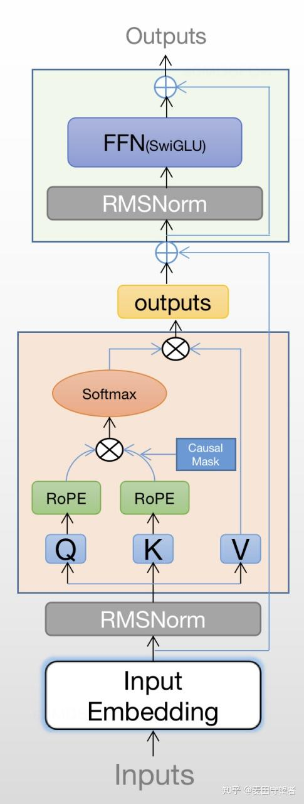
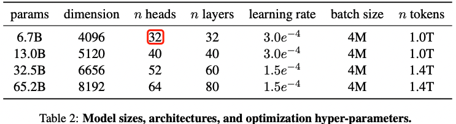
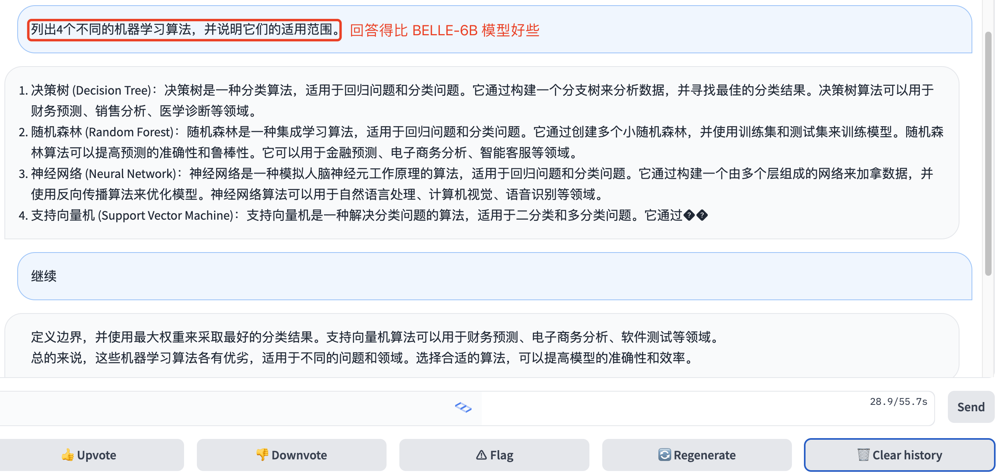

- [一，介绍](#一介绍)
- [二，模型结构](#二模型结构)
  - [2.1，RMSNorm](#21rmsnorm)
  - [2.2，SwiGLU](#22swiglu)
  - [2.3，RoPE旋转位置编码](#23rope旋转位置编码)
- [三，代码分析](#三代码分析)
  - [3.2，transformers 模型推理](#32transformers-模型推理)
  - [3.3，高性能 PyTorch 库-FairScale](#33高性能-pytorch-库-fairscale)
- [四，基于开源 LLaMA 微调的模型](#四基于开源-llama-微调的模型)
- [四，个人感想](#四个人感想)
- [参考资料](#参考资料)

> 本文主要从模型推理角度去总结论文，因此没有涉及到数据集处理、模型训练及试验报告的细节，只介绍了 LLaMA（羊驼）模型的主要思想以及模型结构的细节，最后介绍一些基于 LLaMA finetune 的模型

## 一，介绍

`LLaMA`（Large Language Model Meta AI）是 由 Meta AI 发布的一个开放且高效的大型基础语言模型，共有 `7B`、`13B`、`33B`、`65B`（650 亿）四种版本。其数据集来源都是公开数据集，无任何定制数据集，保证了其工作与开源兼容和可复现，整个训练数据集在 token 化之后大约包含 1.4T 的 token。

关于模型性能，LLaMA 的性能非常优异：具有 130 亿参数的 LLaMA 模型「在大多数基准上」可以**胜过** GPT-3（ 参数量达 1750 亿），而且可以在单块 V100 GPU 上运行；而最大的 650 亿参数的 LLaMA 模型可以媲美谷歌的 Chinchilla-70B 和 PaLM-540B。

关于训练集，其来源都是公开数据集，无任何定制数据集，保证了其工作与开源兼容和可复现。整个训练数据集在 token 化之后大约包含 1.4T 的 token。其中，LLaMA-65B 和 LLaMA-33B 是在 1.4万亿个 `token` 上训练的，而最小的模型 LLaMA-7B 是在 1万亿个 token 上训练的。

Hoffmann 等人（2022）最近的工作表明了，在给定的计算预算下，最佳性能不是由最大的模型实现的，而是基于更多数据上的训练较小模型实现的。

和之前的工作相比，`llama` 论文的重点是基于**更多 `tokens` 的训练集，在各种推理预算下，训练出性能最佳的一系列语言模型**，称为 `LLaMA`，参数范围从 `7B` 到 `65B` 不等，与现有最佳 LLM 相比，其性能是有竞争力的。比如，`LLaMA-13B` 在大多数基准测试中优于 `GPT-3`，尽管其尺寸只有 GPT-3 的十分之一。作者相信，LLaMA 将有助于使 LLM 的使用和研究**平民化**，因为它可以在单个 GPU 上运行！在规模较大的情况下，LLaMA-65B 也具有与最佳大型语言模型（如 Chinchilla 或 PaLM-540B）相竞争的能力。

LLaMA **优势**在于其**只使用公开可用的数据**，这可以保证论文的工作与开源兼容和可复现。之前的大模型要么使用了不公开的数据集去训练从而达到了 state-of-the-art，如 Chinchilla、PaLM 或 GPT-3；要么使用了公开数据集，但模型效果不是最佳无法和 PaLM-62B 或 Chinchilla 相竞争，如 OPT、GPT-NeoX、BLOOM 和 GLM。

## 二，模型结构

和 `GPT` 系列一样，LLaMA 模型也是 `Decoder-only` 架构，但结合前人的工作做了一些改进，比如：

1. Pre-normalization [GPT3]. 为了提高训练稳定性，LLaMA 对每个 transformer 子层的输入进行归一化，使用 `RMSNorm` 归一化函数，Pre-normalization 由Zhang和Sennrich（2019）引入。使用 `RMSNorm` 的好处是不用计算样本的均值，速度提升了40%
2. `SwiGLU` 激活函数 [PaLM]. 将 ReLU 非线性替换为 `SwiGLU` 激活函数，且使用 $\frac{2}{3}4d$ 而不是 PaLM 论文中的 4d，SwiGLU 由 Shazeer（2020）引入以提高性能。
3. `Rotary Embeddings` [GPTNeo]. 模型的输入不再使用 `positional embeddings`，而是在网络的每一层添加了 positional embeddings (`RoPE`)，RoPE 方法由Su等人（2021）引入。

模型结构图如下图所示:


不同模型的超参数详细信息在表 2 中给出。



### 2.1，RMSNorm

LayerNorm 通过对输入和权重矩进行重新中心化和重新缩放（`re-centering 和re-scaling`，即减均值和除方差），来帮助稳定训练并加速模型收敛。

[RMSNorm](https://openreview.net/pdf?id=SygkZ3MTJE)（Root Mean Square Layer Normalization）论文假设 LayerNorm 中的重新中心化不再是必须的，并提出了一种新的归一化方法：均方根层归一化（RMSNorm）。RMSNorm 通过均方根（RMS）对每一层神经元的输入进行归一化，使模型具备重新缩放不变性和隐式学习率调整的能力。相比 LayerNorm，RMSNorm 计算更为简洁，因此效率更高。

对于输入向量 x ，RMSNorm 的计算过程如下：

1. **计算 RMS（均方根值）**：

$$\text{RMS}(x) = \sqrt{\frac{1}{n} \sum_{i=1}^{n} x_i^2}$$

这里，n 是输入向量的维度。
	
2. **归一化输入**：

$$\hat{x}_i = \frac{x_i}{\text{RMS}(x)}$$

这一步将每个元素 x_i 按照 RMS 归一化。

3. **缩放和偏移**：

$$y = \frac{x}{\sqrt{\text{RMS}[x]} + \epsilon} \times \gamma$$

其中，$\gamma$ 和 $\epsilon$ 是可学习的缩放和偏移参数，与 LayerNorm 类似。

以下是 RMSNorm 在 PyTorch 中的简单实现，使用了 RMS（均方根）来对输入进行归一化处理。

```python
import torch
import torch.nn as nn

class RMSNorm(nn.Module):
    def __init__(self, dim, eps=1e-8):
        """
        :param dim: 输入的维度
        :param eps: 防止除以0的稳定项
        """
        super(RMSNorm, self).__init__()
        self.eps = eps
        self.scale = nn.Parameter(torch.ones(dim))  # 可学习的缩放参数
    
    def forward(self, x):
        # x 的形状为 [batch_size, seq_len, dim]
        
        # 计算均方根 (RMS)
        rms = torch.sqrt(torch.mean(x ** 2, dim=-1, keepdim=True) + self.eps)
        
        # 归一化，并应用缩放参数
        return x / rms * self.scale


# 测试 RMSNorm
batch_size, seq_len, dim = 2, 4, 8
x = torch.randn(batch_size, seq_len, dim)

rmsnorm = RMSNorm(dim)
output = rmsnorm(x)

rmsnorm_pytorch = nn.RMSNorm([dim])
output_pytorch = rmsnorm_pytorch(x)

print("输入和输出的形状: ", x.shape, output.shape)
if torch.allclose(output, output_pytorch, atol=1e-6):
    print("结果验证通过: 自己实的 RMSNorm 和 pytorch nn.RMSNorm 结果一致！")
else:
    print("结果验证失败: 自己实的 RMSNorm 和 pytorch nn.RMSNorm 结果不一致。")
```

代码运行后输出结果如下所示：
> 输入和输出的形状:  torch.Size([2, 4, 8]) torch.Size([2, 4, 8])
结果验证通过: 自己实的 RMSNorm 和 pytorch nn.RMSNorm 结果一致！

### 2.2，SwiGLU

Feed Forward 层全称是 Position-wise Feed-Forward Networks（`FPN`），`FFN` 接收一个向量 x（序列中特定位置的隐藏表示），并将其通过两个可学习的**线性变换**（由矩阵 W1 和 W2 以及偏置向量 b1 和 b2 表示）进行处理，在两个线性变换之间应用修正线性（`ReLU`）激活函数。计算过程用数学公式可表达为：

$$
\text{FFN}(x, W_1, W_2, b_1, b_2) = \text{max}(0, xW_1 + b_1 )W_2 + b_2 
$$

在 T5 模型的实现中，使用是没有偏置 `bias` 的版本，数学公式表达如下:

$$
\text{FFN}(x, W_1, W_2) = \text{max}(0, xW_1)W_2
$$

后续的研究提出了用其他非线性激活函数替换ReLU，如高斯误差线性单元 （Gaussian Error Linear Units），$\text{GELU}(x) = x\Phi (x)$ 和 $\text{Swish}_{\beta}(x) = x\sigma(\beta x)$。

$$
\text{FFN}_{\text{GELU}}(x, W_1, W_2) = \text{GELU}(xW_1)W_2 \\
\text{FFN}_{\text{Swish}}(x, W_1, W_2) = \text{Swish}(xW_1)W_2
$$

[Dauphin et al., 2016] 提出了门控线性单元（`GLU`），定义为输入的两个线性变换的**逐元素乘积**，其中一个经过了 sigmoid 激活。另外，他们还建议省略激活函数，称之为“双线性”（bilinear）层。

$$
\text{GLU}(x, W, V, b, c) = \sigma(xW+b)\otimes (xV+c) \\
\text{bilinear}(x, W, V, b, c) = (xW+b)\otimes (xV+c)
$$

我们还可以使用其他激活函数定义 GLU 变体，如下所示:
$$
\text{ReGLU}(x, W, V,b, c) = \text{max}(0, xW+b)\otimes (xV+c) \\
\text{GEGLU}(x, W, V,b, c) = \text{GELU}(xW+b)\otimes (xV+c) \\
\text{SwiGLU}(x, W, V,b, c) = \text{Swish}(xW+b)\otimes (xV+c)
$$

在本论文中，作者提出了 Transformer FFN 层的其他变体，这些变体使用 `GLU` 或其变体代替第一个线性变换和激活函数。同样也省略了偏差项。

`SwiGLU` 激活函数是  Gated Linear Units (GLU) 变体之一，来源于论文 [GLU Variants Improve Transformer](https://arxiv.org/pdf/2002.05202.pdf)。`SwiGLU` 数学表达式如下:

$$
\text{FPN}_{\text{SwiGLU}}(x, W, V, W_2) = (\text{Swish}_{1}(xW)\otimes xV)W_2
$$

其中激活函数 `Swish` 的定义如下:

$$
\text{Swish}(x) = x⋅ \text{Sigmoid}(\beta x) \\
\text{SiLU}(x) = x⋅ \text{Sigmoid}(x)
$$

原始的的 $\text{FPN}$ 层只有两个权重矩阵，但 $\text{FPN}_{\text{SwiGLU}}$ 的线性变换层**有三个权重矩阵**。为了保持参数数量和计算量的恒定，需要将隐藏单元的数量 `d_ff`（W 和 V 的第二个维度以及 W2 的第一个维度）缩小 `2/3`。实现代码如下所示:

```python
# -*- coding  : utf-8 -*-
# Author: honggao.zhang

import torch
import torch.nn as nn
import torch.nn.functional as F

class FFNSwiGLU(nn.Module):
    def __init__(self, input_dim: int, hidden_dim: int):
        super().__init__()
        hidden_dim = int(2 * hidden_dim / 3)
        self.fc1 = nn.Linear(input_dim, hidden_dim, bias=False)
        self.fc2 = nn.Linear(hidden_dim, input_dim, bias=False)
        self.fc3 = nn.Linear(input_dim, hidden_dim, bias=False) 
        
    def forward(self, x):
        # LLaMA 官方提供的代码是使用 F.silu() 激活函数
        return self.fc2(F.silu(self.fc1(x) * self.fc3(x)))
    
layer = FFNSwiGLU(128, 256)
x = torch.randn(1, 128)
out = layer(x)
print(out.shape) # torch.Size([1, 128])
```

### 2.3，RoPE旋转位置编码

`RoPE`（Rotary Position Embedding）旋转位置编码，是苏剑林老师提出的一种旋转位置编码方法，其思想是采用绝对位置编码的形式，实现相对位置编码。

## 三，代码分析

**LLaMA [官方代码](https://github.com/facebookresearch/llama) 只提供了模型结构和推理代码，没有提供模型训练代码**。另外看了官方提供的下载脚本，是没有直接提供下载链接，是需要自己申请！原版 `LLaMA` 模型需要去 [`LLaMA` 项目申请使用](https://github.com/facebookresearch/llama)或参考这个 [PR](https://github.com/facebookresearch/llama/pull/73/files)。因版权问题本项目无法提供下载链接。

> 下载链接说明信息来源 `Alpaca` 仓库。

LLaMA 模型结构也只使用 `Decoder` 结构。

[等待更新]

LLaMA 模型的线性计算层都是使用了 FairScale 库的 `ColumnParallelLinear` 层，它是一个并行的线性层，可以在多个 GPU 上**并行计算**，这个计算速度比 Linear 的 nn.Linear 层速度更快。

### 3.2，transformers 模型推理

`HuggingFace` 格式的 `LLaMA` 模型权重，可按照如下所示方式加载模型权重。

```python
from transformers import LlamaForCausalLM, LlamaTokenizer

tokenizer = LlamaTokenizer.from_pretrained("/output/path")
model = LlamaForCausalLM.from_pretrained("/output/path")
```

加载 float16 精度的模型权重需要足够的 CPU RAM，对于 65B 参数模型，需要 130GB 的 RAM。

### 3.3，高性能 PyTorch 库-FairScale

1，`FairScale`: 用于在一台或多台机器/节点上进行高性能和大规模训练的 PyTorch库，由 Meta 发布。示例代码：

```python
from torch import nn
import fairscale
 
model = nn.Sequential(
    nn.Conv2d(in_channels=3, out_channels=6, kernel_size=(5,5), stride=1, padding=0),
    nn.MaxPool2d(kernel_size=(2,2), stride=2, padding=0),
    nn.Conv2d(in_channels=6, out_channels=16, kernel_size=(5,5), stride=1, padding=0),
    nn.MaxPool2d(kernel_size=(2, 2), stride=2, padding=0),
)
model = fairscale.nn.Pipe(model, balance=[2, 2], devices=[0, 1], chunks=8)
```

在 2 个 GPU 上运行 4 层模型。前两层在 cuda:0 上运行，后两层在 cuda:1 上运行。

## 四，基于开源 LLaMA 微调的模型
> 以下这些项目都可以算是 Meta 发布的 LLaMA（驼马）模型的子子孙孙。

**1，Alpaca**

[Alpaca](https://github.com/tatsu-lab/stanford_alpaca) 是斯坦福在 `LLaMA` 上对 52000 条指令跟随演示进行了精细调优的模型，是后续很多中文 LLM 的基础。

对应的中文版是 [Chinese-LLaMA-Alpaca](https://github.com/ymcui/Chinese-LLaMA-Alpaca/)。该项目在原版 LLaMA 的基础上**扩充了中文词表**并使用了中文数据进行**二次预训练**，进一步提升了中文基础语义理解能力。同时，在中文LLaMA 的基础上，本项目使用了**中文指令数据进行指令精调**，显著提升了模型对指令的理解和执行能力。

值得注意的是，该项目开源的不是完整模型而是 `LoRA` 权重，理解为原 LLaMA 模型上的一个“补丁”，两者进行合并即可获得完整版权重。提醒：仓库中的中文 LLaMA/Alpaca LoRA 模型无法单独使用，需要搭配原版 LLaMA 模型[1]。可以参考本项目给出的[合并模型步骤](https://github.com/ymcui/Chinese-LLaMA-Alpaca/blob/main/README.md#%E5%90%88%E5%B9%B6%E6%A8%A1%E5%9E%8B)重构模型。

- repo: https://github.com/ymcui/Chinese-LLaMA-Alpaca/

**2，Vicuna**

[Vicuna](https://chat.lmsys.org/) 是一款从 LLaMA 模型中对用户分享的对话进行了精细调优的聊天助手，根据的评估，这款聊天助手在 LLaMA 子孙模型中表现最佳，能达到  ChatGPT 90% 的效果。 



**3，Koala**(考拉)

一款从 `LLaMA` 模型中对用户分享的对话和开源数据集进行了**精细调优**的聊天机器人，其表现与`Vicuna` 类似。 

- blog: Koala: A Dialogue Model for Academic Research
- demo: FastChat
- repo: https://github.com/young-geng/EasyLM

**4，Baize (白泽)**

- 论文：https://arxiv.org/pdf/2304.01196.pdf
- demo: Baize Lora 7B - a Hugging Face Space by project-baize
- repo: https://github.com/project-baize/baize

**5，Luotuo (骆驼，Chinese)**

- repo: https://github.com/LC1332/Luotuo-Chinese-LLM

另外，中文 LLM 的有影响力的模型还有 `ChatGLM`，通常指 `ChatGLM-6B`， 一个由清华团队开源的、支持中英双语的对话语言模型，基于 [General Language Model (GLM)](https://github.com/THUDM/GLM) 架构，具有 62 亿参数。结合模型量化技术，用户可以在消费级的显卡上进行本地部署 ChatGLM（INT4 量化级别下最低只需 6GB 显存）。

整体使用下来，其基本任务没问题，但是涌现能力还是有限的，且会有事实性/数学逻辑错误，另外，Close QA 问题也很一般。`GLM` 模型架构与 BERT、T5 等预训练模型模型架构不同，它采用了一种**自回归**的空白填充方法,。

## 四，个人感想

一些 LLM 的论文看下来，发现讲模型结构的内容真的很少，大部分内容都在讲数据集构建方法、模型训练方法、实验报告等内容。

FlashLlamaAttention、LlamaMLP、LlamaRMSNorm、LlamaRMSNorm。

## 参考资料

1. [Meta发布最新大模型LLaMA：参数规模更小，单卡就能跑赢GPT-3](https://mp.weixin.qq.com/s/W1AhzvkOOXsBrMqbpxiFYw)
2. [Hendrycks and Gimpel, 2016](https://arxiv.org/pdf/1606.08415.pdf) 
3. [GLU Variants Improve Transformer](https://arxiv.org/pdf/2002.05202.pdf)
4. [llama2介绍(模型结构+参数计算)](https://zhuanlan.zhihu.com/p/647862867)