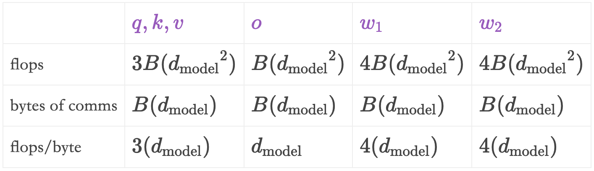
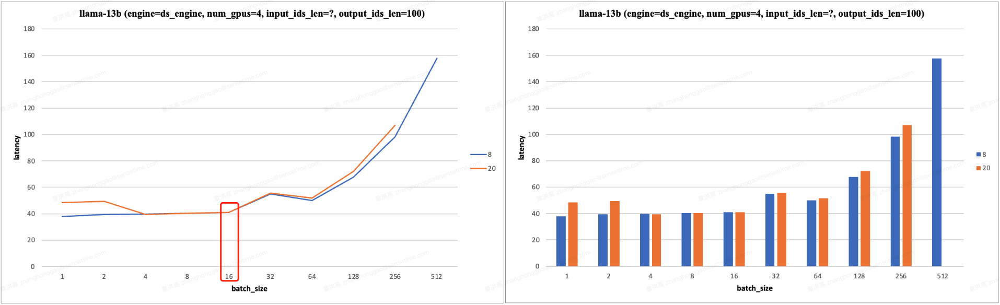
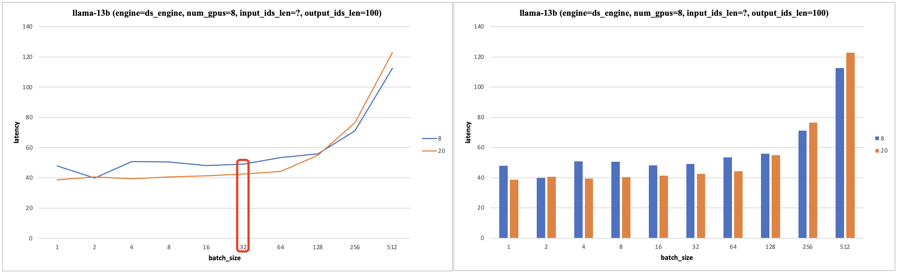
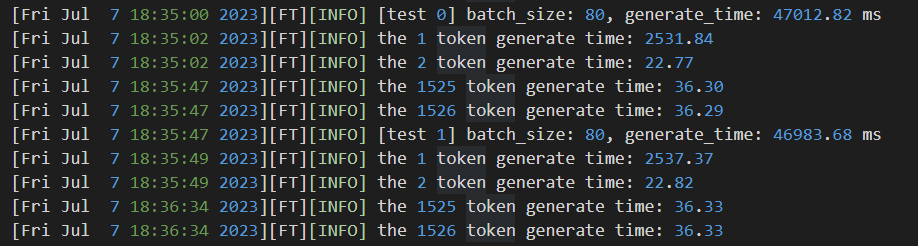
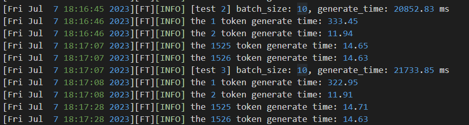

- [一 decode latency 估算](#一-decode-latency-估算)
- [二 理论 latency 和实际 latency 的差距](#二-理论-latency-和实际-latency-的差距)
- [三 批次大小对性能影响的分析](#三-批次大小对性能影响的分析)
  - [3.1 批次大小对性能影响的实验](#31-批次大小对性能影响的实验)
- [参考资料](#参考资料)

## 一 decode latency 估算

考虑基于 roofline 模型和的 llm decode 阶段的 latency 分析，对于小 `batch` 的模型推理，单个 token 的推理 `latency` 可能受限于 gpu 的内存带宽，即内存读取时间 > 计算时间；对于大 `batch`，单个 token 的推理 `latency` 受限于 gpu 的算力，即内存读取时间 > 计算时间。

注意，上述公式计算得到理论 `Latency` 只是个上限，我们永远不可能达到这个值，而且现实中 GPU 卡的性能也很少能达到其规格所宣称的数字。另外，本章 `Latency` 的计算忽略了**预填充阶段**中计算和**读取 kv cache 的时间、读取 umembedding vector 来计算 logits 的时间**。预填充阶段对应的就是生成第一个 `token` 的过程，这个时候需要计算 `kv cache`，所以第一个 `token` 的 `latency` （首次延时）会比后面的 `token` （decode latency）大很多。

**解码阶段的每轮 decode latency（非首字时延）的估算公式如下所示**：

1，对于小 batch size（比如为 1），计算和通信的 latency 计算公式如下（来源[Transformer Inference Arithmetic](https://kipp.ly/transformer-inference-arithmetic/)）：
$$
\begin{align}
\text{compute} = \frac{2\cdot P}{N\cdot A_{bm}} \nonumber \\
\text{comms}  = 4\cdot n\cdot 8us \nonumber \\
\end{align}
$$

> 这里 $2P$ 表示权重参数所消耗的内存量，每个参数是两个字节；

2，对于大 batch（比如 512）：
$$
\begin{align}
\text{compute} = B\cdot \frac{2\cdot P}{N\cdot A_{f}} \nonumber \\
\text{comms}  = B\cdot \frac{2\cdot 4\cdot n_{layers}\cdot h}{A_c} \nonumber \\
\end{align}
$$

- $N$ 是 GPU 数目
- $n$ 是 transformer layers 数目
- $s$ 输入序列长度
- $h$ embedding 向量的大小，也作 $d_{model}$
- $A_c$ 是 GPU 之间通信带宽，即卡间带宽
- $A_{bm}$ 是 GPU 内存带宽
- $A_f$ 是 GPU 算力
- $P$ 表示模型(`float16`)参数量
- $B$ 是 `batch size`

> 这里的 $2P$ 表示我们需要执行 $2P$ 次运算。

3，`prefille` 阶段一般都是计算受限，`prefill latency` 的理论计算公式（也可复用前面 decode latency）：

$$\begin{aligned}
\text{compute} = Bs\cdot \frac{2\cdot P}{N\cdot A_{f}} = \frac{s \cdot \text{decode latency}}{A_f/A_{bm}} \\
\text{comms}  = Bs\cdot \frac{2\cdot 4\cdot n_{layers}\cdot h}{A_c}
\end{aligned}
$$

另外，对于明显计算受限 `MLP` 层其推理计算时间:

$$\text{flops time} = \frac{16h^2s}{N\cdot A_f}$$

举例说明，260B 模型（$n = 80, h=16484$）运行在 16张 A100 卡上。对于小批次，生成每个 token 的时间为 22 毫秒：
$$
\begin{align}
\text{compute} = \frac{2\cdot P}{N\cdot A_{bm}} \nonumber = \frac{2\cdot260e9}{16\cdot1.5e12}\simeq 0.0217 \simeq 22 \text{ms}\\
\text{comms}  = 4\cdot n_{layers}\cdot 8us \nonumber = 4\cdot 80\cdot8us = 2560us\simeq 3\text{ms}\\
\end{align}
$$
对于一个批次大小为 512 的大批次，每个 token 生成的计算总时间为 53 ms，加上卡间通信时间 18 ms，总耗时为 71 ms（即在 71 ms 内生成 512 个 token）：
$$
\begin{align}
\text{compute} = B\frac{2\cdot P}{N\cdot A_{f}} \nonumber = 512\cdot\frac{2\cdot260e9}{16\cdot 312e12}\simeq 0.053 \simeq 53 \text{ms}\\
\text{comms} = B\cdot \frac{2\cdot 4\cdot n_{layers}\cdot h}{A_c} = 512\cdot \frac{8\cdot 80\cdot 16384}{300e9} = \simeq 18\text{ms} \nonumber
\end{align}
$$
对于自回归模型的推理来说就是，**固定 seq_len**， 如果 seq_len * bs < ops:byte ratio * gpu_num，即**小 `batch_size` 范围 的 latency 不明显增加的**。

## 二 理论 latency 和实际 latency 的差距

**decode latency 的理论预估和实际差别**：

使用 2 个 gpu 运行 13b 的大语言模型，使用 FasterTransformer 框架进行推理，其使用量内核融合并提供了张量并行方法。130 亿参数的模型有 40 层，40 个头，每个头的维度为 128，总维度大小为 5120。[这里](https://docs.google.com/presentation/d/17PMhlxB3hZYBLqf2mych9CL8kyyssIEvJHOscpqTo1k/edit#slide=id.g120cbed70ac_0_0)有一些性能剖析的截图。

开始测试的设置是上下文长度 512，批次大小 1（内存受限），输出 10 个 token。对于 2 个 GPU 的小批次每生成一个 token，我们预估耗时 $8.4$ 毫秒，通信耗时约为 1 毫秒。如果使用 1 个 GPU，时间预估为 $16.8$ 毫秒（计算公式：$2\cdot 13 \cdot40\cdot5120^2/1.555e12 = 16.8 \text{ms}$），没有通信开销。在实际 llm 的实际推理中：

**1 个 GPU 的 decode latency 实际结果是 22.0 毫秒，表明我们预测值达到了 76% 的准确性**。这个差距可以解释，因为部分时间用于中间激活，并且机器也没有达到理论上 100% 的内存带宽。根据模型的维度，性能剖析显示我们最多只能使用大约 90% 的带宽。因此，将预估时间调整为 18.5 毫秒，再加上中间激活（约 2.2 毫秒），总耗时为 20.7 毫秒！剩余的 1.4 毫秒可以归因于子毫秒级的操作，如 token 嵌入、top-(k|p) 操作、低于 90% 的带宽使用率，甚至是内核启动时间，但总体来说，1 个 gpu 的预估时间很接近 FasterTransformer 框架的实际推理 decode latency。

2 个 GPU 的实际结果为 13.5 毫秒，差距较大，只有 62% 的准确性。我们需要检查内存带宽的下降，因为**较小的张量通常无法完全利用带宽**，2 个 GPU 并行的带宽利用率只有 87%，所以预估时间调整为 9.6 ms。中间激活时间和 1 个 GPU 类似（约 2.4 ms），总耗时为 12 ms。剩余的 1.5 毫秒可以归因于通信，在性能剖析中，每层通信耗时约 40-50 微秒，总通信时间为 1.7 毫秒，到此，理论预估 latency 和实际 latency 的差距（8.4/0.87 + 2.4 + 1.5 = 13.5）完全解释清楚了。

总结：无论是 1/2 个 GPU，中间激活耗时都比预估要高一些（感兴趣的可以利用 nvidia 工具做实验，或者参考别人提供的[性能剖析结果](https://docs.google.com/presentation/d/17PMhlxB3hZYBLqf2mych9CL8kyyssIEvJHOscpqTo1k/edit#slide=id.g120cbed70ac_0_0)）。另外，基准测试中推理的总时间结果是，1 个 GPU 推理: 180.86 ms（prefill time: 45.45ms），2 个 GPU 推理：283.60 ms（prefill time: 63.17 ms）。

**prefill latency 的理论预估和实际差别**：

prefill latency 的理论计算复用前面 decode latency 计算公式的话，其理论结果为：
$$\text{prefill latency} = \frac{s \cdot \text{decode latency}}{A_f/A_{bm}}$$

前面 decode latency 的分析可知，内存带宽利用率肯定不足 90%，因此 $A_f/A_{bm} = 312e12/(1.5e12*0.9) = 231$。对于 1 个 GPU 设置，实际 decode latency 为 22 ms ，则 $22*(512/231) = 48 ms$，计算结果和实际结果 63 ms 不符。对于 2 个 GPU，计算得出 $13.5*(512/231) = 30 ms$，和实际结果 63.17ms 差距更大。

对于 1 个 GPU，部分时间差异可能来自 kv 存储。查看性能剖析，存储 kv 每层大约耗时 18 us，总计 0.7 ms，还有一些内存清零操作耗时 0.2 ms，加起来为 0.9 ms。另外，主要的是 flops 时间差异：
- 预估 MLP 乘法的 flops 时间（这是受 flops 限制的！）为 $12\times 5120^2\times 512/312e12 = 344us$。而实际最低时间是 476 微秒，说明我们只达到了理论 flops 的 72%。
- 对于注意力投影层，理论预估时间为 $2\times 5120^2\times 512/312e12 = 86 us$ ，而性能剖析中最低时间是 159 微秒，仅为 54%。这非常糟糕！但好像也符合现实，参见这篇论文的图 14，$512\times 4000\times 4000$ 张量的计算效率不到 $150\text{TFLOPs/s}$。

综上分析：**实际测试的 prefill/decode latency 和公式理论预估 latency 的差距主要来自：中间激活、线性层的计算效率低于 90%、内存带宽利用率低于 90%** 和其他次要因素如 token 嵌入、top-(k|p) 操作和内核启动时间。且对于小 `batch` decode 阶段会出现明显的内存带宽利用率不足，prefill 阶段会出现明显的算力利用率不足。

## 三 批次大小对性能影响的分析

通过《英伟达 GPU 性能分析指导》文档可知：算术强度通俗理解就是计算量除以访存量后的值，表示此模型/网络层在计算过程中，每 Byte 内存交换（传输）到底用于进行多少次浮点运算，单位是 FLOPs/Byte（**每字节交换的 flops**）。即模型计算强度越大，其内存使用效率越高，因此应该尽可能让算法/网络层的算术强度高于 gpu 的操作强度，这样才能充分利用 gpu 的算力。

对于 `llm` 的 `decode` 阶段，模型的算术强度 = $\frac{B\cdot2\cdot P}{2\cdot P} = B(批量大小)$，**即 LLM 的算术强度和批量大小近乎成正比关系，在decode 阶段应该尽量增大批量大小，以充分利用 gpu 算力**。

假设我们使用 A100 GPU，它每秒可以执行 $312 \times 10^{12}$ 次浮点运算（flops），并且内存带宽为每秒 $1.5 \times 10^{12}$ 字节，即 A100 的操作强度为 $A_f/A_{bw}  = 208$。对于 llm 的 decode 阶段，只要批量大小大于 208，则推理处于计算受限，计算效率更高。

我们也可以通过比较内存带宽时间和计算时间，来判断是内存带宽受限还是计算 flops 受限，**模型内存访问和 decode 计算时间公式如下**:
$$
\begin{align}
\text{mem boundwidth time} = \frac{2\cdot P}{N\cdot A_{bm}} \nonumber \\
\text{flops time}  =B\cdot \frac{2\cdot P}{N\cdot A_{f}} \nonumber
\end{align}
$$

另外，假设在推理系统中我们能实现计算和 GPU 通信并行处理，则可以得到了一个更为复杂的比率：每字节通信的 flops（前面的 A100 的操作强度对应的是每字节内存访问的 flops）。以下使用张量并行的主要 layer 的通信量、计算量和每字节通信 flops 值表：

这是我们 A100 GPU 的每字节通信 flops 值。我们希望上述表格最后一行的值大于硬件的每字节 flops 计算值，这样可以确保系统保持在计算（flops）受限状态（这里先假设内存带宽不是限制因素）。对于 $d_{model} > 1024$ 的模型运行在 A100 上来说，我们的推理是安全高效的！但对于维度为 512 的情况，情况就有些不理想了。

### 3.1 批次大小对性能影响的实验

batch_size、内存带宽限制 vs 计算限制对 Latency 会有什么影响呢？

**自回归模型的推理实验**。**固定 seq_len=8/20**， 如果 seq_len * bs < ops:byte ratio * gpu_num，即**小 `batch_size` 范围 的 latency 不明显增加的**。从实验测试结果看，**使用 4/8 个 V100 硬件做模型推理（张量并行），输入长度固定，在 batch_size < 16/32，其 latency 不明显增加**。且有以下实验结果：

**`Latency` 的理论分析**：对于自回归模型的推理，默认推理配置是 `use_cache=True`，**固定 seq_len**，batch_size 较小时，模型的算术强度较低，模型受到内存带宽限制，`Latency` 取决于内存读取和 gpu 通信时间，而 `batch_size` 较小时，kv cache 读写时间和较小，而 gpu 通信时间又是固定的，故 latency 不明显增加；当 batch_size 增加到一定程度，模型的算术强度增加，模型受到算力 `FLOPS` 限制，故此时 `Latency` 与 batch_size 几乎成正比。

另外，基于上述分析和前面 decode 阶段 `mha` 层的计算量估计也可知，当 batch_size 和 output_ids_len 比较大时，**迭代生成 token 的过程中，后面 token 的 Latency 会大于前面的**。

## 参考资料
- [Transformer Inference Arithmetic](https://kipp.ly/transformer-inference-arithmetic/)
- [LLM Inference Unveiled: Survey and Roofline Model Insights](https://arxiv.org/pdf/2402.16363)