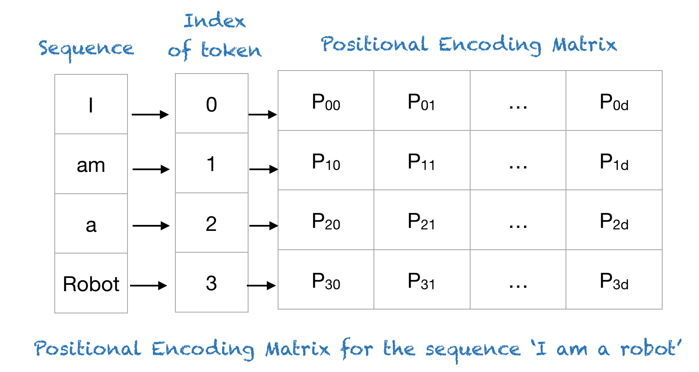
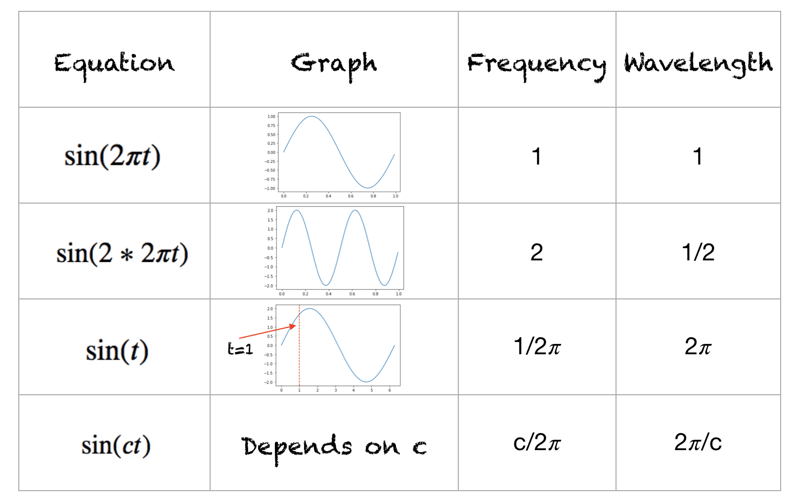
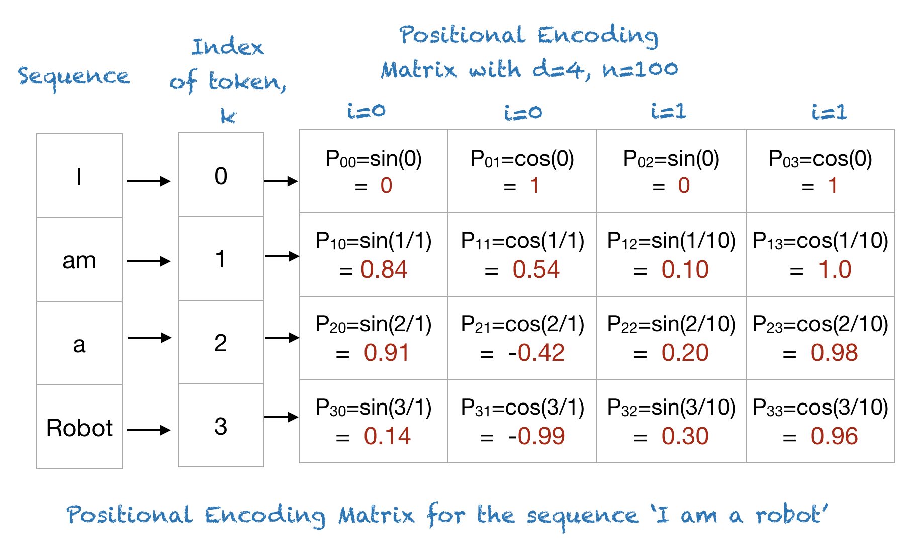
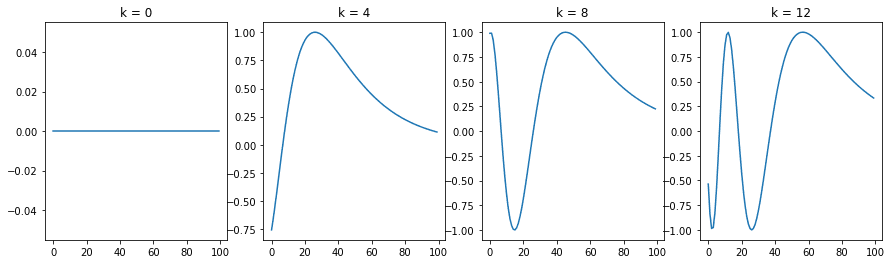
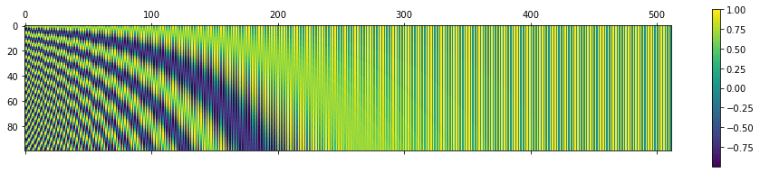
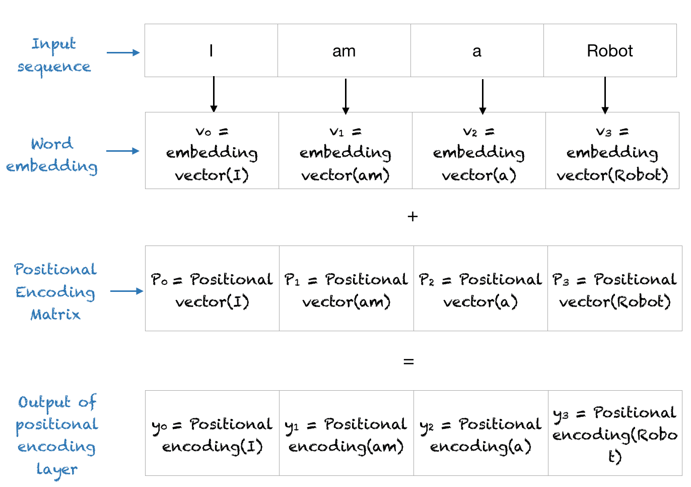

- [一 三角函数式位置编码](#一-三角函数式位置编码)
  - [1.1 位置编码原理](#11-位置编码原理)
    - [正弦函数](#正弦函数)
    - [正弦函数的波长](#正弦函数的波长)
    - [三角函数式位置编码公式](#三角函数式位置编码公式)
- [二 三角函数式位置编码实现及可视化](#二-三角函数式位置编码实现及可视化)
  - [2.1 python 实现](#21-python-实现)
  - [2.2 理解位置编码矩阵](#22-理解位置编码矩阵)
- [二 RoPE 位置编码](#二-rope-位置编码)
- [参考资料](#参考资料)

## 一 三角函数式位置编码

### 1.1 位置编码原理

不同于 RNN、CNN 等模型，对于Transformer 模型来说，位置编码的加入是必不可少的，因为纯粹的 Attention 模块是无法捕捉输入顺序的，即无法区分不同位置的 Token。

简单来说，位置编码的意义是**用于表示序列中某个元素的位置**，它为每个位置分配一个独特的表示。在 Transformer 模型中，不使用像索引这样的单一数值来表示元素的位置有很多原因。对于较长的序列，索引的数值可能会非常大。如果将索引归一化到 0 到 1 之间，对于长度不同的序列，这种归一化方法会导致问题，因为它们的归一化方式不一致。

Transformer 模型采用了一种巧妙的位置信息编码方法，其中每个位置或索引都映射到一个向量，向量大小为 $d_\text{model}$。因此，位置编码层的输出是一个矩阵，其中**矩阵的每一行表示一个序列元素的编码**，该编码包括了该元素的位置信息。下图展示了一个仅编码位置信息的矩阵示例。



#### 正弦函数

理解 transformer 模型提出的位置信息绝对编码算法之前，先对正弦函数做一个快速回顾（余弦函数特性差不多）。

在数学中，正弦（英语：sine、缩写sin）是一种周期函数，是三角函数的一种。它的定义域是整个实数集，值域是 $[-1, 1]$。它是周期函数，其最小正周期为 $2\pi$ ($360^{\circ}$)。

在物理中的正弦波中，波形的频率表示每秒内完成的周期数，而波长表示波形重复的距离。下图展示了不同波形的波长和频率。



#### 正弦函数的波长

正弦函数的波长（wavelength）是指正弦波完成一个完整周期所需要的距离或时间。在公式上，正弦函数通常表示为：

$$y = \sin(kx + \phi) \tag{1}$$

其中：

- $y$  是输出值。
- $x$  是输入变量，通常代表时间或空间。
- $k$  是波数（wave number），它与波长 \lambda 的关系是  k = \frac{2\pi}{\lambda} 。
- $\phi$  是相位偏移。

因此，波长 $\lambda$ 的计算公式为：

$$\lambda = \frac{2\pi}{k}$$

#### 三角函数式位置编码公式

下面进入主题，假设有一个长度为 $L$ 的输入序列，并且需要获取该序列中第 $i$ 个元素的位置。**位置编码通过不同频率的正弦和余弦函数来表示**：

$$P(k, 2i) = \sin\Big(\frac{k}{n^{2i/d}}\Big) \\
P(k, 2i+1) = \cos\Big(\frac{k}{n^{2i/d}}\Big)$$

上述公式称为三角函数式位置编码，一般也称为 `Sinusoidal` 位置编码。其中：
- $k$：输入序列中元素的位置，$0 <= k < L/2$；
- $d_{\text{model}}$ ：输出嵌入空间的维度；
- $P(i)$：用于将输入序列中位置 $k$ 映射到位置矩阵中 $(k,j)$ 索引的映射函数；
- 10,000：用户定义的标量，设定为 10,000，如论文《Attention Is All You Need》作者所使用的值。
- $i$：用于映射到列索引，范围为 $0 \leq i < \frac{d}{2}$，每个 $i$ 值都同时映射到正弦和余弦函数应正弦和余弦函数。

在上面的公式中，可以看到偶数位置使用正弦函数，而奇数位置使用余弦函数。

直接看公式不够直观，我们以短语“I am a robot”为例，其中 $n=100$ 且 $d=4$。下表展示了该短语的位置信息编码矩阵。实际上，对于任何由四个字符组成的短语，只要 n=100 且 d=4，其位置信息编码矩阵都相同。



即，“I am a robot” 对应的位置编码矩阵如下所示:


## 二 三角函数式位置编码实现及可视化

### 2.1 python 实现
下面是使用 NumPy 实现绝对位置编码的简短 Python 代码。

```python
import numpy as np
import matplotlib.pyplot as plt
 
def getPositionEncoding(seq_len, d, n=10000):
    P = np.zeros((seq_len, d))
    for k in range(seq_len):
        for i in np.arange(int(d/2)):
            denominator = np.power(n, 2*i/d)
            P[k, 2*i] = np.sin(k/denominator)
            P[k, 2*i+1] = np.cos(k/denominator)
    return P
 
P = getPositionEncoding(seq_len=4, d=4, n=100)
print(P)
```

输出结果如下所示:

```bash
[[ 0.          1.          0.          1.        ]
 [ 0.84147098  0.54030231  0.09983342  0.99500417]
 [ 0.90929743 -0.41614684  0.19866933  0.98006658]
 [ 0.14112001 -0.9899925   0.29552021  0.95533649]]
```

### 2.2 理解位置编码矩阵

为了理解位置编码，我们首先来看一下 n=10,000 和 d=512 的不同位置的正弦波。

```python
def plotSinusoid(k, d=512, n=10000):
    x = np.arange(0, 100, 1)
    denominator = np.power(n, 2*x/d)
    y = np.sin(k/denominator)
    plt.plot(x, y)
    plt.title('k = ' + str(k))
 
fig = plt.figure(figsize=(15, 4))    
for i in range(4):
    plt.subplot(141 + i)
    plotSinusoid(i*4)
```

`PE` 可视化如下所示:



可以看出，每个位置 $k$ 都对应一个不同的正弦波，它将该位置编码为一个向量。

结合前面的波长 $\lambda$ 的计算公式（1）和位置编码函数，可以确定，对于固定的嵌入维度 $i$，**波长**是通过以下公式确定的：

$$\lambda_{i} = 2 \pi n^{2i/d}$$

从公式可以看出，**正弦波的波长随着嵌入维度 $i$ 的增长呈几何级数变化**，波长从某个值到另一个值。绝对位置编码方案有几个显著的优点：

1. 正弦和余弦函数的取值范围在 $[-1, 1]$，保证了位置编码矩阵的值处于归一化范围内。
2. 每个位置的正弦波不同，因此你可以用一种独特的方式来编码每个位置。
3. 你可以衡量或量化不同位置之间的相似性，从而能够编码词语的相对位置。

可以使用更大的数值来**可视化位置矩阵**。可以使用 Python 的 matplotlib 库中的 matshow() 方法。将 n=10,000 设置为与原论文一致时，你会得到如下图所示的结果：

```python
# 调用 PE 函数生成一个 100 行、512 列的矩阵 P，表示 100 个位置的编码。
P = getPositionEncoding(seq_len=100, d=512, n=10000)
# 使用 matshow() 函数可视化位置编码矩阵 P。该函数生成矩阵的热力图，每个位置的编码值通过颜色的深浅来表示。
cax = plt.matshow(P)
# plt.gcf().colorbar(cax)：添加颜色条以显示数值和颜色之间的映射关系。
plt.gcf().colorbar(cax)
```


位置编码层的输出-位置向量与词嵌入向量相加，并将这个结果矩阵作为输入提供给后续层。整个过程如下图所示。



## 二 RoPE 位置编码


## 参考资料

- [A Gentle Introduction to Positional Encoding in Transformer Models, Part 1](https://www.machinelearningmastery.com/a-gentle-introduction-to-positional-encoding-in-transformer-models-part-1/)
- https://github.com/meta-llama/llama/blob/main/llama/model.py
- 