- [1. 介绍](#1-介绍)
- [2. 性能模型](#2-性能模型)
- [3. Roofline 性能模型](#3-roofline-性能模型)
- [4. 为模型增加性能上限](#4-为模型增加性能上限)
- [5. 将 3Cs 模型与操作强度相结合](#5-将-3cs-模型与操作强度相结合)
- [6. Roofline model 实用性](#6-roofline-model-实用性)
  - [6.1 四台不同的多核计算机](#61-四台不同的多核计算机)
  - [6.2.  四个不同的浮点运算内核](#62--四个不同的浮点运算内核)
  - [6.3 Roofline 模型和结果](#63-roofline-模型和结果)
    - [6.3.1 稀疏矩阵-向量乘法 (SpMV)](#631-稀疏矩阵-向量乘法-spmv)
    - [6.3.2 Lattice-Boltzmann 磁流体力学 (LBMHD)](#632-lattice-boltzmann-磁流体力学-lbmhd)
    - [6.3.3 模板计算 (Stencil)](#633-模板计算-stencil)
    - [6.3.4 三维快速傅里叶变换 (3D FFT)](#634-三维快速傅里叶变换-3d-fft)
    - [6.3.5 生产效率与性能](#635-生产效率与性能)
    - [6.3.6 屋顶线模型演示总结](#636-屋顶线模型演示总结)
- [7. 关于 Roofline 的一些误解](#7-关于-roofline-的一些误解)
- [8. 附录](#8-附录)
  - [计算操作强度、屋顶线和上限](#计算操作强度屋顶线和上限)
  - [负载均衡与屋顶线模型](#负载均衡与屋顶线模型)
  - [与性能计数器的互动](#与性能计数器的互动)

> 作者设计了一个直观的**性能模型**，帮助程序员和硬件架构师找到提升浮点计算并行软件和硬件性能的方法。

## 1. 介绍

多核处理器设计的兴起，同时针对多核设计还没有统一的设计原则，这使得程序员编写高性能程序面临更加复杂的挑战，因此**提出一个易于理解并能提供性能优化建议的性能模型**显得尤为重要。

## 2. 性能模型

一个性能模型不必完美，关键是能提供启发性。例如，缓存的 3Cs 模型就是一个典型案例[19]。尽管它没有考虑诸如块大小、分配策略、替换策略等重要因素，且存在一些特异情况，例如同一大小的缓存可能在不同设计下会产生容量或冲突问题，它依然在过去20年里得到了广泛应用，因为它为程序行为提供了宝贵的洞见，帮助了程序员、编译器编写者和架构师改进他们的设计。本文提出了一个类似的性能模型，并通过四个多核系统上的四个关键浮点运算模块进行验证。
> 3Cs 模型是指：Capacity Miss（容量缺失）：缓存大小不足导致的数据缺失；Conflict Miss（冲突缺失）：由于缓存冲突导致的缺失；Compulsory Miss（初始缺失）：首次访问导致的缺失

作者认为与其精确预测多处理器系统中的程序表现，不如考虑**性能界限和瓶颈分析**，这种方法给出了影响性能的关键因素并突出了瓶颈的量化分析[20]。最著名的例子就是**阿姆达尔定律**[3]，其明确指出，**并行计算机的性能提升受限于并行程序中的串行部分**。近年来，这一定律已被应用于异构多核计算机[4][18]。

**阿姆达尔定律**（Amdahl’s Law）是计算机科学中的一个公式，用于分析多处理器系统中并行化对加速比的限制，其核心思想是：

$$加速比 = 1 / (S + P/N)$$
- $S$ 是程序中必须串行执行的部分所占的比例；
- $P$ 是可以并行化的部分；
- $N$ 是处理器数量。

它揭示了即使增加处理器数量，并行程序的加速效果仍然受到串行部分的限制。因此，**提高并行部分的比例至关重要**。

## 3. Roofline 性能模型

本文认为，过去以及可以预见的未来，**芯片外内存带宽 off-chip memory bandwidth**（CPU 内存或者 GPU 显存）往往是制约系统性能的关键因素[23]。因此，我们需要一个模型，将处理器性能与芯片外内存传输（CPU 和 DRAM 数据交换）联系起来。
> 作者这个预测太准了，深度学习时代以来，无论是 CNN 亦或者 Transformer 架构模型，在优化模型速度上，考虑芯片内存带宽并减少模型内存访问代价是一个非常广泛的方法。

为此，本文引入了“操作强度”（operational intensity）这个概念，表示每字节 DRAM 数据传输（`traffic`）所对应的操作次数（**每字节 flops**），这里的字节数是指那些经过缓存层过滤后进入主内存 DRAM 的字节，即我们关注的是**缓存与内存之间的数据传输**，而不是处理器与缓存之间的数据传输（`traffic`）。因此，操作强度反映了在特定计算机上某个计算核所需的 DRAM 带宽。
> 操作强度定义其他表达：每字节内存数据传输所对应的操作次数，即每字节 `flops`，单位一般为 `GFlops/sec`。

本文之所以使用“操作强度”来取代“算术强度”(`arithmetic intensity`)[16]或“机器平衡”(`machine balance`)[8][11]，有两个原因：首先，算术强度和机器平衡通常衡量处理器与缓存之间的数据传输（`traffic`），而我们则关注缓存与 DRAM 之间的 `traffic`。这个细微的区别让我们能够在模型中纳入内存优化技术。其次，我们希望该模型不仅适用于算术运算的核（详见第7节），因此我们需要一个比“算术”更为广泛的术语。

本文提出的模型将**浮点运算性能、操作强度和内存性能整合在一个二维图中**。浮点运算的峰值性能可以通过硬件规格或微基准测试得出。由于我们所考察的计算核的工作集无法完全放入片上缓存，因此内存性能的峰值由缓存之后的内存系统决定。虽然也可以通过 STREAM 基准测试[22]来衡量内存性能，但作者在本研究中还是编写了一系列逐步优化的微基准测试，以确定可持续的 DRAM 带宽。这些测试包括了所有能够优化内存性能的技术，比如预取和数据对齐。

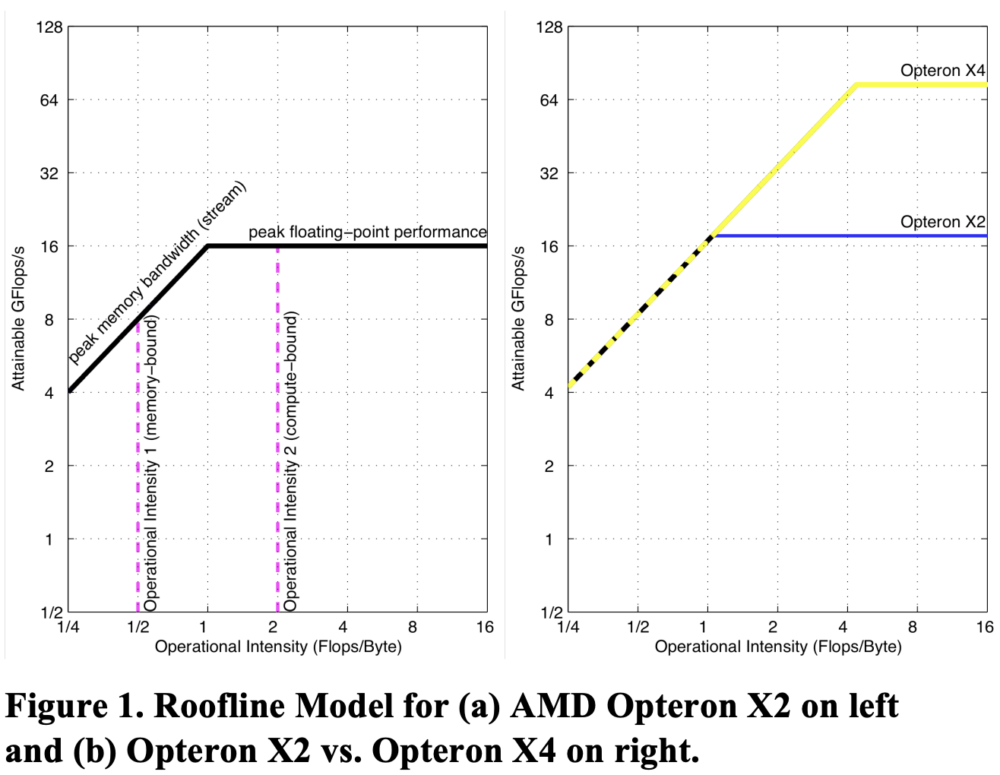

图 1a 展示了双插槽系统中 2.2 GHz AMD Opteron X2 2214 型处理器的 Roofline 模型图。

图表采用对数-对数刻度，**Y 轴为可实现的浮点性能，X 轴为操作强度，范围从每 1/4 `Flops/DRAM 字节`到 16 `Flops/DRAM 字节`**。该系统的峰值双精度浮点性能为 17.6 GFlops/sec，而根据基准测试，其峰值内存带宽为 15 GBytes/sec。这里的带宽是计算机内存的稳态带宽，而不是 DRAM 芯片的引脚带宽。

> 使用 matplotlib 的 plt.xscale('log') 和 plt.yscale('log') 函数设置 x 和 y 轴的对数刻度。

可以通过绘制一条水平线表示计算机的浮点性能峰值，显然，任何浮点运算的实际性能都不会超越这条线，因为它代表硬件限制。那内存性能峰值如何绘制？由于 X 轴是每字节的 GFlops（GFlops per byte），Y 轴是每秒的 GFlops（GFlops per second），每秒字节（bytes/sec）可以通过 (GFlops/sec)/(GFlops/byte) 计算出来，这是一条 45 度角的直线。因此，我们可以绘制一条斜线，表示该计算机内存系统在不同操作强度下支持的最大浮点性能。公式如下：

$$\text{可实现的 GFlops/sec} = \text{Min(峰值浮点性能，峰值内存带宽 x 操作强度)}$$
> $$\text{Attainable GFlops/sec} = \text{Min(Peak Floating Point Performance, Peak Memory Bandwidth} \times \text{Operational Intensity)}$$

这两条线在峰值计算性能和峰值内存带宽的交点相交。需要注意的是，这些限制线是为每台多核计算机确定的，而不是针对每个内核。对于每个内核，我们可以根据其操作强度在 X 轴找到一个点，然后通过该点画一条垂直线，内核的性能必然在这条线上的某个位置。

**水平和斜线的组合为该模型命名为“Roofline model”**。Roofline 为每个内核设定了性能上限，具体取决于操作强度。我们可以将操作强度视为触及屋顶的一个柱子。如果触及平坦的屋顶部分，表明性能受计算限制；如果触及斜屋顶部分，表明性能受内存限制。在图 1a 中，操作强度为 2 的内核受计算限制，而操作强度为 1 的内核受内存限制。可以在不同内核上 重复使用 `Roofline model`，Roofline 不会变化。

脊点（ridge point），也就是斜线和水平线相交的位置，反映了系统整体性能。脊点的 X 坐标代表实现最大性能所需的最低操作强度。如果脊点靠右，则只有高操作强度的内核才能达到系统的峰值性能；如果脊点靠左，则几乎所有内核都可以达到最大性能。正如在第 6.3.5 节讨论的，脊点还暗示了程序员和编译器开发者达到峰值性能的难易程度。

为了说明，我们将图 1a 中的双核 Opteron X2 与其继任者四核 Opteron X4 进行对比。为简化设计，它们使用相同的插槽，因此拥有相同的 DRAM 通道和峰值内存带宽，尽管 X4 的预取机制有所改善。除了核心数量翻倍，X4 每个核心的峰值浮点性能也翻倍：X4 核心每个时钟周期可以执行两条 SSE2 指令，而 X2 核心则每两个时钟周期才能执行两条指令。加上 X4 稍快的 2.3 GHz 时钟频率，X4 在相同内存带宽下的浮点性能是 X2 的四倍多。

图 1b 比较了这两个系统的 `Roofline model`。正如预期，脊点从 Opteron X2 的 1.0 右移到了 Opteron X4 的 4.4。因此，在 X4 上实现性能提升需要内核的操作强度超过 1。

综上分析：`Roofline` 模型有两个作用:
1. *上限分析*：为浮点程序性能设定了一个上限（水平线）。
2. *瓶颈分析*：比较浮点程序的操作强度硬件的操作强度，判断程序是处于内存还是计算受限。

## 4. 为模型增加性能上限

`Roofline` 模型为性能设定了一个上限。如果你的程序表现远低于这个上限，你应该进行哪些优化？优化的顺序又是什么？界限和瓶颈分析的另一个优势是[20]：

“多种替代方案可以一起进行分析，通过一次界限分析可以为所有方案提供有用的信息。”

我们利用这一想法，向 `Roofline` 模型添加多个性能上限，以指导优化的优先级，类似于循环平衡为编译器提供的优化建议。我们可以将每个优化看作一个“性能上限”，即在不进行相应优化的情况下，程序性能无法突破这个上限。

例如，为了减少 `Opteron X2` 的计算瓶颈，有两种优化几乎适用于所有内核:
1. *提高指令级并行性 (ILP) 并使用 `SIMD`*。对于超标量架构，最高性能是在每个时钟周期内获取、执行和提交最大数量的指令。这里的目标是通过改进编译器生成的代码来提高 ILP。为了完全覆盖功能单元的延迟，可以通过[循环展开](https://0x04.net/~mwk/doc/amd/40546.pdf)实现。在 x86 架构中，另一种方式是尽可能使用浮点 SIMD 指令，因为这些指令可以同时操作一对相邻的操作数。
2. *平衡浮点运算的组合*。为了获得最佳性能，指令中需要有相当比例的浮点运算（见第7节）。为达到峰值浮点性能，通常还需要同时进行相同数量的浮点加法和乘法操作，因为许多计算机支持乘加指令，或者有等量的加法器和乘法器。

> 循环展开优化：对循环次数固定且循环体较小的循环进行完全展开。

为了解决内存瓶颈，可以采用以下三种优化：
1. *重构循环重构以实现单步访问*。优化单步访问可以触发硬件预取，从而显著提升内存带宽。
2. *确保内存亲和性*。现代处理器大多在同一芯片上集成了内存控制器。如果系统有两块多核芯片，一些内存地址会指向与本地多核芯片连接的 DRAM，而其他则需要通过芯片互联访问另一个芯片上的 DRAM。这种情况会导致性能下降。通过此优化，可以确保数据和任务线程分配到同一内存-处理器对，以避免跨芯片访问内存。
3. *使用软件预取*。要想获得最高性能，通常需要同时进行大量内存操作，**预取能够提前加载数据，避免等待程序实际请求**。在某些系统中，软件预取可以比硬件预取带来更高的内存带宽。

类似于计算 Roofline（屋顶线），计算性能的上限可以通过[优化手册 [2]](https://0x04.net/~mwk/doc/amd/40546.pdf) 确定，尽管也可以通过简单的微基准测试来收集必要的参数。内存上限则需要在每台计算机上运行实验，以确定不同情况下的差距（参见附录 A.1）。好消息是，和 `Roofline`（屋顶线）一样，上限只需要在每台多核系统中测量一次。

图 2 为图 1a 的 Roofline model 添加了性能上限：图 2a 展示了计算性能的上限，图 2b 展示了内存带宽的上限。尽管较高的上限没有显示具体的优化步骤，但它们是隐含的：要突破更高的上限，你必须先突破其下的所有上限。图 2a 显示，如果浮点运算组合不平衡，计算性能的上限是 8.8 GFlops/秒；如果没有进行 ILP 或 SIMD 优化，则上限降至 2.2 GFlops/秒。图 2b 显示了内存带宽的上限：没有软件预取时为 11 GBytes/秒，没有内存亲和优化时为 4.8 GBytes/秒，只有单步优化时为 2.7 GBytes/秒。

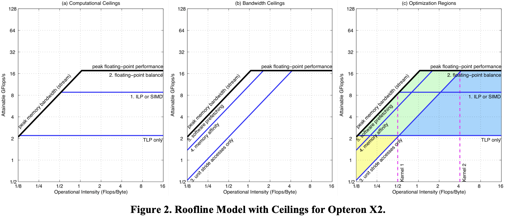

图 2c 将这两张图合并为一个图表。**内核的操作强度决定了需要进行的优化区域以及应该尝试哪些优化**。图 2c 中显示了计算优化与内存带宽优化的重叠区域，并用不同颜色加以区分。例如，内核 2 落在右侧的蓝色梯形区域，这表明只需进行计算优化。而如果内核落在左下方的黄色三角形区域，模型则建议只进行内存优化。内核 1 落在中间的绿色区域（= 黄色 + 蓝色）平行四边形中，表明需要同时进行计算和内存的双重优化。需要注意的是，内核 1 的垂直线低于浮点不平衡优化线，因此可以跳过优化 2。

Roofline model（屋顶线模型）中的性能上限表明应该进行哪些优化。上限之间的高度差代表了通过进行该优化所能获得的潜在性能提升。因此，图 2 显示优化 1（提高 ILP/SIMD）可以显著提升计算性能，而优化 4（提高内存亲和性）对提升内存带宽有很大潜在帮助。

**上限的顺序也暗示了优化的优先级**，因此我们从下到上排列优化：编译器或程序员最容易实现的优化位于底部，而难以实现或内核本身不具备的优化位于顶部。浮点运算的平衡是个例外，因为它取决于具体的内核。对于大多数内核，保持乘法与加法的平衡非常困难，但对一些内核来说，这种平衡是自然的。稀疏矩阵-向量乘法就是一个例子。对于这一领域，我们会将浮点运算平衡视为最低上限，因为它是该算法固有的。和 3Cs 模型类似，只要屋顶线模型能提供有价值的 `insights`，它不必是完美的。

## 5. 将 3Cs 模型与操作强度相结合

操作强度可以告诉我们应该关注哪些性能上限。到目前为止，我们假设操作强度是固定的，但实际上并非如此。例如，**对于稠密矩阵和 FFT 问题，某些内核的操作强度会随着问题规模的增加而提升**。

显然，缓存性能会影响访问内存的次数，因此，**提升缓存效率可以增加操作强度**。因此，我们可以将 3Cs 模型与 Roofline model 结合起来。强制性未命中设定了最小的内存数据传输（memory traffic），因此也是最高可能的操作强度。由于冲突未命中和容量未命中的内存数据传输可能显著降低内核的操作强度，我们应该尽量减少这种未命中。

例如，我们可以通过为数组添加填充来避免**冲突未命中**(traffic from conflict misses)，从而改变缓存行的地址分配。另一个例子是某些计算机支持“不分配存储”指令，这样存储操作直接写入内存而不占用缓存。这种优化可以避免将要被覆盖的数据加载到缓存中，从而减少内存数据传输，同时防止缓存中有用的数据被未读取的数据替换，从而减少冲突未命中。

操作强度的提升可能会将内核移到一个不同的优化区域。通常建议在进行其他优化之前，先优化内核的操作强度。

## 6. Roofline model 实用性

为了展示 Roofline 模型的实用性，我们为四台近期的多核计算机构建了屋顶线模型，并优化了 4 个浮点计算内核。我们接着展示了所有计算机和内核的结果都受到模型上限和屋顶线的限制。

### 6.1 四台不同的多核计算机

由于多核架构尚无传统的设计经验，因此出现了多种不同设计并不令人意外。表 1 列出了本节所讨论的四台多核计算机的关键特点，它们都是双插槽系统。

Intel Xeon 使用相对先进的处理器，每个时钟周期可以执行两条 SIMD 指令，每条指令能执行两个双精度浮点运算。它是四台机器中唯一使用前端总线连接通用北桥芯片和内存控制器的系统，而其他三台计算机的内存控制器都集成在芯片上。

Opteron X4 也采用了高性能的复杂核心，它是四台计算机中唯一带有片上 L3 缓存的系统。这两个插槽通过专用的 HyperTransport 链路通信，使得构建“无胶”多芯片系统成为可能。

Sun UltraSPARC T2+ 采用相对简单的处理器，时钟频率较为适中，这使得它每个芯片的核心数量是其他处理器的两倍。此外，它高度支持多线程，每个核心可以运行八个硬件线程。它在四台计算机中拥有最高的内存带宽，因为每个芯片都配备了两个双通道内存控制器，能够支持四组 DDR2/FBDIMMs。

IBM Cell QS20 的时钟频率在四台多核系统中最高，达到了 3.2 GHz。它的设计也非常独特，采用异构架构，包含一个相对简单的 PowerPC 核心和八个协同处理单元（SPE），这些单元拥有各自独特的 SIMD 风格指令集。每个 SPE 都配有自己的本地内存，而不是缓存。SPE 需要将数据从主内存传输到本地内存进行操作，完成后再将数据传回主内存。它使用 DMA，与软件预取有一些相似之处。缺少缓存使得将程序移植到 Cell 系统上变得更加复杂和具有挑战性。

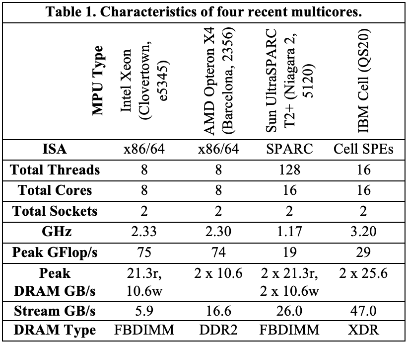

### 6.2.  四个不同的浮点运算内核

我们没有选择诸如 Parsec [5] 或 Splash-2 [30] 等标准并行基准套件中的程序，而是受到了 Phil Colella [10] 工作的启发。这位科学计算领域的专家提出了七种数值方法，他认为这些方法在未来至少十年对科学与工程将至关重要。由于这七种方法的提出，它们被称为“七个小矮人”（Seven Dwarfs）。这些小矮人以高抽象层次描述，便于跨多种实现方式分析它们的行为。广泛传播的《伯克利观点》报告 [4] 指出，如果将数据类型从浮点数改为整数，这些小矮人也能在许多其他程序中找到。需要注意的是，并不是说这些小矮人易于并行化，而是它们将在当今及未来的计算中占据重要位置。因此，设计人员需要确保它们在所设计的系统上能够高效运行，无论该系统是否并行。

使用这些高级别描述的一个优势是，我们不受限于过去为优化旧计算机而编写的代码来评估未来的系统。另一个优势是，由于数量有限，我们可以为每个内核创建自动调优器，探索不同的优化方案，生成针对该多核计算机的最佳代码，包括全面的缓存优化 [13]。

在此背景下，表 2 列出了我们用于演示屋顶线模型的四个浮点运算内核（函数），它们来自“七个小矮人”，并在表 1 中的四台多核计算机上进行测试。本节的自动调优参考了 [12]、[25] 和 [26]。

对于这些内核（函数）来说，存在足够的并行性，可以充分利用所有核心和线程，并保持负载均衡。（附录 A.2 描述了如何处理负载不均衡的情况。）

### 6.3 Roofline 模型和结果

图 3 显示了 Xeon、X4 和 IBM Cell QS20 的屋顶线模型。粉色虚线表示操作强度，红色 X 标记了该内核的实际性能。如前所述，在 SpMV 中，加法和乘法自然平衡，因此该内核的平衡较容易，而其他内核的平衡则较为复杂。因此，图 3 中每台计算机有两个图：左侧图中的 LBMHD、Stencil 和 3-D FFT 以乘加平衡为最高性能上限，右侧图中的 SpMV 则以乘加平衡为最低上限。由于 T2+ 不支持融合乘加指令，且无法同时执行乘法和加法操作，图 4 为 T2+ 显示了四个内核的单一屋顶线模型，不包含乘加平衡上限。

Intel Xeon 在四台多核系统中拥有最高的双精度浮点性能。然而，图 3a 中的屋顶线模型表明，只有在操作强度至少达到 6.7 时，才能实现该性能峰值。换句话说，Xeon 需要每个从 DRAM 传输的双精度操作数（8 字节）执行 55 次浮点运算。这一高比率部分是由于前端总线的限制，前端总线还要处理一致性流量，可能会占用一半的总线带宽。Intel 采用嗅探过滤器，减少不必要的总线一致性流量。如果工作集足够小，嗅探过滤器几乎可以将实际内存带宽翻倍。

Opteron X4 集成了片上内存控制器，提供独立的通道连接 667 MHz DDR2 DRAM，并且拥有独立的路径处理一致性。图 3 显示，Opteron X4 的屋顶线模型中的脊点位于 Xeon 的左侧，操作强度为每字节 4.4 Flops。Sun T2+ 拥有四台系统中最高的内存带宽，其脊点的操作强度非常低，仅为每字节 0.33 Flops。通过使用大量线程并行处理内存传输，T2+ 能够实现这种高带宽。IBM Cell 的操作强度脊点为每字节 0.65 Flops。

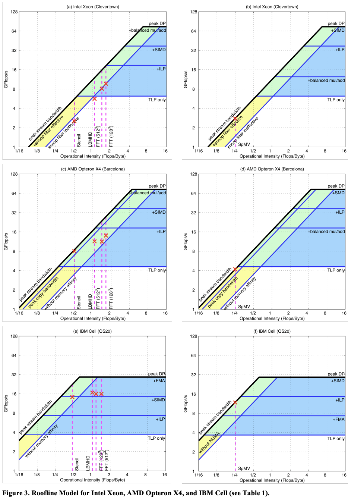
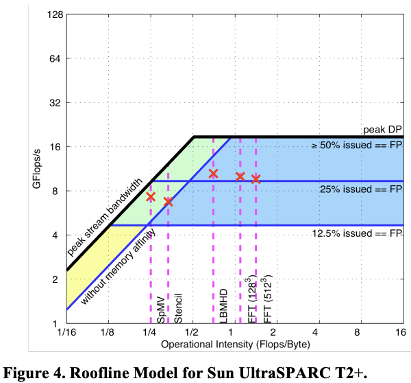

#### 6.3.1 稀疏矩阵-向量乘法 (SpMV)

第一个稀疏矩阵计算的内核示例是稀疏矩阵-向量乘法 (SpMV)，计算公式为 y = A * x ，其中 A 是稀疏矩阵，x 和 y 是密集向量。SpMV 在科学计算、经济建模和信息检索中广泛应用。然而，传统的实现通常只能在单处理器上运行不到 10% 的峰值浮点性能。其原因之一是稀疏矩阵导致的内存访问不规则性。操作强度在寄存器阻塞优化前为 0.17 Flops/字节，优化后提升至 0.25 Flops/字节 [29]。（见附录 A.1）

由于 SpMV 的操作强度低于四台多核系统的脊点（见图 3），因此大多数优化都集中在内存系统上。表 3 总结了 SpMV 及其他内核的优化策略，许多优化与图 3 中的上限相关，上限高度预示了这些优化的潜在性能提升。

#### 6.3.2 Lattice-Boltzmann 磁流体力学 (LBMHD)

与 SpMV 类似，LBMHD 在单处理器上也只能达到较低的峰值性能，这是由于其数据结构的复杂性和内存访问的不规则性。LBMHD 的 Flops/字节比率为 0.70，而 SpMV 通常为 0.25 或更低。通过使用“无分配存储”优化，LBMHD 的操作强度可以提升至 1.07。两个 x86 多核系统支持此缓存优化，而 Cell 由于采用 DMA 机制则不存在该问题。T2+ 的操作强度则较低，为 0.70。

图 3 和图 4 显示，LBMHD 的操作强度足够高，因此计算和内存带宽优化在所有多核系统上都能起作用，除了 T2+，其脊点低于 LBMHD 的操作强度。T2+ 通过仅计算优化就能达到性能上限。

#### 6.3.3 模板计算 (Stencil)

一般来说，模板计算是在结构化网格中基于邻居点的值更新某个点的操作。模板在空间中移动时其结构保持不变。在此工作中，我们使用了基于 256^3 三维均匀网格的模板，来源于显式热方程 PDE [12]。该模板的邻居为沿每个坐标轴的最近 6 个点以及中心点本身。在写分配架构中，模板每产生 24 字节的强制性内存流量会执行 8 次浮点运算，操作强度为 0.33。

#### 6.3.4 三维快速傅里叶变换 (3D FFT)

快速傅里叶变换 (FFT) 是一种经典的分治算法，通过递归将离散傅里叶变换分解为多个更小的变换。FFT 广泛用于图像处理和数据压缩等领域。处理 3D FFT 的高效方法是沿每个维度进行 1D 变换，以保持连续的内存访问。我们在 Xeon、X4 和 T2+ 系统上使用自动调优库 (FFTW) [15] 进行了 1D FFT 计算。在 Cell 上，我们实现了基 2 FFT。

与前面提到的三个内核不同，**FFT 的操作强度取决于问题的规模**。对于我们分析的 $128^3$ 和 $512^3$ 点变换，操作强度分别为 1.09 和 1.41。（由于 Cell 的 1 GB 主存无法容纳 $512^3$ 点的数据，我们对此结果进行了估算。）在 Xeon 和 X4 系统中，整个 128x128 平面可以被缓存，从而增加了时间局部性，将 $128^3$ 点变换的操作强度提高到了 1.64。

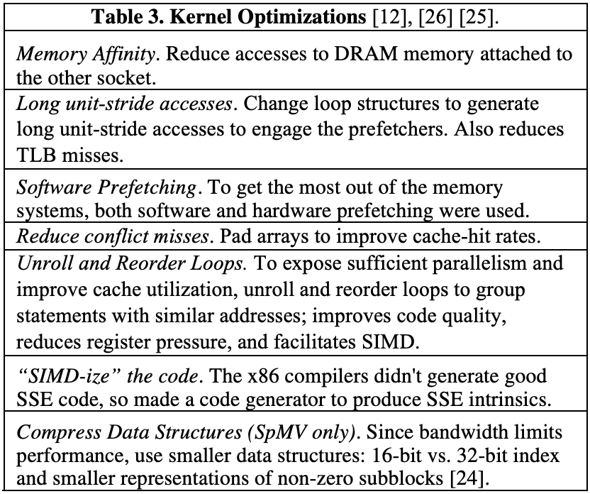

#### 6.3.5 生产效率与性能

除了性能之外，并行计算革命中的另一个重要问题是生产力，即实现高性能程的编程难度 [4]。一个相关问题，较低的脊点是否能够为生产力提供 `insight`。

Sun T2+ 的脊点最低，因此编程难度相对较低，主要得益于它较大的内存带宽和易于理解的核心架构。对于在 T2+ 上运行的内核，建议是通过编译器获取高性能代码，然后尽可能多地利用线程。缺点是 T2+ 的 L2 缓存只有 16 路集合关联，当 64 个线程同时访问缓存时，可能会出现冲突未命中，就像在 Stencil 内核中发生的那样。

相比之下，脊点最高的计算机在未优化的情况下性能最低。Intel Xeon 编程难度较大，原因在于难以理解其双前端总线的内存行为，难以掌握硬件预取的工作机制，且很难通过编译器生成高效的 SIMD 代码。为了获得良好性能，针对 Xeon 和 Opteron X4 的 C 代码中**大量使用了包含 SIMD 指令的内联语句**。由于 Opteron X4 的脊点接近 Xeon，因此它也需要同样多的优化努力，不过 Opteron X4 的内存行为比 Xeon 更容易理解。

IBM Cell 的脊点接近 Sun T2+，但它面临两方面的挑战。首先，编译器为 Cell 的 SPE 生成 SIMD 指令的效率较低，有时我们需要通过在 C 代码中插入内联汇编语句来帮助编译器。其次，Cell 的内存系统更具挑战性。每个 SPE 的本地内存位于独立的地址空间，因此代码不能简单移植并运行在 SPE 上。程序必须发出 DMA 命令，在本地存储与主内存之间传输数据。好消息是，DMA 在本地存储中的作用类似于缓存中的软件预取。与缓存预取相比，编写 DMA 代码更加容易，并能实现更好的内存性能与计算任务的重叠。

#### 6.3.6 屋顶线模型演示总结

为了展示 Roofline 模型的有效性，表 4 列出了每个内核-计算机组合的上限、下限，以及其每秒的 GFlops 和 GBytes 性能数据。请注意，操作强度是这两个速率的比值。表中列出的上限和下限是实际性能的范围。所有 16 个案例都验证了该界限和瓶颈模型，因为 Roofline 的上下限限定了性能，所以内核（函数）按照下限的建议进行了优化。限制性能的关键指标以粗体显示：在 Xeon 和 X4 上，16 个案例中有 15 个受内存带宽限制，而在 T2+ 和 Cell 上几乎是均衡分布。对于 FFT，有趣的是，在 Xeon 和 X4 上受内存带宽限制，而在 T2+ 和 Cell 上受计算能力限制。

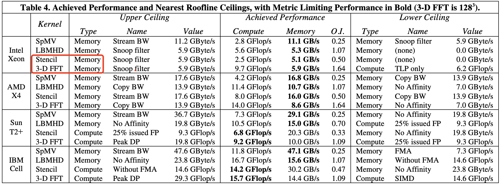

## 7. 关于 Roofline 的一些误解
> 这里只展示部分误解及其解释。

1. **误解：模型未考虑现代处理器的所有特性，如缓存或预取**。事实上，内存访问是在缓存与内存之间测量的，而不是在处理器与缓存之间测量的。
2. **误解：增大缓存容量会提高操作强度**。事实上，不一定。
3. **误解：模型未考虑长内存延迟**。事实上，图 3 和图 4 中不使用软件预取时的上限显示较低的内存带宽，正是因为它们无法隐藏长内存延迟。
4. **误解：Roofline 模型与多核系统无关**。事实上，它对多核系统的帮助更大，典型的就是在 GPU cuda 程序的应用
5. **误解：每个内核都需要重新计算模型**。事实上，计算一次就够了。
6. **误解：该模型仅限于浮点程序**。事实上，3D FFT 的转置阶段，它根本不执行浮点运算，但依然存在 Roofline，因为本地存储和缓存会影响去往 DRAM 的交换次数。
7. **误解：屋顶线模型必须使用 DRAM 带宽**。事实上，现在 gpu 推理优化深度学习模型已经广泛使用 Roofline 模型进行上限和瓶颈分析。

## 8. 附录
> [Roofline: AnInsightfulVisual Performance Modelfor Floating-Point Programsand Multicore Architecture](https://escholarship.org/uc/item/5tz795vq)

### 计算操作强度、屋顶线和上限

基于 DRAM 带宽的屋顶线模型是通过三组数据构建的，这些数据来自微基准测试或特定架构的软件优化手册 [AMD08]。通常，性能受以下三者中最小值的限制：
1. 操作强度 * 带宽（优化 1…i）（Op. Intensity * Bandwidth (with optimizations 1…i)）
2. 内核的 Flops/秒（优化 1…j）（In-core Flop/sec (with optimizations 1…j)）
3. 浮点运算占比与内核 Flops/秒的函数关系（In-core Flop/sec as a function of the floating-point fraction.）。

通常，后两个因素在某个架构上占主导地位。因此，我们为每台机器绘制一条 Roofline。这些参数提供了内核无关的性能上限，因此只需为每台机器的每个指标收集一次数据。本节介绍了这些上限的测量或计算方法。

**A.1.1 操作强度**

操作强度受架构和内核的双重影响，因此必须为每个内核-架构组合单独计算。最简单的方法是使用性能计数器测量实际的运算量和内存流量。然而，视具体内核而定，可能可以手动计算出感兴趣的运算量和最小内存流量，因此可以对操作强度设定上限。

**A.1.2 主内存带宽**

第一组上限与主存带宽相关，并随着优化的增多而变化。虽然 STREAM 基准测试声称能报告带宽，但实际上并没有。它测量的是每秒迭代次数，然后尝试根据非写分配架构的强制内存流量转换为带宽。这个细微但重要的差异意味着它无法考虑冲突未命中或写入未命中的填充流量。

为了正确测量流式带宽，我们编写了高度优化的 STREAM 基准测试版本，执行点积和数据复制操作。我们为数组添加填充以避免银行冲突和缓存冲突，并使用缓存旁路指令或增加转换系数以考虑填充流量。最简单的版本是将所有数据分配给一个处理器（没有内存亲和性），但适当展开并填充数据。接下来，我们正确利用内存亲和性，并收集新的带宽数据。随后，我们为循环添加了自动调优的软件预取，并测量带宽。最后，通过减少数据集大小以提高嗅探过滤器的有效性，得到了第四个带宽值。我们对每种版本分别进行基准测试，并为每个测量到的带宽定义了一个新的上限。

**A.1.3 核内并行性**

为了估算利用核内并行性后的性能，我们参考了相关架构的软件优化手册 [AMD08]。长期来看，这并非理想方案，因为它要求对当前和未来的架构有深刻的了解。然而，针对本文的分析，不需要基准测试。

例如以下求和操作：

$$y = x[1] + x[2] + x[3] + … + x[N]$$

我们将**线程级并行性定义为最简单的并行化优化**。因此，最基本的上限是仅基于线程级并行性的上限。每个线程处理 $N/N_{\text{Threads}}$ 个元素。假设每个线程执行的是展开但依赖的标量浮点加法链，不存在指令级、数据级或功能单元级并行性。在这种情况下，下一次加法操作要等到前一次操作完成后才能开始，这暴露了浮点运算管道的延迟。此时的吞吐量上限计算为：

$$\text{核心数} \times \text{频率} \times \max(1, \frac{\text{每核心线程数}}{\text{延迟}})$$

其中，ThreadsPerCore 是共享同一核心内浮点单元 (FPU) 的线程数。在细粒度多线程架构中，只要有足够的线程，FPU 的延迟可以通过 Latency 个线程隐藏，从而完全利用 FPU。

如果通过**循环展开**并维护多个部分和进行进一步优化，那么**指令级并行性**便得以展现。因此，下一个上限假设每个线程有足够的指令级并行性以隐藏功能单元的延迟。此时的吞吐量为：

$$\text{核心数} \times \text{频率}$$

接下来，我们引入**数据级并行性**（`SIMD`）。两个标量加法指令可以合并为一条 SIMD 加法指令，将两个部分和存储在 SIMD 寄存器中。最终的上限结合了线程级、指令级和数据级并行性：

$$\text{核心数} \times \text{频率} \times \frac{\text{SIMD 宽度}}{\text{SIMD 吞吐量}}$$

吞吐量项必须包含在内，因为某些架构支持 SIMD 指令，但每个周期只能执行一个元素。例如，对于执行双精度 SIMD 指令的较旧的 Santa Rosa Opteron 处理器，其宽度为 2 FLOPs，而吞吐量为每两个周期一条指令。

值得注意的是，代码并未执行任何浮点乘法。但如果修改为：

$$y = y[1] \times x[1] + y[2] \times x[2] + y[3] \times x[3] + … + y[N] \times x[N]$$

此时加法和乘法将保持平衡。对于具有融合乘加 (FMA) 指令或并行加法和乘法路径的架构，核内性能的上限为：

$$2 \times \text{核心数} \times \text{频率} \times \frac{\text{SIMD 宽度}}{\text{SIMD 吞吐量}}$$

在 Niagara2 上，由于每个核心每周期只能发出一条标量浮点指令，性能上限为：

$$\text{核心数} \times \text{频率}$$

需要注意的是，一些计算机（例如 IBM P5）有多个相同的浮点数据通路。ILP（指令级并行性）可用于满足超标量和深度流水线的功能单元。因此，它们可以比这些公式中展示的得到更大的 ILP 受益。

**A.1.4 指令组合**

处理器的指令发射带宽是有限的，而**浮点指令的发射带宽通常小于或等于总指令发射带宽**。随着非浮点指令占比的增加，浮点指令的发射带宽会被非浮点指令抢占。我们根据指令组合中浮点指令的占比计算出一组上限，假设核内并行性已被完全利用。此方法较为复杂，例如在 Cell 架构上，双精度指令会导致发射单元停顿 6 个周期。浮点指令的比例通常用 2 的负次方表示。根据不同架构和内核，通常可以确定哪些核内上限应被考虑，这些上限也考虑到处理器可能有限的整数运算性能。

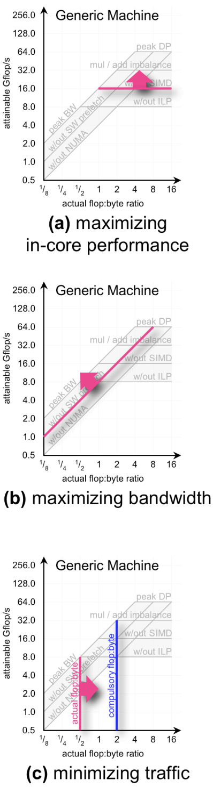

### 负载均衡与屋顶线模型

负载均衡大致可以分为内存访问的不平衡和计算的不平衡。

**A.2.1 计算不平衡**

计算不平衡容易理解和可视化。随着不平衡的加剧，承担全部工作量的线程数量越来越少。在极端情况下，如果排除糟糕的屏障实现，性能将退化为顺序执行。因此，我们可以定义 logP 上限，表示以二的幂次递减的负载不平衡对性能的限制。根据负载均衡是否被认为比核内优化更易处理，可以将其放在屋顶线的正下方，或者仅有线程级并行性的上限下方。图 A2 和 A3 展示了在计算负载均衡中应用屋顶线模型的两种方法。

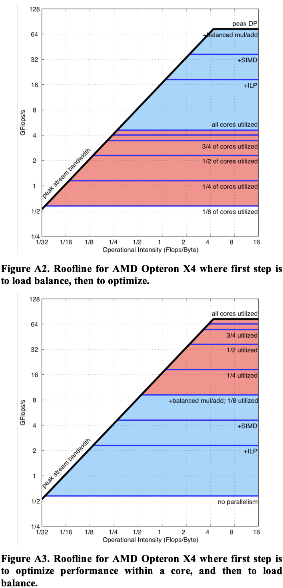

**A.2.2 内存不平衡**

当一个核心产生的主存流量与其他核心显著不同，或者某些内存控制器的负载远高于其他控制器时，就会出现内存不平衡。之前，我们在讨论内存亲和性时探讨了后者。当所有数据都位于共享内存多处理器的一个插槽中时，内存控制器的负载明显不平衡——其他插槽的控制器未被使用。在屋顶线模型中，带宽上限表示这种性能下降。

在每个核心产生的内存流量不平衡的情况下，Little 定律未被满足。根据延迟-带宽乘积，需要相同的并发性。然而，不产生主存流量的核心减少了全芯片可利用的并发性。当利用的并发性低于满足 Little 定律所需的并发性时，持续带宽会下降。对于我们的 SPMD 代码，这种不平衡从未发生。

然而，通常可以将其视为一系列逐渐降低的带宽上限，用产生主存流量的核心比例来标记。根据认为更容易实现的是内存优化还是负载均衡，这些上限可以放在屋顶线下方或最低上限下方。需要一个基准测试来生成这样的图表。图 A4 展示了内存不平衡的情况。

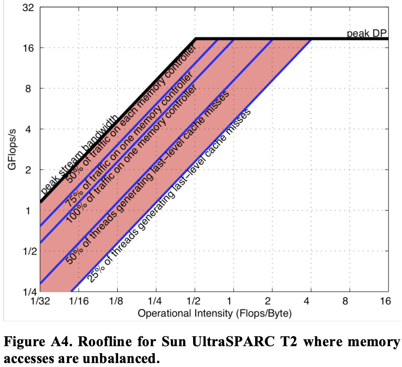

### 与性能计数器的互动

绘制的屋顶线（Roofline）展示了充分利用每种架构特性的好处。好消息是，这个模型为架构师、编译器开发者和程序员提供了系统优势和劣势的洞察。

如果能获得 100% 的 ILP、100% 的 DLP，以及 50% 的乘法/加法平衡，估计性能相对容易。然而，在实际中，可能无法完全利用所有特性。事实上，可能只能利用 85% 的 ILP、75% 的 SIMD，且乘法与加法的平衡度为 65%。

因此，一个有趣的未来方向是补充上述的“面向架构”的屋顶线模型，使用**性能计数器**生成“面向运行时”的屋顶线模型。我们可以从基础的屋顶线开始，利用性能计数器生成表示由于未充分利用各种架构特性而导致性能损失的上限。例如，可以检查性能计数器，统计发出了多少浮点 SIMD 指令。将其除以发出的浮点指令总数，可以定义一个实际的 SIMD 上限。明确地说，如果未发出任何 SIMD 指令，那么上限等于峰值性能的一半；如果所有发出的指令都是 SIMD，那么上限就是峰值。关键是在计算核内上限时，必须忽略来自内存的停顿。

性能计数器还可用于估计峰值带宽的真实限制。通过统计所有内存控制器的总 DRAM 内存流量，可以轻松计算带宽。利用性能计数器观察内存控制器之间的不平衡，可以估计进一步内存亲和性优化的收益。同样，可以统计队列未满时的延迟周期，以确定软件预取的实际潜力。

最后，性能计数器可以用来确定真实的操作强度。理想情况下，性能计数器能够区分强制未命中、容量未命中和冲突未命中。这样就可以判断缓存优化是否有益。如果能够区分容量未命中和冲突未命中，就可以决定缓存阻塞或数组填充优化是否会带来收益。

图 A5 显示了 Opteron X4 的传统面向架构的模型，而图 A6 展示了针对一个假设内核的 Opteron X4 的面向运行时的屋顶线模型。

    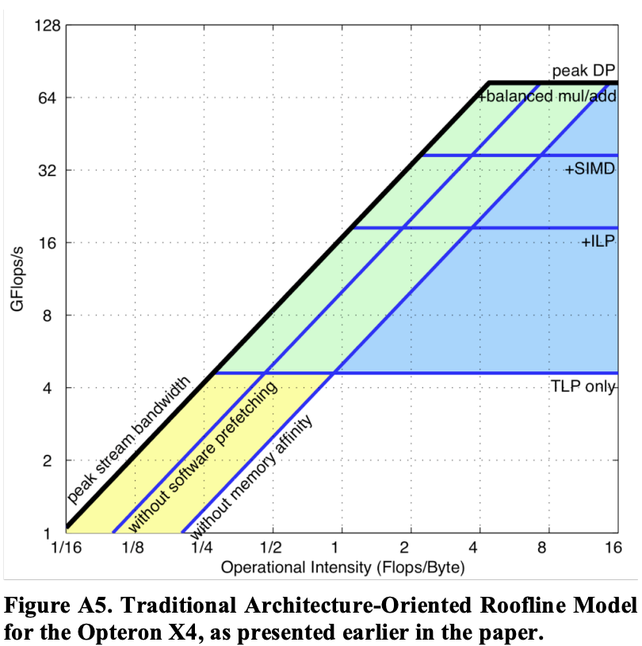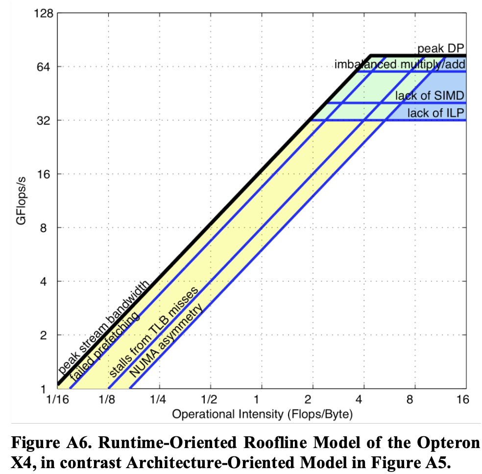

