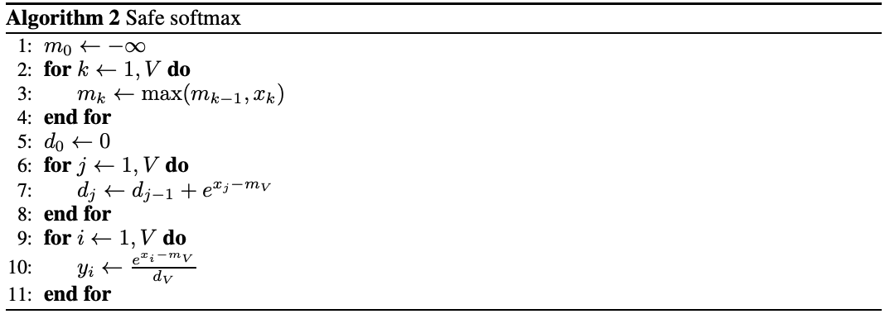

- [1. Online Softmax](#1-online-softmax)
  - [Original Softmax](#original-softmax)
  - [Online Softmax](#online-softmax)
- [2. FlashAttention-v1](#2-flashattention-v1)
  - [Tiling](#tiling)
  - [Roofline](#roofline)
  - [SRAM](#sram)
  - [FlashAttention](#flashattention)
- [3. FlashAttention-v2](#3-flashattention-v2)
- [4. FlashAttention-v3](#4-flashattention-v3)
- [5. FlashDecoding \& FlashDecoding++](#5-flashdecoding--flashdecoding)
- [参考资料](#参考资料)

## 1. Online Softmax

### Original Softmax

假设 $\text{Softmax}$ 函数输入矩阵大小为 $[s,s]$，这里都默认是对行进行 `Softmax`。

**1，Naive softmax**

给定输入向量 $\mathbf{x} = [x_1, x_2, \dots, x_s]$，$Softmax(x)$ 函数的输出定义为：

$$d_N= \sum_j^{N} e^{x_j} \\
y_i = \frac{e^{x_i}}{d_N} $$

Naive Softmax 算法主要包括两个步骤，其算法实现步骤和 `FLOPs` 分析如下：


1. **计算归一化项 $dn$**：先对矩阵每个元素都需要进行指数运算，涉及 `FLOPs` 为 $s^2$（逐元素操作），假设是**对每一行进行 `Softmax`**，每一行有 $s$ 个元素，需要进行 $s - 1$ 次加法，矩阵总共有 $s$ 行，因此需要 $s\times(s - 1)$ 次加法，最后计算归一化项 $dn$ 的 `FLOPs` 为 $2s^2-s$
2. **计算 softmax 输出**：分为两步进行每个元素都需要除以所在行的总和，总共 $s^2$ 个元素，`FLOPs` 为 $s^2$。

综上，`Native Softmax` 的总 FLOPs 为：

$$\text{Native Softmax FLOPs} = 2s^2 - s + s^2 = 3s^2-s$$

算法的 `python` 代码实现和其对 global memory 的访存量 `MAC` 数值如下所示：

```python
"""
在 attenion 算子中, softmax 函数的输入 QK^T, 输入矩阵大小就是 [s,s]
"""
# [s, s] -> [s, s], 每个元素进行 3 次内存访问：2次读取和一次写入.
# mac = 3s^2, flops = 3s^2 - s
def native_softmax(x):
    s, s = x.shape # 第一个维度是序列长度，第二个维度是隐藏层大小
    output = np.array(x) # np.array() 将 python 中的数据结构（如列表、元组等）转换为 NumPy 的数组
    for r in range(s):
        sum = 0
        for j in range(s):
            sum += np.exp(x[r][j]) 
        for i in range(s):
            output[r][i] = np.exp(x[r][i]) / sum
    
    return output
```

**2，Safe Softmax**

和 `Native Softmax` 相比，`Safe Softmax` 为了防止数值溢出还需要将 $x_i$ 再额外减掉一个 `max` 最大值：

$$m_N= \text{max}_{k}^{N} x_k \\
d_N= \sum_j^{N} e^{(x_j -m_N)} \\
y_i = \frac{e^{(x_i - m)}}{d_N} $$

`Safe Softmax` 涉及三个步骤，其算法实现步骤和 `FLOPs` 分析如下：



1. **对每行求最大值**：遍历每行元素，做 $s-1$ 次比较，得到每行元素的最大值，总共 $s$ 行，因此该操作涉及 `FLOPs` 为 $s(s-1)$
2. **计算指数并求和得到归一化项 $dn$**：将每个元素减去最大值后，再计算指数，这个过程是**逐元素操作**，`FLOPs` 为 $s^2 + s^2$。对每行进行求和，每行进行 $s - 1$ 次加法，整个矩阵共 $s\times(s - 1)$ 次加法。
3. **计算 softmax 输出**：将每个元素减去最大值后，再计算指数，最后除以行总和，需要 $2s^2$ 次除法。

值的注意的是，这里计算 max 需要一次独立的**全局** reduce，计算分母的 sum 再需要一次独立的全局 reduce，最后分别计算每一个元素的 softmax 值。三个步骤之间**存在数据依赖**。

结合前面 `Native Softmax` 的 FLOPs 计算，再加上对每行求最大值的操作，可知 `Safe Softmax` 总 `FLOPs`：

$$\text{Safe Softmax FLOPs} = (s^2 - s) + (5s^2 - s) = 6s^2 - 2s$$

`Safe Softmax` 算法的 `python` 代码实现和其对 global memory 的访存量 `MAC` 数值如下所示：

```python
# [s, s] -> [s, s], 每个元素进行 4 次内存访问：3次读取和一次写入.
# mac = 4s^2, flops = 4s^2 - 2s
def safe_softmax(x):
    s, s = x.shape # 第一个维度是序列长度，第二个维度是隐藏层大小
    output = np.array(x) # np.array() 将 python 中的数据结构（如列表、元组等）转换为 NumPy 的数组
    for r in range(s):
        max_r = 0
        for k in range(s):
            max_r = max(max_r, x[r][k]) # flops 为 1
            
        sum = 0
        for j in range(s):
            sum += np.exp(x[r][j] - max_r) # flops 为 2 + 1
            
        for i in range(s):
            output[r][i] = np.exp(x[r][i] - max_r) / sum # flops 为 2
    
    return output
```
### Online Softmax
> 算法分析和公式证明过程，本文不再描述，感兴趣的可以看我上一篇文章-《online-softmax 论文解读》。

考虑原始计算步骤中分母求最大值以及求和的部分，这里需要 $3$ 个独立的循环，即`Safe Softmax` 对输入向量进行了三次遍历：第一次计算最大值 $m_n$，第二次计算归一化项 $d_n$，第三次计算最终值 $y_i$，再加上将结果写回内存中，这导致**每个向量元素总共需要 `4` 次内存访问**，即原始的 Softmax 算法的内存访问（`MAC`）偏大。

$$\begin{align}
m_i &= \max(m_{i-1}, x_i) \\
d_i &= d_{i-1} + e^{x_i - m_N} = \sum^i_{j=1}e^{x_j - m_N} \\
softmax_i &= \frac{e^{x_i - m_N}}{d_N} \\
\end{align}$$

从上述公式很明显看出，MAC 大原因是因为存在数据依赖：(2) 需要依赖 $m_N$, (3) 则需要依赖 $m_N$ 和 $d_N$。但如果能有下述的关系：

$$d_i' = \sum_{j=1}^i e^{x_j - m_i} = d_{i-1}' + e^{x_i -m_i}$$

则公式 (2) 对 $m_N$ 的数据依赖则就不存在了，虽然序列的中间部分的值不相等但最终的结果 $d_N$ 与 $d_N'$ 是等价的，从代码角度看，则可以实现在一个 for 循环中得到最终的 $m_N$ 和 $d_N$，减少 `MAC`。这个就是 [Online normalizer calculation for softmax](https://arxiv.org/pdf/1805.02867) 论文提出的一种能将上面的 3 步 softmax 合并成 2 步完成的方法，论文证明了 $d_i'$ 存在递推性质

$$\begin{aligned}
d_i' &= \sum^i_{j=1}e^{x_j - m_i} \\
&= \sum^{i-1}_{j=1}e^{x_j - m_i} + e^{x_i-m_i} \\
&= \left ({\sum^{i-1}_{j=1}e^{x_j - m_{i-1}}} \right ) * e^{m_{i-1} - m_i} + e^{x_i-m_i} \\
&= d_{i-1}'* e^{m_{i-1} - m_i} + e^{x_i-m_i} \\
\end{aligned}$$

即 $m_i$ 和 $d_i'$ 可以在一个 for 循环中计算并更新，这样 softmax 的实现就可以通过两个 for 循环完成，即两步 softmax，`Online Softmax` 计算公式如下：

$$m_j = max(m_{j-1}, x_j),\quad d_j = d_{j-1}e^{m_{j-1} - m_j} + e^{x_j - m_j}  \\
softmax\ x_i = \frac{e^{x_i - m_V}}{d_V} \tag{4}$$

这里 $m_j$ 和 $d_j$, 可以在一个 for 循环中同时实现，或者说在一个 kernel 中计算完成；$m_s$ 和 $d_s$ 是全局的最大值和归一化项。其算法实现过程如下所示：


如果想继续优化，则**使用分块技术计算归一化常数**，先定义分块计算: $ d_{xy} = d_x * e^{m_x - m_{xy}} + d_y * e^{m_y - m_{xy}}$，分块计算完 $m$ 和 $d$ 之后，再将所有子块结果重新聚合得到全局结果 $m_N$ 和 $d_N$，其和串行顺序计算结果在数学上完全等价**

这篇论文在算法上其实有**两个创新**：
1. 提出并证明了通过**一次遍历**输入数据来计算 Softmax 函数归一化项的方法，该方法将 Softmax 函数的内存访问次数减少了 $1.33 (4/3 = 1.33)$倍
2. 证明了可以**分块计算归一化常数**，这个方法可以发挥 GPU 多线程的特性。

这里针对上面两个创新，我分别给出 online softmax 算法的 `python` 代码实现以及 global memory 的访存量 `MAC`。

```python
import numpy as np
import torch.nn.functional as F
import torch

def online_softmax_update(m0, d0, m1, d1):
    #                             x   1
    m = max(m0, m1) # flops: 1
    d = d0 * np.exp(m0 - m) + d1 * np.exp(m1-m) # flops: 5
    return m, d

# [s, s] -> [s, s], 每个元素进行 3 次内存访问：2 次读取和一次写入.
# mac = 3s^2, flops = 8s^2 
def online_softmax(x):
    s, s = x.shape
    output = np.array(x)
    for r in range(s):
        m = x[r][0]
        d = 1
        for j in range(1, s):
            m, d = online_softmax_update(m, d, x[r][j], 1) # flops 为 6
        for i in range(s):
            output[r][i] = np.exp(x[r][i] - m) / d # flops 为 2
            
    return output

# [s, s] -> [s, s], 每个元素进行 3 次内存访问：2 次读取和一次写入. 
# mac = 3s^2, flops = 8s^2，分块计算，可发挥并行计算优势
def block_online_softmax(x, block_size=256):
    assert x.shape[1] % block_size == 0
    s, s = x.shape
    output = np.array(x)
    for r in range(s):
        m = x[r][0]
        d = 0
        
        # 可使用多线程并行计算，实际 mac 为 s^2
        for b in range(0, s // block_size):
            # Calculate m,d of single block
            m_block = x[r][b*block_size]
            d_block = 0
            for j in range(0, block_size):
                m_block, d_block = online_softmax_update(m_block, d_block, x[r][b*block_size + j], 1)
            
            # Merge all block's result to total
            m, d = online_softmax_update(m, d, m_block, d_block) 
            
        for i in range(s):
            output[r][i] = np.exp(x[r][i] - m) / d
    
    return output
     
if __name__ == "__main__":
    x = np.random.randn(1024, 1024)
    # 对每一行执行 softmax 操作
    pytorch_softmax_out = F.softmax(torch.tensor(x), dim=1) # dim=0表示按列计算；dim=1表示按行计算。
    native_softmax_out = native_softmax(x)
    safe_softmax_out = safe_softmax(x)
    online_softmax_out = online_softmax(x)
    block_online_softmax_out = block_online_softmax(x, 256)
    
    if torch.allclose(pytorch_softmax_out, torch.tensor(native_softmax_out), atol=1e-4):
        print("naive softmax 与 PyTorch softmax 结果一致!")
    else:
        print("naive softmax safe_softmax 与 PyTorch softmax 结果不一致!")
    
    if torch.allclose(pytorch_softmax_out, torch.tensor(safe_softmax_out), atol=1e-4):
        print("safe softmax 与 PyTorch softmax 结果一致!")
    else:
        print("safe softmax 与 PyTorch softmax 结果不一致!")
    
    if torch.allclose(pytorch_softmax_out, torch.tensor(online_softmax_out), atol=1e-4):
        print("online softmax 与 PyTorch softmax 结果一致!")
    else:
        print("online softmax 与 PyTorch softmax 结果不一致!")

    if torch.allclose(pytorch_softmax_out, torch.tensor(block_online_softmax_out), atol=1e-4):
        print("block online softmax 与 PyTorch softmax 结果一致!")
    else:
        print("block online softmax 与 PyTorch softmax 结果不一致!")
```

程序运行后输出结果如下所示:
> naive softmax 与 PyTorch softmax 结果一致!
safe softmax 与 PyTorch softmax 结果一致!
online softmax 与 PyTorch softmax 结果一致!
block online softmax 与 PyTorch softmax 结果一致!

## 2. FlashAttention-v1

### Tiling

Parallel online normalizer calculation.

### Roofline

How to understand Roofline Model?

### SRAM

**FlashAttention 论文中说的 `SRAM` 是指哪种 GPU 内存类型？**

1，可以从 cuda 编程和算法角度理解 SRAM 是 L1 Cache (数据缓冲)。

FlashAttention 核心是分块计算注意力，可以简单理解为就是将输入张量划分成很多块，每个数据块放到 sm 里面去计算（cuda/triton 编程的核心就是在于如何将数据分块），sm 里面 L1 cache/共享内存的大小基本就决定了 这个数据块的上限空间大小，所以论文里面说的 SRAM 大小其实值的是 L1 Cache 大小，L2 Cache 是所有 SM 能共同访问的，明显不是论文里指的 SRAM。

2，可以从 GPU 内存层次角度直接看出 SRAM 是 L1 Cache (数据缓冲)。

论文 2.1 节明确都说了 A100 的 SRAM 大小是 192 KB，“As an example, the A100 GPU has 40-80GB of high bandwidth memory (HBM) with bandwidth 1.5-2.0TB/s and 192KB of on-chip SRAM per each of 108 streaming multiprocessors with bandwidth estimated around 19TB/s [44, 45].” 

而英伟达官网给出的 A100 白皮书也明确说了 A100 的 L1 cache 大小是 192KB（ 组合共享内存和 L1 数据缓存），所以论文的 SRAM 肯定指的是 L1 cache 了。

另外，这个论文学习，除非有 cuda 编程经验和 transformer 模型扎实的算法基础就好容易理解点，不然真的太难懂啦，很多人其实刚开始就看了个寂寞，而且这个论文也可以说 attention 和 cuda 优化的集大成者啦。

### FlashAttention

FlashAttention-v1 其实并没有提出新的算法和网络结构上的优化，但是其在算法上综合了过往的两个创新点：**分块**和**重计算**，并将其应用于 Attention 结构，给出了详尽的数学计算、证明和 IO 复杂度分析（论文长达 34 页大头都是公式），可以说是过往 transformer 模型在 gpu 上优化的**集大成者**，而且最重要的是提供了非常易用的前向传播和反向传播的代码库，这使得其广为引用和应用于工业界。
> 可见，优秀的代码功底、扎实的理论基础、底层硬件和框架的熟悉对于科研工作非常重要，即使你没有提出新的算法，但是你的工作依然可以广为传播和应用。

总的来说，FlashAttention 通过 `Tiling` 和 `Recomputation` 技术大幅减少了 cuda kernel 对 global memory 的访问量，使得在 sequence length 偏长和 attention 计算处于内存密集型的情况下有着明显的加速效果。
> 本文主要分析其在模型推理阶段的优化，因此**重计算**方法的分析就略过了。

论文总结的一些定理：

【**定理 1**】 算法 1 注意力输出矩阵 $O = softmax(QK^T)V$ 要求 $O(N^2d)$ 的 FLOPs，并且除了输入和输出内存之外，需要额外的 $O(N)$ 内存【证明见附录 B】。

【**定理 2**】假设 $N$ 是输入序列的长度，$d$ 是注意力头的维度，$M$ 是 `SRAM` 大小，且 $d \leq M\leq Nd$。标准 attention 的 `HBM` 访问次数是 $O(Nd+N^2)$，而 FlashAttention [算法 1] 只需要 $O(N^2d^2M^{-1})$。

【**命题 3**】设 $N$ 为序列长度，$d$ 为头部维度，$M$ 为 `SRAM` 的大小，且 $d \leq M \leq Nd$。不存在一个算法可以在所有范围内的 $M$（即 $[d, N d]$）使用少于 $O(N^2 d^2 M^{-1})$ 次 `HBM` 访问来计算精确的注意力。

【**定理 4**】假设 $N$ 是输入序列的长度，$d$ 是注意力头的维度，$M$ 是 `SRAM` 大小，且 $d \leq M\leq Nd$。块-稀疏的 FlashAttention (算法 5) 的 HBM 访问次数是 $O(Nd + N^2d^2M^{−1}s)$。（其中 $s$ 是块稀疏掩码中非零块的比例）

【**定理 5**】设 $N$ 为序列长度，$d$ 为头部维度，$M$ 为 `SRAM` 的大小，且 $d \leq M \leq Nd$。标准注意力（算法 0）的反向传播需要 $\Theta(N d + N^2)$ 次 HBM 访问，而 FlashAttention 的反向传播（算法 4）只需要 $\Theta(N^2 d^2 M^{-1})$ 次 HBM 访问。

Online Softmax 实现在一个 for 循环中计算 $m_i$ 和 $d_i$，FlashAttention-v1 基于它的思想更进一步，实现在一个 for 循环中计算 $m_i$、$d_i$、$\text{softmax}_i$ 和注意力输出 $O_i$，也就是说，在一个 kernel 中实现 attention 的所有操作，这样大大减少了内存访问次数（内存读/写的次数）。


## 3. FlashAttention-v2


## 4. FlashAttention-v3


## 5. FlashDecoding & FlashDecoding++


## 参考资料

- [Online normalizer calculation for softmax](https://arxiv.org/pdf/1805.02867)
- [FlashAttention: Fast and Memory-Efficient Exact Attention with IO-Awareness](https://arxiv.org/pdf/2205.14135)
- [FlashAttention-2:Faster Attention with Better Parallelism and Work Partitioning](https://tridao.me/publications/flash2/flash2.pdf)
- [FlashAttention-3: Fast and Accurate Attention with Asynchrony and Low-precision](https://arxiv.org/pdf/2407.08608)
- [FlashAttention: Fast and Memory-Efficient Exact Attention with IO-Awareness](https://ahmdtaha.medium.com/flashattention-fast-and-memory-efficient-exact-attention-with-io-awareness-2a0aec52ed3d)
- [Chenfan Blog-FlashAttentions](https://jcf94.com/2024/02/24/2024-02-24-flash-attention/)
- [FlashAttentions 原理及代码实现](https://jcf94.com/2024/02/24/2024-02-24-flash-attention/)
- [Self Attention 固定激活值显存分析与优化及PyTorch实现](https://zhuanlan.zhihu.com/p/445016136)
- [榨干 GPU 效能的 Flash Attention 3](https://tomohiroliu22.medium.com/%E6%A6%A8%E4%B9%BEgpu%E6%95%88%E8%83%BD%E7%9A%84flashattention%E7%AC%AC%E4%B8%89%E4%BB%A3-4a8b0a2a812e)
- [图解大模型计算加速系列：FlashAttention V1，从硬件到计算逻辑](https://zhuanlan.zhihu.com/p/669926191)
- [FlashAttention 实现算子融合原理的可视化](https://www.bilibili.com/video/BV1Zz4y1q7FX/?vd_source=69e98dbaea70afc6b62d55a86d59e408)