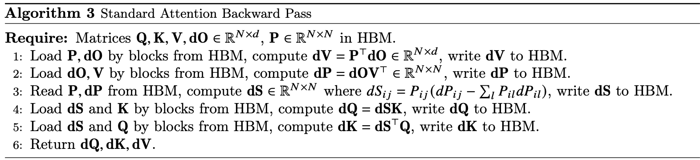

- [1. 介绍](#1-介绍)
- [2. 背景](#2-背景)
	- [2.1 硬件性能](#21-硬件性能)
	- [2.2 标准 attention 实现](#22-标准-attention-实现)
- [3 FlashAttention: 算法、分析和拓展](#3-flashattention-算法分析和拓展)
	- [3.1 使用分块和重计算的高效注意力机制算法](#31-使用分块和重计算的高效注意力机制算法)
	- [3.2 分析：FlashAttention 的 IO 复杂度](#32-分析flashattention-的-io-复杂度)
	- [3.3 拓展：块稀疏 FlashAttention](#33-拓展块稀疏-flashattention)
- [4，实验](#4实验)
	- [4.1 使用 FlashAttention 的更快模型](#41-使用-flashattention-的更快模型)
	- [4.2 使用长序列的更好模型](#42-使用长序列的更好模型)
	- [4.3 注意力基准测试](#43-注意力基准测试)
	- [4.4 FlashAttention 运行时、内存占用和序列长度的关系](#44-flashattention-运行时内存占用和序列长度的关系)
- [5. 局限性和未来方向](#5-局限性和未来方向)
- [A. 相关工作](#a-相关工作)
- [B. 算法细节](#b-算法细节)
	- [B.1 内存高效的前向传播](#b1-内存高效的前向传播)
	- [B.2 内存高效的反向传播](#b2-内存高效的反向传播)
	- [B.3 FlashAttention: 前向传播](#b3-flashattention-前向传播)
	- [B.3 FlashAttention: 反向传播](#b3-flashattention-反向传播)
- [C. 证明](#c-证明)
- [参考资料](#参考资料)

## 1. 介绍

Transformer 模型目前已经成为自然语言处理和图像分类等领域中使用最广泛的神经网络架构。虽然 Transformer 模型已经变得越来越大和深，但是处理更长的上下文依然还是有困难，最主要的原因是其核心模块-自注意力机制的时间和内存复杂度是序列长度的二次方。一个重要的问题是，让注意力更快、内存效率更高是否可以帮助 Transformer 模型解决长序列的运行时和内存挑战。

> $Attention(Q,K,V) = softmax(\frac{QK^T}{\sqrt{d_k}})V$

许多近似自注意力方法旨在降低注意力的计算和内存需求，比如稀疏逼近 sparse-approximation [51, 74]、低秩逼近 low-rank approximation [12, 50, 84]以及它们的组合[3, 9, 92]。尽管这些方法将 Flops 降低到与序列长度线性或接近线性的水平，但并未在实际运行时间上显著提速，与标准注意力相比也没有被广泛采用。一个主要原因是它们侧重于减少浮点运算量（FLOPs 与实际运行时间不一定相关），而忽略内存访问代价（`MAC`）。

> 减少算子对 FLOPs 不一定会减少运行时间，还要关注其内存访问代价 MAC，这个结论在 shufflenetv2 论文就旗帜鲜明指出了。

在这篇论文中，本文提出一个新原则-**让注意力算法具备 IO 感知性** IO-aware [1]，即考虑对不同速度的内存的读取和写入操作（GPU 芯片上的快速 SRAM 和相对较慢的 GPU 高带宽内存）。**在现代 GPU 中，计算速度已经超过了内存读写速度 [61, 62, 63]，而 Transformers 中的大多数操作都受到内存访问的限制[43]。**

对于类似于内存受限操作的任务，IO 感知算法非常重要，因为数据的读取和写入会占用运行时的大部分时间，比如数据库连接[71]、图像处理[70]、数值线性代数[4]等等[40, 85]。然而，通常用于深度学习的常见 Python 接口，如 PyTorch 和 Tensorflow，不允许对内存访问进行精细控制。

本文提出了 FlashAttention，这是一种新的注意力算法，它可以在极少的内存访问次数下计算出准确的注意力，我们的主要目标是**避免从 HBM（显存）读取和写入注意力矩阵**，为此需要:
1. 在不访问整个输入的情况下进行 `softmax reduction`
2. 不存储用于反向传播的大型中间注意力矩阵。

为此，本文采用了两种已经被广泛使用的技术来解决这些挑战。

- 重构了注意力计算，将输入分块并多次遍历，逐步执行 softmax reduction（也称为切片）。这样可以在不需要访问整个输入的情况下计算 softmax reduction。
- 本文在前向传播中存储了 softmax 归一化因子，以便在反向传播中快速重新计算芯片上的注意力。这比从 HBM 读取中间注意力矩阵的标准方法更快。

本文使用 CUDA 实现了 FlashAttention，以精细控制内存访问，并将所有注意力操作融合到一个 GPU 内核中。即使由于重新计算而增加了 FLOPs，但**得益于大幅减少的 HBM 访问量，FlashAttention 依然比标准注意力机制运行更快**（在 GPT-2 上可达 7.6 倍加速，见图 1 右侧），并且使用的内存更少——随序列长度线性增长。

作者使用 CUDA 实现 FlashAttention，以实现对内存访问的精细控制，并将所有注意力操作融合到一个 GPU 内核中。即使由于重新计算而增加了浮点运算量，由于大大减少了 HBM 访问次数，本文的算法比标准的注意力更快（例如，在GPT-2上高达7.6倍，参见图1右侧），并且使用的内存更少，与序列长度呈线性关系。

本文分析了 FlashAttention 的 IO 复杂度 [1]，证明它需要 $O(N^2d^2M^{-1})$ 次 HBM 访问，其中 $d$ 是头部尺寸，$M$ 是 SRAM 的大小，而标准注意力的复杂度 $O(N*d + N^2)$。  对于典型的 $d$ 和 $M$ 值，FlashAttention 相对于标准注意力需要的 HBM 访问次数要少得多（最多少 9 倍，如图 2 所示)。此外，本文提供了一个下界，表明在所有SRAM 大小上，没有任何精确的注意力算法可以在 HBM 访问次数上渐近地改进。

> 关于时间复杂度的计算，附录有公式推导。

作者还认为，FlashAttention 可以作为一个有用的原语（useful primitive），通过克服内存访问开销的问题来实现近似注意算法的潜力。 作为概念验证，本文实现了块稀疏 FlashAttention，这是一种稀疏注意力算法，比 FlashAttention 快 2-4 倍，可扩展到 64k 的序列长度。 作者证明了块稀疏 FlashAttention 具有比 FlashAttention 更好的 IO 复杂性，其程度与稀疏度成正比。 论文在第 5 节中讨论对其他操作的进一步扩展（多 GPU 注意力、内核回归、块稀疏矩阵乘法）。作者已经将 FlashAttention 算法代码开源，以便更轻松地在此原语上进行构建。

论文通过实证验证了 FlashAttention 可以加速模型训练，并通过建模更长的上下文来提高模型质量。与之前的注意力实验相比，本文还对 FlashAttention 和块稀疏 FlashAttention 的运行时和内存占用进行了基准测试。

1. **更快的模型训练**。本文训练的 BERT-large（序列长度 512）比 MLPerf 1.1 [58] 的训练速度记录快15%，比 HuggingFace [87] 和 Megatron-LM [77]的基准实现快 `3` 倍，而对于长序列 arena（序列长度 1K-4K），速度比基线快2.4倍。
2. **更高质量的模型**。FlashAttention可以将 Transformers 扩展到更长的序列，从而提高模型质量并实现新的功能。
3. **attention 的基准测试**。在基准测试中，FlashAttention 在常见序列长度（从128 到 2K）上比标准的注意力实现快 3 倍，可扩展到 64K。在序列长度最大为 512 的情况下，FlashAttention 既比任何现有的注意力方法更快，也更节省内存，但对于超过 `1K` 的序列长度，一些近似注意力方法（例如，Linformer）开始变得更快。另一方面，块稀疏 FlashAttention 比本文所知的所有现有近似注意力方法都更快。

## 2. 背景

本文提供了一些关于现代硬件（GPU）上常见深度学习操作的性能特征的背景信息。本文还**描述了注意力的标准实现方式**。

### 2.1 硬件性能

1. **GPU 内存层次结构**。（如图1左侧所示）包括多种不同大小和速度的内存形式，较小的内存速度更快。以A100 GPU为例，它具有40-80GB的高带宽内存（HBM），**带宽为 1.5-2.0 TB/s**，并且**每个流式多处理器（SM）都有 192KB 的片上 SRAM**，其带宽约为19TB/s [44, 45]。片上 SRAM 速度比 HBM 快一个数量级，但其容量比 HBM 小多个数量级。随着计算速度相对于内存速度的不断提升 [61, 62, 63]，操作越来越受到内存（HBM）访问的瓶颈限制。因此，利用快速的 SRAM 变得更加重要。
2. **执行模型**（Execution Model）。GPU 有大量线程来执行操作（称为内核）。每个内核将输入从 HBM 加载到寄存器和 SRAM 中，进行计算，然后将输出写入HBM。
3. **性能特性**（Performance characteristics.）。根据计算与内存访问的平衡，操作可以分为计算密集型（也叫计算受限）或内存密集型。这通常通过**算术强度**来衡量，即每字节内存访问执行的算术运算次数 [[85]](https://people.eecs.berkeley.edu/~kubitron/cs252/handouts/papers/RooflineVyNoYellow.pdf)。
   - **计算密集型**：操作的耗时主要取决于算术运算的数量，而访问高带宽内存（HBM）所需的时间较短。典型例子包括具有大内部维度的矩阵乘法和具有大量通道的卷积。
   - **内存密集型**：操作的耗时主要取决于内存访问的次数，而计算时间相对较短。典型的例子包括大多数**其他操作**，如**逐元素操作**（如激活函数、dropout）和**归约操作**（如求和、softmax、batch norm、layer norm）。
4. **内核融合**（Kernel fusion）。**加速内存受限操作的最常见方法是内核融合**：如果对相同输入应用了多个操作，那么可以从 HBM 加载一次输入，而不是每个操作都加载多次。编译器可以自动融合许多逐元素操作[53, 65, 75]。然而，在模型训练的背景下，中间值仍然需要写入HBM以供反向传播保存，降低了朴素内核融合的效果。

### 2.2 标准 attention 实现

给定输入序列 $Q, K, V \in \mathbb{R}^{N\times d}$，其中 $N$ 是输入序列的长度的，$d$ 是自注意力机制头的长度，本文想要计算注意力模块的输出矩阵 $O \in \mathbb{R}^{N\times d}$: 

$$\text{S = QK}^\text{T} \in \mathbb{R}^{N\times N},\quad \text{P = softmax(S)} \in \mathbb{R}^{N\times N},\quad \text{O = PV}\in \mathbb{R}^{N\times d}$$

这里的 softmax 是按行应用的。

标准的注意力实现会将矩阵 $\text{S}$ 和 $\text{P}$ 写入到 HBM，这需要 $O(N^2)$ 的内存。通常情况下，N 和 d 相对较大（例如，对于GPT2，N = 1024，d = 64）。本文在算法 0 中描述了标准的注意力实现。由于一些或大多数操作是内存受限的（例如 softmax），大量的内存访问会导致墙钟时间（wall-clock time）变慢。

这个问题在应用于注意力矩阵的其他逐元素操作时会加剧，例如应用于 S 的掩码 mask 或应用于 P 的丢弃 dropout 操作。因此，已经有很多尝试将多个逐元素操作融合在一起，比如将掩码与 softmax 融合在一起[77]。

在第3.2节中，本文将展示标准的注意力实现在序列长度 N 方面执行 HBM 访问，同时比较标准注意力和本文的方法（FlashAttention）的 FLOPs 数量和 HBM 访问数量。

## 3 FlashAttention: 算法、分析和拓展

### 3.1 使用分块和重计算的高效注意力机制算法

给定输入  $Q,K,V \in R^{N\times d}$ 存储于 HBM（高带宽内存）中，本文的目标是计算出注意力输出 $O \in R^{N\times d}$ 并将其写回 HBM，并且将对 HBM 的访问次数减少到 $N^2$ 以下。

本文采用了两种已知的优化技术（**分块和重计算**），以解决在次二次（sub-quadratic）HBM 访问中计算精确注意力的技术难题。具体步骤详见算法 1。核心思想是将输入的 Q、K、V 矩阵拆分为多个块，将其从较慢的 HBM 加载到更快的 SRAM 中，然后分别计算这些块的注意力输出。最后，将每个块的输出按正确的**归一化因子缩放**之后相加，本文最终得到了正确的结果。

**1，Tiling.** 本文**按块计算注意力**。因为 `Softmax` 将 $K$ 的列关联在一起，因此本文对大规模的 `softmax` 进行分解，并进行缩放 [51, 60, 66]。为了数值稳定性，向量 $x\in \mathbb{R}^B$ 的 softmax 计算方式如下：

$$m(x) := \underset{i}{max}\quad x_i,\quad\ f(x) := [e^{x_1 - m(x)}\ ...\ e^{x_B - m(x)}],\quad \ell(x) := \sum_i f(x)_i,\quad softmax(x) := \frac{f(x)}{\ell(x)} .$$

对于**向量** $x^{(1)}, x^{(2)} \in \mathbb{R}^{B}$，本文可以将拼接后的向量 $x=\left[x^{(1)}\ x^{(2)}\right] \in \mathbb{R}^{2 B}$ 的 softmax 表示为：

$$\begin{array}{l}
m(x)=m\left(\left[x^{(1)}\ x^{(2)}\right]\right)=\max \left(m\left(x^{(1)}\right), m\left(x^{(2)}\right)\right), \quad f(x)=\left[e^{m\left(x^{(1)}\right)-m(x)} f\left(x^{(1)}\right) \quad e^{m\left(x^{(2)}\right)-m(x)} f\left(x^{(2)}\right)\right] \\
\ell(x)=\ell\left(\left[x^{(1)}\ x^{(2)}\right]\right)=e^{m\left(x^{(1)}\right)-m(x)} \ell\left(x^{(1)}\right)+e^{m\left(x^{(2)}\right)-m(x)} \ell\left(x^{(2)}\right), \quad \operatorname{softmax}(x)=\frac{f(x)}{\ell(x)}
\end{array}$$

上述公式意义总结就是，正常 `Softmax` 需要对**完整的** $QK^T$ 结果矩阵（图上虚线部分正方形）沿着 `Inner Loop` 维度进行归一化；`Softmax` 需要全局的 max 和 sum 结果才能 scale 每一个元素；但是这里，本文**借助 `Online Softmax` 技术，实现了按块块计算 `Softmax`**。

即如果本文**计算一些额外的统计信息** $(m(x), \ell(x))$，本文**可以逐块计算 `Softmax`**。本文将输入的 $Q、K、V$ 拆分为多个块（参见算法 1 第 3 行），计算 Softmax 以及相应的额外统计信息（参见算法 1 第 10 行），并最终结合这些结果（参见算法 1 第 12 行）。

**2，Backward Recomputation.** 本文的目标之一是不为反向传播存储 $O(N^2)$ 的中间值。反向传播通常需要矩阵 $S, P \in \mathbb{R}^{N\times N}$，用来计算 $Q, K, V$ 的梯度。但是，通过存储输出 $O$ 和 $\text{Softmax}$ 归一化统计信息 $(m, \ell)$，本文可以在反向传播时通过加载 `SRAM` 中的 $Q、K、V $ 块重新计算注意力矩阵 S 和 P。这种方法也可以看作是一种选择性的梯度检查点（ gradient checkpointing [10, 34]）。虽然**梯度检查点技术已被提出以减少所需的最大内存量**[66]，但所有已知的实现都必须在速度和内存之间进行权衡。相比之下，即使增加了 FLOPs，但本文的重新计算方法也能加速反向传播。完整的反向传播描述在附录 B 中。

实现细节：**内核融合**（一次把所有操作算完的流程，可以大大减少内存访问次数）。`Tiling` 使本文能够在一个 CUDA 内核中实现本文的算法，从 HBM 加载输入，执行所有计算步骤（矩阵乘法、softmax、可选的掩码和丢弃、矩阵乘法），然后将结果写回 HBM（附录B中有掩码和丢弃）。这避免了反复从 HBM 读取和写入输入和输出的操作。

`FlashAttention` 算法实现步骤如下所示。

$\text{算法 1 FlashAttention} \\
要求：矩阵\; Q, K, V \in \mathbb{R}^{N \times d}  \;存储在\;\text{HBM}（高带宽内存）中，片上\;\text{SRAM}\;大小为\;M. \\$

$1: 设置块大小\;B_c = \left\lceil \frac{M}{4d} \right\rceil ,  B_r = \min \left(\left\lceil \frac{M}{4d} \right\rceil , d\right). \\
2: 初始化\;O = (0)_{N \times d} \in \mathbb{R}^{N \times d} ,  \ell = (0)_N \in \mathbb{R}^N ,  m = (-\infty)_N \in \mathbb{R}^N\;存储在\; \text{HBM} 中. \\
3: 将 \;Q\;分成\; T_r = \left\lceil \frac{N}{B_r} \right\rceil \;块 Q_1, \dots, Q_{T_r}，每块大小为\;B_r\times d；将\;K, V\;分为\; T_c = \left\lceil \frac{N}{B_c} \right\rceil \;块\; K_1, \dots, K_{T_c} \;和\; V_1, \dots, V_{T_c}，每块大小为\; B_c \times d. \\
4: 将 \;O\;分为\;T_r\; 块\;O_1, \dots, O_{T_r}，每块大小为 \;B_r\times d，将 \;\ell\;分为\;T_r\;块 \ell_1, \dots, \ell_{T_r}，将\; m \;分为\;T_r\;块 m_1, \dots, m_{T_r}，每块大小为\;B_r. \\
5: for \;1 \leq j \leq T_c\;\text{do} \\
6: \quad 从\;\text{HBM} 加载\;K_j, V_j\;到片上 \;\text{SRAM}. \\
7: \quad for \; 1 \leq i \leq T_r\; \text{do} \\
8: \quad \quad 从 \; \text{HBM}\; 加载 \; Q_i, O_i, \ell_i, m_i \;到片上\; \text{SRAM}. \\
9: \quad \quad 在片上计算\; S_{ij} = Q_i K_j^T \in \mathbb{R}^{B_r \times B_c}. \\
10: \quad \quad 在片上计算\; \tilde{m}_{ij} = \text{rowmax}(S_{ij}) \in \mathbb{R}^{B_r} ， \tilde{P}_{ij} = \exp(S_{ij} - \tilde{m}_{ij}) \in \mathbb{R}^{B_r \times B_c} （逐元素操作），计算\; \tilde{\ell}_{ij} = \text{rowsum}(\tilde{P}{ij}) \in \mathbb{R}^{B_r}. \\
11: \quad \quad 在片上计算\; m_i^{\text{new}} = \max(m_i, \tilde{m}_{ij}) \in \mathbb{R}^{B_r} ， \ell_i^{\text{new}} = e^{m_i - m_i^{\text{new}}} \ell_i + e^{\tilde{m}_{ij} - m_i^{\text{new}}} \tilde{\ell}_{ij} \in \mathbb{R}^{B_r}. \\
12: \quad \quad 将\; O_i \leftarrow \text{diag}(\ell_i^{\text{new}})^{-1} (\text{diag}(\ell_i) O_i + e^{\tilde{m}{ij} - m_i^{\text{new}}} \tilde{P}{ij} V_j) \; 写回到\; \text{HBM}. \\
13: \quad \quad 将\; \ell_i \leftarrow \ell_i^{\text{new}}, m_i \leftarrow m_i^{\text{new}} \;写回到\; \text{HBM}. \\
14: \quad \text{end for} \\
15: \text{end for} \\
16: 返回\; O$

【**定理 1**】 算法 1 注意力输出矩阵 $O = softmax(QK^T)V$ 要求 $O(N^2d)$ 的 FLOPs，并且除了输入和输出内存之外，需要额外的 $O(N)$ 内存【证明见附录 B】。

### 3.2 分析：FlashAttention 的 IO 复杂度

本节分析了 `FlashAttention` 的 `IO` 复杂度，结果显示，与标准注意力相比 HBM 访问次数显著减少。另外，还给出了一个下界，证明没有精确的注意力算法可以在所有 SRAM 大小上渐近地改善 HBM 访问次数。详细公式推导证明在附录 C 中。

> 左图：在 A100 GPU 上，标准注意力和 FlashAttention 针对 GPT-2 medium（序列长度 1024，头维度 64，16 个头，批量大小 64）的前向 + 反向运行时间。HBM 访问次数是影响运行时间的主要因素。中图：在 A100 GPU 上，FlashAttention（序列长度 1024，头维度 64，16 个头，批量大小 64）的前向运行时间。HBM 访问次数越少，运行时间越快，但只有在某一临界点之前。右图：块稀疏 FlashAttention（序列长度 4K）的运行时间比 FlashAttention 更快，速度提升与稀疏性成比例。

【**定理 2**】假设 $N$ 是输入序列的长度，$d$ 是注意力头的维度，$M$ 是 `SRAM` 大小，且 $d \leq M\leq Nd$。标准 attention 的 `HBM` 访问次数是 $O(Nd+N^2)$，而 FlashAttention [算法 1] 只需要 $O(N^2d^2M^{-1})$。

对于典型值的情况，$d$ (64 -128)，$M$ 大概是 100KB，很明显 $d^2$ 远远小于 $M$。因此，FlashAttention 所需的 HBM 访问次数比标准实现少很多，这会带来**更快的执行速度和更低的内存占用**，这一点作者在第 4.3 节中进行了验证。

证明的主要思想是，给定 SRAM 大小为 $M$，则可以加载大小为 $\Theta(M)$ 的 $K$ 和 $V$ 块（算法 1 第 6 行）。对于每个 $K$ 和 $V$ 块，本文迭代遍历所有 $Q$ 块（算法 1 第 8 行）以计算中间值，结果是对 $Q$ 进行 $\Theta(NdM^{-1})$ 次遍历。每次遍历加载 $\Theta(Nd)$ 个元素，总计 $\Theta(N^2 d^2 M^{-1})$ 次 HBM 访问。类似地，可以证明标准注意力的反向传播需要 $\Theta(Nd + N^2)$ 次 HBM 访问，而 `FlashAttention` 的反向传播则需要 $\Theta(N^2d^2M^{-1})$ 次 HBM 访问（附录 B）。

本文还证明了一个下界：在计算**精确**注意力时，对于所有 $M$（即 SRAM 大小）的值，无法在 HBM 访问次数上取得渐进性的改进。
> 这里用精确注意力是因为之前的论文有通过近似计算注意力 `Approximate Attention` 的算法（如 Sparse Transformer、Reformer、Routing Transformer），取得两线性的性能提升。

【**命题 3**】设 $N$ 为序列长度，$d$ 为头部维度，$M$ 为 `SRAM` 的大小，且 $d \leq M \leq Nd$。不存在一个算法可以在所有范围内的 $M$（即 $[d, N d]$）使用少于 $O(N^2 d^2 M^{-1})$ 次 `HBM` 访问来计算精确的注意力。

该证明依赖于这样一个事实：对于 $M = \Theta(Nd)$，任何算法都必须执行 $\Omega(N^2 d^2 M^{-1}) = \Omega(N d)$ 次 HBM 访问。这种对 $M$ 的子范围的下界在流式算法文献中很常见【88。作者将证明关于 $M$ 的参数化复杂度【27】下界作为未来有趣的研究工作。

本文验证了 HBM 访问次数是决定注意力运行时间的主要因素。在图 2（左图）中，本文看到尽管 FlashAttention 的 FLOP 数比标准注意力要高（因为反向传播中的重计算），但它的 HBM 访问次数少得多，导致运行时间大幅减少。在图 2（中图）中，本文改变了 FlashAttention 的块大小 $B_c$，导致不同的 HBM 访问次数，并测量了前向传播的运行时间。随着块大小的增加，HBM 访问次数减少（因为本文对输入的遍历次数减少），运行时间也随之减少。对于足够大的块大小（超过 256），运行时间则受到其他因素（例如算术运算）的限制。此外，更大的块大小无法适应较小的 SRAM 大小。

### 3.3 拓展：块稀疏 FlashAttention

本文还将 FlashAttention 扩展到近似注意力：本文提出了块稀疏 FlashAttention，其 IO 复杂性比 FlashAttention 还小，且与稀疏度成比例。

给定输入 $Q,K,V \in R^{N\times d}$ 和掩码矩阵（mask matrix）$\tilde{m}\in {0,1}^{N\times N}$，想要计算:

$$S = QK^T \in R^{N\times N}, P = softmax(S\bigodot 1_{\tilde{m}}) \in \mathbb{R}^{N\times N}, O = PV\in \mathbb{R}^{N\times d} \\
\left\{\begin{matrix}
S\bigodot 1_{\tilde{M}} = S_{kl} \quad \tilde{M}_{kl} = 1 \\ \nonumber
-\infty \quad M_{kl} = 0 \end{matrix}\right.$$

本文要求 $\tilde{M}$ 具有块形式：对于某些块大小 $B_r，B_c$，对于所有的 $k, l$，都有 $\tilde{M}_{kl} = M_{ij}$，其中 $i = \left \lfloor k/B_r \right \rfloor, j = \left \lfloor l/B_c \right \rfloor$，对于某些 $M\in {0, 1}^{N/B_r\times N/B_c}$。

给定预定义的块稀疏掩码矩阵 $M\in {0, 1}^{N/B_r\times N/B_c}$，本文可以轻松地调整算法1，只计算注意力矩阵的非零块。该算法与算法 1 相同，只是本文会跳过零块部分。本文在附录B中的算法5中重现了算法描述。本文还分析了块稀疏 FlashAttention 的 IO 复杂性。

【定理 4】假设 $N$ 是输入序列的长度，$d$ 是注意力头的维度，$M$ 是 `SRAM` 大小，且 $d \leq M\leq Nd$。块-稀疏的 FlashAttention (算法 5) 的 HBM 访问次数是 $O(Nd + N^2d^2M^{−1}s)$。

其中 $s$ 是块稀疏掩码中非零块的比例。

本文可以看到，**应用块稀疏性直接改善了 IO 复杂性中较大项的复杂度**，复杂度与稀疏度成比例。对于大的序列长度 $N$，$s$ 通常设置为 $N^{-1/2}$ [11] 或 $N^{-1}log N$ [3, 17, 92]，导致 $\Theta(N\sqrt{N})$ 或 $\Theta(N logN)$的 IO 复杂性。在下游实验中，本文使用了固定的蝴蝶稀疏模式 [17]，已经证明能够逼近任意的稀疏性 [16]。在图 2（右侧）中，本文验证随着稀疏性的增加，块稀疏 FlashAttention 的运行时间成比例提高。在 `LRA` 基准测试中，块稀疏 FlashAttention 实现了2.8倍的加速，同时性能与标准注意力相当（第4节）。

## 4，实验

本文评估了使用 FlashAttention 训练 Transformer 模型的影响，验证了关于训练时间和模型准确性的两项指标，并报告了注意力运行时间和内存基准测试结果。
- **训练速度**：FlashAttention 的速度比 MLPerf 1.1【58】的 BERT 速度记录快 15%，相比 HuggingFace【87】对 GPT-2 的标准 Transformer 实现，速度提升最多可达 3 倍，相比 Megatron【77】提升 1.8 倍。FlashAttention 在长距离竞技场（LRA）基准测试中加速了 2.4 倍
- **质量**：FlashAttention 将 Transformer 模型扩展到更长的序列，提升了模型质量。FlashAttention 在训练 GPT-2 时，使用上下文长度为 4K 的序列，训练速度比 Megatron 使用上下文长度为 1K 的训练速度更快，同时在困惑度上提高了 0.7。对更长序列的建模在两个长文档分类任务中带来了 6.4 个百分点的提升。最后，FlashAttention 实现了第一个在具有挑战性的 Path-X 任务（序列长度 16K）上表现优于随机水平的 Transformer，块稀疏 FlashAttention 则是本文所知的第一个在 Path-256（序列长度 64K）上表现优于随机水平的序列模型。
- **注意力基准测试**：本文测量了 FlashAttention 和块稀疏 FlashAttention 在不同序列长度下的运行时间和内存性能。本文通过基准测试确认了 **FlashAttention 的内存占用随序列长度线性扩展**，并且在常见的序列长度（最多到 2K）下速度比标准注意力快 3 倍。本文还确认，块稀疏 FlashAttention 的运行时间随着序列长度线性扩展，并且比所有现有的实现更快。

### 4.1 使用 FlashAttention 的更快模型

借助 FlashAttention，作者实现了论文发表时单卡训练 BERT 模型的最快速度。

借助 FlashAttention 在大型 OpenWebtext 数据集 [32] 上训练 GPT-2 [67] 的速度比广泛使用的 HuggingFace [87] 和 Megatron-LM [77] 实现更快，分别快了 3 倍和 1.7 倍，并且在 `perplexity` 上和其他两个框架是一样的。

最后，在 Long-range Arena（`LRA`）基准上比较使用 standard attention 和 flashattention 模型的准确率、吞吐量和训练时间。每个任务的序列长度在 1024 到 4096 之间变化，并遵循 Tay 等人[80] 和 Xiong 等人[90] 的实现和实验设置。

**表 3 显示，与标准注意力相比，FlashAttention 的速度提升高达 2.4 倍。块稀疏 FlashAttention 的速度比本文测试过的所有近似注意力方法都要快**。

### 4.2 使用长序列的更好模型

使用 FlashAttention 且上下文长度为 4K 的 GPT-2 模型仍然比上下文长度为 1K 的 Megatron GPT-2 快 30%（**加速比=4.7/3.6=1.3**），并且 `perplexity` 提高了 0.7。

### 4.3 注意力基准测试

4.3 节的实验对于做工程的人来说应该尤其关注，不管是实验设置、结果和实现都应该注意细节。

通过改变序列长度，并测量了 FlashAttention 和块稀疏 FlashAttention 在 40 GB HBM 的 A100 GPU 上与各种注意力基线的运行时和内存使用情况，测试中包含 dropout 和填充掩码。本文与精确注意力、近似注意力和稀疏注意力的参考实现进行了比较。在正文中报告了一部分基线（`baselines`）；更多基线和详细信息见附录 E。

**运行时**：图 3（左）报告了 FlashAttention 和块稀疏 FlashAttention 在前向 + 反向传播中的运行时（单位：毫秒），并与精确、近似和稀疏注意力的基线进行了比较（精确数值见附录 E）。**FlashAttention 运行时间随序列长度呈二次增长**，但 FlashAttention 的运行速度明显快于精确注意力基线，比 PyTorch 实现快多达 3 倍。另外，虽然许多近似/稀疏注意力机制的运行时随序列长度呈线性增长，但 FlashAttention 在**短序列上**还是比近似和稀疏注意力快，因为其内存访问次数更少；近似注意力的运行时在序列长度为 512 到 1024 之间才开始与 FlashAttention 持平。另一方面，块稀疏 FlashAttention 在所有序列长度上都比本文已知的精确、稀疏和近似注意力的所有实现更快。

**内存占用**：图 3（右）显示了 FlashAttention 和块稀疏 FlashAttention 与各种精确、近似和稀疏注意力基线相比的内存占用。**FlashAttention 和块稀疏 FlashAttention 的内存占用相同，随序列长度呈线性增长**。FlashAttention 的内存效率最多比精确注意力基线高 20 倍，并且比近似注意力基线更具内存效率。除 Linformer 之外的所有算法在 A100 GPU 上在序列长度达到 64K 之前都耗尽了内存，而 FlashAttention 仍然比 Linformer 高效 2 倍。

### 4.4 FlashAttention 运行时、内存占用和序列长度的关系

1. FlashAttention 运行时间随序列长度呈二次增长，这里的运行时指在前向 + 反向传播中的运行时间（单位：毫秒）。
2. FlashAttention 和块稀疏 FlashAttention 的内存占用相同，**随序列长度呈线性增长**。

## 5. 局限性和未来方向

1. **编译为 CUDA**。本文当前构建 IO 感知的注意力（FlashAttnetion）实现的方法需要为每个新的注意力实现编写一个新的 CUDA 内核。 这需要使用比 PyTorch 低得多的语言编写注意力算法，并且需要大量的工程工作。 实现也可能无法跨 GPU 架构转移。 这些限制表明需要一种方法来支持用高级语言（例如 PyTorch）编写注意力算法，并编译为 CUDA 中的 IO 感知实现，类似于图像处理中的 Halide 等工作 [70]。

2. **IO 感知深度学习**。 本文相信，**IO 感知方法**可以扩展到注意力以外的领域。虽然注意力是变换器中最占用内存的计算，但深度网络中的每一层都会接触 GPU HBM。本文希望本文的工作能够激发对其他模块进行 IO 感知实现的灵感。本文在附录 D 中讨论了这些潜在的扩展。

3. **多 GPU IO 感知方法**。 本文的 IO 感知注意力实现在单个 GPU 上计算注意力的常数范围内是最佳的。 然而，注意力计算可以跨多个 GPU 并行[72]。 使用多个 GPU 为 IO 分析增加了一个额外的层 - 考虑 GPU 之间的数据传输。 本文希望本文的工作能够激发未来在这个方向上的研究工作。

## A. 相关工作

略

## B. 算法细节

分为 4 个小节：
1. 标准 attention 内存高效的前向传播。
2. 标准 attention 内存高效的反向传播。
3. FlashAttention 的前向传播
4. FlashAttention 的反向传播

前面两个虽然采用了内存高效的方式计算 attention，实现了**额外内存**随序列长度呈线性增长而不是二次增长，但这种实现还是会导致二次的 HBM 访问，这依然会降低执行速度。

而本论文提出的 FlashAttention 算法，分别实现了其在 GPU 上的前向和反向传播，其能 减少 HBM 访问，并实现更快的运行时间和更小的内存占用。

### B.1 内存高效的前向传播

计算 $\text{softmax}(QK^T)$ 时，需要对 $K$ 所有列同时进行计算求和 `sum`，即 softmax 结果和 $K$ 的列耦合，这对于长序列来说，会显著增加内存占用，而如何将这些列计算**解耦合，实现分块计算 softmax 的归一化常数**，正是 online softmax 解决的问题。

online softmax 技术[60] 在文献[51, 66] 中被使用，其证明**注意力计算不需要二次的额外内存，即通过一次遍历输入数据来计算 Softmax 函数归一化项的方法**（但是 HBM 访问次数仍然是二次的，所以导致较慢的运行时间）。

为简便起见，此处本文省略了 softmax 过程中最大值平移的步骤。完整的算法见附录 B.3，其中包含所有步骤。

给定输入 $Q,K,V \in R^{N\times d}$，目标是计算注意力输出 $O \in R^{N\times d}$: 

$$S = QK^T \in R^{N\times N}, P = \text{softmax}(S) \in R^{N\times N}, O = PV\in R^{N\times d} $$

假设 $q_i$ 和 $k_j$ 是 $Q$ 和 $K$ 矩阵的第 $i$ 和第 $j$ 列。定义 `softmax` 的**归一化常数**如下:

$$L_i = \sum_j e^{q_i^T k_j} \tag{1} $$

设 $v_j$ 为矩阵 $V$ 的第 $j$ 列，则注意力输出矩阵的第 $i$ 列为：
$$o_i = P_{i:}V = \sum_j P_{ij}v_j = \sum_j \frac{e^{q_i^T k_j}}{L_i}v_j \tag{2} $$

> 因为 $v_j$ 为矩阵 $V$ 的第 $j$ 列，所以对应的对注意力分数矩阵也要取第 $j$ 列。

本文看到，一旦计算出 $L_i$，本文就可以通过重复对 $\frac{e^{q_i^T k_j}}{L_i}v_j$ 求和来计算 $o_i$，而无需额外的内存。 因此，前向传播可以用 $O(n)$ 额外内存来计算：

1. 根据方程式（1）计算所有 $i$ 的 $L_i$，需要 $O(n)$ 额外内存。
2. 根据方程式（2）计算所有 $i$ 的 $o_i$，需要 $O(d)$ 额外内存。

### B.2 内存高效的反向传播

略

### B.3 FlashAttention: 前向传播

FlashAttention 算法前向传播计算的细节如下公式所示。给定输入序列 $Q,K,V \in \mathbb{R}^{N\times d}$，输出 $O\in \mathbb{R}^{N\times d}$。

$$
\mathbf{S} = \tau \mathbf{Q} \mathbf{K}^\top \in \mathbb{R}^{N \times N}, \quad
\mathbf{S}_{\text{masked}} = \text{MASK}(\mathbf{S}) \in \mathbb{R}^{N \times N}, \quad
\mathbf{P} = \text{softmax}(\mathbf{S}_{\text{masked}}) \in \mathbb{R}^{N \times N},
$$

$$
\mathbf{P}_{\text{dropped}} = \text{dropout}(\mathbf{P}, p_{\text{drop}}), \quad
\mathbf{O} = \mathbf{P}_{\text{dropped}} \mathbf{V} \in \mathbb{R}^{N \times d},
$$

其中，$ \tau \in \mathbb{R}$ 是某种 softmax 缩放（通常为 $\frac{1}{\sqrt{d}}$），`mask` 是某种掩码函数，用于将输入的某些项设置为 $-\infty $，其他项保持不变（例如，当批次中的序列长度不同时使用的 key padding 掩码），$\text{dropout}(x, p)$ 对 $x$ 逐元素应用 `dropout`（即，以概率 $1 − p$ 输出 $x$，且以概率 $p$ 输出 0）。

完整算法过程见算法 2。保存了输出 $O$，softmax 统计量 $\ell$ 和 $m$，以及用于反向传播的伪随机数生成器状态 $R$。

完整的 `FlashAttention` 前向传播算法如下:

$要求：矩阵 Q, K, V \in \mathbb{R}^{N \times d} \text{存储在 HBM 中，片上 SRAM 大小为}  M，\text{softmax 缩放常数}  \tau \in \mathbb{R} ，\text{掩码函数 MASK，dropout 概率} p_{\text{drop}}$

$1: 初始化伪随机数生成器状态\; \mathcal{R} ，并保存到 HBM 中. \\
2: 设置块大小\; B_c = \left\lceil \frac{M}{4d} \right\rceil ， B_r = \min \left(\left\lceil \frac{M}{4d} \right\rceil, d \right). \\
3: 初始化\; O = (0)_{N \times d} \in \mathbb{R}^{N \times d}, \ell = (0)_N \in \mathbb{R}^N, m = (-\infty)_N \in \mathbb{R}^N ，存储在 HBM 中. \\
4: 将\; Q\; 分成  T_r = \left\lceil \frac{N}{B_r} \right\rceil \; 块 Q_1, \dots, Q_{T_r}，每块大小为\; B_r \times d; 将\; K, V\; 分为\; T_c = \left\lceil \frac{N}{B_c} \right\rceil  块 K_1, \dots, K_{T_c}，每块大小为  B_c \times d. \\
5: 将\; O\; 分为  T_r  块 O_1, \dots, O_{T_r}，每块大小为  B_r \times d ，将  \ell  分为  T_r  块 \ell_1, \dots, \ell_{T_r}，将\; m\; 分为\; T_r\; 块 m_1, \dots, m_{T_r}，每块大小为\; B_r\\
6: for\; 1 \leq j \leq T_c  do \\
7: \quad 从\; HBM\; 中加载\; K_j, V_j\; 到片上 SRAM 中. \\
8: \quad for\; 1 \leq i \leq T_r  do \\
9: \quad \quad 从\; HBM\; 加载\; Q_i, O_i, \ell_i, m_i\; 到片上 SRAM 中. \\
10: \quad \quad 在片上计算\; S_{ij} = \tau Q_i K_j^\top \in \mathbb{R}^{B_r \times B_c}. \\
11: \quad \quad 在片上计算\; S_{ij}^{\text{masked}} = \text{MASK}(S_{ij}). \\
12: \quad \quad 在片上计算\; \tilde{m}{ij} = \text{rowmax}(S_{ij}^{\text{masked}}) \in \mathbb{R}^{B_r}，
\tilde{P}{ij} = \exp(S_{ij}^{\text{masked}} - \tilde{m}{ij}) \in \mathbb{R}^{B_r \times B_c} （逐元素操作），
\tilde{\ell}{ij} = \text{rowsum}(\tilde{P}_{ij}) \in \mathbb{R}^{B_r}. \\
13.	\quad \quad 在片上计算\; m_i^{\text{new}} = \max(m_i, \tilde{m}{ij}) \in \mathbb{R}^{B_r} ，
\ell_i^{\text{new}} = e^{m_i - m_i^{\text{new}}} \ell_i + e^{\tilde{m}{ij} - m_i^{\text{new}}} \tilde{\ell}_{ij} \in \mathbb{R}^{B_r}. \\
14.	\quad \quad 在片上计算\; \tilde{P}{ij}^{\text{dropped}} = \text{dropout}(\tilde{P}{ij}, p_{\text{drop}}). \\
15.	\quad \quad 将\; O_i \leftarrow \text{diag}(\ell_i^{\text{new}})^{-1} \left( \text{diag}(\ell_i) O_i + e^{\tilde{m}{ij} - m_i^{\text{new}}} \tilde{P}{ij}^{\text{dropped}} V_j \right)  写回 HBM. \\
16.	\quad \quad 将\; \ell_i \leftarrow \ell_i^{\text{new}}, m_i \leftarrow m_i^{\text{new}} 写回\; HBM. \\
17.	\quad \text{end for} \\
18.	\text{end for} \\
19.	返回\; O, \ell, m, \mathcal{R}$

### B.3 FlashAttention: 反向传播

给定输入序列 $Q、K、V ∈ \mathbb{R}^{N \times d}$、输出 $O \in \mathbb{R}^{N \times d}$ 和输出梯度 $dO$，现在我们需要计算输入梯度 $dQ、dK、dV \in \mathbb{R}^{N \times d}$。

首先看下标准注意力层的反向传播算法流程。

FlashAttention 的反向传播做点两点改进：
1. 不保存从前向传播中大小为 $O(N^2)$ 的 `dropout` 掩码，但可以保存前向传播中的伪随机数生成器状态 $R$，并在反向传播中重新生成 dropout 掩码，这样我们就只需要 $O(N)$ 的额外内存。
2. 在计算 $\text{softmax}$ 梯度时，我们使用公式 (4) 计算 $D_i = P_i^\top dP_i$，而不在大小为 $N$ 的 $P_i$ 和 $dP_i$ 上进行归约（它们可能无法放入 SRAM）。相反，我们可以将其重写为 $D_i = dO_i^\top O_i$，并计算大小为 $N$ 的向量之间的点积。

完整的 FlashAttention 反向传播算法见算法 4。从概念上讲，它其实是附录 B.2 中推导的分块版本。

可以看出与前向传播类似，反向传播执行 $O(N^2)$ 的 `FLOPs`，并且只需要 $O(N)$ 的额外内存，除了输入和输出、输入和输出梯度之外。另外，FlashAttention 反向传播的 IO 复杂度，类似于前向传播（定理 2）。
> 这里的额外内存是指除了输入输出之外的内存占用，一般指临时存储的中间结果、数值稳定性相关的存储和 dropout、掩码等操作的额外内存。

【定理 5】设 $N$ 为序列长度，$d$ 为头部维度，$M$ 为 `SRAM` 的大小，且 $d \leq M \leq Nd$。标准注意力（算法 0）的反向传播需要 $\Theta(N d + N^2)$ 次 HBM 访问，而 FlashAttention 的反向传播（算法 4）只需要 $\Theta(N^2 d^2 M^{-1})$ 次 HBM 访问。

证明见附录 C。

## C. 证明

**【证明定理1-计算 FLOPs 和需要的额外内存】**

`FLOPs` 主要来源于**矩阵乘法**，在内循环的矩阵乘法中：

1. 算法 1 第 9 行，计算 $Q_iK_j^T \in R^{B_r\times B_c}$ ，$Q \in R^{B_r \times d}$、$K_j \in R^{B_c \times d}$，FLOPs 为 $O(B_rB_cd)$
2. 算法 1 第 12 行，计算 $\tilde{P}_{ij}V_j \in R^{B_r \times d}$，这里 $\tilde{P} \in R^{B_r\times B_c}$、$V_j \in R^{B_c \times d}$，FLOPs 为 $O(B_rB_cd)$。

内部循环执行次数：$T_cT_r = \left \lceil \frac{N}{B_c} \right \rceil \left \lceil \frac{N}{B_r} \right \rceil$，**由此可得总的 FLOPs 为**：

$$O(\frac{N^2}{B_r\times B_c}B_rB_cd) = O(N^2d)$$

**块大小**为：$B_c = \frac{M}{4d}$，$B_r = min(\frac{M}{4d}, d)$。

**从额外内存需求的角度来看，我们需要 $O(N)$ 的内存来存储统计量 $(\ell, m)$**。

通过对 $j$ 进行归纳证明算法 1（FlashAttention）的正确性，其中 $0 ≤ j ≤ T_c$。令 $K_{: j} \in \mathbb{R}^{j B_c\times d}$ 为 $K$ 的前 $jB_c$ 行，同样地，令 $V_{:j} \in \mathbb{R}^{jB_c\times d}$ 为 $V$ 的前 $jB_c$ 行。令 $S_{:,:j} = QK_{:j}^\top \in \mathbb{R}^{N × 𝑗B_c}$，且 $P_{:,:j} = \text{softmax}(S:,:j) \in \mathbb{R}^{N × jB_c}$（softmax 按行应用）。令 $m_j, \ell^{(𝑗)}, O^{(j)}$ 为第 $j$ 次外层循环（算法 1 第 5 行）后 HBM 中的 $m, \ell, O$ 的值。（注意，$m, \ell, O$ 的这些值在每次外层循环后都会更新。）我们想证明，在第 $j$ 次外层循环之后，我们在 HBM 中计算出了：

$$m^{(j)} = \text{rowmax}(S_{:,j}) \in \mathbb{R}^N, \quad
\ell^{(j)} = \text{rowsum}(\exp(S_{:,j} - m^{(j)})) \in \mathbb{R}^N, \quad
O^{(j)} = P_{:,j} V_{:,j} \in \mathbb{R}^{N \times d}.$$

根据我们的初始化（算法 1 第 2 行），当 $j = 0$ 时（即在外层循环的任何迭代执行之前），该命题成立。假设该命题对于某个 $j = 0, …, T_c - 1$ 成立。我们要证明该命题对于$j + 1$ 也成立。确实，当我们在外层循环的第 $j + 1$ 次迭代中更新内层循环中的统计量（算法 1 第 10 行）时，我们更新 $m^{(𝑗+1)} = \max(m^{(j)}, \tilde{m})$，其中 $\tilde{m} \in \mathbb{R}^{N}$ 是 $S_{:, j:j+1}$ 的行最大值，$S_{:, j:j+1}$ 是矩阵 $S$ 从列 $jB_c$ 到列 $(j + 1)B_c - 1$ 的切片。这意味着：

$$m^{(j+1)} = \text{rowmax}(S_{:, j:j+1}) \in \mathbb{R}^{N}$$

**【证明定理2-分析标准 attention 和 flashattention 的 IO 复杂度】**

首先分析标准 attention 的 IO 复杂度，算法 0 的计算步骤分为 $3$ 步：
1. 首先，矩阵乘法 $S = QK^T$，输入 $Q, K$ 从 HBM 中读取，输出 $S \in \mathbb{R}^{N \times N}$ 被写入 HBM（算法 0 第 1 行）,HBM 访问次数为 $Nd + N^2$。
2. 然后，计算 $\text{P = softmax(S)}$, 从 HBM 读取 S，再将 P 写入 HBM，HBM 访问次数为 $2N^2$.
3. 最后，计算 $O = PV$，`HBM` 访问次数为 $N^2 + 2Nd$。

**综上，标准注意力实现的 `HBM` 访问次数为 $\Theta(3N d + 4N^2)$**。

根据算法 1，我们看到 $K$ 和 $V$ 的每个元素都从 HBM 中加载一次（算法 1 第 6 行）。我们对 $Q$ 和 $O$ 进行 $T_c$ 次遍历，每次遍历将所有的 $Q$ 和 $O$ 加载到 `HBM` 中（算法 1 第 8 行）。

因此，FlashAttention 的 `HBM` 访问次数为 $\Theta(N d + N d T_c) = \Theta(NdT_c)$。

另外，块大小的需要根据内存 SRAM 大小来设置，$K_j$ 和 $V_j$块的大小为 $B_c \times d$。

$$B_cd = O(M) <=>B_c = O(\frac{M}{d})$$

$Q_i$ 和 $Oi$ 块的大小为 $B_r \times d$。

$$B_rd = O(M) <=>B_r = O(\frac{M}{d})$$

最后，大小为 $B_r \times B_c$ 的块 $S_{ij}$ 要能够适应片上内存：

$$B_r\times B_c = O(M)$$

因此，$B_r$ 和 $B_c$ 设置如下:

$$
B_c = \Theta\left(\frac{M}{d}\right), \quad B_r = \Theta\left(\min\left(\frac{M}{d}, \frac{M}{B_c}\right)\right) = \Theta\left(\min\left(\frac{M}{d}, d\right)\right).
$$

于是，我们有：

$$
T_c = \frac{N}{B_c} = \Theta\left(\frac{Nd}{M}\right).
$$

因此，**`FlashAttention` 的 `HBM` 访问次数为**：
$$
\Theta(NdT_c) = \Theta\left(\frac{N^2 d^2}{M}\right).
$$

**【命题 3 的证明-反证法】**

**反证法**，假设存在一个算法可以计算精确的注意力机制，并且对于所有 $M \in [d, Nd]$ 的 HBM 访问次数为：

$$o\left(\frac{N^2 d^2}{M}\right).$$

在 $M = \Theta(Nd)$ 的情况下，HBM 访问次数为

$$o\left(\frac{N^2 d^2}{Nd}\right) = o(Nd).$$

但是，注意力机制的输入（矩阵 Q、K、V）和输出 $O$ 的大小为 $Nd$，它们一开始就存储在 HBM 中，因此，如果该算法计算精确的注意力机制，必然会产生至少 $\Omega(N d)$ 次 HBM 访问。这就导致了矛盾。

**【定理 5 的证明-注意力反向传播的 IO 复杂度和前向传播的 IO 复杂度（定理 2）非常相似】**

首先分析标准注意力反向传播的 IO 复杂度。输入 $Q, K, V, dO ∈ \mathbb{R}^{N \times d}$ 存储在 HBM 中，算法结束时，输出 $dQ, dK, dV ∈ \mathbb{R}^{N \times d}$ 被写入 HBM。

在标准注意力反向传播的每一步，需要从 HBM 中加载大小为 $Nd$ 或 $N^2$ 的输入，并且需要将大小为 $N^2$ 或 $Nd$ 的注意力输出写入 `HBM`。这将导致 $\Theta(N d + N^2)$ 次 HBM 访问。

然后分析 FlashAttention 反向传播的 IO 复杂度。

类似于定理 2，我们看到 $K$ 和 $V$ 的每个元素只从 `HBM` 加载一次。$dK$ 和 $dV$ 的每个元素也只写入 HBM 一次。我们对 $Q, O, dO$ 进行 `T_c` 次遍历，每次遍历将所有的 $Q, O, dO$ 加载到 HBM 中。我们还对 $dQ$ 进行 $T_c$ 次遍历，每次遍历从 HBM 读取/写入所有的 $dQ$。因此，HBM 访问次数为 $\Theta(N d + N d T_c) = \Theta(NdT_c)$。如定理 2 的证明中所述，可知 $T_c = \frac{N}{B_c} = \Theta(\frac{Nd}{M})$。

最终，FlashAttention 反向传播的 `HBM` 访问次数为:

$$\Theta(NdT_c) = \Theta(\frac{N^2d^2}{M})$$

## 参考资料

- [FlashAttention: Fast and Memory-Efficient Exact Attention with IO-Awareness](https://arxiv.org/abs/2205.14135)
- [大模型训练加速之FlashAttention系列：爆款工作背后的产品观](https://zhuanlan.zhihu.com/p/664061672)
- [图解大模型计算加速系列：FlashAttention V1，从硬件到计算逻辑](https://zhuanlan.zhihu.com/p/669926191)
