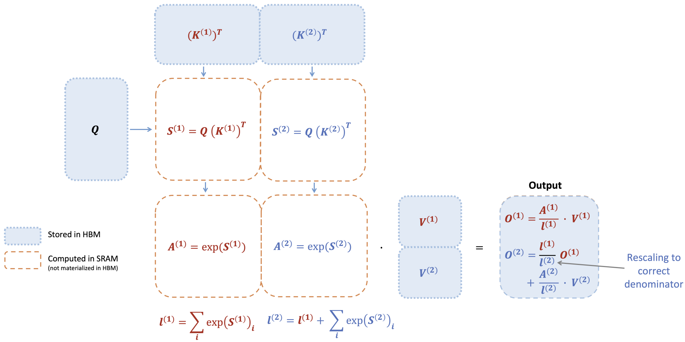
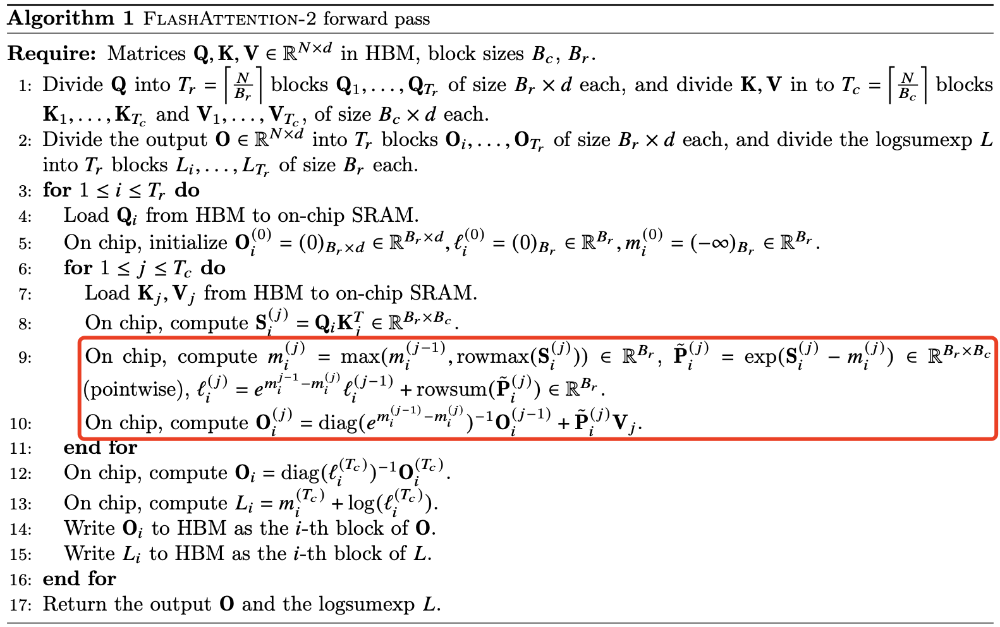
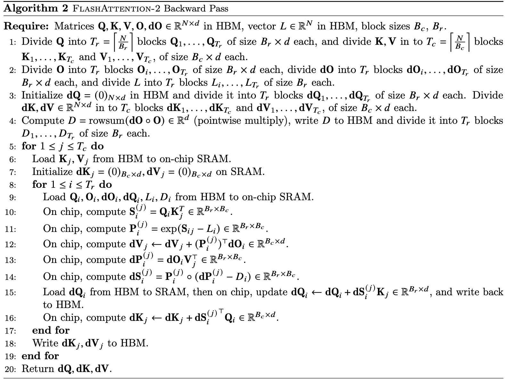
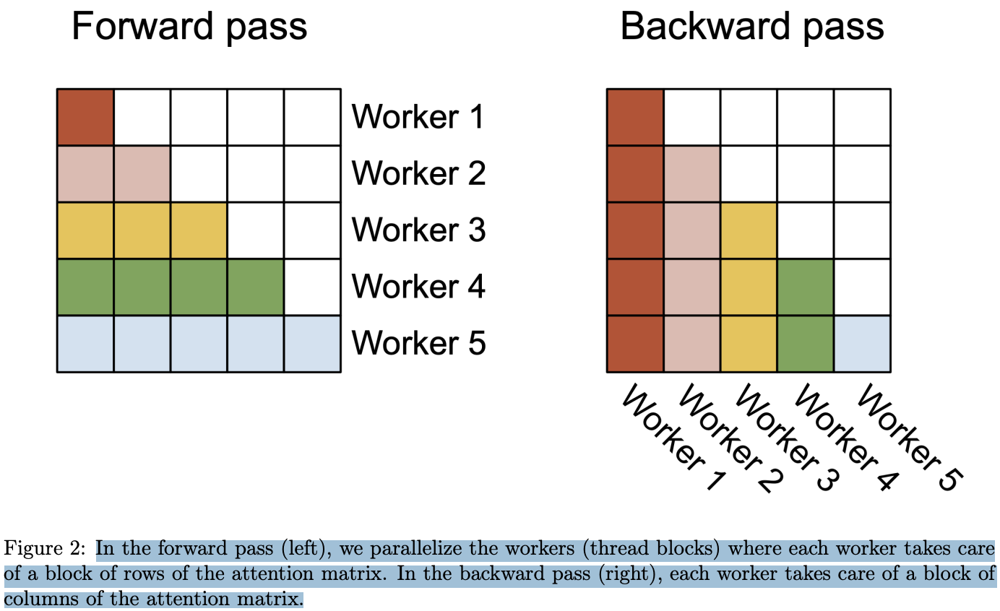
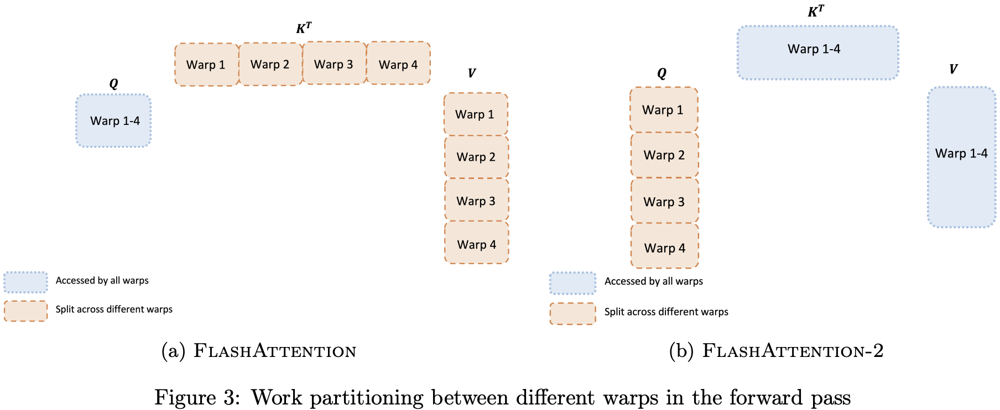
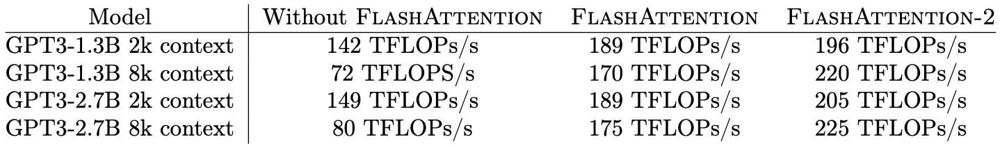

- [摘要](#摘要)
- [1. 介绍](#1-介绍)
- [2. 背景](#2-背景)
  - [2.1 硬件特性](#21-硬件特性)
  - [2.2 标准 Attention 实现](#22-标准-attention-实现)
  - [2.3 FlashAttention](#23-flashattention)
    - [2.3.1 前向传播](#231-前向传播)
    - [2.3.2 反向传播](#232-反向传播)
- [3. FlashAttention-2: 算法, 并行性与工作分配](#3-flashattention-2-算法-并行性与工作分配)
  - [3.1 算法](#31-算法)
    - [3.1.1 前向传播](#311-前向传播)
    - [3.1.2 反向传播](#312-反向传播)
  - [3.2 并行化](#32-并行化)
  - [3.3 不同 warp 之间的任务划分](#33-不同-warp-之间的任务划分)
- [4. 实验验证](#4-实验验证)
- [5. 讨论与未来方向](#5-讨论与未来方向)

## 摘要

将 transformer 拓展到更长的序列是一个难点，而注意力层是是扩展到更长序列的主要瓶颈，因为**随着序列长度的增加，标准注意力层的计算时间和内存占用呈二次方增长**。FlashAttention 通过 Tiling 和 Recomputation 技术大幅减少了 cuda kernel 对 global memory 的访问量，显著节省了内存（线性而非二次）并加快了运行时间（相比优化基线提高了 2-4 倍），并且计算结果是精确而非近似的。但 FlashAttention 依然远达不到优化矩阵乘法（GEMM）操作的速度，仅达到理论最大 FLOPs/s 的 25-40%。作者观察到，这种低效是**由于 GPU 上不同线程块和 warp 之间的工作分配不理想**，导致了 SM 低占用率或不必要的共享内存读，由此本文提出了 FlashAttention-2，通过更好的工作分配来解决这些问题。具体来说，通过以下 3 个方法（后面两个是纯 cuda 工程极度优化）：
1. 优化算法以减少非矩阵乘法的 FLOPs；
2. 将注意力计算并行化，即使是单个 head 也能跨不同线程块并行，以提高占用率；
3. 在单个线程块内，将工作分配给不同的 warp，以减少共享内存的访问量。

与 FlashAttention 相比，这些改进带来了约 2 倍的加速，达到了 A100 上理论最大 FLOPs/s 的 50-73%，接近 GEMM 操作的效率。实验证明，当用于 GPT 类模型的端到端训练时，FlashAttention-2 在每个 A100 GPU 上的训练速度可达 225 TFLOPs/s（72% 的模型 FLOPs 利用率）。
> FlashAttention [算法 1] HBM 访问次数为 $O(N^2d^2M^{-1})$，标准 Attention HBM 访问次数为 $\Theta(Nd + N^2)$。

## 1. 介绍

Dao 等人 [5] 提出 FlashAttention **在算法层面通过重排注意力计算，并利用经典技术（分块和重计算）显著加速注意力计算，并将内存占用从二次方降低到线性**。这直接带来了相对于优化基准 2-4 倍的实际运行时间加速，以及高达 10-20 倍的内存节省，并且计算结果是精确而非近似的。

虽然 FlashAttention 已经比标准注意力机制快 2-4 倍，但其前向传播的可实现计算性能（$\text{Attainable GFlops/s}$）仅达到设备理论最大 FLOPs/s 的 30-50%（见图 5），而反向传播的效率更低，仅为 A100 GPU 理论最大吞吐量的 25-35%（见图 6）。相比之下，优化的 GEMM 操作可以达到设备理论吞吐量的 80-90%。通过详细分析，作者发现 **FlashAttention 在 GPU 上的线程块和 warp 之间的工作划分仍不理想，导致了较低的占用率或不必要的共享内存读写**。

由此，在 FlashAttention 的基础上，作者提出了 FlashAttention-2，通过改进并行性和工作划分来解决这些问题。

## 2. 背景

### 2.1 硬件特性

**GPU 性能特征**。GPU 由计算单元（如浮点运算单元）和内存层次结构组成。大多数现代 GPU 包含专门的单元用于加速低精度矩阵乘法（如 Nvidia GPU 上用于 FP16/BF16 矩阵乘法的 Tensor Cores）。内存层次包括高带宽内存（HBM）和片上 SRAM（也称为共享内存）。例如，A100 GPU 具有 40-80GB 的高带宽内存（HBM），其带宽为 1.5-2.0TB/s，并且每个 108 个流式多处理器拥有 192KB 的片上 SRAM，带宽约为 19TB/s [6, 7]。由于 L2 缓存不能直接由程序员控制，因此我们在此讨论中专注于 HBM 和 SRAM。

**CUDA 执行模型**。GPU 通过大量线程来执行一个操作（称为 kernel）。线程被组织成线程块，线程块被调度在流式多处理器（SM）上运行。在线程块内，线程被分组为 warp（由 32 个线程组成的组）。warp 内的线程可以通过快速的 shuffle 指令进行通信，或者协作执行矩阵乘法。线程块内的 warp 可以通过读取/写入共享内存进行通信。**每个 kernel 将输入从 HBM 加载到寄存器和 SRAM，进行计算，然后将输出写回 HBM**。

### 2.2 标准 Attention 实现

给定输入序列 $Q, K, V \in \mathbb{R}^{N \times d}$，其中 $N$ 代表序列长度，$d$ 表示头维度（head dimension），我们需要计算注意力输出 $O \in \mathbb{R}^{N \times d}$：

$$S = QK^\top \in \mathbb{R}^{N \times N}, \quad P = \text{softmax}(S) \in \mathbb{R}^{N \times N}, \quad O = PV \in \mathbb{R}^{N \times d},$$
其中 softmax 是按行应用的。对于多头注意力（MHA），同样的计算会在多个头上并行执行，并在批次维度上并行（即一个批次中的输入序列数量）。

注意力的反向传播过程如下。令 $dO \in \mathbb{R}^{N \times d}$ 是相对于某个损失函数的 $O$ 的梯度。然后根据链式法则（即反向传播）：

$$\begin{aligned}
    dV &= P^\top dO \in \mathbb{R}^{N \times d} \\
    dP &= dO V^\top \in \mathbb{R}^{N \times N} \\
    dS &= \text{dsoftmax}(dP) \in \mathbb{R}^{N \times N} \\
    dQ &= dS K \in \mathbb{R}^{N \times d} \\
    dK &= Q dS^\top \in \mathbb{R}^{N \times d}
\end{aligned}$$

其中 dsoftmax 是按行应用的 softmax 的梯度（反向传播）。

可以推导出，对于向量 $s$ 和 $p$，如果 $p = \text{softmax}(s)$，那么当输出梯度为 $dp$ 时，输入梯度可以表示为 $ds = (\text{diag}(p) - pp^\top) dp$。

其中 $\text{diag}(p)$ 是一个对角矩阵，其对角线上的元素为 $p$ 中的各个元素。上述公式描述了 softmax 函数的输入梯度 $ds$ 与输出梯度 $dp$ 之间的关系，同时考虑了输出概率的相互依赖性。

标准的注意力机制实现会将矩阵 $S$ 和 $P$ 写入 HBM，这需要 $O(N^2)$ 的内存。通常 $N \gg d$（典型情况下，$N$ 大约在 1k–8k 之间，而 $d$ 大约在 64–128 之间）。**标准注意力的实现步骤**：
1. 调用矩阵乘法（GEMM）子程序计算 $S = QK^\top$，并将结果写入 `HBM`，
2. 然后从 `HBM` 加载 $S$，计算 softmax，将结果 $P$ 写入 HBM，
3. 最后调用 `GEMM` 计算 $O = PV$。

由于大多数操作都受限于内存带宽，大量的内存访问会导致较慢的实际执行时间。此外，额外需要存储 $S$ 和 $P$ 的内存占用量为 $O(N^2)$。并且，为了反向传播时计算梯度，还需要保存矩阵 $P \in \mathbb{R}^{N \times N}$。

### 2.3 FlashAttention

#### 2.3.1 前向传播

FlashAttention 使用经典的 `tiling` 技术来减少内存 IO 操作，**FlashAttention 实现步骤**：
1. 将输入块从 HBM 加载到 SRAM，
2. 针对该块计算注意力，
3. 更新输出而无需将大型中间矩阵 S 和 P 写入 HBM。

由于 softmax 会耦合整个行或行块，在线 softmax [11, 13] 可以将注意力计算划分为多个块，并重新缩放每个块的输出，最终得到正确结果（无近似）。通过显著减少内存的读写操作，FlashAttention 相比优化后的基准注意力实现提升了 2-4 倍的运行时间。

这里介绍下在线 softmax 技术 [11] 以及它在注意力机制中的应用 [13]。为了简单起见，假设只考虑注意力矩阵 $S$ 的一个行块，形式为 $[S^{(1)}\quad S^{(2)}]$，其中矩阵 $S^{(1)}, S^{(2)} \in R^{B_r\times B_c}$，$B_r$ 和 $B_c$ 分别是行块和列块的大小。目标是对这个行块进行 softmax 计算并与 $V = [V^{(1)}\quad V^{(2)}]$ 矩阵相乘，其中矩阵 $V^{(1)}, V^{(2)} \in R^{B_c \times d}$。标准的 softmax 计算方式是：

$$m = \max(\text{rowmax}(S^{(1)}), \text{rowmax}(S^{(2)})) \in \mathbb{R}^{B_r}, \quad
\ell = \text{rowsum}(e^{S^{(1)} - m}) + \text{rowsum}(e^{S^{(2)} - m}) \in \mathbb{R}^{B_r}$$

$$\mathbf{P} = [\mathbf{P}^{(1)} \; \mathbf{P}^{(2)}] = \text{diag}(\ell)^{-1} \left[ e^{S^{(1)} - m} \; e^{S^{(2)} - m} \right] \in \mathbb{R}^{B_r \times 2B_c}$$

$$\mathbf{O} = [\mathbf{P}^{(1)} \; \mathbf{P}^{(2)}] \begin{bmatrix} \mathbf{V}^{(1)} \\ \mathbf{V}^{(2)} \end{bmatrix} = \text{diag}(\ell)^{-1} e^{S^{(1)} - m} \mathbf{V}^{(1)} + e^{S^{(2)} - m} \mathbf{V}^{(2)} \in \mathbb{R}^{B_r \times d}$$

在线 softmax 会针对每个块计算“局部” softmax，并在最后通过重缩放得到正确的输出:

$$\begin{aligned}
    m^{(1)} &= \text{rowmax}(S^{(1)}) \in \mathbb{R}^{B_r}, \quad
    \ell^{(1)} = \text{rowsum}(e^{S^{(1)} - m^{(1)}}) \in \mathbb{R}^{B_r} \\
    \tilde{P}^{(1)} &= \text{diag}(\ell^{(1)})^{-1} e^{S^{(1)} - m^{(1)}} \in \mathbb{R}^{B_r \times B_c} \\
    \mathbf{O}^{(1)} &= \tilde{P}^{(1)} \mathbf{V}^{(1)} = \text{diag}(\ell^{(1)})^{-1} e^{S^{(1)} - m^{(1)}} \mathbf{V}^{(1)} \in \mathbb{R}^{B_r \times d} \\
    m^{(2)} &= \max(m^{(1)}, \text{rowmax}(S^{(2)})) = m \\
    \ell^{(2)} &= e^{m^{(1)} - m^{(2)}} \ell^{(1)} + \text{rowsum}(e^{S^{(2)} - m^{(2)}}) = \text{rowsum}(e^{S^{(1)} - m}) + \text{rowsum}(e^{S^{(2)} - m}) = \ell \\
    \tilde{P}^{(2)} &= \text{diag}(\ell^{(2)})^{-1} e^{S^{(2)} - m^{(2)}} \in \mathbb{R}^{B_r \times B_c} \\
    \mathbf{O}^{(2)} &= \text{diag}\left(\frac{\ell^{(2)}}{\ell^{(1)}}\right) \mathbf{O}^{(1)} + \tilde{P}^{(2)} \mathbf{V}^{(2)} = \text{diag}(\ell^{(2)})^{-1} e^{S^{(1)} - m} \mathbf{V}^{(1)} + \text{diag}(\ell^{(2)})^{-1} e^{S^{(2)} - m} \mathbf{V}^{(2)} = \mathbf{O}.
\end{aligned}$$

下图展示 FlashAttention 如何使用在线 softmax 实现分块处理（见图 1），从而减少内存的读写操作。

当键 K 被划分为两个块、值 V 也被划分为两个块时，FlashAttention 的前向传播执行过程的示意图。通过对每个块计算注意力并重新缩放输出，最终可以得到正确的结果，同时避免了对中间矩阵 S 和 P 的昂贵内存读写。为了简化说明，图中省略了 softmax 过程中每个元素减去行最大值的步骤。

#### 2.3.2 反向传播

在反向传播中，当输入 $Q、K、V$ 的块被加载到 SRAM 后，通过重新计算注意力矩阵 $S$ 和 $P$ 的值，FlashAttention 避免了存储大量中间值。由于不需要保存大小为 $N\times N$ 的大矩阵 S 和 P，FlashAttention 根据序列长度节省了 10-20 倍的内存（所需内存量与序列长度 $N$ 呈线性增长，而不是二次增长）。由于减少了内存读写，反向传播还实现了 2-4 倍的实际运行时间加速。

反向传播对第 2.2 节中的公式进行了分块处理。虽然从概念上来说，反向传播比前向传播更简单（没有 softmax 的重新缩放 `no softmax rescaling`），但其实现却更加复杂。因为与前向传播只需要执行 2 次矩阵乘法不同，反向传播需要在 SRAM 中保留更多数据，以执行 5 次矩阵乘法。

## 3. FlashAttention-2: 算法, 并行性与工作分配

### 3.1 算法

对 FlashAttention 的算法进行了调整，以**减少非矩阵乘法的 FLOPs 数量**，因为从硬件角度看，非矩阵乘法计算速度远远低于矩阵乘法。以 A100 GPU 为例，其 FP16/BF16 矩阵乘法的理论最大吞吐量为 312 TFLOPs/s，而非矩阵乘法的 FP32 吞吐量仅为 19.5 TFLOPs/s，即非矩阵乘法 FLOP 的计算成本是矩阵乘法 FLOP 的 16 倍。

#### 3.1.1 前向传播

重新审视第 2.3 节中展示的在线 softmax 技巧，并进行了**两项细微调整以减少非矩阵乘法的 FLOPs**：

1. 我们不需要通过 $\text{diag}(\ell^{(2)})^{-1}$ 来重新缩放输出更新的两项：
$$
\mathbf{O}^{(2)} = \text{diag}\left(\frac{\ell^{(1)}}{\ell^{(2)}}\right)^{-1} \mathbf{O}^{(1)} + \text{diag}(\ell^{(2)})^{-1} e^{S^{(2)} - m^{(2)}} \mathbf{V}^{(2)}.
$$

我们可以保留 $\tilde{\mathbf{O}}^{(2)}$ 的 "未缩放" 版本，并保留统计量 $\ell^{(2)}$：
$$
\tilde{\mathbf{O}}^{(2)} = \text{diag}(\ell^{(1)})^{-1} \tilde{\mathbf{O}}^{(1)} + e^{S^{(2)} - m^{(2)}} \mathbf{V}^{(2)}.
$$

只在循环结束时将最终的 $\tilde{\mathbf{O}}^{(\text{last})}$ 通过 $\text{diag}(\ell^{(\text{last})})^{-1}$ 进行缩放，以得到正确的输出。

2. 我们不需要保存每一块的最大值 $m^{(j)}$ 和指数和 $\ell^{(j)}$ 用于反向传播。我们只需要存储 $\log \text{sumexp}$，即 $L^{(j)} = m^{(j)} + \log(\ell^{(j)})$。

和第 2.3 节只处理 2 个块的简单场景，在线 softmax 技巧现在变为：

$$\begin{aligned}
    m^{(1)} &= \text{rowmax}(S^{(1)}) \in \mathbb{R}^{B_r} \\
    \ell^{(1)} &= \text{rowsum}(e^{S^{(1)} - m^{(1)}}) \in \mathbb{R}^{B_r} \\
    \mathbf{O}^{(1)} &= e^{S^{(1)} - m^{(1)}} \mathbf{V}^{(1)} \in \mathbb{R}^{B_r \times d} \\
    m^{(2)} &= \max(m^{(1)}, \text{rowmax}(S^{(2)})) = m \\
    \ell^{(2)} &= e^{m^{(1)} - m^{(2)}} \ell^{(1)} + \text{rowsum}(e^{S^{(2)} - m^{(2)}}) = \text{rowsum}(e^{S^{(1)} - m}) + \text{rowsum}(e^{S^{(2)} - m}) = \ell \\
    \tilde{\mathbf{P}}^{(2)} &= \text{diag}(\ell^{(2)})^{-1} e^{S^{(2)} - m^{(2)}} \\
    \tilde{\mathbf{O}}^{(2)} &= \text{diag}(e^{m^{(1)} - m^{(2)}}) \tilde{\mathbf{O}}^{(1)} + e^{S^{(2)} - m^{(2)}} \mathbf{V}^{(2)} \\
    \mathbf{O}^{(2)} &= \text{diag}(\ell^{(2)})^{-1} \tilde{\mathbf{O}}^{(2)} = 0
\end{aligned}$$

FlashAttention-2 算法前向传播过程的完整流程在算法 1 中描述。

#### 3.1.2 反向传播

FlashAttention-2 的反向传播与 FlashAttention 基本相同。只做了一个小改动，softmax 中仅使用按行的 logsumexp $L$，而不是同时使用按行最大值和按行指数和。反向传播过程的详细步骤在算法 2 中描述。

多查询注意力（MQA）和分组查询注意力（GQA）。多查询注意力（MQA）[15] 和分组查询注意力（GQA）[1] 是注意力机制的变体，在这些变体中，多个查询头共享同一个键和值的头，从而减少推理过程中 KV 缓存的大小。与其为计算复制键和值的头，不如通过隐式操作头部索引来完成相同的计算。在反向传播中，我们需要将那些隐式复制的不同头的 dK 和 dV 梯度相加。

### 3.2 并行化

FlashAttention 的第一个版本通过批次大小和头的数量进行并行处理。每个注意力头对应一个线程块，整体上会有批次大小 × 头数量的线程块。每个线程块被安排在流式多处理器（SM）上执行，例如在 A100 GPU 上有 108 个这样的 SM。当线程块数量较多时（例如 ≥ 80），这种调度可以高效地利用 GPU 上的计算资源。

在处理长序列时（通常意味着较小的批次或头的数量），为了更好地利用 GPU 的多处理器，我们增加了在序列长度维度上的并行化。这对长序列任务带来了显著的加速。

前向传播。我们可以看到外层循环（在序列长度上的循环）是完全并行的，我们将它们调度到不同的线程块上，这些线程块之间不需要通信。我们还像 FlashAttention 中那样在批量维度和头的数量维度上并行化。序列长度上的并行化提高了占用率（GPU 资源的使用率），当批量大小和头的数量较小时，这种并行化带来了加速。

将循环的顺序交换（外层循环在行块上，内层循环在列块上，与原始 FlashAttention 论文中相反的顺序），和在序列长度维度上并行化的想法，最早由 Phil Tillet 在 Triton [17] 实现中提出和实现。

反向传播中，唯一需要在不同列块之间共享计算的部分是更新 $dQ$ 的过程（见算法 2）。我们需要从 HBM 中加载 $dQ_i$ 到 SRAM，在片上更新 $dQ_i ← dQ_i + dS^{(j)}_i K_j$，并将其写回 HBM。因此，我们也在序列长度维度上并行化，并为每个反向传播的列块分配一个线程块。使用原子加法来协调不同线程块之间的 $dQ$ 更新。

图 2 中描述了这种并行化方案。

在前向传播过程中（左侧），我们并行化了工作线程（线程块），每个线程处理注意力矩阵的一部分行。在反向传播过程中（右侧），每个线程负责处理注意力矩阵的一部分列。

### 3.3 不同 warp 之间的任务划分

3.2 节介绍了如何调度线程块，但即使在每个线程块内部，我们仍然需要决定如何在不同的 `warps` 之间划分任务。通常情况下，每个线程块会使用 $4$ 或 $8$ 个 `warp`，任务划分如图 3 所示。

**前向传播**。在每个块中，FlashAttention 将 K 和 V 分配给 4 个 warps，同时保持 Q 对所有 warps 都可访问。每个 warp 计算 $QK^T$ 的一部分，随后需要与 V 的一部分相乘，并通过通信汇总结果。这种方案被称为 “split-K” 方案。然而，这种方式效率不高，因为所有 warp 都需要将中间结果写入共享内存，进行同步后再汇总，这些共享内存的读写操作拖慢了前向传播的速度。

FlashAttention-2 优化这一点，改为将 Q 分配给 4 个 warp，同时保持 K 和 V 对所有 warps 可访问。每个 warp 在计算 $QK^T 的一部分后，直接与 $V$ 的共享部分相乘，得到最终输出。这样无需 warps 之间的通信，大大减少了共享内存的读写操作，从而提升了速度（见第 4 节）

**反向传播**。将 warps 分区以避免“split-K”方案。不过，由于 $Q、K、V、O、dO、dQ、dK、dV$ 等输入和梯度之间的复杂依赖关系，仍然需要一定的同步操作。尽管如此，避免“split-K”方案可以减少共享内存的读写操作，从而带来加速效果（详见第 4 节）。

**调整块大小**。增大块大小通常可以减少共享内存的加载和存储操作，但也会增加所需寄存器的数量以及共享内存的总使用量。一旦块大小超过一定阈值，寄存器溢出会导致显著的性能下降，或者所需的共享内存量超过 GPU 的可用空间，导致内核无法执行。通常我们根据头维度 $d$ 和设备的共享内存大小，选择 {64, 128} × {64, 128} 大小的块。

我们针对每个头维度手动调优块大小，因为基本上只有 4 种块大小可供选择。但这个过程可以通过自动调优来避免手动调节的麻烦，作者未来将对*块大小自动调优*进行探索。

## 4. 实验验证

分为两个部分，attention 模块的基准测试和端到端的性能。表2 是无 flashattention、使用flashattention-v1 和 flashattention-v2 在训练 GPT3 模型上的可实现计算性能（$\text{Attainable GFlops/s}$）的对比。

## 5. 讨论与未来方向

FlashAttention-2 比 FlashAttention 快 2 倍，这意味着我们可以用训练 8k 上下文模型的成本来训练 16k 上下文的模型。我们对这项技术应用于理解长篇书籍和报告、高分辨率图像、音频和视频的潜力感到非常期待。FlashAttention-2 还将显著加速现有模型的训练、微调和推理。

作为下一步，作者计划进一步优化 FlashAttention-2，以充分利用 H100 GPU 的新硬件特性（如 TMA、第四代 Tensor Cores、fp8）。通过将 FlashAttention-2 的低级优化与高级算法变化（如局部注意力、扩展注意力、块稀疏注意力）结合，我们有望训练具有更长上下文的 AI 模型。此外，我们也期待与编译器研究人员合作，使这些优化技术更易于编程。

