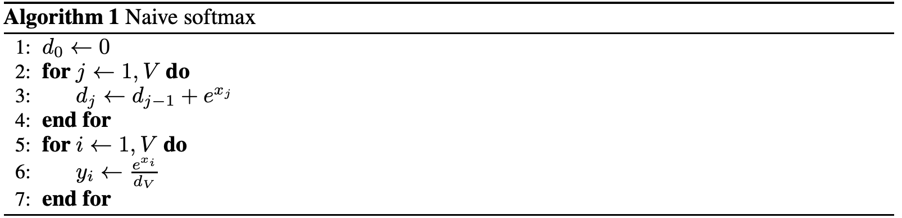
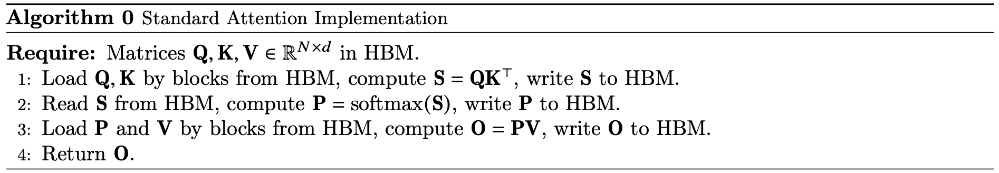
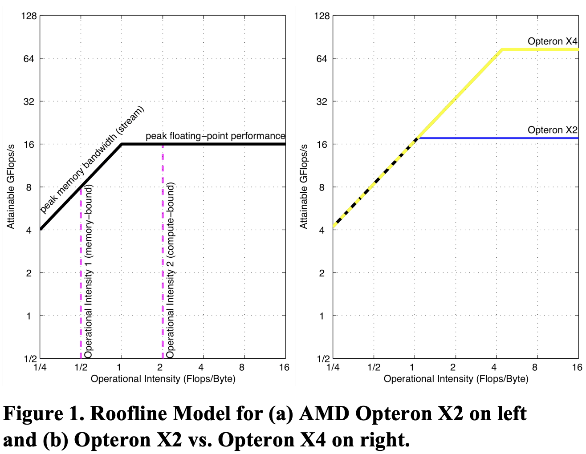

- [1. Online Softmax](#1-online-softmax)
  - [Original Softmax](#original-softmax)
  - [Online Softmax](#online-softmax)
- [2. FlashAttention-v1](#2-flashattention-v1)
  - [2.1 标准注意力](#21-标准注意力)
  - [2.2 Roofline](#22-roofline)
  - [2.3 SRAM](#23-sram)
  - [2.4 Tiling](#24-tiling)
  - [2.5 FlashAttention](#25-flashattention)
- [3. FlashAttention-2](#3-flashattention-2)
- [4. FlashAttention-3](#4-flashattention-3)
- [5. FlashDecoding \& FlashDecoding++](#5-flashdecoding--flashdecoding)
- [参考资料](#参考资料)

## 1. Online Softmax

### Original Softmax

**1，Naive softmax**

给定输入向量 $\mathbf{x} = [x_1, x_2, \dots, x_N]$，$Softmax(x)$ 函数的输出定义为（默认对行进行 `Softmax`。）：

$$d_N= \sum_j^{N} e^{x_j} \\
y_i = \frac{e^{x_i}}{d_N} $$

Naive Softmax 算法主要包括两个步骤，其算法实现步骤和 `FLOPs` 分析如下：



1. **计算归一化项 $dn$**：先对矩阵每个元素都需要进行指数运算，涉及 `FLOPs` 为 $N^2$（逐元素操作），假设是**对每一行进行 `Softmax`**，每一行有 $N$ 个元素，需要进行 $N - 1$ 次加法，矩阵总共有 $N$ 行，因此需要 $s\times(N - 1)$ 次加法，最后计算归一化项 $d_N$ 的 `FLOPs` 为 $2N^2N$
2. **计算 softmax 输出**：分为两步进行每个元素都需要除以所在行的总和，总共 $N^2$ 个元素，`FLOPs` 为 $N^2$。

综上，`Native Softmax` 的总 FLOPs 为：

$$\text{Native Softmax FLOPs} = 2N^2 - N + N^2 = 3N^2-N$$

算法的 `python` 代码实现和其对 global memory 的访存量 `MAC` 数值如下所示：

```python
"""
在 attenion 算子中, softmax 函数的输入 QK^T, 输入矩阵大小就是 [s,s]
"""
# [N, N] -> [N, N], 每个元素进行 3 次内存访问：2次读取和一次写入.
# mac = 3N^2, flops = 3N^2 - N
def native_softmax(x):
    s, s = x.shape # 第一个维度是序列长度，第二个维度是隐藏层大小
    output = np.array(x) # np.array() 将 python 中的数据结构（如列表、元组等）转换为 NumPy 的数组
    for r in range(s):
        sum = 0
        for i in range(s):
            sum += np.exp(x[r][i]) 
        for i in range(s):
            output[r][i] = np.exp(x[r][i]) / sum
    
    return output
```

**2，Safe Softmax**

和 `Native Softmax` 相比，`Safe Softmax` 为了防止数值溢出还需要将 $x_i$ 再额外减掉一个 `max` 最大值：

$$\begin{align}
m_N &= \text{max}_{k}^{N} x_k \\
d_N &= \sum_j^{N} e^{(x_j -m_N)} \\
softmax_i &= \frac{e^{x_i - m_N}}{d_N} \\
\end{align}$$

`Safe Softmax` 涉及三个步骤，其算法实现步骤和 `FLOPs` 分析如下：


1. **对每行求最大值**：遍历每行元素，做 $N-1$ 次比较，得到每行元素的最大值，总共 $N$ 行，因此该操作涉及 `FLOPs` 为 $N(N-1)$
2. **计算指数并求和得到归一化项 $d_N$**：将每个元素减去最大值后，再计算指数，这个过程是**逐元素操作**，`FLOPs` 为 $N^2 + N^2$。对每行进行求和，每行进行 $N - 1$ 次加法，整个矩阵共 $N\times(N - 1)$ 次加法。
3. **计算 softmax 输出**：将每个元素减去最大值后，再计算指数，最后除以行总和，需要 $2N^2$ 次除法。

值的注意的是，这里计算 max 需要一次独立的**全局** reduce，计算分母的 sum 再需要一次独立的全局 reduce，最后分别计算每一个元素的 softmax 值。三个步骤之间**存在数据依赖**。

结合前面 `Native Softmax` 的 FLOPs 计算，再加上对每行求最大值的操作，可知 `Safe Softmax` 总 `FLOPs`：

$$\text{Safe Softmax FLOPs} = (N^2 - N) + (5N^2 - N) = 6N^2 - 2N$$

`Safe Softmax` 算法的 `python` 代码实现和其对 global memory 的访存量 `MAC` 数值如下所示：

```python
# [N, N] -> [N, N], 每个元素进行 4 次内存访问：3次读取和一次写入.
# mac = 4N^2, flops = 4N^2 - 2N
def safe_softmax(x):
    s, s = x.shape # 第一个维度是序列长度，第二个维度是隐藏层大小
    output = np.array(x) # np.array() 将 python 中的数据结构（如列表、元组等）转换为 NumPy 的数组
    for r in range(s):
        max_r = 0
        for i in range(s):
            max_r = max(max_r, x[r][i]) # flops 为 1
            
        sum = 0
        for i in range(s):
            sum += np.exp(x[r][i] - max_r) # flops 为 2 + 1
            
        for i in range(s):
            output[r][i] = np.exp(x[r][i] - max_r) / sum # flops 为 2
    
    return output
```

**IO 复杂度分析**：`Safe Softmax` 需要 $3$ 个独立的循环对输入向量进行了三次遍历：第一次计算最大值 $m_N$，第二次计算归一化项 $d_N$，第三次计算最终值 $softmax_i$，再加上将结果写回内存中，这导致**每个向量元素需要 `4` 次内存访问**，即 Safe Softmax 算法的内存访问（`MAC`）偏大，即 softmax 函数的 HBM 访问次数为 $4N^2$，和序列长度呈二次方关系。

### Online Softmax

从 `Safe Softmax` 公式很明显看出，`MAC` 大原因是因为存在数据依赖：(2) 需要依赖 $m_N$, (3) 则需要依赖 $m_N$ 和 $d_N$。如果能**同时计算最大值 $m$ 和归一化项（normalization term）$d$，在一个 for 循环中得到最终的 $m_N$ 和 $d_N$**，则能直接减少 HBM 的访问次数（`MAC`），又因为 Softmax 典型情况都是内存受限，所以这肯定能提高 Softmax 算子的运行速度。

[Online normalizer calculation for softmax](https://arxiv.org/pdf/1805.02867) 论文将 3 步 safe softmax 合并成 2 步完成的方法，并证明了 $d_i'$ 存在如下递推性质：

$$\begin{aligned}
d_i' &= \sum^i_{j=1}e^{x_j - m_i} \\
&= \sum^{i-1}_{j=1}e^{x_j - m_i} + e^{x_i-m_i} \\
&= \left ({\sum^{i-1}_{j=1}e^{x_j - m_{i-1}}} \right ) * e^{m_{i-1} - m_i} + e^{x_i-m_i} \\
&= d_{i-1}'* e^{m_{i-1} - m_i} + e^{x_i-m_i} \\
\end{aligned}$$

即 $m_i$ 和 $d_i'$ 可以在一个 for 循环中计算并更新，这样 softmax 的实现就可以通过两个 for 循环完成，即两步 softmax，`Online Softmax` 计算公式如下：

$$m_j = max(m_{j-1}, x_j),\quad d_j = d_{j-1}e^{m_{j-1} - m_j} + e^{x_j - m_j}  \\
softmax\ x_i = \frac{e^{x_i - m_V}}{d_V} \tag{4}$$

这里 $m_j$ 和 $d_j$, 可以在一个 for 循环中同时实现，或者说在一个 kernel 中计算完成；$m_N$ 和 $d_N$ 是全局的最大值和归一化项。其算法实现过程如下所示：


如果想继续优化，则**使用分块技术计算归一化常数**，假设 $x = [x_1,x_2], y = [x_3, x_4]$，$m_{xy} = \text{max}(m_x, m_y)$定义分块计算: 

$$d_{xy} = d([x^{},y]) = d_x * e^{m_x - m_{xy}} + d_y * e^{m_y - m_{xy}}$$

分块计算完 $m$ 和 $d$ 之后，再将所有子块结果重新聚合得到全局结果 $m_N$ 和 $d_N$，其和串行顺序计算结果在数学上完全等价。
> 算法分析和公式证明过程，本文不再描述，感兴趣的可以看我上一篇文章-《online-softmax 论文解读》。

这篇论文在算法上其实有**两个创新**：
1. 提出并证明了通过**一次遍历**输入数据来计算 Softmax 函数归一化项的方法，该方法将 Softmax 函数的内存访问次数减少了 $1.33 (4/3 = 1.33)$倍
2. 证明了可以**分块计算归一化常数**，这个方法可以发挥 GPU 多线程的特性。

这里针对上面两个创新，我分别给出 online softmax 算法的 `python` 代码实现以及 global memory 的访存量 `MAC`。

```python
import numpy as np
import torch.nn.functional as F
import torch

def online_softmax_update(m0, d0, m1, d1):
    #                             x   1
    m = max(m0, m1) # flops: 1
    d = d0 * np.exp(m0 - m) + d1 * np.exp(m1-m) # flops: 5
    return m, d

# [N, N] -> [N, N], 每个元素进行 3 次内存访问：2 次读取和一次写入.
# mac = 3N^2, flops = 8N^2 
def online_softmax(x):
    s, s = x.shape
    output = np.array(x)
    for r in range(s):
        m = x[r][0]
        d = 1
        for j in range(1, s):
            m, d = online_softmax_update(m, d, x[r][j], 1) # flops 为 6
        for i in range(s):
            output[r][i] = np.exp(x[r][i] - m) / d # flops 为 2
            
    return output

# [N, N] -> [N, N], 每个元素进行 3 次内存访问：2 次读取和一次写入. 
# mac = 3N^2, flops = 8N^2，分块计算，可发挥并行计算优势
def block_online_softmax(x, block_size=256):
    assert x.shape[1] % block_size == 0
    s, s = x.shape
    output = np.array(x)
    for r in range(s):
        m = x[r][0]
        d = 0
        
        # 可使用多线程并行计算，实际 mac 为 N^2
        for b in range(0, s // block_size):
            # Calculate m,d of single block
            m_block = x[r][b*block_size]
            d_block = 0
            for j in range(0, block_size):
                m_block, d_block = online_softmax_update(m_block, d_block, x[r][b*block_size + j], 1)
            
            # Merge all block's result to total
            m, d = online_softmax_update(m, d, m_block, d_block) 
            
        for i in range(s):
            output[r][i] = np.exp(x[r][i] - m) / d
    
    return output
     
if __name__ == "__main__":
    x = np.random.randn(1024, 1024)
    # 对每一行执行 softmax 操作
    pytorch_softmax_out = F.softmax(torch.tensor(x), dim=1) # dim=0表示按列计算；dim=1表示按行计算。
    native_softmax_out = native_softmax(x)
    safe_softmax_out = safe_softmax(x)
    online_softmax_out = online_softmax(x)
    block_online_softmax_out = block_online_softmax(x, 256)
    
    if torch.allclose(pytorch_softmax_out, torch.tensor(native_softmax_out), atol=1e-4):
        print("naive softmax 与 PyTorch softmax 结果一致!")
    else:
        print("naive softmax safe_softmax 与 PyTorch softmax 结果不一致!")
    
    if torch.allclose(pytorch_softmax_out, torch.tensor(safe_softmax_out), atol=1e-4):
        print("safe softmax 与 PyTorch softmax 结果一致!")
    else:
        print("safe softmax 与 PyTorch softmax 结果不一致!")
    
    if torch.allclose(pytorch_softmax_out, torch.tensor(online_softmax_out), atol=1e-4):
        print("online softmax 与 PyTorch softmax 结果一致!")
    else:
        print("online softmax 与 PyTorch softmax 结果不一致!")

    if torch.allclose(pytorch_softmax_out, torch.tensor(block_online_softmax_out), atol=1e-4):
        print("block online softmax 与 PyTorch softmax 结果一致!")
    else:
        print("block online softmax 与 PyTorch softmax 结果不一致!")
```

程序运行后输出结果如下所示:
> naive softmax 与 PyTorch softmax 结果一致!
safe softmax 与 PyTorch softmax 结果一致!
online softmax 与 PyTorch softmax 结果一致!
block online softmax 与 PyTorch softmax 结果一致!

## 2. FlashAttention-v1

### 2.1 标准注意力

给定输入二维矩阵 $Q, K, V \in \mathbb{R}^{N\times d}$，其中 $N$ 是输入序列的长度，$d$ 是自注意力机制头的长度，Softmax 是按行应用的，注意力输出矩阵 $O \in \mathbb{R}^{N\times d}$ 的计算公式如下: 

$$\text{S = QK}^\text{T} \in \mathbb{R}^{N\times N},\quad \text{P = softmax(S)} \in \mathbb{R}^{N\times N},\quad \text{O = PV}\in \mathbb{R}^{N\times d}$$



标准的 `Attention` 运算大致可以描述为以下三个步骤：
1. 将 $Q, K$ 矩阵以块的形式从 `HBM` 中加载到 `SRAM` 中，计算 $S=QK^T$，将 $S$ 写入到 `HBM` 中。
2. 将 $S$ 矩阵从 `HBM` 中加载到 `SRAM` 中，计算 $P = Softmax(S)$，将 $P$写入到 HBM 中。
3. 将 $P, V$ 矩阵以块的形式从 HBM 中加载到 SRAM 中，计算 $O=PV$, 将 $O$ 写入到 HBM 中。


self-attention 算子涉及到的和 HBM 数据传输过程如上图所示，很明显需要从HBM 中读取 5次，写入 HBM 3 次，`HBM` 访存量 $MAC = 3N^2 + 4Nd$，很明显标准注意力的 HBM 随序列长度增加呈二次方增长。

### 2.2 Roofline

`Roofline` 性能分析模型是一种用于衡量和分析计算性能的工具，通过将应用程序的实际计算性能与硬件的理论峰值性能进行对比，以揭示应用是受到计算性能的限制还是受到内存带宽的限制，这里的内存带宽是指芯片外内存带宽。

Roofline 模型的有两个关键指标：**操作强度和性能上限**。操作强度定义：每字节内存数据传输所对应的操作次数，即每字节 flops，单位一般为 GFlops/sec。`Roofline` 模型将**浮点运算性能、操作强度和内存性能整合在一个二维图中**。浮点运算的峰值性能可以通过硬件规格或微基准测试得出。



> 图表采用对数-对数刻度，Y 轴为可实现的浮点性能，X 轴为操作强度，范围从每 1/4 `Flops/DRAM 字节`到 16 `Flops/DRAM 字节`。Operational Intensity, OI， 也称算术强度 Arithmetic Intensity。

计算机内存系统在不同操作强度下支持的最大浮点性能的计算公式：

$$\text{可实现的 GFlops/sec} = \text{Min(峰值浮点性能，峰值内存带宽 x 操作强度)}$$

`Roofline` 模型有两个作用:
1. *上限分析*：为浮点程序性能设定了一个上限（水平线）。
2. *瓶颈分析*：比较浮点程序的操作强度硬件的操作强度，判断程序是处于内存还是计算受限。

FlashAttention 论文就是基于 `Roofline` 模型分析了 self-attention 层处于内存受限状态，从而得到了减少 HBM 访问次数的思路。

### 2.3 SRAM

**FlashAttention 论文中说的 `SRAM` 是指哪种 GPU 内存类型？**

1，可以从 cuda 编程和算法角度理解 SRAM 是 L1 Cache (数据缓冲)。

FlashAttention 核心是分块计算注意力，可以简单理解为就是将输入张量划分成很多块，每个数据块放到 sm 里面去计算（cuda/triton 编程的核心就是在于如何将数据分块），sm 里面 L1 cache/共享内存的大小基本就决定了 这个数据块的上限空间大小，所以论文里面说的 SRAM 大小其实值的是 L1 Cache 大小，L2 Cache 是所有 SM 能共同访问的，明显不是论文里指的 SRAM。

2，可以从 GPU 内存层次角度直接看出 SRAM 是 L1 Cache (数据缓冲)。

论文 2.1 节明确都说了 A100 的 SRAM 大小是 192 KB，“As an example, the A100 GPU has 40-80GB of high bandwidth memory (HBM) with bandwidth 1.5-2.0TB/s and 192KB of on-chip SRAM per each of 108 streaming multiprocessors with bandwidth estimated around 19TB/s [44, 45].” 

而英伟达官网给出的 A100 白皮书也明确说了 A100 的 L1 cache 大小是 192KB（ 组合共享内存和 L1 数据缓存），所以论文的 SRAM 肯定指的是 L1 cache 了。

另外，这个论文学习，除非有 cuda 编程经验和 transformer 模型扎实的算法基础就好容易理解点，不然真的太难懂啦，很多人其实刚开始就看了个寂寞，而且这个论文也可以说 attention 和 cuda 优化的集大成者啦。

### 2.4 Tiling

Online Softmax 实现在一个 for 循环中计算 $m_i$ 和 $d_i$，FlashAttention-v1 基于它的思想更进一步，实现在一个 for 循环中计算 $m_i$、$d_i$、$\text{softmax}_i$ 和注意力输出 $O_i$，也就是说，在一个 kernel 中实现 attention 的所有操作。再通过分块 Tiling 技术，将输入的 Q、K、V 矩阵拆分为多个块，将其从较慢的 HBM 加载到更快的 SRAM 中，然后分别计算这些块的注意力输出，最后，将每个块的输出按正确的**归一化因子缩放**之后相加后可得到精确的注意力输出。把在 HBM 上的访存通过 Tiling 技术 转移到 SRAM 上，从而大大减少了 HBM 访问次数（内存读/写的次数）

注意力输出 $O_i$ 的更新公式在算法 1 第 12 行，公式的推导证明在附录 C 中。

$$O_i \leftarrow \text{diag}(\ell_i^{\text{new}})^{-1} (\text{diag}(\ell_i) e^{m_{i} - m_i^{\text{new}}}O_i + e^{\tilde{m}_{ij} - m_i^{\text{new}}} \tilde{P}_{ij} V_j)$$

这里原论文给出的推导不是很容易看懂，我参考[文章](https://fancyerii.github.io/2023/10/23/flashattention/)给出了推导证明，其证明了 $O_i$ 的计算也是可以同时满足交换律和结合律，任意分块分别计算 $m$、$\ell$ 和 $O_i$之后，将所有子块结果重新聚合在数学上完全等价，从而实现在一个 `for` 循环中计算 $m$、$\ell$ 和 $O_i$。

将矩阵版的 online-softmax 套进标准 Attention，这里的 Softmax 是对 $QK^T \in [N, N]$ 结果中的每一行做一维的 softmax；用大写 $M、D$ 表示最大、归一化项，它们的长度都为 $N$；$O\in [N,d]$ 表示注意力输出。计算公式如下：

$$\begin{aligned}
S_{r, i} &= \sum^{d}_{j=0}Q_{r,j}K_{j,i}\\
M_{r, i} &= \max(M_{r, i-1}, S_{r, i}), \quad
D_{r, i}' = D_{r, i-1}' * e^{M_{r, i-1} - M_{r, i}} + e^{S_{r, i}-M_{r, i}}, \\
P_{r, i} &= \frac{e^{S_{r, i} - M_{r, N}}}{D_{r, N}'}, \\
O_{r, c} &= \sum^N_{i=0}(P_{r, i} * V_{i, c}) 
\end{aligned}
$$

对应代码如下：

```python
def online_softmax_update(m0, d0, m1, d1):
    #                             x   1
    m = max(m0, m1) # flops: 1
    d = d0 * np.exp(m0 - m) + d1 * np.exp(m1-m) # flops: 5
    return m, d

def flashattn_0(Q, K, V):
    N, Dim = Q.shape
    
    # 1, Load Q K and write S. and Compute S[r][i] by matrix multiply 
    S = np.zeros([N, N], "float32")
    for r in range(0, N):
        for i in range(0, N):
            for j in range(0, Dim):
                S[r][i] += Q[r][j] * K[i][j] # K^T 的列就是 K 的行
    
    # 2, Load S and write O. Compute softmax[i] and O[r][c]
    O = np.zeros([N, Dim], "float32") 
    for r in range(0, N):
        m = S[r][0]
        d = 1
        for i in range(1, N):
            m, d = online_softmax_update(m, d, S[r][i], 1) # flops 为 6
        
        softmax = np.zeros([N], "float32")
        for i in range(0, N):
            softmax[i] = np.exp(S[r][i] - m) / d
        
        for c in range(0, Dim):
            for i in range(0, N):
                O[r][c] += softmax[i] * V[i][c] # V[i][c] 的加载不连续
    
    return O
```

可以看到将 online softmax 应用到标准 attention 后，新的注意层只需在三个 for 循环完成 O[r][c] 的计算，那么还能不能继续优化，在两个 for 循环内完成注意力 O[r][c] 的计算呢？就像 online-softmax 那样，实际是可以的。

$O_{r,c}$ 的计算是一个累加过程，拆开来看：

$$\begin{aligned}
O_{r,c, i} &= O_{r,c, i-1} + Softmax_{r, i} * V[i, c] \\
&= O_{r,c, i-1} + \frac{e^{S_{r, i} - M_{r,N}}}{D'_{r,N}} * V[i, c] \\
&= \sum_{j=1}^i \frac{e^{S_{r, j} - M_{r,N}}}{D'_{r,N}} * V[j, c] 
\end{aligned}$$

可以发现 $O_{r, c, i}$ 依赖于 $M_{r, L}$ 和 $D_{r, L}'$，类比 Online Softmax 求解归一化项的技巧，我们使用迭代的方式求解 $O_{r,c,i}$，可以用数学归纳法证明：

$$\begin{aligned}
O'_{r,c, i} &= \sum_{j=1}^i \frac{e^{S_{r, j} - M_{r, i}}}{D'_{r, i}} * V[j, c] \\
&=  \sum_{j=1}^{i-1} \frac{e^{S_{r, j} - M_{r, i}}}{D'_{r,i}} * V[j, c] + \frac{e^{S_{r, i} - M_{r, i}}}{D'_{r,i}} * V[i, c] \\
&= \sum_{j=1}^{i-1} \frac{e^{S_{r, j} - M_{r, i-1}}}{D'_{r, i-1}} * V[j, c] * \frac{D'_{r, i-1} * e^{M_{r,i-1} - M_{r,i}}}{D'_{r, i}} + \frac{e^{S_{r, i} - M_{r, i}}}{D'_{r,i}} * V[i, c] \\
&= O'_{r,c, i-1} * \frac{e^{M_{r,i-1} - M_{r,i}} * D'_{r, i-1}}{D'_{r, i}} + \frac{e^{S_{r, i} - M_{r, i}}}{D'_{r,i}} * V[i, c] 
\end{aligned}$$

可以看到 $O'_{r,c, i}$ 仅仅和 $O'_{r,c, i-1}$ 以及 ${S_{r, i}、M_{r,i-1}、D'_{r,i-1}}$ 有关，不需要“规约”操作，这些变量都是可以在同一个 for 循环中计算得到的，即我们可以像 online softmax 那样在一个 $[i, N]$ 的循环中完成计算：

$$\begin{aligned}
S_{r, i} &= \sum^{Dim}_{j=1}Q[r, j]K[j, i]\\
M_{r, i} &= \max(M_{r, i-1}, S_{r, i}), \quad D_{r, i}' = D_{r, i-1}' * e^{M_{r, i-1} - M_{r, i}} + e^{S_{r, i}-M_{r, i}}\\
O'_{r,c, i} &=O_{r,c,i-1}'*\frac{e^{M_{r, i-1} - M_{r, i}}D_{r,i-1}'}{D_{r,i}'} + \frac{e^{S_{r, i} - M_{r, i}}}{D_{r, i}'}V[i, c]\\
\end{aligned}
$$

最终，我们想要的注意力输出结果为:

$$O_{r,c} = \sum_{i=0}^N O_{r,c,i}$$

与 Online softmax 的 $D_{r,i}$一样，$ O'_{r,c, i}$ 也满足也具有分块满足交换律和结合律的特性：

$$
\begin{aligned}
D_{r, xy}' &= D_{r, x}' * e^{M_{r, x} - M_{r, xy}} + D_{r, y}' * e^{M_{r, y} - M_{r, xy}}\\
O_{r,c,xy}' &= O_{r,c,x}' * \frac{e^{M_{r, x}-M_{r, xy}}D_{r, x}'}{D_{r, xy}'} + O_{r,c,y}' * \frac{e^{M_{r, y}-M_{r, xy}}D_{r, y}'}{D_{r, xy}'}\\
\end{aligned}$$

上述就是 FlashAttention 算法的等效计算公式，对应的注意输出第 k 行第 c 列结果 $O_{k,c}$ 的伪代码可以写为:

```python
for i in range(0, N):
    Sk[i] = np.dot(Q[k, :], K.T[:, i])
    Mk[i] = Mk[i] = max(Mk[i - 1], Sk[i])
    Dk[i] = Dk[i-1] * exp(Mk[i - 1] - Mk[i]) + exp(Sk[i] - Mk[i])
    Ok[i] = Ok[i-1] * (exp(Mk[i - 1] - Mk[i]) * Dk[i-1]) / Dk[i] + exp(Sk[i] - Mk[i]) / Dk[i] * V[i,:]
```

或者类似下面写法：

$$\begin{align}
SubSum_{r, c, i} &= SubSum_{r, c, i-1} + Softmax_{r, i} * V[i, c] \nonumber \\
&=SubSum_{r, c, i-1} + \frac{e^{X_{r, i} - M_{r, N}}}{D_{r, N}'} * V[i, c]  \nonumber \\
&=\sum^i_{j=1}\frac{e^{X_{r, j} - M_{r, N}}}{D_{r, L}'}V[j, c] \nonumber
\end{align}
$$

可以发现 $SubSum_{r, c, i}$ 依赖于 $M_{r, L}$ 和 $D_{r, L}'$，运用与 online softmax 相似的归纳假设方法，可以在这里增加一个人 $SubSum_{r, c, i}'$，则：

$$\begin{aligned}
SubSum_{r,c,i}' &= \sum^i_{j=1}\frac{e^{X_{r, j} - M_{r, i}}}{D_{r, i}'}V[j, c]\\
&=\sum^{i-1}_{j=1}\frac{e^{X_{r, j} - M_{r, i}}}{D_{r, i}'}V[j, c] + \frac{e^{X_{r, i} - M_{r, i}}}{D_{r, i}'}V[i, c]\\
&=\left (\sum^{i-1}_{j=1}\frac{e^{X_{r, j} - M_{r, i-1}}}{D_{r, i-1}'}V[j, c] \right) * \frac{e^{M_{r, i-1} - M_{r, i}}D_{r,i-1}'}{D_{r,i}'} + \frac{e^{X_{r, i} - M_{r, i}}}{D_{r, i}'}V[i, c]\\
&=SubSum_{r,c,i-1}'*\frac{e^{M_{r, i-1} - M_{r, i}}D_{r,i-1}'}{D_{r,i}'} + \frac{e^{X_{r, i} - M_{r, i}}}{D_{r, i}'}V[i, c]\\
\end{aligned}$$

综上，可知我们可以像 online softmax 那样在一个 $[i, L]$ 的循环中完成如下计算：

$$\begin{aligned}
X_{r, i} &= \sum^{Dim}_{j=1}Q[r, j]K[j, i]\\
M_{r, i} &= \max(M_{r, i-1}, X_{r, i})\\
D_{r, i}' &= D_{r, i-1}' * e^{M_{r, i-1} - M_{r, i}} + e^{X_{r, i}-M_{r, i}}\\
SubSum_{r,c,i}' &=SubSum_{r,c,i-1}'*\frac{e^{M_{r, i-1} - M_{r, i}}D_{r,i-1}'}{D_{r,i}'} + \frac{e^{X_{r, i} - M_{r, i}}}{D_{r, i}'}V[i, c]\\
\end{aligned}
$$

最终，我们想要的注意力输出结果为:

$$O_{r,c} = SubSum_{r,c,L}$$

【**定理 1**】 算法 1 注意力输出矩阵 $O = softmax(QK^T)V$ 要求 $O(N^2d)$ 的 FLOPs，并且除了输入和输出内存之外，需要额外的 $O(N)$ 内存【证明见附录 B】。

FlashAttention 伪代码如下所示：

```python
for (r = 1 to L)
    for (i = 1 to L)
        // [L, Dim] * [Dim, L] -> [L, L]
        for (j = 1 to Dim) 
            X[r, i] += Q[r, j] * K[j, i]

        // [L, L]
        M[r, i] = max(M[r, i-1], X[r, i])

        // [L, L]
        D'[r, i] = D'[r, i-1] * e(...) + e(...)

        // [L, Dim]
        for (c = 1 to Dim)
            O[r, c] += O[r, c] * e(...) * D'[r, i-1] / D'[r, i] + e(...) / D'[r, i] * V[i, c]
```

再用 python 实现如下所示:

```python
def flashattn_update(m, d, m0, d0, s0, m1, d1, s1):
    #                      |   |   |   |   |   |
    #                      |   |   |   x   v   1
    # Init value:        MIN_M 0   0
    s = s0 * np.exp(m0 - m) * d0 / d + s1 * np.exp(m1 - m) * d1 / d
    return s


def flashattn_1(q, k, v):
    # [L, Dim] * [Dim, L] -> [L, L]
    x = np.zeros([L, L], "float32")
    for r in range(0, L):
        for i in range(0, L):
            for j in range(0, Dim):
                x[r, i] += q[r, j] * k[i, j]

    # [L, L] -> [L, L] * [L, Dim] -> [L, Dim]
    o = np.zeros([L, Dim], "float32")
    for r in range(0, L):
        m = []
        d = []
        for i in range(0, L):
            mm, dd = online_softmax_update(
                m[-1] if i > 0 else MIN_M, d[-1] if i > 0 else 0, x[r, i], 1
            )
            m.append(mm)
            d.append(dd)

        for c in range(0, Dim):
            s = 0
            for i in range(0, L):
                s = flashattn_update(
                    m[i],
                    d[i],
                    m[i - 1] if i > 0 else MIN_M,
                    d[i - 1] if i > 0 else 0,
                    s,
                    x[r, i],
                    v[i, c],
                    1,
                )
            o[r, c] = s
    return o
```

继续优化，上面的公式和代码只是实现了在一个 for 循环中计算 $o(r, c)$，但是没有分块计算，同样和 Online softmax 一样，SubSum_{r,c,i}' 也具有分块满足交换律和结合律的特性：

$$\begin{aligned}
D_{r, xy}' &= D_{r, x}' * e^{M_{r, x} - M_{r, xy}} + D_{r, y}' * e^{M_{r, y} - M_{r, xy}}\\
SubSum_{r,c,xy}' &= SubSum_{r,c,x}' * \frac{e^{M_{r, x}-M_{r, xy}}D_{r, x}’}{D_{r, xy}’} + SubSum_{r,c,y}' * \frac{e^{M_{r, y}-M_{r, xy}}D_{r, y}’}{D_{r, xy}’}\\
\end{aligned}$$

因此，FlashAttention-1 的分块计算 python 代码如下。

```python
def flashattn_1_block(q, k, v):
    assert L % BLK == 0
    # [L, Dim] * [Dim, L] -> [L, L]
    x = np.zeros([L, L], "float32")
    for r in range(0, L):
        for i in range(0, L):
            for j in range(0, Dim):
                x[r, i] += q[r, j] * k[i, j]

    # [L, L] -> [L, L] * [L, Dim] -> [L, Dim]
    o = np.zeros([L, Dim], "float32")
    for r in range(0, L):
        m = np.zeros([L // BLK], "float32")
        d = np.zeros([L // BLK], "float32")
        mm = np.zeros([L], "float32")
        dd = np.zeros([L], "float32")
        for b in range(0, L // BLK):
            # Calculate block
            for i in range(0, BLK):
                mm[b * BLK + i], dd[b * BLK + i] = online_softmax_update(
                    mm[b * BLK + i - 1] if i > 0 else MIN_M,
                    dd[b * BLK + i - 1] if i > 0 else 0,
                    x[r, b * BLK + i],
                    1,
                )

            # Merge to total
            m[b], d[b] = online_softmax_update(
                m[b - 1] if b > 0 else MIN_M,
                d[b - 1] if i > 0 else 0,
                mm[(b + 1) * BLK - 1],
                dd[(b + 1) * BLK - 1],
            )

        for c in range(0, Dim):
            s = 0
            for b in range(0, L // BLK):
                # Calculate block
                ss = 0
                for i in range(0, BLK):
                    ss = flashattn_update(
                        mm[b * BLK + i],
                        dd[b * BLK + i],
                        mm[b * BLK + i - 1] if i > 0 else MIN_M,
                        dd[b * BLK + i - 1] if i > 0 else 0,
                        ss,
                        x[r, b * BLK + i],
                        v[b * BLK + i, c],
                        1,
                    )

                # Merge to total
                s = flashattn_update(
                    m[b],
                    d[b],
                    m[b - 1] if b > 0 else MIN_M,
                    d[b - 1] if b > 0 else 0,
                    s,
                    mm[(b + 1) * BLK - 1],
                    dd[(b + 1) * BLK - 1],
                    ss,
                )
            o[r, c] = s
    return o
```
### 2.5 FlashAttention

FlashAttention-v1 其实并没有提出新的算法和网络结构上的优化，但是其在算法上综合了过往的两个创新点：**分块**和**重计算**，并将其应用于 Attention 结构，给出了详尽的数学计算、证明和 IO 复杂度分析（论文长达 34 页大头都是公式），可以说是过往 transformer 模型在 gpu 上优化的**集大成者**，而且最重要的是提供了非常易用的前向传播和反向传播的代码库，这使得其广为引用和应用于工业界。
> 可见，优秀的代码功底、扎实的理论基础、底层硬件和框架的熟悉对于科研工作非常重要，即使你没有提出新的算法，但是你的工作依然可以广为传播和应用。

总的来说，FlashAttention **在算法层面通过重排注意力计算，并利用经典技术（分块和重计算）显著加速了注意力计算，将内存占用从二次方降低到线性**。使得在 sequence length 偏长和 attention 计算处于内存密集型的情况下有着明显的加速效果。并直接带来了相对于优化基准 2-4 倍的实际运行时间加速，以及高达 10-20 倍的内存节省，并且计算结果是精确而非近似的。

> 本文主要分析其在模型推理阶段的优化，因此**重计算**方法的分析就略过了。

论文总结的一些定理：

【**定理 1**】 算法 1 注意力输出矩阵 $O = softmax(QK^T)V$ 要求 $O(N^2d)$ 的 FLOPs，并且除了输入和输出内存之外，需要额外的 $O(N)$ 内存【证明见附录 B】。

【**定理 2**】假设 $N$ 是输入序列的长度，$d$ 是注意力头的维度，$M$ 是 `SRAM` 大小，且 $d \leq M\leq Nd$。标准 attention 的 `HBM` 访问次数是 $O(Nd+N^2)$，而 FlashAttention [算法 1] 只需要 $O(N^2d^2M^{-1})$。

【**命题 3**】设 $N$ 为序列长度，$d$ 为头部维度，$M$ 为 `SRAM` 的大小，且 $d \leq M \leq Nd$。不存在一个算法可以在所有范围内的 $M$（即 $[d, N d]$）使用少于 $O(N^2 d^2 M^{-1})$ 次 `HBM` 访问来计算精确的注意力。

【**定理 4**】假设 $N$ 是输入序列的长度，$d$ 是注意力头的维度，$M$ 是 `SRAM` 大小，且 $d \leq M\leq Nd$。块-稀疏的 FlashAttention (算法 5) 的 HBM 访问次数是 $O(Nd + N^2d^2M^{−1}s)$。（其中 $s$ 是块稀疏掩码中非零块的比例）

【**定理 5**】设 $N$ 为序列长度，$d$ 为头部维度，$M$ 为 `SRAM` 的大小，且 $d \leq M \leq Nd$。标准注意力（算法 0）的反向传播需要 $\Theta(N d + N^2)$ 次 HBM 访问，而 FlashAttention 的反向传播（算法 4）只需要 $\Theta(N^2 d^2 M^{-1})$ 次 HBM 访问。

`FlashAttention` 算法实现步骤如下所示。

$\text{算法 1 FlashAttention} \\
要求：矩阵\; Q, K, V \in \mathbb{R}^{N \times d}  \;存储在\;\text{HBM}（高带宽内存）中，片上\;\text{SRAM}\;大小为\;M. \\$

$1: 设置块大小\;B_c = \left\lceil \frac{M}{4d} \right\rceil ,  B_r = \min \left(\left\lceil \frac{M}{4d} \right\rceil , d\right). \\
2: 初始化\;O = (0)_{N \times d} \in \mathbb{R}^{N \times d} ,  \ell = (0)_N \in \mathbb{R}^N ,  m = (-\infty)_N \in \mathbb{R}^N\;存储在\; \text{HBM} 中. \\
3: 将 \;Q\;分成\; T_r = \left\lceil \frac{N}{B_r} \right\rceil \;块 Q_1, \dots, Q_{T_r}，每块大小为\;B_r\times d；将\;K, V\;分为\; T_c = \left\lceil \frac{N}{B_c} \right\rceil \;块\; K_1, \dots, K_{T_c} \;和\; V_1, \dots, V_{T_c}，每块大小为\; B_c \times d. \\
4: 将 \;O\;分为\;T_r\; 块\;O_1, \dots, O_{T_r}，每块大小为 \;B_r\times d，将 \;\ell\;分为\;T_r\;块 \ell_1, \dots, \ell_{T_r}，将\; m \;分为\;T_r\;块 m_1, \dots, m_{T_r}，每块大小为\;B_r. \\
5: for \;1 \leq j \leq T_c\;\text{do} \\
6: \quad 从\;\text{HBM} 加载\;K_j, V_j\;到片上 \;\text{SRAM}. \\
7: \quad for \; 1 \leq i \leq T_r\; \text{do} \\
8: \quad \quad 从 \; \text{HBM}\; 加载 \; Q_i, O_i, \ell_i, m_i \;到片上\; \text{SRAM}. \\
9: \quad \quad 在片上计算\; S_{ij} = Q_i K_j^T \in \mathbb{R}^{B_r \times B_c}. \\
10: \quad \quad 在片上计算\; \tilde{m}_{ij} = \text{rowmax}(S_{ij}) \in \mathbb{R}^{B_r} ， \tilde{P}_{ij} = \exp(S_{ij} - \tilde{m}_{ij}) \in \mathbb{R}^{B_r \times B_c} （逐元素操作），计算\; \tilde{\ell}_{ij} = \text{rowsum}(\tilde{P}{ij}) \in \mathbb{R}^{B_r}. \\
11: \quad \quad 在片上计算\; m_i^{\text{new}} = \max(m_i, \tilde{m}_{ij}) \in \mathbb{R}^{B_r} ， \ell_i^{\text{new}} = e^{m_i - m_i^{\text{new}}} \ell_i + e^{\tilde{m}_{ij} - m_i^{\text{new}}} \tilde{\ell}_{ij} \in \mathbb{R}^{B_r}. \\
12: \quad \quad 将\; O_i \leftarrow \text{diag}(\ell_i^{\text{new}})^{-1} (\text{diag}(\ell_i) e^{m_{i} - m_i^{\text{new}}}O_i + e^{\tilde{m}_{ij} - m_i^{\text{new}}} \tilde{P}_{ij} V_j) \; 写回到\; \text{HBM}. \\
13: \quad \quad 将\; \ell_i \leftarrow \ell_i^{\text{new}}, m_i \leftarrow m_i^{\text{new}} \;写回到\; \text{HBM}. \\
14: \quad \text{end for} \\
15: \text{end for} \\
16: 返回\; O$


上面的是纯 python 代码，下面我们继续优化，利用 triton 框架写出极度优化的  FlashAttention-1 内核代码。

```python

```

## 3. FlashAttention-2


## 4. FlashAttention-3


## 5. FlashDecoding & FlashDecoding++


## 参考资料

- [Online normalizer calculation for softmax](https://arxiv.org/pdf/1805.02867)
- [FlashAttention: Fast and Memory-Efficient Exact Attention with IO-Awareness](https://arxiv.org/pdf/2205.14135)
- [FlashAttention-2:Faster Attention with Better Parallelism and Work Partitioning](https://tridao.me/publications/flash2/flash2.pdf)
- [FlashAttention-3: Fast and Accurate Attention with Asynchrony and Low-precision](https://arxiv.org/pdf/2407.08608)
- [FlashAttention: Fast and Memory-Efficient Exact Attention with IO-Awareness](https://ahmdtaha.medium.com/flashattention-fast-and-memory-efficient-exact-attention-with-io-awareness-2a0aec52ed3d)
- [Chenfan Blog-FlashAttentions](https://jcf94.com/2024/02/24/2024-02-24-flash-attention/)
- [FlashAttentions 原理及代码实现](https://jcf94.com/2024/02/24/2024-02-24-flash-attention/)
- [Self Attention 固定激活值显存分析与优化及PyTorch实现](https://zhuanlan.zhihu.com/p/445016136)
- [榨干 GPU 效能的 Flash Attention 3](https://tomohiroliu22.medium.com/%E6%A6%A8%E4%B9%BEgpu%E6%95%88%E8%83%BD%E7%9A%84flashattention%E7%AC%AC%E4%B8%89%E4%BB%A3-4a8b0a2a812e)
- [图解大模型计算加速系列：FlashAttention V1，从硬件到计算逻辑](https://zhuanlan.zhihu.com/p/669926191)
- [FlashAttention 实现算子融合原理的可视化](https://www.bilibili.com/video/BV1Zz4y1q7FX/?vd_source=69e98dbaea70afc6b62d55a86d59e408)
- [FlashAttention: Fast and Memory-Efficient Exact Attention With IO-Awareness](https://www.nvidia.com/en-us/on-demand/session/gtc24-s62546/)