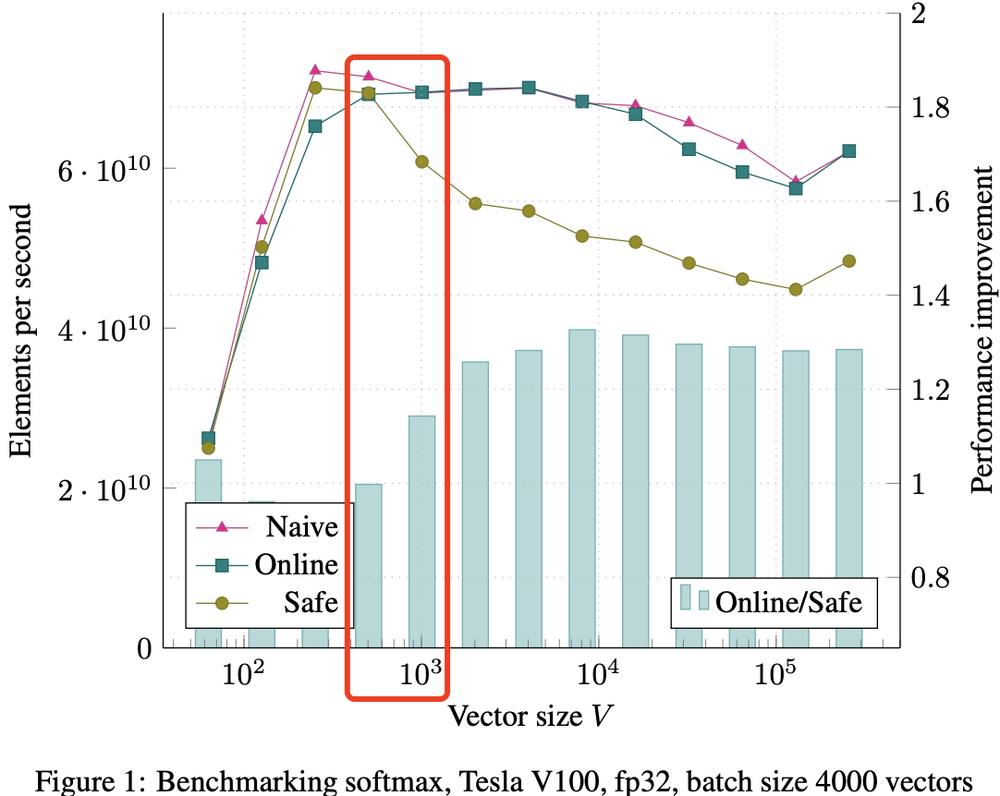

- [摘要](#摘要)
- [1. 原来的 Softmax](#1-原来的-softmax)
- [2. 在线归一化计算](#2-在线归一化计算)
  - [2.1 并行在线归一化计算](#21-并行在线归一化计算)
- [3. Softmax 和 top-k 融合](#3-softmax-和-top-k-融合)
- [4. Benchmarking](#4-benchmarking)
- [5. 结论和讨论](#5-结论和讨论)
- [参考资料](#参考资料)

## 摘要

`Softmax` 函数在机器学习中应用广泛，此前的多项研究提出了更快的替代方案。本文针对提升原始 Softmax 性能，提出了一种**一次遍历输入数据来计算 Softmax 函数归一化项的方法，作用是减少内存访问次数**，并称其为“在线 Softmax”，并推测这种减少内存访问的方法可以提升 Softmax 在实际硬件上的性能。基准测试也证实了这一推测：Softmax 的速度最多提升 `1.3` 倍，且 Softmax 和 `TopK` 结合并融合后的速度提升最多可达 `5` 倍。

## 1. 原来的 Softmax

Softmax 函数是一种常用于机器学习，特别是多分类问题中的激活函数。它的作用是将一个任意实数向量转换为一个概率分布，并确保输出的概率和为 1。

给定输入向量 $\mathbf{x} = [x_1, x_2, \dots, x_n]$，$Softmax(x)$ 函数的输出定义为：

$$y_i = \frac{e^{x_i}}{\sum_j^{n} e^{x_j} } \quad (1)$$

其中，$x,y\in  \mathbb{R}^{n}$。朴素的 Softmax [算法 1] 实现需要对 $\mathbf{x}$ 进行二次内存访问，一次计算归一化项 $d_n$，另一次计算输出值 $y_i$，加上写输出结果 $y_i$，即**每个向量元素都需要进行三次内存访问：两次读取和一次写入**。
> Softmax 函数中，分母的求和项被叫做归一化项 $d_n$，作用是将输入向量中每个元素 $e^{x_i}$ 变为比例较小的数值，保证它们的和为 1，从而符合概率的定义。

$\text{算法 1 朴素 softmax} \\
\begin{aligned}
1: & \quad d_0 \leftarrow 0 \\
2: & \quad \textbf{for} \ j \leftarrow 1, n \ \textbf{do} \\
3: & \quad \quad d_j \leftarrow d_{j-1} + e^{x_j} \\
4: & \quad \textbf{end for} \\
5: & \quad \textbf{for} \ i \leftarrow 1, n \ \textbf{do} \\
6: & \quad \quad y_i \leftarrow \frac{e^{x_i}}{d_n} \\
7: & \quad \textbf{end for}
\end{aligned}
$

在实际硬件上，由于表示对数字范围有限，算法 1 的第 3 行可能会因指数运算而发生溢出或下溢，因此目前通用的 Softmax 实现（更安全的形式）中为了防止数值溢出还需要再额外减掉一个 `max` 最大值：

$$m = \text{max}_{k}^{n} x_k\\
y_i = \frac{e^{(x_i - m)}}{\sum_j^{n} e^{(x_j -m)}} \quad (2)
$$

大部分深度学习框架都是采用这个更安全的朴素实现，算法流程见 [算法2]。但安全 Softmax 对输入向量进行了三次遍历：第一次计算最大值 $m_n$，第二次计算归一化项 $d_n$，第三次计算最终值 $y_i$，再加上将结果写回内存中，这导致**每个向量元素总共需要 `4` 次内存访问**，即原始的 Softmax 算法的内存访问（`MAC`）偏大，本文希望对此进行改进。

$\text{算法 2 安全 Softmax} \\
\begin{aligned}
1: & \quad m_0 \leftarrow -\infty \\
2: & \quad \textbf{for} \ k \leftarrow 1, n \ \textbf{do} \\
3: & \quad \quad m_k \leftarrow \max(m_{k-1}, x_k) \\
4: & \quad \textbf{end for} \\
5: & \quad d_0 \leftarrow 0 \\
6: & \quad \textbf{for} \ j \leftarrow 1, n \ \textbf{do} \\
7: & \quad \quad d_j \leftarrow d_{j-1} + e^{x_j - m_n} \\
8: & \quad \textbf{end for} \\
9: & \quad \textbf{for} \ i \leftarrow 1, n \ \textbf{do} \\
10: & \quad \quad y_i \leftarrow \frac{e^{x_i - m_n}}{d_n} \\
11: & \quad \textbf{end for}
\end{aligned}$

## 2. 在线归一化计算

算法 3 通过一次遍历输入向量，同时计算最大值 $m$ 和归一化项（normalization term）$d$，每个向量元素仅增加两次操作（2 个 for 循环遍历），几乎没有额外成本。它将 `Softmax` 函数计算的内存访问次数从每个向量元素的 4 次减少到 3 次。灵感来源于数值稳定的方差在线计算算法 [18]。

$\text{算法 3 带在线归一化计算的安全 Softmax} \\
\begin{aligned}
1: & \quad m_0 \leftarrow -\infty \\
2: & \quad d_0 \leftarrow 0 \\
3: & \quad \textbf{for} \ j \leftarrow 1, n \ \textbf{do} \\
4: & \quad \quad m_j \leftarrow \max(m_{j-1}, x_j) \\
5: & \quad \quad d_j \leftarrow d_{j-1} \times e^{m_{j-1} - m_j} + e^{x_j - m_j} \\
6: & \quad \textbf{end for} \\
7: & \quad \textbf{for} \ i \leftarrow 1, n \ \textbf{do} \\
8: & \quad \quad y_i \leftarrow \frac{e^{x_i - m_n}}{d_n} \\
9: & \quad \textbf{end for}
\end{aligned}$

算法 3 本质上就是在遍历输入数组元素的过程中，**持续更新最大值** $m$ 和归一化项 $d$。在每次迭代时，算法基于新的最大值 $m_j$ 更新归一化项 $d$，之后再将新值加入归一化项中。

**定理 1**：算法 3 的第 1-6 行计算 $m_n = \max_{k=1}^{n} x_k$ 和 $d_n = \sum_{j=1}^{n} e^{x_j - m_n}$。

证明：我们将通过数学归纳法进行证明。
$
- *基础情况*：当  $n = 1$
    $m_1 \leftarrow x_1 \\
        \quad\;\; = max_{k=1}^1x_k\qquad\qquad\qquad\qquad\; \text{根据算法 3 第 4 行}$
    $d_1 \leftarrow e^{x_1 - m_1} \\
    \quad\;\; = \sum_{j=1}^1 e^{x_j - m_1} \qquad\qquad\quad\qquad\;\; \text{根据算法 3 第 5 行}$

    上述公式仅 对于 $n = 1$ ，定理成立。

- *归纳步骤*：假设定理在 $n = S - 1$ 时成立，即算法的第 1-6 行可以计算得到  $m_{S-1} = \max_{k=1}^{S-1} x_k$  且  $d_{S-1} = \sum_{j=1}^{S-1} e^{x_j - m_{S-1}}$。现在，我们来看看当 $n = S$ 时，算法计算的结果。
    
    $m_S \leftarrow \max(m_{S-1}, x_S) \qquad\qquad\qquad\; \text{根据算法 3 第 4 行} \\
    \quad\;\; = \max\left(\max_{k=1}^{S-1} x_k, x_S\right) \qquad\qquad \text{根据归纳假设} \\
    \quad\;\; = \max_{k=1}^{S} x_k$ 

    $d_S \leftarrow d_{S-1} \times e^{m_{S-1} - m_S} + e^{x_S - m_S}  \qquad\; \text{根据算法 3 第 5 行} \\
    \quad\;\; = \left(\sum_{j=1}^{S-1} e^{x_j - m_{S-1}}\right) \times e^{m_{S-1} - m_S} + e^{x_S - m_S} \quad \text{根据归纳假设} \\
    \quad\;\; = \sum_{j=1}^{S-1} e^{x_j - m_S} + e^{x_S - m_S} \\
    \quad\;\; = \sum_{j=1}^{S} e^{x_j - m_S}$

    归纳步骤同样成立（$d_S$ 的推导第三行成立是因为 $e^{m_{S-1} - m_S}$ 是**常数**）。

算法 3 被证明可以计算公式 (2) 中定义的 Softmax 函数，并且是安全的：

- $m_j$  是运行中的最大值：$m_j \in \left[ \min_{k=1}^{n} m_k, \max_{k=1}^{n} m_k \right]$，对于所有 $j \in [1, n]，m_j$ 不会发生下溢或上溢。
- $d_j$ 同样有界：$1 \leq d_j \leq j$ ，对于所有 $j \in [1, n]$。这一点可以通过归纳法轻松证明。对于 $d_j$，32 位浮点数存储保证可以处理最多 $1.7 \times 10^{37}$ 个向量元素而不会发生上溢。这是一个合理大的数，但如果你的向量更大，则需要使用 64 位浮点数存储 $d_j$。

算法 2 提供了相同的保证：$1 ≤ d_j ≤ j$，$∀j \in [1, n]$。

**算法 3 意义**：上述公式证明了 $m_j$ 和 $d_j$ 可以在一个 for 循环中同时计算得到，换句话说 $m_j$ 和 $d_j$ 可以在一个 kernel 中计算完成了，这样就将 softmax  的安全计算由 3 个 kernel 减少到 2 个。在本文的其余部分中，我们将算法 3 称为“**在线 Softmax**”。

### 2.1 并行在线归一化计算
算法 3 的 1-6 行定义了一种通过**一次遍历输入向量来顺序计算归一化项的方法**，这样的实现虽然减少了内存访问次数，但是还是不够快，如果能通过并行分块计算归一化项就更好了。但是因为 $d_j$ 的实现依赖前一个归一化项 $d_{j-1}$，所以貌似看起来不能分块计算，除非 $d_j$ 可以不直接依赖 $d_{j-1}$，而是通过实现分配好的索引范围来乱序计算。

现代计算机都支持并行运行多个线程，由此，我们可以实现在线 Softmax 的并行版本（即减少 for 循环次数，或者不用 for 循环）：

$$\begin{bmatrix} m_n \\ d_n \end{bmatrix} = \begin{bmatrix}x_1 \\ 1 \end{bmatrix} \oplus
\begin{bmatrix} x_2 \\ 1 \end{bmatrix}
\oplus \cdots \oplus
\begin{bmatrix} x_n \\ 1 \end{bmatrix}
\quad (3)$$

其中 $x_i, m_V, d_V \in \mathbb{R}$。二元操作 $\oplus : \mathbb{R}^2 \times \mathbb{R}^2 \rightarrow \mathbb{R}^2$  定义如下：

$$\begin{bmatrix} m_i \\ d_i \end{bmatrix} \oplus
\begin{bmatrix} m_j \\ d_j \end{bmatrix}
= \begin{bmatrix} \max(m_i, m_j) \\ d_i \times e^{m_i - \max(m_i, m_j)} + d_j \times e^{m_j - \max(m_i, m_j)} \end{bmatrix} \quad (4)$$

解释：
1. 公式 (3)：表示  $m_n$  和  $d_n$  是通过 $\oplus$ 操作，将 \( x_1, x_2, \dots, x_n \) 与初始的  1  进行连续的二元操作得到的结果。
2. 公式 (4)：定义了 $\oplus$ 操作的具体形式。对于两个向量 $[m_i, d_i]$ 和  $[m_j, d_j]$，它们的 $\oplus$ 结果是新的 $[\max(m_i, m_j), d_i \text{和} d_j  的某种加权和]$。

从左到右按顺序应用公式 (3) 等价于执行算法 3 的第 1-6 行。运算 $\oplus$ 具有结合性，使得公式 (3) 可以并行评估。同时，它也是可交换的，这为提高并行实现的效率提供了灵活性。公式（4）的证明如下：

算法 3 第 5 行（$d_j \leftarrow d_{j-1} \times e^{m_{j-1} - m_j} + e^{x_j - m_j}$）的循环展开几个例子:

| index | 0   | 1   | 2   | 3   |  j |
| ----- | --- | --- | --- | --- |----|
| $m_j$   |  $x_0$   |   $max(x_0, x_1)$  |  $max(m_1, x_2)$   |  $max(m_2, x_3)$   | $max(m_{j-1}, x_j)$
| $d_j$   |  1   |  $e^{m_0 - m_1} + e^{x_1 - m_1}$   |  $e^{m_0 - m_2} + e^{x_1 - m2} + e^{x_2 - m_2}$   |   $e^{m_0 - m_3} + e^{x_1 - m_3} + e^{x_2 - m_3} + e^{x_3 - m_3}$ |$e^{m_o - m_j} + e^{x_1 - m_j} + e^{x_2 - m_j} + \dots  + e^{x_j - m_j}$|

上述 $d_3$ 的推导是按照 0->1->2->3 的先后顺序来推导的，但其实由于 exp/log 计算的特性，除了正常从严格按先后顺序推导以外，乱序也是可以得到的，例如 2->1->0->3：

$$\begin{aligned}
m_{21} &= \max(x_2, x_1) \\
d_{21} &= e^{x_2 - m_{21}} + e^{x_1 - m_{21}}\\
m_{210} &= \max(x_0, m_{21}) = \max(x_0, x_2, x_1)\\
d_{210} &= d_{21} * e^{m_{21} - m_{210}} + e^{x_0 - m_{210}}\\
&= (e^{x_2 - m_{21}} + e^{x_1 - m_{21}}) * e^{m_{21} - m_{210}} + e^{x_0 - m_{210}}\\
&= e^{x_2 - m_{210}} + e^{x_1 - m_{210}} + e^{x_0 - m_{210}}\\
m_3 = m_{2103} &= \max(x_3, m_{210}) = \max(x_3, x_0, x_2, x_1) \\
d_3=d_{2103}&=d_{210} * e^{m_{210} - m_3} + e^{x_3 - m_3}\\
&=(e^{x_2 - m_{210}} + e^{x_1 - m_{210}} + e^{x_0 - m_{210}}) * e^{m_{210} - m_3} + e^{x_3 - m_3}\\
&=e^{x_2 - m_3} + e^{x_1 - m_3} + e^{x_0 - m_3} + e^{x_3 - m_3}\\
\end{aligned}$$

定义分块计算: $ d_{xy} = d_x * e^{m_x - m_{xy}} + d_y * e^{m_y - m_{xy}}$，即使按照 (2->1)->(0->3) 乱序的迭代顺序：

$$\begin{aligned}
m_{21} &= \max(x_2, x_1) \\
d_{21} &= e^{x_2 - m_{21}} + e^{x_1 - m_{21}}\\
m_{03} &= \max(x_0, x_3) \\
d_{03} &= e^{x_0 - m_{03}} + e^{x_3 - m_{03}}\\
m_3=m_{2103} &= \max(m_{21}, m_{03}) = \max(x_2, x_1, x_0, x_3)\\
d_3=d_{2103} &= d_{21} * e^{m_{21} - m_3} + d_{03} * e^{m_{03} - m_3} \\
&= (e^{x_2 - m_{21}} + e^{x_1 - m_{21}}) * e^{m_{21} - m_3} + e^{x_0 - m_3} + (e^{x_0 - m_{03}} + e^{x_3 - m_{03}}) * e^{m_{03} - m_3} \\
&= e^{x_2 - m_3} + e^{x_1 - m_3} + e^{x_0 - m_3} + e^{x_3 - m_3}\\
\end{aligned}$$

同样可以得到相同的 $d_3$。这样，我们就可以得到这种方式最大的一个特性：$m$ 和 $d$ 的迭代计算操作同时满足交换律和结合律，任意分块分别计算 $m$ 和 $d$ 之后，将所有子块结果重新聚合在数学上完全等价，即序列中 max 值带来的影响可以延迟到最后一步再被修正。

> 论文没有给出证明，在线 softmax 计算支持分块计算的数学证明来源于[FlashAttentions](https://jcf94.com/2024/02/24/2024-02-24-flash-attention/)，我做了些细节修改。

## 3. Softmax 和 top-k 融合

**在线 Softmax[算法 3] 对每个向量元素执行三次内存访问：一次用于归一化计算的读取，一次用于 Softmax 函数值 $y_i$ 的读取，和一次写入**。在自回归模型的推理过程中，使用波束搜索时，TopK 操作通常跟随在 Softmax 之后，而 TopK 不需要计算所有 $yi$ 值。这使得性能可以获得更大的提升。

`TopK` 函数生成一个包含输入向量最大值索引的 $K$ 个整数索引向量，以及对应的值：

$$TopK(y) = (v, z) : v_i = y_{z_i}, v_i \geq y_j, ∀i ∈ [1, K], ∀j /∈ z$$

其中，$y \in \mathbb{R}^V，z \in \mathbb{Z}^K，v \in \mathbb{R}^K$。

`TopK` 至少需要读取输入向量的每个元素一次。如果分别运行安全的 Softmax 和 TopK 则每个输入元素需要进行 5 次内存访问，如果使用在线 Softmax 而非安全 Softmax（但仍然分别依次运行），则需要 4 次内存访问。如果我们继续改进算法 3，不仅在遍历输入向量时保持最大值 $m$ 和归一化项 $d$ 的运行，还保存 TopK 输入值 $u$ 和它们的索引 $p$ 的向量（如算法 4 所示），我们可以通过 $\text{Softmax + TopK}$ 融合运行，实现每个输入向量元素只进行一次内存访问。

## 4. Benchmarking

**理论分析**：softmax 函数明显是“内存受限”（每字节 flops 很低）操作，这意味着内存带宽可能限制了性能，即使在线 Softmax 在每个元素上有额外的少量浮点运算，减少内存访问次数应该也能提升性能，本文的实验也直接证实了这一点。

**实验硬件**：Tesla V100 PCIe 16 GB，CUDA Toolkit 9.1，ECC和持续模式都打开。基准测试的源码可在 github.com/NVIDIA/online-softmax 上获得。

**输入数据配置**：批次大小分别为 4,000 和 10，大批量 gpu 算力充分发挥，小批量 gpu 算力无法充分发挥。向量大小范围 $[10, 10^6]$。

对于大批次情况（见图 1），所有三种算法在向量大小 V = 1000 之前表现相似。NVIDIA Visual Profiler 显示在此时，L1 和 L2 缓存抖动开始导致所有三种算法都受到 DRAM 带宽的限制。当这种情况发生时，在线和朴素算法的速度比 Safe 算法更快，在 V = 4000 时达到了约 1.3 倍的提升（参见图中的条形图，显示了在线 Softmax 相较于 Safe Softmax 的性能提升）。这与内存访问次数减少 1.33 倍相当接近。
> 在向量大小小于 1000 时，GPU 的 SRAM 能放下输入数据，因为 SRAM 速度极快，所以此时算法不受内存带宽限制，三种 softmax 速度差不多；但当向量大小小大于 1000 时，SRAM 空间不够，数据存取与 HBM，此时所有三种算法都受到 DRAM 带宽的限制。

在小批次情况下，所有算法的绝对性能都较低，见图 2（图 2 的柱子普遍低于 图 1）。基准测试为每个向量运行一个线程块；因此在小批次情况下（10 个向量）网格中仅有 10 个线程块。这不足以充分利用 GPU，导致计算和内存子系统未被完全使用，各种延迟暴露出来。同样在批量推理的情况下，所有三种算法在 V = 1000 之前表现相似。之后朴素和在线算法的表现优于 Safe 算法，约为 1.15 倍。

## 5. 结论和讨论

结论：本篇论文在算法上其实有**两个创新**：
1. 提出并证明了通过**一次遍历**输入数据来计算 Softmax 函数归一化项的方法，该方法将 Softmax 函数的内存访问次数减少了 $1.33 (4/3 = 1.33)$倍
2. 提出了可以**分块计**算归一化项，这个方法可以发挥 GPU 多线程的特性。

在 Tesla V100 上的基准测试显示，当向量大小 V ≥ 1000 时，性能提升为 1.15 倍，而在大批次模式下，当 V ≥ 4000 时，性能提升可达 1.3 倍。

如果使用的是朴素 Softmax，那么切换到在线版本可以在不影响性能或仅产生可忽略性能影响的情况下提高数值精度。

当 TopK 操作跟随 Softmax 运行时，新的单次遍历归一化计算使得这两个函数的高效融合成为可能，从而使 Softmax+TopK 的内存访问次数减少 5 倍。我们在 Tesla V100 上观察到 1.5 倍至 5 倍的性能提升，其中 5 倍的提升来自 2.5 倍的函数融合和 2 倍的在线 Softmax 本身。

这些性能提升不仅适用于经典的 Softmax 函数；它们与许多其他 Softmax 优化技术是正交的，包括分层 Softmax、重要性采样和 SVD-Softmax。

在线 Softmax 在最新一代 GPU 上的运行速度比主流深度学习框架中使用的版本快 1.3 倍。它还使 Softmax 与 TopK 的高效融合成为可能，与传统的单独运行 Safe Softmax 和 TopK 相比，性能提升可达 5 倍。

**后续讨论**：

其他设备是不是可能会出现不同的情况，比如在 cpu 上可能出现速度下降，作者没有在 cpu 和其他设终端上做实验，但其实只要原始代码进行了向量化，并且能够保持在线归一化（和部分 TopK）计算的向量化，那么就可能会获得类似的加速效果。

还有可能进一步提高性能。当前的 Softmax 和 Softmax+TopK 融合仍然受限于内存带宽，因此如果将它们与前一层继续融合可以避免内存往返，从而提高性能。但是，这种改进方法很难实现，比前者更具挑战性。

## 参考资料

- [Flash Attention (零) - Online Softmax](https://zhuanlan.zhihu.com/p/672664395)
- [Easymath-wiki: 数列的求和](https://easymath-wiki.org/%E5%88%9D%E7%AD%89%E6%95%B0%E5%AD%A6/%E6%95%B0%E5%88%97/02%E6%95%B0%E5%88%97%E7%9A%84%E6%B1%82%E5%92%8C/)
- [FlashAttentions](https://jcf94.com/2024/02/24/2024-02-24-flash-attention/)