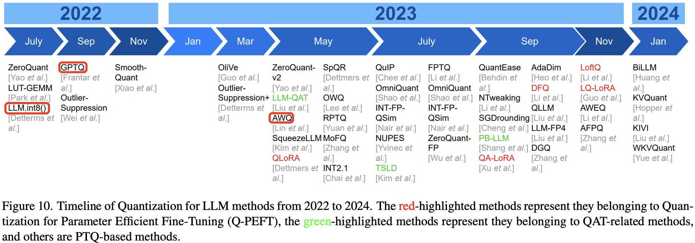
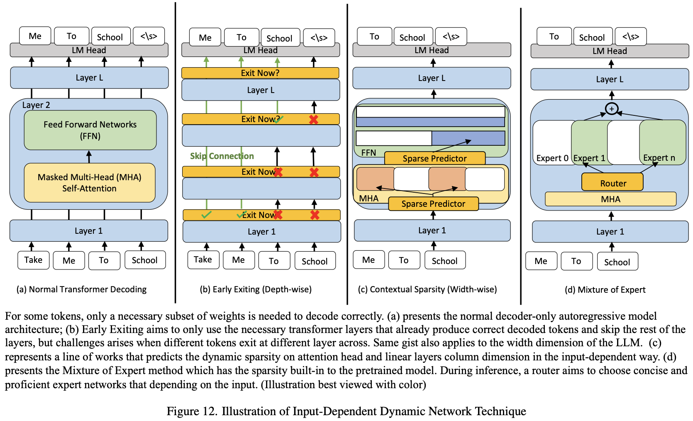
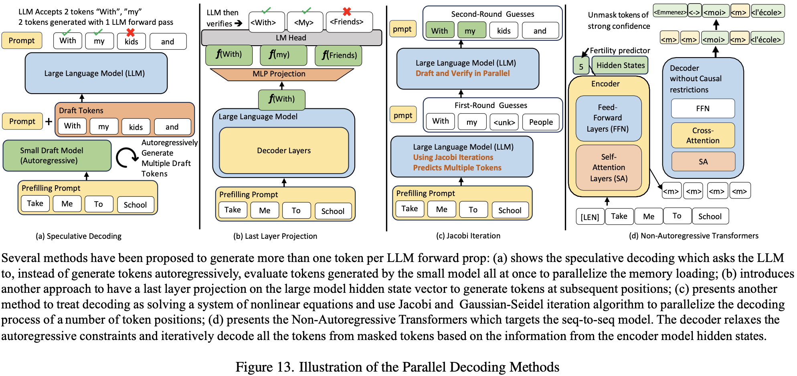

- [摘要](#摘要)
- [介绍](#介绍)
- [2. 深入研究 LLM 推理和部署](#2-深入研究-llm-推理和部署)
  - [2.1 LLM 推理](#21-llm-推理)
  - [2.2. Roofline 模型](#22-roofline-模型)
- [3. 模型压缩](#3-模型压缩)
  - [3.1. 量化](#31-量化)
    - [3.1.1 LLM-Viewer 的应用案例：量化的 Roofline 分析](#311-llm-viewer-的应用案例量化的-roofline-分析)
    - [3.1.2 量化用于压缩预训练 LLMs](#312-量化用于压缩预训练-llms)
      - [量化感知训练（`QAT`）](#量化感知训练qat)
      - [训练后量化（PTQ）](#训练后量化ptq)
    - [3.1.3 参数高效微调的量化（Q-PEFT）](#313-参数高效微调的量化q-peft)
    - [3.1.4 关于 LLM 量化的讨论](#314-关于-llm-量化的讨论)
- [4. 快速解码的算法方法](#4-快速解码的算法方法)
  - [4.1 每个词元解码时使用最少的参数](#41-每个词元解码时使用最少的参数)
    - [4.1.1 提前退出](#411-提前退出)
    - [4.1.2 上下文稀疏性](#412-上下文稀疏性)
    - [4.1.3 专家混合模型](#413-专家混合模型)
    - [4.1.4 动态参数的 Roofline 模型分析](#414-动态参数的-roofline-模型分析)
  - [4.2 最大解码令牌数每次 LLM 前向传播](#42-最大解码令牌数每次-llm-前向传播)
    - [4.2.1 推测解码](#421-推测解码)
    - [4.2.2 并行解码](#422-并行解码)
- [5. 编译器/系统优化](#5-编译器系统优化)
  - [5.1. 算子融合](#51-算子融合)
  - [5.2. 内存管理与工作负载卸载](#52-内存管理与工作负载卸载)
  - [5.3. 并行服务](#53-并行服务)
- [6. 硬件优化](#6-硬件优化)
  - [6.1. 空间架构](#61-空间架构)
- [8. 结论](#8-结论)

## 摘要

在大型语言模型 (LLM) 高效推理领域，尽管其发展迅速且充满活力，但目前尚缺乏一个简洁的框架来**分析各种 `LLM` 推理方法**，从而清晰地理解这一领域。我们的综述区别于传统的文献回顾，不仅总结了现有研究的现状，还基于 `Roofline` 模型提出了一个用于系统分析 `LLM` 推理技术的框架。该框架能够识别在硬件设备上部署 LLM 时的瓶颈，并为诸如为什么 LLM 受到内存限制、它们需要多少内存和计算资源，以及如何选择合适的硬件等实际问题提供清晰的理解。

我们系统地整理了高效 LLM 推理领域的最新进展，涵盖了**模型压缩**（例如量化）、**算法改进**（例如推测解码）、以及**系统**和**硬件层面的增强**（例如操作融合）等关键领域。与其他综述不同，我们通过 Roofline 模型分析这些方法，揭示它们在内存和计算方面的性能影响。这种独特的视角不仅展示了当前的研究现状，还为实际应用提供了深刻的见解，因此我们这项工作对新入门者和希望深入了解高效 LLM 部署的研究人员都极具参考价值。此外，我们还开源了用于分析的工具 LLM-Viewer。

## 介绍

近年来，大型语言模型 (LLMs) 已成为人工智能进步的基石，重新定义了机器学习和自然语言处理 (NLP) 的格局 [Zhao et al., 2023]。这一趋势可以追溯到革命性模型 ChatGPT [Brown et al., 2020, Ouyang et al., 2022] 的成功，该模型通过其卓越的理解和生成能力产生了非常接近人类的文本。在 ChatGPT 之后，其他著名的 LLM，如 OPT [Zhang et al., 2022]、BLOOM [Scao et al., 2022] 和 Llama [Touvron et al., 2023a,b] 相继问世，进一步巩固了更大规模模型通常会带来更强大能力的共识。因此，拥有数百亿参数的模型正变得越来越普遍。由于这些模型的庞大规模，它们在推理时不仅对计算能力有限的设备提出了巨大挑战，对最先进的硬件设备也是如此。由于其复杂性和规模，以及它们对能源和计算的需求，这些模型在实际应用中难以部署。此外，这些模型的高资源需求引发了关于能源消耗、可扩展性和可访问性的担忧。对计算资源不如大公司丰富的小型组织和社区来说，这种情况尤其困难。因此，这些挑战突显了开发创新解决方案以使 LLM 推理更加普及和可持续的必要性。

为了解决 LLM 部署中的问题，已经有许多方法被提出。高效 LLM 推理这一领域在过去两年中发展迅猛，既带来了机遇也伴随着挑战。虽然研究数量的激增展示了该领域的活力，但也无意中掩盖了主要趋势和减缓进展。现有文献中的一个重要空白是**缺乏一个系统化且实用的框架，用于统一分析和制定全面解决方案**。为了填补这一空缺，我们的工作提供了一份详尽的 LLM 高效推理研究概览，并特别关注其实践导向的特性。**不同于传统的文献综述，我们不仅总结了现有研究，还引入了一个基于 Roofline 模型的框架，用于分析 LLM 部署中的瓶颈**。我们认为这是实现优化和实际应用的重要一步，如图 1 所示。这也是目前首个针对 LLM 在硬件设备上推理复杂性进行分析的工具，系统汇总了高效 LLM 推理领域的最新成果。

我们深入探讨了部署中的挑战，尤其是在推理效率方面。我们的讨论涉及多个领域，包括模型压缩、解码算法改进、系统和硬件层面的优化，如图 2 所示。尽管该领域也有相关的综述，如 [Zhuet al., 2023] 关于 LLM 压缩的研究，以及 [Miao et al., 2023a]、[Ding et al., 2023] 和 [Wang et al., 2024a] 关于 LLM 服务的研究，但我们的工作通过引入 Roofline 模型分析，展现了独特的价值。

> 高效 LLM 推理调查的思维导图。我们的综述与传统综述不同，重点关注 LLM 推理的实际应用。我们识别并分析了 LLM 推理过程中遇到的挑战，并引入了一种专门开发的 Roofline 模型，旨在找到推理过程中的瓶颈（第 2 节）。本综述将提升 LLM 推理效率的策略划分为四个核心方向：参数压缩（第 3 节）、快速解码算法设计（第 4 节）、系统层优化（第 5 节）以及硬件层优化（第 6 节），提供了一个系统的框架，帮助解决高效 LLM 部署的复杂问题。

本文首先介绍了 LLM 的基础，并开发了名为 `LLM-Viewer` 的工具，该工具**基于 Roofline 模型分析 LLM 部署的瓶颈**（第 2 节）。LLM-Viewer 可以用于分析任何 LLM 架构在各种硬件平台上的部署情况，如图 1 所示。在文献回顾中，本综述将 LLM 推理效率提升策略划分为四大领域：**模型压缩**（第 3 节）、**快速解码的算法方法**（第 4 节）、**系统级/编译器优化**（第 5 节）以及**硬件优化**（第 6 节）。

## 2. 深入研究 LLM 推理和部署

### 2.1 LLM 推理

现在，大多数大型语言模型（LLM）都采用 Transformer 解码器架构。本文只提供基本结构的简要概述，更详细内容可参考 [Zhao et al. [2023]](https://arxiv.org/pdf/2303.18223) 这篇综述。该结构由**一个嵌入层**、**一系列连续的 Transformer 层**和**一个预测头**组成。图 3 展示了这一架构。

**Embedding 层将输入 token 序列（整数序列）转化为 embedding 向量/张量（大小为 $d$ 的向量）**，Embedding 向量/张量 被传递给 Transformer 层。每个 Transformer 层包含两个组件：首先是一个被称为 `MHA` 的掩码多头注意力模块，紧接着是一个被称为 `MLP` 的多层感知器子模块。最后一个 Transformer 层的输出被传递到**预测头（线性层 + softmax 层）**，负责在输入 token 之后预测下一个 token 。

推理是与训练过程相反的过程。在训练期间，模型通过庞大的数据集学习，捕捉语言和上下文的复杂性，模型的权重会被更新。而在推理阶段，用户输入一个提示词（`prompt`），模型根据预训练时学习到的固定权重进行理解，并**迭代式输出生成文本**。LLM 的推理过程主要分为两个阶段：**预填充阶段和解码阶段**。

预填充阶段是 LLM 推理的初始步骤。在此阶段，模型将提示序列作为输入，并为 LLM 的每一层 Transformer 生成键值缓存（KV 缓存）。KV 缓存在存储和组织模型认为对后续生成 token 重要的信息方面起着至关重要的作用。**每个 Transformer 层都有其独特的 KV 缓存**，预填充过程为随后的解码阶段奠定了基础。

**在预填充阶段，多头注意力（`MHA`）模块生成 `KV` 键值对并存储在 KV 缓存中**。设输入到 Transformer 层的输入为 $X_{pre}\in R^{n\times d}$，其中 $d$ 是隐藏维度，$n$ 是提示 token 序列的长度。`MHA` 模块的 $4$ 个线性层权重用 $W_q$，$W_k$，$W_v$ 和 $W_o$ 表示。查询、键和值（Q、K、V）的计算过程如下：

$$\text{Query}: Q_{pre}=X_{pre} * W_{q} \\
\text{Key}: K_{pre}=X_{pre} * W_{k} \\
\text{Value}: V_{pre}=X_{pre} * W_{v}$$

生成的 $K_{pre}$ 和 $V_{pre}$ 被存储在 KV 缓存中。其余的 `MHA` 计算如下：

$$O_{pre }=\text{softmax}(\frac{Q_{pre } * K_{pre }^{T}}{\sqrt{d}}) * V_{pre } * W_{o}+X_{pre }$$

MHA 的输出 $O_{pre }\in R^{n\times d}$ 将传递到 MLP。MLP 的输出作为下一层 Transformer 层的输入。

解码阶段是 LLM 推理的关键部分。在这一阶段，模型使用预填充阶段生成的 **KV 缓存**，同时逐步添加新信息。目标是**逐步生成新的 token**，每个新 token 的生成都会参考之前生成的 token ，从而逐字逐句地完成文本输出。

**在解码阶段**，MHA 加载先前存储的 KV 缓存 $K_{cache}$ 和 $V_{cache}$。输入为 $X_{dec}\in R^{1\times d}$。新的键值对被计算并连接到现有缓存：

$$\text{Query}: Q_{dec}=X_{dec}*W_{q} \\
\text{Key}: K_{cat }=[K_{cache }, X_{dec } * W_{k}] \\
\text{Value}: V_{cat }=[V_{cache }, X_{dec } * W_{v}]$$

这些新计算的 $X_{dec}\cdot W_{k}$ 和 $X_{dec}\cdot W_{v}$ 然后被附加到 $KV$ 缓存。MHA 中的其他计算如下进行：

$$O_{dec}=\text{softmax}(\frac{Q_{dec}\cdot K_{cat}^{T}}{\sqrt{d}}) * V_{cat } * W_{o}+X_{dec}$$

其中 MHA 的输出 $O_{dec}\in R^{1\times d}$ 被传递到 MLP。最后一个 Transformer 层的输出被发送到最终的预测层，以预测下一个 token 。

### 2.2. Roofline 模型

**评估大型语言模型（LLM）在特定硬件上的部署效率需要全面考虑硬件和模型的特性**。为此，我们采用 `Roofline` 模型。Roofline 模型是一个有效的理论框架，用于评估模型在特定硬件上的潜在性能。

如图 4 所示，神经网络层在硬件设备上的执行涉及将数据从内存（DDR 或 HBM）传输到片上缓冲区，随后由片上处理单元执行计算，最终将结果输出回内存。因此，**评估性能需要同时考虑内存访问和处理单元的能力**。如果某一层涉及大量计算但很少的内存访问，我们称之为计算瓶颈。在这种情况下，内存访问处于空闲状态。相反，当某一层需要大量内存访问但计算需求较少时，则称为内存瓶颈。这种情况下，计算单元未被充分利用。我们可以通过 Roofline 模型清晰地区分这两种情况，并为不同情况提供性能上限。

使用 Roofline 模型有两个步骤：

1. **绘制 Roofline 图**：确定目标硬件设备的**峰值计算性能**（每秒操作数，OPS）和**峰值内存带宽**（每秒字节数）。然后创建一个图表，其中 y 轴为性能（OPS），x 轴为算术强度（OPs/byte）。绘制一条等于硬件设备峰值计算性能的水平线，这条线代表设备的最大可达性能。同时从原点绘制一条**斜率等于峰值内存带宽**的斜线，这条线代表系统可用的最大内存带宽，称为内存 Roofline。图 5 展示了 Nvidia A6000 GPU 的 Roofline 模型。

2. **分析各层性能**：通过量化**每层的操作数**（OPs）和从**内存访问的数据量**（字节数）来评估模型各层的性能。通过将所需操作数除以传输的数据量来计算每层的算术强度（OPs/byte）。根据第一步创建的图表，确定每层在算术强度对应的 x 轴位置上的理论最大性能。这使我们能够判断系统在此点是内存受限（memory-bound）还是计算受限（compute-bound），从而指导后续优化策略的制定。

资源未充分利用的情况有两种：

1. **内存受限（memory-bound）**：当模型的计算强度低于拐点时，处于红色区域，意味着每次内存访问所需的计算量较低。即使达到了峰值内存带宽，计算资源也无法得到充分利用。在这种情况下，该层受到**内存访问限制（内存瓶颈）**，部分计算单元可能处于闲置状态。针对内存受限的情况，可以考虑以下优化技术来减小内存占用：
	- **量化**（quantization）：通过将模型权重或激活值降低为低位表示（如 8 位或 4 位），减少内存带宽和存储需求，从而提高内存访问效率。
	- **内核融合**（kernel fusion）：将多个独立的计算内核操作合并为一个，以减少内存的读写次数，并降低总的内存访问需求。
	- **增大批处理大小**（increasing batch size）：通过增大一次性处理的输入数据量，增加计算密度，从而更有效地利用内存和计算资源。
2. **计算受限（compute-bound）**：当模型的计算强度高于拐点，位于绿色区域时，表明模型仅需少量的内存访问即可消耗大量的计算能力。这意味着该层受到计算限制，部分内存资源可能未被充分利用。在这种情况下，可以通过以下方法提高计算效率：
	- **启用低比特计算单元**（low-bit computation）：使用低位的表示形式（如 4 位或 8 位）进行计算，以减少处理单元的计算负担，提升计算效率。（后续章节将对这些方法进行详细解释）

举个例子，表 1 展示了使用 Roofline 模型在 Nvidia A6000 GPU 上分析 Llama-2-7b 各层的结果。我们观察到，在预填充阶段，大多数计算是计算瓶颈，导致性能较高。相反，在解码阶段，所有计算都受到内存瓶颈限制，导致性能显著低于 GPU 计算单元的计算能力。在用户与大型模型交互时，预填充阶段只执行一次，而解码阶段则需要反复执行以生成连续输出。因此，**优化解码阶段的内存受限特性对于提升大型模型的推理性能至关重要**。

在大型语言模型（LLM）中，存在多个 Transformer 层，每层执行不同的操作，并且不同的 LLM 使用不同的操作组合。此外，我们还需要跟踪如内存使用等信息，以计算**最高内存消耗和总推理时间**。因此，分析 LLM 需要考虑整个网络的多个因素。为此，我们提出了一款强大的工具—`LLM-Viewer`，用于进行全网络的分析。它可以**帮助评估 LLM 在不同硬件平台上的表现和效率**，从而提供有关推理过程和性能优化的宝贵见解。

LLM-Viewer 的工作流程如图 1 所示，主要包括以下几个步骤：

（1）输入 LLM 并收集每层的基本信息，例如计算次数、输入和输出张量的形状，以及数据依赖关系。
（2）提供硬件信息，生成考虑计算能力和内存带宽的 Roofline 模型。
（3）配置推理设置，如批量大小、提示令牌长度和生成令牌长度。
（4）配置优化设置，例如量化位宽、FlashAttention 的使用、解码方法和其他系统优化技术。（5）LLMViewer 分析器利用 Roofline 模型和层信息来评估每层的性能，同时跟踪每层的内存使用，并根据数据依赖关系计算峰值内存消耗。通过汇总所有层的结果，可以得到 LLM 的整体性能表现。
（6）生成报告，展示每层和整个网络的最大性能及瓶颈，并提供内存使用情况。报告中还可以绘制性能曲线，如批量大小与性能关系图和序列长度与性能关系图，以帮助理解不同设置对性能的影响。
（7）LLM-Viewer 提供了一个 Web 查看器，方便可视化网络架构和分析结果，使配置调整更加便捷，并提供对每层各种数据的访问。

## 3. 模型压缩

LLMs 由于其庞大的规模和内存、计算需求，在实际部署中，尤其是在资源有限的环境下，面临着显著的挑战。**压缩 LLM** 是解决这些挑战的直接办法。在本节中，我们将探讨 LLM 的神经网络压缩技术，包括**量化、剪枝、知识蒸馏和低秩分解**等成熟方法。每个小节中，我们都会使用 LLM-Viewer 来分析网络压缩对 LLM 推理性能的影响，并根据分析结果提供优化建议。

### 3.1. 量化

在 LLM 压缩领域，量化已经成为减轻这些模型存储和计算开销的关键技术。**量化主要是将原始 LLM 中的浮点值转换为整数或其他离散形式，其可以显著降低存储需求和计算复杂度 [Gholami et al., 2022]**。虽然这一过程中不可避免地会有一些精度损失，但通过精心设计的量化方法，可以在对模型准确性影响很小的情况下实现显著的压缩。针对 LLM 的量化主要有两个方向：**压缩预训练 LLM 的量化**和**参数高效微调（QPEFT）的量化**。

对预训练的 `LLM` 进行量化，方便使用量化后的模型，这一类又可以细分为：
- 量化感知训练（`QAT`）: QAT 是将量化集成到模型的训练过程或预训练模型的微调过程中，从而使模型从一开始就适应量化。
- 训练后量化（`PTQ`）: PTQ 是在模型完成训练后进行量化，这种方法更为直接，无需重新训练即可实现模型压缩。

#### 3.1.1 LLM-Viewer 的应用案例：量化的 Roofline 分析

下面我们展示了如何使用 LLM-Viewer（第 2.3 节）来分析 LLM 部署中的瓶颈。在 LLM 中，**张量包括权重和激活，激活包括临时激活和 KV 缓存**。
（1）LLM 的权重必须存在内存中存储。例如，Llama-13b [Touvron et al., 2023a] 拥有 130 亿个权重，在 `FP16` 格式下占用约 26GB 的内存。
（2）在推理过程中，会生成临时激活。例如，每个 Transformer 层的输入会一直保存在内存中，直到执行残差加法。
（3）对于自回归 LLM，需要将 KV 键值对（KV 缓存）缓存到内存中，以便生成后续的令牌。

我们将利用 LLM-Viewer 从**计算、内存消耗和内存访问**三个方面来分析量化对这些张量的影响。

**计算**：现代计算设备，如 NVIDIA GPU，通常支持 FP32、FP16 和 INT8 数据类型。**处理较小位宽的数据通常能获得更好的性能**。例如，NVIDIA 的 A6000 GPU 在 FP16 计算时的性能是 FP32 的两倍，分别为 155 TOP/s 和 310 TOP/s。**在 Roofline 模型中，启用量化可以提高计算强度，进而提升计算密集层的性能**。如图 6 所示，使用 INT8 计算时的最大性能有所提升。**但是，要发挥 INT8 的计算优势，所有输入操作数必须为 INT8 格式**。因此，如果仅量化权重为 INT8，而激活仍保持 FP16 格式，INT8 的计算能力是无法得到有效利用的。相反，INT8 权重需要转换为 FP16 才能与 FP16 激活进行乘法。此外，当张量的位宽超出硬件支持范围时，需要转换为更高的位宽进行计算。例如，NVIDIA H100 GPU 不支持 INT4 计算。因此，如果权重或激活被量化为 INT4，则需要转换为更高的位宽，如 INT8 或 FP16，才能进行计算。

**内存消耗**：量化对不同张量的内存消耗减少程度各异，如图 7 所示。特别是，临时激活的内存使用量较低，特别是在解码阶段，这主要因为它们的生命周期较短，一旦用途完成即可释放内存。而 KV 缓存的内存分配则表现不同。KV 缓存不能释放，直到生成完整的答案，这需要多次通过网络进行推理。此外，KV 缓存的内存消耗随着批量大小和输入序列长度的增加而增加，因为模型需要存储更多的关键值（KV）对以支持操作。

**内存访问**：量化张量可以显著减少内存访问量，从而减少相同计算量所需移动的数据字节数。这种计算强度的提升对 Roofline 模型有贡献，导致三种情况：
* **计算强度仍在内存绑定范围内**。随着计算强度的提高，每次计算的平均数据访问量减少，减轻了对数据内存访问的压力，因此理论性能得到提升。这在内存绑定的解码阶段可以显著提升性能。
* **计算强度从内存绑定转变为计算绑定**。这种转变也减少了对数据内存访问的压力，提升了理论性能。
* **计算强度在量化前后始终保持计算绑定状态**。在这种情况下，性能没有提升。例如，这种情况可能发生在计算绑定的填充阶段或解码阶段批量大小较大时。

如图 8 所示，**当批量大小较小时，网络中的层在量化前后都处于内存绑定状态，因此量化可以提升性能并减少网络推理时间**。然而，当批量大小较大时，将网络权重从 4 位压缩到 2 位或 1 位并不会减少推理时间，因为此时网络已经处于计算绑定状态，量化权重变得无效。

如图 9 所示，**类似地，在填充阶段，当序列长度较小时，填充阶段处于内存绑定状态，这时应用量化可以通过减少内存访问需求来提升性能**。但随着序列长度增加，填充阶段变得更加计算绑定，因此当网络在填充阶段已经是计算绑定状态时，量化权重可能不会显著提高性能。

#### 3.1.2 量化用于压缩预训练 LLMs

##### 量化感知训练（`QAT`）

在量化感知训练（`QAT`）[Choi et al., 2018；Courbariaux et al., 2015；Dong et al., 2019]中，量化过程被无缝地集成到大型语言模型（LLMs）的训练中，使这些模型能够适应低精度表示，从而减轻了精度损失。`LLM-QAT` [Liu et al., 2023b] 创新性地解决了 `LLMs` 训练数据获取的问题，直接**利用预训练模型的输出**来消除大量数据收集的需要。此外，LLM-QAT 将量化范围扩展到包括关键值（KV）缓存在内的更多内容，从而提升了处理速度并支持更长的序列依赖。它成功地将大型 Llama 模型蒸馏为**4位量化的权重和KV 缓存**，显示了 4 位量化 LLMs 的准确性潜力。

为了实现更低位的量化，如低于 2 位，Kim et al. [2023b] 提出了用于 LLMs 的三元量化感知训练的新方法—— token 缩放对数蒸馏（`TSLD`）。这种方法利用适应性知识蒸馏技术，根据 token 的置信度调整对数知识蒸馏，为LLM QAT提供了个性化的指导。除此之外，Shang et al. [2024] **关注于重要的权重**，提出了 `PB-LLM` 中的部分二值化矩阵概念。通过在高位保留这些重要权重，PB-LLM 能够有效地保持在高度量化LLMs中的推理能力。此外，PB-LLM 还研究了通过确定最佳缩放因子来最小化量化误差，这是在高量化情况下保持模型有效性的关键步骤。

##### 训练后量化（PTQ）

训练后量化（`PTQ`）是优化大型语言模型（`LLMs`）的一项关键技术。它是**在模型训练结束后对参数进行量化**，旨在减少存储需求和计算负担，而不需要对模型架构做任何改动或重新训练。

这种方法简单高效，特别适合需要大幅度压缩模型的场景。对于通常包含数十亿参数的 LLMs 来说，量化感知训练（QAT）的训练成本过高，PTQ 因此成为一种更实际的替代方案。不过，量化过程可能带来一定程度的精度下降，但 PTQ 提供了一种无需重大修改或重新训练的简洁解决方案，能显著提高 LLMs 的效率。

**`PTQ` 的多种方案集中在仅对权重进行量化上**，以提升效率。例如:
1. `LUTGEMM` [Park et al., 2023] 通过权重量化和 `BCQ` 格式优化 `LLM` 中的矩阵运算，**降低了延迟并提升了计算效率**。LLM.int8() [Dettmers et al., 2022] 采用 8 位量化，将推理时的 GPU 内存占用减半，同时通过向量量化和混合精度保持精度，实现了在最大 1750 亿参数模型中的高效推理。
3. `GPTQ` [Frantar et al., 2022] 则使用基于二阶信息的逐层量化，成功将每个权重量化至 3-4 位，几乎没有精度损失。
4. Dettmers 和 Zettlemoyer [2023] 研究了模型规模与位精度的平衡，尤其在零样本推理中，发现 4 位精度是最佳选择。
5. `AWQ` [Kim et al., 2023c；Lin et al., 2023] 等创新方法表明，保护少量关键权重能显著减少量化误差。`AWQ` 采用激活感知的策略，**专注于激活值较大的权重通道，并通过每通道缩放实现最佳量化效果**。
6. `OWQ` [Lee et al., 2023] 则研究了激活异常如何加剧量化误差，提出一种混合精度方案，为受异常值影响的权重提供更高的精度。
7. `SpQR` [Dettmers et al., 2023b] 采取独特的方式，将异常权重隔离出来并用更高的精度存储，其他权重则压缩至 3-4 位，达到了更加高效的压缩效果，同时性能几乎没有损失。
8. `QuantEase` [Behdin et al., 2023] 提议使用坐标下降算法来优化网络中的权重，提升量化效率。为实现低于 2 位的量化，QuIP [Chee et al., 2023] 提出了一种新方法，考虑了权重大小的均匀分布，并关注那些不与坐标轴对齐方向的舍入精度
9. `QuIP` 包含一个自适应舍入过程，能够优化量化过程，并利用高效的预处理和后处理技术，通过随机正交矩阵的乘法操作确保权重和 Hessian 的不相关性，从而保障量化效果。
10. **“归一化调整”策略**: [Li 等人[2023a]](https://arxiv.org/pdf/2309.02784) 发现，通过**将量化的激活分布与浮点版本对齐，可以显著提高 LLM 的准确性**。“归一化调整”策略通过精确生成校准数据并设定通道的距离约束，来更新归一化层的权重，从而提升模型的泛化能力。
11. `PB-LLM`[Shang et al., 2024]部分二值化 LLM: 将权重量化推进至低于 2 位，基于二值化方法 [Hubara et al., 2016]。
12. `BiLLM`[Huang et al., 2024] : 紧随 `PB-LLM` 之后, 进一步将量化推进至几乎 1 位。

**`PTQ` 方法除了关注 LLM 权重量化，还有许多 PTQ 方法关注权重与激活同时量化**。比如：
1. `ZeroQuant` [Yao et al., 2022] 结合硬件友好的量化方法与逐层知识蒸馏，将权重和激活量化为 INT8，且几乎不损失精度。
2. `SmoothQuant` [Xiao et al., 2023a] 针对激活量化中的异常值问题，提出了一种逐通道缩放的方法，平滑激活幅度，提升模型对量化的适应能力。
3. `RPTQ` [Yuan et al., 2023c] 关注激活量化的复杂性，指出通道范围不均匀和异常值的普遍存在问题。RPTQ 通过将通道进行聚类量化，减少通道范围差异，并将通道重排序与层归一化和线性层权重结合，最大限度降低开销。
4. `OVP` 异常值-受害者配对量化策略，由 OliVe [Guo et al., 2023a] 提出，其专注于局部处理异常值，在硬件开销较低的情况下带来显著的性能提升。该策略基于异常值的重要性，而忽略了相邻的普通数值。进一步的研究，如 Outlier Suppression+，则解决了某些通道中不对称分布的异常值问题，通过逐通道的移位和缩放操作，均衡异常值的分布，减少问题通道对量化误差的影响。
5. `ZeroQuant-FP` [Wu et al., 2023d] 探讨了**浮点量化**，特别是 FP8 和 FP4 格式的应用，研究表明 FP8 激活量化在 LLMs 中优于传统的 INT8 格式，而 FP4 权重量化则表现得与 INT4 类似。ZeroQuant-FP 通过将缩放因子统一为 2 的幂，并将其限制在同一个计算组内，确保了权重和激活的一致性和量化过程的高效性。
6. `FPTQ` 采用了分层方法来应对不同层的量化难度，由 Li 等人 [2023c] 提出，特别是通过离线的对数激活均衡策略，成功处理了以往难以量化的层。

自 2023 年底以来，token 的长度快速增长，KV 缓存因此占用了更多的内存。例如，Google Gemini 1.5 [Sundar Pichai, 2024] 能够在生产环境中处理多达 100 万个 token，而处理书籍、图像或视频的 LLMs 通常需要数万个 token。因此，**KV 缓存量化的优化变得至关重要**。2024 年的一些最新研究专注于这一问题，例如，Hooper 等人 [2024] 提出了一种实现 1000 万上下文长度 LLM 推理的 KV 缓存量化方案。KIVI [Liu et al., 2024b] 将 KV 缓存量化压缩至 2 位。Yue 等人 [2024] 的 `WKVQuant` 通过联合优化权重和 KV 缓存量化，使得 `W4KV4` 的表现与 `W4` 相同。

如图 11 所示，通过使用 LLM-Viewer，我们分析了 KV 缓存量化对内存占用的影响，**结果显示当序列长度超过 `50k` 时，KV 缓存占用了大部分内存，而量化处理能够显著降低内存消耗。**

#### 3.1.3 参数高效微调的量化（Q-PEFT）

参数高效微调（`PEFT`）是大型语言模型（`LLMs`）领域的重要话题。其中最受欢迎的方法之一是**低秩适应**（`LoRA`）[Hu et al., 2021, Valipour et al., 2022]，其关键思想是将适配器权重分解为两个低秩（因此是参数高效的）矩阵的乘积。LoRA 声称在使用更少可学习参数的情况下，能够与完整微调相媲美。更多关于此适配器的详细信息，请参考综述文章 [Hu et al., 2023]。

除了已有的量化范式外，LLM 效率领域正在兴起一种新的范式：参数高效微调的量化（`Q-PEFT`）。这种方法将量化整合到 LLM 的微调过程中，提供了一种独特而高效的方式，尤其在大模型时代尤为相关。诸如 `PEQA` [Kim et al., 2023a]、DFT [Li et al., 2023e] 和 `QLORA` [Dettmers et al., 2023a] 等开创性工作展示了这种方法的可行性和有效性。
1. `PEQA` 采用了双阶段流程，第一阶段是将每个全连接层的参数矩阵量化为低位整数矩阵，并配以标量向量；第二阶段则专注于为特定下游任务微调标量向量，使得任务特定的调整更加高效。DFT 采用高效的 Lion 优化器，该优化器仅跟踪动量，并为每个参数提供一致的更新幅度，这对稳健的量化有着天然优势；此外，它将所有模型状态量化并以整数值存储，提出了一种针对量化权重的梯度流和参数更新方案。
2. `QLORA` 引入了新的数据类型、双重量化和分页优化器等概念。这些创新旨在有效节省内存，同时保持 LLM 微调的性能。尤其值得注意的是，QLORA 使得在单个 GPU 上进行大模型的微调成为可能，并在 Vicuna 基准测试上取得了最先进的结果，展示了其在平衡内存效率和模型性能方面的有效性。但是，QLoRA 在微调过程中最多只能进行 4 位量化；对于更低位的量化（如 2 位），性能可能会显著下降。
3. `LQ-LoRA` [Guo et al., 2023b] 引入了一种迭代算法，将每个预训练矩阵分解为一个高精度低秩分量和一个高效量化分量。在微调过程中，仅更新低秩分量，而保持量化分量不变。该方法采用了整数线性规划的方法来处理量化分量，允许在给定的内存预算内动态配置量化参数，如位宽和块大小。
4. `Loft-Q` [Li et al., 2023d]: 量化 LLM 的同时为 LoRA 微调建立了一个合适的低秩初始化策略。该策略有效地弥合了量化模型与全精度模型之间的差距，显著提高了下游任务的泛化能力。
5. `QA-LoRA` [Xu et al., 2023c]: 利用了将 LLM 权重量化为低位整数的优势，促进了高效的微调过程。此外，它还生成了轻量化、微调后的模型，避免了通常与后训练量化（PTQ）相关的精度损失。

#### 3.1.4 关于 LLM 量化的讨论

图 10 展示了 LLM 量化技术的发展时间轴，重点突出了从后训练量化（PTQ）作为最初的主流方法，逐渐演变为量化感知训练（QAT）和参数高效微调的量化（Q-PEFT）。这种转变反映了研究社区为应对 PTQ 性能瓶颈而作出的调整，标志着 QAT 和 Q-PEFT 成为在追求高效 LLM 推理过程中日益受到关注的领域。

## 4. 快速解码的算法方法

大规模语言模型（ LLMs ）在各种文本生成任务中取得了惊人的表现。它们通常包含解码阶段，通过与之前所有生成的词元进行自回归关系，一个接一个地生成词元。在每个词元解码过程中，解码器的权重必须反复加载到内存中。**随着 LLM 的参数规模变得庞大，解码过程主要瓶颈是内存带宽[de Jong et al., 2023](https://arxiv.org/pdf/2212.08153)，硬件的利用率很低，导致延迟严重[Kim et al., 2023d](https://arxiv.org/pdf/2302.14017)**。这在诸如 ChatBot 这样的实际应用中尤其成问题，因为这些应用需要快速甚至是实时的响应。因此，迫切需要优化解码过程，以提高此类应用的性能。

本节集中讨论了从算法角度减少 LLM 推理成本的先前努力。具体而言，本节旨在从两个方向展开讨论：

- 在第 4.1 节中，**对于每个解码的词元（固定的解码词元数），如何利用 LLM 的最少参数**。
- 在第 4.2 节中，**对于每次 LLM 的前向传播（固定的使用参数数），如何解码最多的词元**。

### 4.1 每个词元解码时使用最少的参数

Simoulin 和 Crabbe[2021] 的研究表明，尽管语言模型的参数量庞大，但**生成准确词元并不需要使用所有参数**。通过动态选择并加载必要的参数子集，可以减少 LLM 推理的延迟，同时保持解码词元的准确性。本节将从三个角度探讨 LLM 的输入依赖型动态权重丢弃方法：
- 4.1.1 讨论提前退出机制，在层、深度和维度上动态选择权重；
- 4.1.2 介绍在宽度维度上检测稀疏性的方法，剪除多余的头部和 MLP 列；
- 4.1.3 介绍专家混合模型（`MoE`），它通过预训练生成稀疏模型，并在推理时为不同输入选择合适的专家。

#### 4.1.1 提前退出

提前退出（或跳过层）的概念已经在许多网络架构中得到了广泛研究，尤其是仅编码器的模型 [Baier-Reinio 和 Sterck, 2020，Hou 等, 2020，Li 等, 2021，Liu 等, 2020, 2022，Schuster 等, 2021，Schwartz 等, 2020，Stickland 和 Murray, 2019，Xin 等, 2020，Zhou 等, 2020，Zhu, 2021]。解码器架构中的提前退出与仅编码器的提前退出不同，要求每个词元都依赖于之前的词元，因此需要在序列级别保持一致性和质量。解码器由多个结构相同的层组成，利用这一特性，每层的隐藏状态可以传递给 LM Head ，用于预测下一个词元的概率分布。Geva 等人 [2022] 和 Simoulin 和 Crabbe´ [2021] 观察到，某些词元在中间层时隐藏状态就已经趋于稳定，也就是说，对于这些词元，中途退出和完整模型运行的预测结果是相同的。这一发现为解码器提前退出方法的有效性提供了依据。

Elbayad 等人[2020] 率先提出在机器翻译任务中使用提前退出的方法。它提出了一种通用的处理流程，如图 12（b）所示，在前向传播的每一层之后，有一个置信度函数（通常是固定指标或一个小型 MLP ），用于根据隐藏状态计算当前层的饱和可能性。该置信度分数用于判断是否可以依据设计好的标准退出模型。随后， LM Head 将输出下一个词元的预测概率分布。由于后续工作的设计有很大的相似性，我们通过进一步讨论语言模型中的提前退出方案设计的挑战，并引入了各种创新技术。

**饱和度置信度的建模**。CALM [Schuster et al., 2022] 探讨了三种计算退出置信度得分的方法：softmax 响应（即 softmax 后前两项的差值）；隐藏状态的饱和度（通过计算当前层和最后一层隐藏状态之间的余弦相似度）；以及每层插入的线性分类器的输出。该线性分类器通过交叉熵损失进行训练，目标是让输入隐藏状态时的 MLP 输出与当前层退出时解码的 top-1 词元与完整模型解码的 top-1 词元一致。实验表明，虽然分类器方法并不是最精准的预测工具，但它在 FLOPs 开销和得分生成准确性之间找到了最佳平衡。[Bae et al., 2023] 基于 CALM 的研究进一步指出，总是从浅层退出可能导致异常长的序列生成。此外，每层计算置信度分数的开销较大，抵消了提前退出的性能优势。因此，该方法提出了两个退出选择：一是从“浅模块”或一组浅层退出，二是运行完整模型“深模块”，大幅减少了模型中需要的分类器数量。这种设计比 CALM 提供了更高的加速效果，在某些任务中达到了 2 倍速度提升。另一边，ConsistentEE [Zeng 等人, 2023] 提出了一种不同的退出预测方法，使用强化学习（RL）策略网络，通过逐层输出分类器头部进行迭代训练。该策略网络的目标是平衡效率（早层获得奖励）和准确性（奖励函数中包括提前退出时的 CE 损失项）。

**提前退出标准**。CALM Schuster 等人 [2022] 提出了一种无需分布的校准技术，利用固定序列测试程序（族内错误率程序）来设定适当的退出阈值。该阈值随着序列的推进呈指数下降，以便在后期允许更加激进的退出策略。Bae 等人 [2023] 观察到置信度分布类似于 beta 分布，并使用实时数据通过最大似然估计（MLE）更新 beta 分布模型，从而通过这种概率模型来引导退出决策。Zeng 等人 [2023] 通过让策略网络直接输出退出决定，避免了此问题。

**隐藏状态传播**。跳过的层的隐藏状态会带来技术上的挑战。如图 12（b）所示，“school”词元的退出时间晚于之前的词元。然而，最后一个自注意力层并没有之前提前退出的词元的键值对。为了解决这个问题，Elbayad 等人 [2020] 和 Schuster 等人 [2022] 提出了“隐藏状态传播”技术。例如，“Max”词元在退出层 l1 的隐藏状态会被保存，当后续的“school”词元到达更深的 l2 层时，l1 层的隐藏状态会被复制到 l1 和 l2 之间的所有层，随后基于复制的隐藏状态计算键值对。这种方式实质上是用早期层的隐藏状态来近似深层的隐藏状态。然而，后续研究 [Bae et al., 2023] 和 [Ding et al., 2023] 发现状态传播会导致性能下降。由于 LLM 的推理主要受限于内存加载，计算负担较小，因此这两项研究建议直接实时计算后续的隐藏状态。Chen 等人 [2023b] 提议让完整的大模型与提前退出的推理流并行运行，从而更高效地并行计算缺失的键值缓存。Din 等人 [2023] 进行了一项系统研究，探讨如何在 Transformer 架构中通过线性网络跳跃层，并展示了通过添加线性层，可以在保持低内存和计算成本的同时，有效填补复制和重新计算隐藏状态之间的性能差距。

#### 4.1.2 上下文稀疏性

虽然**早期退出技术侧重于在深度维度上选择参数，但一些技术也致力于利用宽度维度上的动态稀疏性**。Deja Vu [Liu et al., 2023c] 对 LLM 宽度维度的动态稀疏性进行了深入研究。研究表明，上下文稀疏性可以达到 80%，即大多数权重可以被忽略，同时仍能保持模型的原始性能。然而，这些权重是动态的，对于不同的输入词元会有所不同。论文将这个问题描述为近邻搜索问题，即**在给定的隐藏状态下，如何找到最相似的注意力头和 MLP 列**。为了节省计算资源，论文提出**在多头注意力（MHA）和前馈网络（FFN）前面训练一个小型 MLP 网络作为稀疏预测器**，如图 12（c）所示。

通过只使用一部分权重并减少内存 I/O 开销，Deja Vu 实现了 LLM 推理速度提升超过 2 倍。基于 Deja Vu 的研究，PowerInfer [Song et al., 2023] 将上下文稀疏性应用于异构设备（如 CPU 和 GPU）上的 LLM 推理。PowerInfer 发现，在输入无关的设置下，大量权重被频繁使用并激活，因此被存储在 GPU 内存中，而其他权重则存储在 CPU 内存中。为了专门为特定输入词元找到使用的权重，它训练了一个比 Deja Vu 更小的稀疏预测器。为制作稀疏预测器，它初始化了一个动态结构的稀疏预测器，并进行迭代训练和调整。为了在混合 CPU 和 GPU 环境中更好地进行推理，它引入了一种新型的内存分配方案，并实现了基于向量的稀疏计算库。

与此同时，MatFormer [Devvrit et al., 2023] 研究了 LLM 在各种异构设备上的部署问题。他们在 FFN 上添加了动态结构，FFN 占总权重的 60%。模型经过特别训练，以便在推理过程中，根据目标硬件的特性，MLP 层在行维度上进行采样，从而生成具有合理性能的不同大小模型。为了增加模型尺寸的多样性，他们采用了 Mix’n’Match 方法，为不同层选择不同的配置，以此组合出更具变化性的模型尺寸。

#### 4.1.3 专家混合模型

`transformer` 架构的语言模型，在训练数据集规模扩大时表现出强大的幂律缩放效应（Kaplan et al. [2020], Hoffmann et al. [2022]）。但是，大量的参数也使得模型的训练和推理效率变得低下。

**专家混合（MoE）**技术是一种经过深入研究的方法（Yukselet al. [2012]），它**通过将模型参数量与训练和推理所需的计算 FLOPs 解耦**，从而在特定条件下实现显著的效率提升。`MoE` 证明能够有效扩大语言模型的规模，并在不增加推理计算负担的情况下提高其性能（Lepikhin et al.[2020], [Fedus et al.[2021]](https://arxiv.org/pdf/2101.03961)）。如图12（d）所示，专家网络被插入到 `transformer` 架构中，替代了 `FFN` 层。同时，在多头注意力和专家网络之间引入了一个门控函数，用于选择最适合当前输入词元的专家。有关 MoE 的扩展通用性、路由算法、训练技术等的详细分析，请参考稀疏专家模型的综述（[Fedus et al. [2022]](https://arxiv.org/pdf/2209.01667)）。

**尽管 MoE 和上下文稀疏性技术都依赖于输入词元来确定稀疏结构**，但我们有意将它们分开讨论。上下文稀疏性技术操作于预训练的稠密语言模型，并利用稠密神经网络中的稀疏性，而 **MoE 从一开始就训练一个稀疏模型**。最近，MoE 技术取得了显著成功。例如，Sparse Mixer（Lee-Thorp 和 Ainslie [2022]）为 BERT（Devlin et al. [2019]）模型在训练和推理中带来了 89% 和 98% 的速度提升。Du et al. [2022] 使用了仅 49% 的 FLOPs，却在性能上超越了 GPT-3（Brown et al. [2020]）。ST-MoE（Zoph et al. [2022]）将 MoE 引入编码器-解码器模型中，成为许多推理和生成任务的最先进模型。ST-MoE 在训练和推理中使用了 20 倍和 40 倍更少的 FLOPs，在性能上超越了 540B PaLM（Chowdhery et al. [2022]）。Mixtral-8x7B（Jiang et al. [2024]）在推理时仅活跃使用了 13B 参数，但在各种评估基准中表现与 Llama2-70B 模型（Touvron et al. [2023b]）相当。

此外，为优化 MoE 模型推理，各种尝试也在进行中。Kossmann et al. [2022] 为 MoE 模型构建了一个高效的编译器库 RECOMPILE，实现了根据不同推理批量大小进行动态重新编译和优化。Rajbhandari et al. [2022] 将 ZeRO 分布式推理方法扩展到了 MoE 模型。Jawahar et al. [2023] 对专家网络架构进行了神经架构搜索（NAS）。Yi et al. [2023] 在边缘设备上部署了大型 MoE 语言模型，并针对发现 MoE 模型中的某些神经元比其他神经元使用更多的情况优化了部署。

#### 4.1.4 动态参数的 Roofline 模型分析

减少每个解码词元所需的最小参数的方法同时减少了计算和内存访问的开销。从 Roofline 模型的角度来看，这些方法对每个操作的算术强度和类型界限的影响较小。

对于早期退出或层跳过方法，整个 `transformer` 层被跳过，从而使整体计算、内存访问和推理时间成比例减少。换句话说，推理时间会与跳过的层数成正比地减少。

然而，对于上下文稀疏性和专家混合这样的方法，不同操作的算术强度会有所不同。因此，动态选择激活这些层会导致计算和内存访问的减少程度不同，从而对整体推理时间产生不同的影响。

### 4.2 最大解码令牌数每次 LLM 前向传播

另一种降低 LLM 推理延迟的方法是解除 LLM 的自回归解码限制，**使其能够在一次前向传播中解码多个令牌**。我们探索了两种实现方法：一种是使用计算效率高的草稿模型（`draft model`）提出**接下来的数个候选 tokns**，LLM 则用来评估这些候选 `tokens`，而不是直接生成下一个令牌。另一方面，4.2.2 节介绍了一些技术，使得 LLM 能够通过一次前向传播直接解码多个令牌。由于一些方法结合了这两种方向的优点并介于其中, 我们为了命名的清晰性手动添加了一个区分，即这里的推测解码方法都具有基于 `transformer` 架构的草稿模型。

#### 4.2.1 推测解码

由于内存加载的挑战和自回归的特性，LLM 的推理效率较低。然而，有研究（Kim 等人 [2023e]）表明，即使是更小的模型，只要对小模型生成序列中的一些关键令牌进行纠正，它们也能解码出与 LLM 相同的正确序列。如图 13(a) 所示，当小模型被要求推测并生成一系列草稿令牌时，模型权重的内存加载问题较小，从而显著提高了硬件计算单元的利用率。为了保证小模型生成的文本质量，LLM 可以“定期”评估并修正小模型的草稿令牌。尽管大模型有时需要评估错误的草稿令牌，可能导致比 LLM 自回归解码更多的 FLOPs 开销，但由于在令牌维度上并行处理内存加载，内存 IO 开销显著减少。**因为 LLM 推理受限于内存瓶颈，推测解码有可能大幅降低 LLM 的推理延迟**。

**LLM 分布保持**: 

在对这思想的早期探索中，出现了两条不同的路径。Kim 等人[2023e] 提议让小模型推测并生成草稿令牌，直到令牌解码的置信度低于阈值。之后，小模型将“回退”到大模型来评估这些草稿令牌，并将其交给小模型。一些令牌被拒绝，大模型要求小模型“回滚”这些错误的令牌并继续推测。

在研究的设置中，所有解码过程都是“贪婪”的。研究表明，大模型和小模型的组合可以生成与原大模型自回归生成文本质量相当的文本。然而，Leviathan 等人 [2023] 和 Chen 等人 [2023a] 在小模型推测范式上提出了一种重新采样技术，这种技术在 LLM 拒绝小模型预测的位置，能够使大模型和小模型的预测与大模型自回归生成保持一致。接下来的技术通常遵循推测、评估和重新采样的范式，以保持 LLM 自回归解码的质量，同时提高速度。

**建立草稿令牌树**

由于 LLM 按自回归顺序生成令牌，因此每个令牌都依赖于之前生成的所有令牌，而小模型草稿中的接受令牌长度通常较为适中且受限。推测较远未来的令牌会变得指数级更困难。例如，如果小模型被要求生成长度为 $m$ 的草稿序列，而 LLM 只接受了 $n$ 个令牌（其中 $n < m$），则 ($m - n$) 个令牌会被自动丢弃。因此，推测解码的加速效果有限，因为每次 LLM 前向传播只能解码出有限数量的令牌。有两种方法可以提高推测解码的加速效果。首先，Sun 等人 [2023b]、Miao 等人 [2023b] 和 Xu 等人 [2023a] 都提出了通过增加批量大小，或让小模型并行采样多个可能的草稿序列供 LLM 评估来提升加速比率。具体来说：
- Sun 等人 [2023b] 提出了一种方法和理论保障，**使 LLM 可以批量验证和重新采样多个小模型草稿，从而保持 LLM 的分布，并确保生成质量不受影响**。论文首先将推测解码与离散最优传输这一更广泛的问题联系起来。小模型通过 `topk` 采样生成多个草稿序列。根据离散最优传输的特性，找到评估和重新采样的最佳方法就是寻找最优的传输路径。
- 另一方面，Miao 等人 [2023b] 构建的令牌树不是仅基于小模型的 top 预测，而是基于多个经过多样化训练的小模型，每个模型并行运行并生成多样化而有效的草稿序列。他们提出了一种**新颖的草稿令牌树构建算法**，通过预定义的扩展和合并方案，基于这些多样化的草稿序列构建候选令牌的树。然后，大模型使用精心设计的树形注意力机制并行验证构建的树，以最大化关键值缓存的重用，并保持树形因果掩码。
- Xu 等人 [2023a] 创新性地将推测解码的好处应用于边缘设备，构建了一个边缘 LLM 服务引擎。在这个引擎中，较小的草稿 LLM 始终驻留在内存中，而较大的健壮 LLM 则偶尔被加载到内存中进行验证。为了提高大 LLM 的接受率，它还使用 topk 令牌构建了一个树形结构。为适应边缘硬件的特性，它实现了一种树形并行验证解码器，配备了掩码功能和定制的大、小 LLM 计算管道，以避免内存竞争。

**知识蒸馏与自我推测解码**

**另一种提高接受率的方法是通过对小模型进行知识蒸馏，以使其更好地与 LLM 的生成分布对齐**。这可以通过在大模型生成的语料上对小模型进行微调来实现。Zhou 等人 [2023c] 建立了接受率与小模型和 LLM 之间自然发散度的数学关系：最小化发散度即是最大化接受率。论文还探讨了各种知识蒸馏损失，显示知识蒸馏可以带来 10-45% 的延迟加速改进。不过，论文发现不同模型的最佳知识蒸馏损失选择会有所不同，需作为超参数进行调整。Liu 等人 [2023a] 也表明知识蒸馏可以提升小模型训练效果。此外，论文将推测解码引入了云端在线学习环境中。由于 LLM 推理存在内存瓶颈，这意味着计算资源通常过剩。这些计算资源可以用来在服务器上持续训练草稿模型，带来两个好处：
1. 持续的知识蒸馏训练能够提高接受率，从而减少 LLM 推理的延迟；
2. 输入的领域不断变化，而持续训练帮助草稿模型在不同领域中维持强劲性能。Zhang 等人 [2023] 通过从大模型中选择性地抽样出较小的草稿模型，避免了存储独立草稿模型的需要。在部署前，论文利用贝叶斯优化方法在预训练的大模型中跳过中间层，以寻找草稿模型。此外，论文还提出了一种适用于大模型中抽样草稿模型的自适应阈值选择技术。

#### 4.2.2 并行解码

此外，还有许多研究提出了使大模型直接进行并行解码的方案，而无需依赖小型 `transformer` 模型。

**同时预测多个未来令牌**: 很多研究探索了如何通过一次前向传播使大型语言模型能够直接预测多个令牌。

Stern 等人 [2018] 首创性地设计了在最后的隐状态输出与语言建模头输入之间插入线性投影层，以便仅基于当前令牌的最后隐状态来预测多个未来令牌。之后，LLM 会对这些投影的令牌进行评估，以决定是否接受或拒绝这些预测令牌。这项技术主要针对具有解码器结构的序列到序列模型。最近，Cai等人[2024] 将之前的工作扩展到了仅解码器的语言模型，如图 13 (b) 所示。除了最后一层投影外，为了进一步提高解码接受率，论文提出了添加基于树的解码结构及其相关注意力掩码设计，从而同时提出多个草稿供大模型评估。

**通过“前瞻嵌入”进行并行解码**: Monea 等人 [2023] 提出了在输入序列的末尾添加多个虚拟令牌，这些虚拟令牌被称为“前瞻嵌入”。在每层的前向传播过程中，可以使用先前提示令牌和已解码令牌的信息来并行解码几个连续的未来令牌。为实现这一设计，论文训练了一个专门用于这些前瞻嵌入的嵌入层。Li 等人 [2024] 也旨在通过 LLM 评估实现并行解码。与之前的工作类似，它还添加了一个轻量级结构 FeatExtrapolator。不同之处在于，该结构将先前令牌的最后层隐状态和实际解码令牌嵌入作为输入，并输出下一层的隐状态预测。LLM 的头部用于进行多个令牌的采样，这些令牌随后用于构建解码树供 LLM 并行评估。

**检索频繁的 N-grams**: 除了直接使用 LLM 输出多个后续令牌外，还有一些工作利用自然语言中频繁出现的 n-grams，使得在一次前向传播中生成多个未来令牌。LLMA（Yang 等人 [2023]）首先观察到生成任务往往要求 LLM 重复先前上下文中出现的令牌。基于这一信息，论文提出使用解码的令牌和提示进行前缀匹配，利用一组参考文档，这样在出现重复时，可以直接将重复的令牌复制到当前位置。然后，LLM 会评估这些从先前上下文中找到的候选令牌，以决定是否使用它们。He 等人 [2023] 进一步扩展了 LLMA，提出首先基于 LLM 预训练或微调的数据集和语料库构建常用短语的数据库。然后，在解码过程中，将先前的上下文提示或令牌用作查询，以检索构建的数据库。检索到的候选项被组织成前缀树结构或 Trie，LLM 可以高效地对其进行评估。Lan 等人 [2023] 同样使用检索方法加速推理。与之前不同的是，它在 LLM 的末尾添加了一个额外的注意力层，以使用当前令牌的隐状态表示的上下文作为查询，关注从参考文档中检索到的相关短语，并根据注意力得分选择前几个短语。

**语言中的层次结构**: 语言中存在层次结构。在撰写长篇文章时，通常的做法是首先列出文章的总体大纲，例如以项目符号的形式。然后，对于每个项目符号，可以扩展论点以涵盖项目符号的全部意图。基于观察到不同项目符号的论点在语义上相对独立，一些方法提出了并行生成不同项目符号的过程。Skeleton-of-Thoughts（Ning 等人 [2023]）提出首先要求 LLM 为文章生成简洁的项目符号，然后将这些项目符号按批次收集，再次输入 LLM 作为提示，以要求 LLM 并行扩展每个项目符号的论点。实现的加速约为 2 倍，但需注意这种方法无法轻易推广到所有文本生成任务。最近，APAR（Liu 等人 [2024a]）在这一方向上进行了扩展。论文添加了特定的软令牌，明确告知 LLM 层次结构信息，在生成过程中进一步指令调优 LLM，以结合添加的特殊令牌，并利用 Medusa（Cai 等人 [2024]）技术实现了文本生成速度的 4 倍提升。

**Jacobi 和高斯-赛德尔迭代算法**: Song 等人 [2021] 开创性地研究了使用可并行化的方法来近似完全连接网络或卷积神经网络（CNN）的迭代和顺序推理结果。尽管看似不可行，但该论文发现神经网络能够容忍数值近似误差，并且神经网络学习的数据模式在某种程度上暴露了并行结构，这使得在某些情况下能够并行化神经网络的顺序推理。Jacobi 和高斯-赛德尔算法此前被提议用来求解非线性方程组（Ortega 和 Rheinboldt [2000]），并且被证明可以有效地并行化顺序神经网络推理。Santilli 等人 [2023] 扩展了 Jacobi 和高斯-赛德尔算法，以并行化机器翻译任务中的自回归解码。具体而言，这项工作是在之前的非自回归变换器架构（我们将在本章后面介绍）基础上构建的，通过 GS-Jacobi 算法来增强并行解码。并行解码过程在解码文本中找到 [EOS]  token 时停止。同时，Lookahead 解码（Fu 等人 [2023a]）如图 13（c）所示，将此方法扩展到并行化 LLM 后续 token 的生成。除了使用原始的 Jacobi 迭代算法外，它还通过基于检索的算法加速其速度，以重用先前见过的 n-gram。此外，通过在原始 LLM 模型中引入精心设计的注意力掩码，它还并行化了前瞻步骤和 LLM 验证步骤，以进一步提高解码效率。

**非自回归 transformer**。对于需要自回归解码的序列到序列模型的机器翻译任务，提出了非自回归变换器（NAT），如图 13（d）所示，NAT 旨在迭代解码所有输出 token 。NAT 已经得到相对充分的研究（Gu 等人 [2017]，Wang 等人 [2019]，Li 等人 [2019]，Sun 等人 [2019b]，Wei 等人 [2019]，Shao 等人 [2020]，Lee 等人 [2018]，Ghazvininejad 等人 [2019]，Guo 等人 [2020]，Gu 和 Kong [2020]，Savinov 等人 [2021]），我们推荐读者参考以下专门涵盖 NAT 模型的综述论文 Xiao 等人 [2023c]，以获取有关该主题的深入审查和分析。大致来说，文本解码的加速来自于使解码器输出的单次前向传播生成多个 token 。首先将输入序列送入编码器，编码器输出的隐藏状态提取输入语义。

编码器的输出隐藏状态随后用作解码器传递的条件。为了加速文本生成，解码器一方放宽了自回归约束，并以充满虚拟 token  [pad] 的序列作为输入，开始迭代并行解码过程。在每次迭代中，根据编码器输出隐藏状态设置的条件，可以自信地预测一些 token ，这些 token 将被解码。序列与未掩盖的解码 token 混合，并将剩余的掩盖 token 再次输入解码器，直到每个 token 被解码。输入到解码器的序列长度，或称为繁殖度，通常是在编码器内部作为特殊 [CLS]  token 学习的，或者由编码器和解码器之间的专用繁殖度预测器预测。最近，Savinov 等人 [2021] 将解码器视为扩散模型，并训练其根据给定的条件去噪声初始序列。然而，由于要求使用编码器隐藏状态作为并行解码的条件，NAT 方法在直接扩展到仅解码器架构时面临天然的困难。

## 5. 编译器/系统优化

在对大语言模型（LLMs）进行模型压缩和算法优化之后，下一步是将它们编译并部署到硬件设备上。为了确保 LLMs 的高效推理，有多种编译器优化技术可以使用。此外，由于 LLMs 的规模不断扩大，可能需要多个硬件设备进行部署和运行，这形成了一个复杂的推理基础设施系统。因此，系统级优化以实现高效推理已经成为一个重要的研究方向。本节将探讨一些常见的编译器和系统优化技术，包括算子融合、内存管理、工作负载卸载和并行服务。

### 5.1. 算子融合

算子融合是一种重要的编译时优化技术，用于提升深度学习框架的计算效率。它通过将计算图中直接连接的多个算子或层合并在一起，从而减少冗余的数据移动和中间表示。例如，可以将一个线性算子和一个 `SiLU` 算子融合成一个单一的算子。如图 14 所示，这样可以避免在每个算子之间存储和加载中间激活，从而减少内存消耗和内存访问。如图 15 所示，`Roofline` 模型表明，内核融合可以提高算术强度，增强内存受限区域的推理性能。然而，当算子已经处于计算受限区域时，内存融合几乎没有什么好处。

尽管算子融合可以显著提升性能，但并不是所有算子都适用。某些情况下，算子融合可能无法进行或并不有益：
1) 算子融合要求融合操作的中间结果不在计算图的其他部分使用。如果后续操作依赖于中间操作的输出，融合操作将变得复杂或者需要重新计算。
2) 算子融合可能增加片上缓冲区的需求。如果片上缓冲区有限，某些操作的融合可能不可行。
3) 不同的框架或硬件架构对可以融合的操作有不同的限制或要求，这取决于具体的实现细节。

一些编译工具，如 TVM [Chen et al.]，致力于将多个算子融合为一个。然而，**对于 LLMs，自动检测和融合算子既不必要也复杂，因为 LLMs 的架构是固定的**。相反，可以利用特定的融合模式来提升效率。例如，注意机制是 LLMs 的重要组成部分。自动融合注意机制对编译工具来说可能是一项复杂的任务。FlashAttention [Dao, 2023, Dao et al., 2022] 和 Flash-Decoding [Dao et al., 2023] **提出了将自注意力中的矩阵乘法和 softmax 操作融合为一个算子**。这种融合方法可以消除存储和加载中间注意力矩阵的需求，尤其是在序列长度或批量大小较大时，如图 16 所示，这可以显著减少内存访问和推理时间。我们可以看到，预填充阶段和解码阶段的效果有所不同。在解码阶段，内存访问减少与推理时间减少相同。然而，在预填充阶段，由于某些操作计算受限，通过算子融合减少内存访问的效果较为有限。

DeepSpeed-inference [Aminabadi et al., 2022] 引入了名为 `Deep-Fusion` 的技术，专门融合了 `transformer` 层中的四个主要区域：
- `QKV GeMM` 和输入层归一化；
- 转置和注意力操作；
- 注意力后的层归一化和中间 GeMM；
- 偏置加法和残差加法。

xFormers [Lefaudeux et al., 2022] 提供了各种融合内核，以提高变换器的性能，包括融合 softmax、融合线性层、融合层归一化和融合 SwiGLU。TensorRT-LLM [Vaidya et al., 2023] 也是一个提供高性能融合内核的框架，采用强大的模式匹配算法来检测 LLMs 中的潜在融合机会。

除了内核融合，我们还可以通过优化算子的实现来进一步提升 LLM 的性能。例如，`FlashDecoding++` [Hong et al., 2023] 提出了使用异步 softmax 和双缓冲的平坦 GEMM 优化来提高效率。

### 5.2. 内存管理与工作负载卸载

在使用大语言模型（LLM）生成响应时，每次输入和输出 `token` 的数量可能会发生变化。用户的输入提示长度可能不一样，从而影响预填充阶段的序列长度。此外，解码阶段随着 token 的生成，序列长度也会逐渐增加。这意味着**激活的形状不像在普通神经网络中那样固定**。**如何在张量大小变化时有效管理内存是一个挑战**。`PagedAttention` [Kwon et al., 2023] 通过将 KV 缓存分块来高效处理。每个序列的 KV 缓存被分成多个块，每个块包含固定数量 token 的键和值。为了管理这些块，使用表将序列的逻辑块映射到 GPU 内存中的物理块，这类似于 CPU 中的虚拟内存系统。

当 GPU 内存有限且网络规模过大时，可能需要将网络存储在其他内存空间中，称为工作负载卸载。如图 17 所示，计算机系统包含多种内存空间，如 CPU 的 DDR、GPU 的 GDDR/HBM 和硬盘，这些内存空间的访问带宽各不相同。

如图 18 显示，当数据卸载到 CPU 的 DDR 上并在需要时转移到 GPU 进行计算时，效果优于在 CPU 上计算。**当批量大小足够大时，算术强度显著提高，GPU 能够充分利用其计算能力，从而实现良好的性能**。`DeepSpeed-inference`[Aminabadi et al., 2022] 引入了 `ZeRO-Inference`，将大模型的权重卸载到 CPU 内存中，这在大批量处理时表现良好，因为较大的批量需求提高了计算负荷，使得计算延迟与模型权重提取延迟重叠，从而提升了整体效率。Huggingface Accelerate [HuggingFace, 2022] 也可以将某些模块迁移到 CPU 或硬盘，以应对 GPU 空间不足的问题。FlexGen [Sheng et al., 2023] 提供了一种探索不同计算卸载方式的方法，考虑了 GPU、CPU 和硬盘的硬件资源限制。FlexGen 采用基于线性规划的搜索算法来找到最佳的吞吐量策略。Alizadeh et al. [2023] 利用闪存内存容量大于 DRAM 的优势，通过将模型参数存储在闪存中并在需要时转移到 DRAM 来高效执行推理。

### 5.3. 并行服务

**并行服务**旨在同时处理多个用户请求。其目标之一是快速响应每个请求，这要求降低每个用户的响应时间，即**响应延迟**。另一个关键因素是**吞吐量**，即服务器在特定时间内可以处理的请求数量。提高服务器的吞吐量可以让我们同时服务更多用户，从而提升整体系统性能。**服务系统应优化以最大化吞吐量，同时保持响应延迟在可接受范围内**。**批处理**是一种基本的提升吞吐量的方法，通过将多个用户请求一起处理来实现。如图 19 所示，在解码阶段增加批量大小显著提高了吞吐量。但需要注意的是，增加批量大小可能会提高响应延迟和内存消耗。

为优化批处理方法，已经提出了多种技术。例如:
1. [ORCA [Yu et al., 2022]](https://www.usenix.org/system/files/osdi22-yu.pdf) 引入了**连续批处理**（也称为迭代批处理或滚动批处理），以合并来自不同用户的推理。
2. [SARATHI [Agrawal et al., 2023]](https://arxiv.org/pdf/2308.16369) 采用了**分块预填充和解码最大化批处理**。它将预填充块和解码请求结合形成批次，从而提高算术强度和吞吐量。同样，DeepSpeed-FastGen [Holmes et al., 2024] 和 `LightLLM`[ModelTC, 2024] 也采用了拆分和融合技术。

## 6. 硬件优化

为大语言模型（LLM）设计高效的推理支持硬件是一项具有挑战性的任务，因为不同推理阶段和工作负载条件下的算术强度变化很大。具体而言，预填充阶段通常利用 GEMM 操作符来处理批量标记，这表现出高算术强度。相反，解码阶段逐个计算输出标记，这要求使用 GEMV 操作符或精简的 GEMM 操作符来处理注意力和前馈网络（FFN）层，这些操作符的算术强度较低。此外，算术强度还会根据批量大小和序列长度的变化显著波动。例如，大批量大小可能会显著改变算术强度，而较长的序列长度可能会增加每个解码步骤中 KV 缓存读取的内存访问开销。这种变异性给硬件设计过程带来了额外的复杂性，因为不同的阶段或配置可能需要不同的优化策略。因此，在设计硬件时，考虑这些因素以确保在各种场景下的高效性能至关重要。

考虑到这些挑战，必须仔细考虑和优化硬件设计。本节将调查和分析针对高效 LLM 推理的各种硬件优化，重点解决与变化算术强度相关的问题。

### 6.1. 空间架构

LLM 的解码过程涉及基于先前生成的标记逐个预测单词。然而，这个过程可能是昂贵的，特别是在长序列生成任务中。这是因为模型需要访问大量的权重和键值（KV）缓存来生成每个标记，导致算术强度较低。

为解决这一问题，已经开发了几种解决方案。其中之一是实现“空间架构”。与传统计算架构不同，空间架构采用不同的计算方法。它们不是将计算过程折叠到处理单元（PEs）和主内存之间的多次交互中，而是将计算分布到多个 PEs 上。这种设计可以利用并行性，因为每个 PE 同时执行计算的一部分。此外，PEs 之间的数据流动避免了每次都写回 DRAM。

在空间架构中，每个 PE 负责计算的特定部分。为了实现高效的通信，数据通常在相邻的 PEs 之间移动。这可以改善性能并有效利用资源。在空间设置中，每个 PE 直接访问内存。这使得多个处理单元可以同时访问内存，从而提高信息进出内存的整体速度。这导致了更高的内存带宽和整体 LLM 推理性能。如图 20 所示，随着总内存带宽的增加，解码阶段线性层的性能可以显著提高。

例如，Groq 使用其 LPU [Abts et al., 2022] 创建了一个空间系统来进行 LLM 推理，该系统在 Llama-2-70b 模型上实现了每秒超过 300 个标记的惊人速度 [Groq, 2023]。另一个例子是 Graphcore 的智能处理单元（IPU），这是一种高效执行 LLM 的空间架构 [Graphcore, 2024]。

## 8. 结论

在这项工作中，我们回顾了高效的大语言模型（LLM）推理。对于这一实践驱动的话题，我们的综合研究超越了传统的文献综述，通过提供现有研究的概述以及屋脊线模型的开发。我们的第一步是开发一个屋脊线模型，这使我们能够识别 LLM 部署中的瓶颈，帮助研究人员采取更具体的部署策略。通过精心整合该领域的最新进展，我们的调查涵盖了多个关键领域，包括权重优化技术的创新、解码算法的改进，以及硬件和系统级优化的进展。值得注意的是，本项目将进行更新和维护。