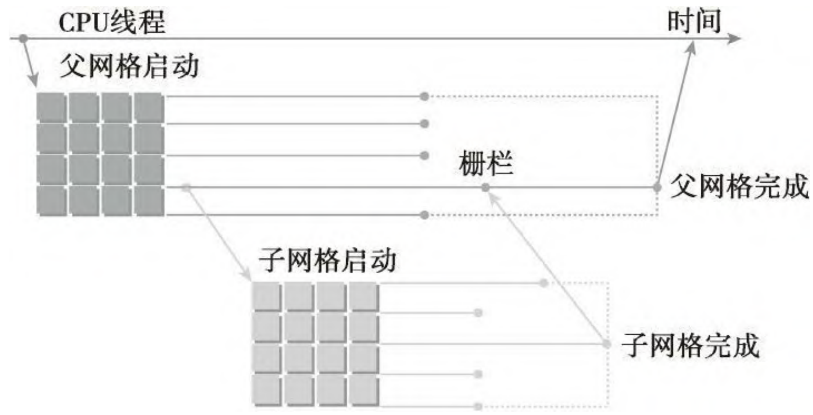
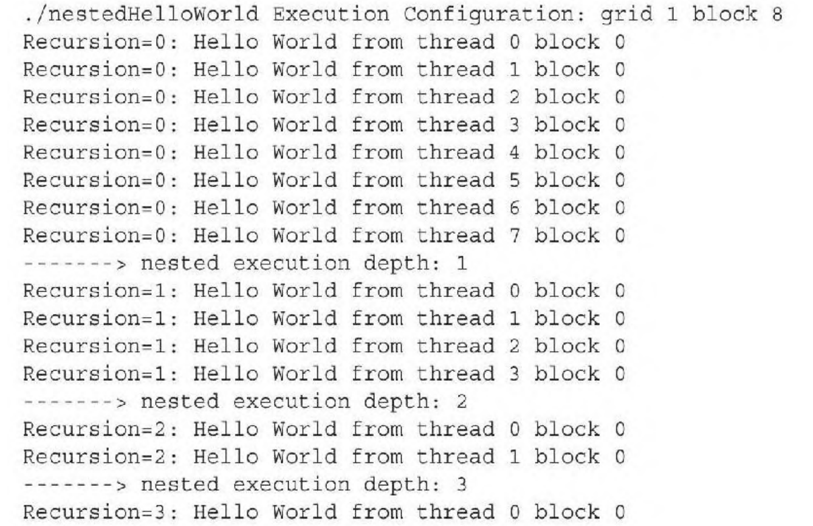

- [一 前言](#一-前言)
- [二 CUDA 内核优化策略](#二-cuda-内核优化策略)
  - [2.1 优化内存层次结构](#21-优化内存层次结构)
  - [2.2 提高并行度](#22-提高并行度)
    - [2.2.1 避免分支化](#221-避免分支化)
    - [2.2.2 展开循环](#222-展开循环)
    - [2.2.3 动态并行](#223-动态并行)
  - [2.3 指令级优化](#23-指令级优化)
  - [2.4 利用流和并发执行](#24-利用流和并发执行)
  - [2.5 Warp 级别优化](#25-warp-级别优化)
  - [2.6 高效的同步与分支管理](#26-高效的同步与分支管理)
  - [2.7 使用 CUDA 性能分析工具](#27-使用-cuda-性能分析工具)
  - [2.8 总结](#28-总结)
- [三 实际案例分析](#三-实际案例分析)
  - [3.1 优化矩阵乘法内核](#31-优化矩阵乘法内核)
  - [3.2 优化快速傅里叶变换（FFT）内核](#32-优化快速傅里叶变换fft内核)
  - [3.3 优化图像卷积内核](#33-优化图像卷积内核)
- [参考资料](#参考资料)

## 一 前言

影响 CUDA 内核性能的因素

1. **块大小**: 块大小（每个块中的线程数）直接影响 GPU 的并行度和资源利用。常见的块大小是 128、256 或 512 个线程。
2. **网格大小**: 网格大小（块的数量）决定了内核执行的总线程数。网格大小应足够大，以充分利用 GPU 的并行处理能力。
3. **线程束（Warp）**: CUDA GPU 中的线程束（Warp）是 32 个线程的组，这些线程同时执行指令。因此，块大小应为 32 的倍数，以最大化资源利用。
4. **内存访问模式**：高效的内存访问模式（如合并访问）可以显著提高内核性能。避免内存访问冲突和未对齐访问，以减少内存带宽的浪费。
5. **共享内存和寄存器使用**：合理利用共享内存和寄存器可以加快数据访问速度。然而，过多的共享内存或寄存器使用可能限制每个块的并发数，从而降低整体性能。
6. **线程并发数和占用率**：线程并发数（active warps per SM）和占用率（occupancy）影响 GPU 的资源利用率。高占用率通常意味着更高的性能，但并非总是如此，具体取决于内核的特性。

## 二 CUDA 内核优化策略

### 2.1 优化内存层次结构

CUDA GPU提供了多种内存类型，每种类型的访问速度和用途不同。有效利用这些内存类型可以显著提升内核性能。

1，全局内存优化

**合并内存访问**：合并内存访问指的是**多个线程在同一时钟周期内访问连续且对齐的内存地址**，从而让GPU能够以最少的内存事务处理更多的数据。这种访问模式能够充分利用GPU的内存带宽，显著提升内核性能。**示例内核代码**：
  
```cpp
__global__ void vectorAdd(const float *A, const float *B, float *C, int N) {
    int idx = blockIdx.x * blockDim.x + threadIdx.x;
    if (idx < N) {
        C[idx] = A[idx] + B[idx];
    }
}
```

2，共享内存优化

共享内存的访问速度远快于全局内存，**适用于重复访问的数据**。通过将常用数据加载到共享内存，减少全局内存访问次数（内存复用）。另外，确保不同线程访问不同的内存银行，避免访问冲突。

**示例**：

```cpp
__global__ void matrixMulShared(const float *A, const float *B, float *C, int N) {
    __shared__ float sA[16][16];
    __shared__ float sB[16][16];
    
    int row = blockIdx.y * 16 + threadIdx.y;
    int col = blockIdx.x * 16 + threadIdx.x;
    float value = 0.0f;
    
    for (int k = 0; k < N / 16; ++k) {
        sA[threadIdx.y][threadIdx.x] = A[row * N + k * 16 + threadIdx.x];
        sB[threadIdx.y][threadIdx.x] = B[(k * 16 + threadIdx.y) * N + col];
        __syncthreads();
        
        for (int n = 0; n < 16; ++n) {
            value += sA[threadIdx.y][n] * sB[n][threadIdx.x];
        }
        __syncthreads();
    }
    C[row * N + col] = value;
}
```

### 2.2 提高并行度

最直接和简单的就是**选择合适的块大小**可以提高并行度，确保 GPU 的计算资源被充分利用。通常选择为 `32`（线程束大小 warp size）的倍数，如128、256、512。**内核配置示例**：

```cpp
int blockSize = 256;
int gridSize = (N + blockSize - 1) / blockSize;
vectorAdd<<<gridSize, blockSize>>>(A, B, C, N);
```

#### 2.2.1 避免分支化

分支化指的是同一线程束（`warp`）内的线程因为**条件语句**（如 if-else、switch 等）执行不同路径，导致这些线程需要分别执行不同的指令，这会降低并行效率，导致内核性能变差。

以数组求和为例，成对的并行求和实现可以被分为以下两种类型:
- **相邻配对**: 元素与它们直接相邻的元素配对
- **交错配对**: 根据给定的跨度配对元素

相邻配对法的 `C++` 实现代码如下所示:

```cpp
#include <stdio.h>

// 相邻配对求和函数
int adjacent_pair_sum(int* arr, int n) {
    while (n > 1) {
        for (int i = 0; i < n / 2; i++) {
            arr[i] = arr[2 * i] + arr[2 * i + 1];
        }
        n /= 2; // 数组长度减半
    }
    return arr[0]; // 最终的和
}

int main() {
    int arr[] = {1, 2, 3, 4, 5, 6, 7, 8}; // 示例数组
    int n = sizeof(arr) / sizeof(arr[0]);
    
    int result = adjacent_pair_sum(arr, n);
    printf("Sum of array elements: %d\n", result);
    
    return 0;
}
```

#### 2.2.2 展开循环

循环展开通过**将循环体中的代码“展开”成多个相似的操作，从而减少循环的执行次数和控制开销**。

如下两个数组求和代码：

```cpp
for (int i = 0; i<100;i++) {
	a[i] = b[i] + c[i]
}
```

重复操作一次循环体，迭代次数可减少为原来的一半:

```cpp
for (int i = 0; i<100;i+=2) {
	a[i] = b[i] + c[i];
	a[i + 1] = b[i+1] + c[i+1]
}
```

高级语言层面上来看，循环展开使性能提高的原因可能不是显而易见的，这种提升来其实是来自于编译器执行循环展开时低级指令的改进和优化。在 GPU 编程中，循环展开的目的是为了优化流水线处理和增加并发操作来提高计算性能。

#### 2.2.3 动态并行

CUDA 的动态并行允许在 GPU 端直接创建和同步新的 GPU 内核。

在动态并行中，内核执行分为两种类型：父母和孩子。父线程、父线程块或父网格启动一个新的网格，即子网格。子线程、子线程块或子网格被父母启动。子网格必须在父线程、父线程块或父网格完成之前完成，只有在所有的子网格都完成之后，父母才会完成。下图说明了父网格和子网格的适用范围。



在 GPU上 嵌套输出 Hello World 的实例代码:

```cpp
__global__ void nestedHelloWorld(int const iSize, int iDepth)
{
	int tid = threadIdx.x;
	printf("Recursion=%d: Hello World from thread %d"
			"block td\n", iDepth, tid, blockIdx.x);
	// condition to stop recursive execution
	if(iSize ==1) return;
	// reduce block size to half
	int nthreads = iSize>>1;
	// thread 0 launches child grid recursively
	if(tid ==0 && nthreads >0){
		nestedHelloWorld<<<1, nthreads>>>(nthreads, ++iDepth);
		printf("------> nested execution depth: %d\n" iDepth);
	}
```

每个线程的核函数执行，会先输出 “Hello World”。接着，每个线程检查自己是否该停止。如果在这个嵌套层里线程数大于1，线程0就递归地调用一个带有线程数一半的子网格。用以下命令编译代码:

```bash
nvcc -arch=sm35 -rdc=true nestedHelloWorld.cu -o nestedHelloWorld -lcudadevrt
```
因为动态并行是由设备运行时库所支持的，所以 nestedHelloWorld 函数必须在命令行使用 `-lcudadevrt` 进行明确链接。当 `-rdc` 标志为 true 时，它强制生成可重定位的设备代码，这是动态并行的一个要求。程序编译运行后输出如下所示:



从输出信息中可见，由主机调用的父网格有1个线程块和8个线程。nestedHelloWorld 核函数递归地调用三次，每次调用的线程数是上一次的一半。

### 2.3 指令级优化

- **使用内联函数**：减少函数调用开销。
- **利用快速数学运算**：如`__fmaf_rn`（浮点乘加）。
- **避免不必要的计算**：预计算不变表达式，减少内核中的计算量。

**示例**：

```cpp
__global__ void optimizedKernel(const float *A, const float *B, float *C, int N) {
    int idx = blockIdx.x * blockDim.x + threadIdx.x;
    if (idx < N) {
        C[idx] = __fmaf_rn(A[idx], B[idx], C[idx]); // 使用快速乘加
    }
}
  ```

### 2.4 利用流和并发执行

通过 CUDA 流（`Streams`）实现**内核和内存传输的并行执行，提升整体吞吐量**。即使用多个流，将数据传输和计算重叠。**示例**：
  
```cpp
cudaStream_t stream1, stream2;
cudaStreamCreate(&stream1);
cudaStreamCreate(&stream2);

// 分割数据为两部分
size_t halfSize = N / 2 * sizeof(float);

// 异步传输和计算
cudaMemcpyAsync(d_A1, h_A, halfSize, cudaMemcpyHostToDevice, stream1);
vectorAdd<<<gridSize, blockSize, 0, stream1>>>(d_A1, d_B1, d_C1, N/2);

cudaMemcpyAsync(d_A2, h_A + N/2, halfSize, cudaMemcpyHostToDevice, stream2);
vectorAdd<<<gridSize, blockSize, 0, stream2>>>(d_A2, d_B2, d_C2, N/2);

cudaStreamSynchronize(stream1);
cudaStreamSynchronize(stream2);

cudaStreamDestroy(stream1);
cudaStreamDestroy(stream2);
```

### 2.5 Warp 级别优化

利用 Warp 级别的指令和操作，提高并行执行效率。如使用 Warp Shuffle（`__shfl`）在线程之间高效传递数据，并尽量减少需要跨 Warp 同步的操作。
  
**示例**：

```cpp
__device__ float warpReduceSum(float val) {
    for (int offset = 16; offset > 0; offset /= 2) {
        val += __shfl_down_sync(0xffffffff, val, offset);
    }
    return val;
}
```

### 2.6 高效的同步与分支管理

- **最小化同步点**：减少内核中的`__syncthreads()`调用，以降低同步开销。
- **优化分支**：尽量避免在内核中使用复杂的条件分支，减少线程束内的分歧。

**示例**：

```cpp
__global__ void kernelWithMinimizedSync(float *data, int N) {
    int idx = blockIdx.x * blockDim.x + threadIdx.x;
    if (idx < N) {
        // 尽量避免在同步点之前有条件语句
        data[idx] *= 2.0f;
    }
}
```

### 2.7 使用 CUDA 性能分析工具

优化内核的一个关键步骤是**识别性能瓶颈**。NVIDIA 提供了一系列工具，帮助开发者进行性能分析和调优。

在 CUDA 性能分析中，事件是可计算的活动，它对应**一个在内核执行期间被收集的硬件计数器**。指标是内核的特征，它由一个或多个事件计算得到。请记住以下概念事件和指标：
- 大多数计数器通过流式多处理器来报告，而不是通过整个GPU。
- 一个单一的运行只能获得几个计数器。有些计数器的获得是相互排斥的。多个性能分析运行往往需要获取所有相关的计数器。
- 由于 GPU 执行中的变化（如线程块和线程束调度指令），经重复运行，计数器值可能不是完全相同的。

分析性能的一个关键是如何使用不同的计数器和指标，从多个角度分析内核。另外，影响内核性能的因素有 3 种：
- **内存带宽**
- **计算资源（算力）**
- **指令和内存延迟**

**1，NVIDIA Nsight 工具套件**

**NVIDIA Nsight**是一套集成的开发工具，支持 CUDA 应用的性能分析、调试和优化。

- **Nsight Compute**：用于分析单个内核的性能，提供详细的内核执行报告。
- **Nsight Systems**：用于系统级性能分析，帮助识别应用中的瓶颈，如CPU与GPU之间的通信延迟。

**使用示例**：

```bash
# 使用 Nsight Compute 分析内核
nsight-compute ./your_cuda_application
```

**2，CUDA Profiler（nvprof和nvvp）**

**nvprof**和**Visual Profiler** (nvvp)是 CUDA 的性能分析工具，虽然逐渐被Nsight 工具所取代，但在一些场景中还是可以使用。

- **nvprof**：命令行性能分析工具，提供内核执行时间、内存带宽利用率等信息。
  
  **使用示例**：
  
  ```bash
  nvprof ./your_cuda_application
  ```
- **nvvp**：图形化界面工具，提供直观的性能分析报告和可视化。


### 2.8 总结

CUDA 内核优化是一个复杂且系统性的过程，涉及**内存层次结构、并行度、指令级优化、流与并发执行**等多个方面，具体来说就是：
1. **内存优化**：有效利用共享内存、常量内存和纹理内存，减少全局内存访问次数，优化内存访问模式。
2. **并行度与占用率**：选择合适的块大小和网格大小，最大化GPU资源利用，避免分支发散。
3. **指令优化**：使用快速数学运算，减少不必要的计算和同步点。
4. **性能分析**：使用NVIDIA的性能分析工具识别和解决性能瓶颈。

## 三 实际案例分析

通过实际案例，我们可以更深入地理解和应用上述优化策略。以下是几个优化后的内核示例，展示了如何在复杂应用中提升性能。

### 3.1 优化矩阵乘法内核

矩阵乘法是GPU计算中的经典问题，优化得当可以显著提升性能。

初始实现

```cpp
__global__ void matrixMul(const float *A, const float *B, float *C, int N) {
    int row = blockIdx.y * blockDim.y + threadIdx.y;
    int col = blockIdx.x * blockDim.x + threadIdx.x;
    if (row < N && col < N) {
        float sum = 0.0f;
        for (int k = 0; k < N; ++k) {
            sum += A[row * N + k] * B[k * N + col];
        }
        C[row * N + col] = sum;
    }
}
```

优化步骤

1. **使用共享内存缓存子矩阵**：减少全局内存访问次数。
2. **选择合适的块大小**：如16x16，每个块处理16x16的子矩阵。
3. **避免内存银行冲突**：通过调整共享内存的访问模式。

优化实现

```cpp
#define TILE_SIZE 16

__global__ void matrixMulShared(const float *A, const float *B, float *C, int N) {
    __shared__ float sA[TILE_SIZE][TILE_SIZE];
    __shared__ float sB[TILE_SIZE][TILE_SIZE];
    
    int row = blockIdx.y * TILE_SIZE + threadIdx.y;
    int col = blockIdx.x * TILE_SIZE + threadIdx.x;
    float sum = 0.0f;
    
    for (int tile = 0; tile < (N + TILE_SIZE - 1) / TILE_SIZE; ++tile) {
        if (row < N && (tile * TILE_SIZE + threadIdx.x) < N)
            sA[threadIdx.y][threadIdx.x] = A[row * N + tile * TILE_SIZE + threadIdx.x];
        else
            sA[threadIdx.y][threadIdx.x] = 0.0f;
        
        if (col < N && (tile * TILE_SIZE + threadIdx.y) < N)
            sB[threadIdx.y][threadIdx.x] = B[(tile * TILE_SIZE + threadIdx.y) * N + col];
        else
            sB[threadIdx.y][threadIdx.x] = 0.0f;
        
        __syncthreads();
        
        for (int k = 0; k < TILE_SIZE; ++k)
            sum += sA[threadIdx.y][k] * sB[k][threadIdx.x];
        
        __syncthreads();
    }
    
    if (row < N && col < N)
        C[row * N + col] = sum;
}
```

**性能提升**：

通过使用共享内存缓存子矩阵，减少了全局内存的访问次数，显著提升了内核的运行效率。选择16x16的块大小平衡了并行度和共享内存使用。

### 3.2 优化快速傅里叶变换（FFT）内核

FFT在信号处理和图像处理等领域应用广泛，优化FFT内核能显著提升相关应用的性能。

优化步骤：

1. **使用分段算法**：分解FFT计算，利用共享内存缓存中间结果。
2. **并行计算蝶形运算**：将蝶形运算并行化，提高执行效率。
3. **利用共享内存和寄存器**：减少全局内存访问，提升数据复用。

优化实现（简化版）：

```cpp
__global__ void fftButterfly(float2 *data, int N, int step) {
    int idx = blockIdx.x * blockDim.x + threadIdx.x;
    int pair = idx ^ step;
    
    if (idx < N && pair < N) {
        float angle = -2.0f * M_PI * (idx & (step - 1)) / (float)N;
        float2 twiddle = make_float2(cosf(angle), sinf(angle));
        float2 temp = data[idx];
        float2 tempPair = data[pair];
        
        // Butterfly operation
        data[idx].x = temp.x + twiddle.x * tempPair.x - twiddle.y * tempPair.y;
        data[idx].y = temp.y + twiddle.x * tempPair.y + twiddle.y * tempPair.x;
    }
}
```

性能优化：

- **分段处理**：将FFT分为多个步长（step），每步处理一部分数据，利用共享内存缓存局部数据。
- **优化线程分配**：确保每个线程执行尽可能多的工作，减少线程创建和销毁开销。

### 3.3 优化图像卷积内核

图像卷积广泛应用于图像处理和计算机视觉领域，优化卷积内核能显著提升图像处理应用的性能。

初始实现

```cpp
__global__ void convolution(const float *input, float *output, const float *kernel, int width, int height, int kSize) {
    int x = blockIdx.x * blockDim.x + threadIdx.x;
    int y = blockIdx.y * blockDim.y + threadIdx.y;
    if (x < width && y < height) {
        float sum = 0.0f;
        int half = kSize / 2;
        for (int ky = -half; ky <= half; ++ky) {
            for (int kx = -half; kx <= half; ++kx) {
                int ix = min(max(x + kx, 0), width - 1);
                int iy = min(max(y + ky, 0), height - 1);
                sum += input[iy * width + ix] * kernel[(ky + half) * kSize + (kx + half)];
            }
        }
        output[y * width + x] = sum;
    }
}
```

优化步骤

1. **使用共享内存缓存图像块**：减少全局内存访问次数。
2. **优化边界处理**：避免在内核中使用条件语句，改为预处理或使用镜像填充。
3. **优化内核尺寸**：选择合适的块大小和网格大小，确保高并行度。

优化实现

```cpp
#define TILE_WIDTH 16
#define KERNEL_RADIUS 1
#define TILE_SIZE (TILE_WIDTH + 2 * KERNEL_RADIUS)

__global__ void convolutionShared(const float *input, float *output, const float *kernel, int width, int height, int kSize) {
    __shared__ float sharedInput[TILE_SIZE][TILE_SIZE];
    
    int tx = threadIdx.x;
    int ty = threadIdx.y;
    int row = blockIdx.y * TILE_WIDTH + ty;
    int col = blockIdx.x * TILE_WIDTH + tx;
    
    // Load data into shared memory with halo
    if (row < height && col < width)
        sharedInput[ty + KERNEL_RADIUS][tx + KERNEL_RADIUS] = input[row * width + col];
    
    // Load halo regions
    if (tx < KERNEL_RADIUS) {
        if (col >= KERNEL_RADIUS)
            sharedInput[ty + KERNEL_RADIUS][tx] = input[row * width + (col - KERNEL_RADIUS)];
        else
            sharedInput[ty + KERNEL_RADIUS][tx] = input[row * width];
    }
    if (ty < KERNEL_RADIUS) {
        if (row >= KERNEL_RADIUS)
            sharedInput[ty][tx + KERNEL_RADIUS] = input[(row - KERNEL_RADIUS) * width + col];
        else
            sharedInput[ty][tx + KERNEL_RADIUS] = input[col];
    }
    __syncthreads();
    
    // Perform convolution
    if (row < height && col < width) {
        float sum = 0.0f;
        for (int ky = -KERNEL_RADIUS; ky <= KERNEL_RADIUS; ++ky) {
            for (int kx = -KERNEL_RADIUS; kx <= KERNEL_RADIUS; ++kx) {
                sum += sharedInput[ty + KERNEL_RADIUS + ky][tx + KERNEL_RADIUS + kx] * kernel[(ky + KERNEL_RADIUS) * kSize + (kx + KERNEL_RADIUS)];
            }
        }
        output[row * width + col] = sum;
    }
}
```

**性能提升**：

通过使用共享内存缓存图像块，减少了全局内存访问次数。此外，选择合适的块大小和优化内核尺寸，提升了内核的并行度和内存带宽利用率。

## 参考资料

《CUDA C 编程权威指南》