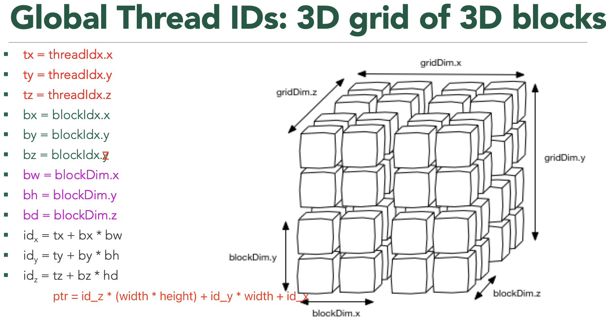

- [一 内核执行配置](#一-内核执行配置)
  - [1.1 grids 和 blocks 的维度设置](#11-grids-和-blocks-的维度设置)
  - [1.2 grids 和 blocks 的尺寸设置](#12-grids-和-blocks-的尺寸设置)
- [二 通过全局线程索引访问数据](#二-通过全局线程索引访问数据)
  - [2.1 全局线程索引计算](#21-全局线程索引计算)
  - [2.2 如何通过全局线程索引访问数据](#22-如何通过全局线程索引访问数据)
- [三 实践](#三-实践)
  - [3.1 一维块: 向量相加](#31-一维块-向量相加)
  - [3.2 二维网格和二维块: 矩阵转置](#32-二维网格和二维块-矩阵转置)
  - [3.3 二维网格和二维块: 矩阵相乘](#33-二维网格和二维块-矩阵相乘)
  - [3.4 二维网格和二维块: 分块矩阵相乘](#34-二维网格和二维块-分块矩阵相乘)
  - [3.5 三维网格和三维块: 三维张量的处理](#35-三维网格和三维块-三维张量的处理)
- [参考资料](#参考资料)


## 一 内核执行配置

### 1.1 grids 和 blocks 的维度设置

前面的内容我们知道可以为一个核函数配置多个线程（每个线程同一时刻只能处理一个数据），而这些线程的组织是通过内核调用函数的**执行配置** <<<grid_size, block_size>> >来决定的，执行配置决定了如何划分并行任务。

这里的 grid_size（网格大小）和 block_size（线程块大小）一般来说是一个 `dim3` 的结构体类型的变量，但也可以是一个普通的整型变量，即只有一个维度，其他维度为 `1`。其维度定义如下所示。
```bash
// 三维 block 和三维 grid
dim3 grid_size(Gx, Gy, Gz);
dim3 block_size(Bx, By, Bz);
// 二维 block 和二维 grid
dim3 grid_size(Gx, Gy);
dim3 block_size(Bx, By);
// 一维 block 和一维 grid
dim3 grid_size(Gx);
dim3 block_size(Bx);
```

三维 block 和三维 grid 的可视化如下图所示:


`dim3` 可以被看作是一个简单的三维向量，其中每个维度代表一个不同的轴：
1. `x`：第一个维度，通常用于表示线程或线程块的线性索引。
2. `y`：第二个维度，用于表示线程块的二维网格布局中的行数。
3. `z`：第三个维度，用于表示线程块的三维网格布局中的深度

对于不同的数据维度可以设置不同的 grids 和 blocks 维度。

### 1.2 grids 和 blocks 的尺寸设置

理解了执行配置有着不同的维度和维度代表的意义，我们还需要学会如何设置各个维度的尺寸大小。

**在 cuda 中希望尽可能多的线程并行，并保证所有数据被处理**，对于：

1. **一维数据(向量相加)**：假设有一个问题需要处理的数据量为 N，每个线程块可以处理 B 个数据项，如果问题规模是线性的，可以计算网格尺寸为 gridSize.x = (N + B - 1) / B，确保所有数据项都被处理，执行配置为：
```cpp
// Threads per CTA (1024)
int NUM_THREADS = 1 << 10;
// CTAs per Grid
int NUM_BLOCKS = (N + NUM_THREADS - 1) / NUM_THREADS;
// Launch the kernel on the GPU
vectorAdd<<<NUM_BLOCKS, NUM_THREADS>>>(d_a, d_b, d_c, N);
```
2. **二维数据（图像处理）**：对于二维数据（如图像、矩阵），如果图像的宽度为 width，高度为 height，每个线程块处理 THREADS * THREADS 个像素，则执行配置为：
```cpp
// Threads per CTA dimension
int THREADS = 32;
BLOCKS_X = (width + THREADS - 1) / THREADS;
BLOCKS_Y = (height + THREADS - 1) / THREADS;
dim3 blockDim(THREADS, THREADS);
dim3 gridDim(BLOCKS_X, BLOCKS_Y);
// Launch kernel
matrixMul<<<blocks, threads>>>(d_a, d_b, d_c, height, width);
```
3. **三维数据（cnn 特征数据）**：对于三维数据，其尺寸为 width = 512, height = 512, depth = 64，如果每个线程块的尺寸为 blockDim(4, 4, 4)：
```cpp
int width = 256;
int height = 128;
int depth = 64;
dim3 blockDim(4, 4, 4);
// 计算网格尺寸. 向上取整，以确保覆盖所有数据
int gridSizeX = (width + blockDim.x - 1) / blockDim.x;
int gridSizeY = (height + blockDim.y - 1) / blockDim.y;
int gridSizeZ = (depth + blockDim.z - 1) / blockDim.z;
// 设置网格尺寸dim3 
dim3 gridDim(gridSizeX, gridSizeY, gridSizeZ);
featuremapProcess<<<blockDim, gridDim>>>(d_a, d_b, d_c, height, width, depth);
```

## 二 通过全局线程索引访问数据

### 2.1 全局线程索引计算

CUDA 中每一个线程都有一个唯一的标识 ID，也叫全局线程索引，kernel 函数内部就是通过这个线程 ID 来访问 1D/2D/3D 张量元素的。要线程的唯一标识符，得先理解 kernel 函数内部一些结构结构体的定义：
1. kernel 执行配置参数的两个变量是赋值给：`gridDim` 和 `blockDim` 内建变量（built-in variable）中。它们都是类型为 `dim3` 结构体变量，具有 x、y、z 这 3 个成员。
	- `gridDim` 表示每个维度上的线程块数量，即每个网格的尺寸。
	- `blockDim` 表示每个维度上的线程数量，即每个线程块的尺寸。
2. 线程id 和 blockid 分别定义为 blockIdx 和 threadIdx，它们都是类型为 `uint3` 的结构体变量，具有 x、y、z 这 3 个成员。其中：
	- blockIdx.x 取值范围是 [0, gridDim.x - 1];
	- blockIdx.y 取值范围是 [0, gridDim.y - 1];
	- blockIdx.z 取值范围是 [0, gridDim.z - 1];
	- threadIdx.x 取值范围是 [0, blockDim.x - 1];
	- 等等

网上有很多资料直接诸如下述这种全局线程索引的计算公式。
```cpp
int blockId = blockIdx.x + blockIdx.y * gridDim.x
			+  blockIdx.z * gridDim.x * gridDim.y;  
int threadId = blockId * (blockDim.x * blockDim.y * blockDim.z) 
			+ (threadIdx.z * (blockDim.x * blockDim.y))
			+ (threadIdx.y * blockDim.x) + threadIdx.x;
```

但根据我个人理解，理解这种公式实践意义不大，真的是多维配置的情况下，我们应该关注的是如何**分别计算 x,y,z 这三个方向下的全局线程索引**，然后再来计算待访问内存数据地址。**多维的网格和线程块本质上还是一维的，就像多维数组本质上也是一维数组一样**，理解了这个再去计算线程索引就相对容易些了。一维 grid 和 一维的 block 的情况比比较简单，这里忽略。

对于二维 grids 和 blocks，x 和 y 方向上的全局线程索引计算如下:


对于三维 grids 和 blocks，x、y 和 z 方向上的全局线程索引计算如下:



### 2.2 如何通过全局线程索引访问数据

上一节，我们知道了如何计算不同维度在不同方向上的全局线程索引，那么如何根据这个索引来去访问数据呢，这也是我们编写正确 kernel 函数最难点！以下是在核函数中使用线程索引来访问数据的步骤：
1. 确定数据结构和计算不同方向上的全局线程索引；
2. 考虑数据存储方式：行优先（主流）和列优先；
3. 确保不同方向上的全局线程索引在有效范围内。

另外，我看了很多资料后，得出一个结论，理解这个知识点，一定得是通过实践案例来理解！

## 三 实践

### 3.1 一维块: 向量相加

输入输出都是向量（一维），核函数和核函数配置如下：
```cpp
// CUDA kernel for vector addition
// __global__ means this is called from the CPU, and runs on the GPU
__global__ void vectorAdd(const int *__restrict a, const int *__restrict b,
                          int *__restrict c, int N) {
    // Calculate global thread ID
    int tid = (blockIdx.x * blockDim.x) + threadIdx.x;

    // Boundary check
    if (tid < N) c[tid] = a[tid] + b[tid];
}

int main() {
    // Vectors for holding the host-side (CPU-side) data
    std::vector<int> a;
    a.reserve(N);
    std::vector<int> b;
    b.reserve(N);
    std::vector<int> c;
    c.reserve(N);
  
    int NUM_THREADS = 1 << 10; // 每个网格的 CTA（合作线程数组）
    int NUM_BLOCKS = (N + NUM_THREADS - 1) / NUM_THREADS; // CTAs per Grid

    // Launch the kernel on the GPU
    // Kernel calls are asynchronous (the CPU program continues execution after
    // call, but no necessarily before the kernel finishes)
    vectorAdd<<<NUM_BLOCKS, NUM_THREADS>>>(d_a, d_b, d_c, N);
}
```
### 3.2 二维网格和二维块: 矩阵转置

二维矩阵转置对于二维矩阵（例如图像），如果我们要进行转置操作，核函数可能如下所示：
```cpp
// 转置核函数
__global__ void transpose(int *src, int *dst, int width, int height) {
    int tx = threadIdx.x;
    int ty = threadIdx.y;
    int bx = blockIdx.x;
    int by = blockIdx.y;
    int bw = blockDim.x;
    int bh = blockDim.y;

    // 计算全局线程的行和列索引，一个线程处理一个元素
    int row = by * bh + ty;
    int col = bx * bw + tx;

    // 检查索引是否在有效范围内
    if (row < height && col < width) { 
        int srcIndex = row * width + col;       // 原矩阵的索引
        int dstIndex = col * height + row;      // 转置后的索引
        dst[dstIndex] = src[srcIndex];
    }
}

int main() {
    // 定义矩阵的行数和列数
    int m = 8; // 行数
    int n = 8; // 列数
    // 定义线程块和网格大小
    dim3 DimBlock(16, 16, 1);
    dim3 DimGrid((n - 1) / DimBlock.x + 1, (m - 1) / DimBlock.y + 1, 1);
    /*省略部分代码*/
    // 启动核函数
    transpose<<<DimGrid, DimBlock>>>(d_src, d_dst, n, m);
}
```

完整程序在[这里](./src/matrix_transpose.cu)，编译运行后输出结果如下所示:
```bash
Matrix transposition completed successfully!
Original Matrix (8x8):
0       1       2       3       4       5       6       7
8       9       10      11      12      13      14      15
16      17      18      19      20      21      22      23
24      25      26      27      28      29      30      31
32      33      34      35      36      37      38      39
40      41      42      43      44      45      46      47
48      49      50      51      52      53      54      55
56      57      58      59      60      61      62      63

Transposed Matrix (8x8):
0       8       16      24      32      40      48      56
1       9       17      25      33      41      49      57
2       10      18      26      34      42      50      58
3       11      19      27      35      43      51      59
4       12      20      28      36      44      52      60
5       13      21      29      37      45      53      61
6       14      22      30      38      46      54      62
7       15      23      31      39      47      55      63
```
### 3.3 二维网格和二维块: 矩阵相乘

正方形二维矩阵相乘，直接使用二维网格和二维块，核函数和核函数配置如下:

```cpp
__global__ void matrixMul(const int *a, const int *b, int *c, int N) {
    // Compute each thread's global row and column index
    int row = blockIdx.y * blockDim.y + threadIdx.y;
    int col = blockIdx.x * blockDim.x + threadIdx.x;

    // Iterate over row, and down column
    c[row * N + col] = 0;
    for (int k = 0; k < N; k++) {
        // Accumulate results for a single element
        c[row * N + col] += a[row * N + k] * b[k * N + col];
    }
}
int main() {
    // Threads per CTA dimension
    int THREADS = 32;
    // Blocks per grid dimension (assumes THREADS divides N evenly)
    int BLOCKS = N / THREADS; // N is matrix shape
    // Use dim3 structs for block  and grid dimensions
    dim3 threads(THREADS, THREADS);
    dim3 blocks(BLOCKS, BLOCKS);
    // Launch kernel
    matrixMul<<<blocks, threads>>>(d_a, d_b, d_c, N)
}
```

### 3.4 二维网格和二维块: 分块矩阵相乘

基于共享内存实现的了分块缓冲和分块矩阵乘法技术。分块矩阵乘法原理的如下图所示：


使用 shared memory，将每个 block 需要计算的数据先存放到 shared memory 中，减少对 global memory 的访存次数。

在 kernel 函数代码中，每个 tile_size x tile_size 的 block 负责计算 C 中 tile_size x tile_size 的块，在外层循环的每次迭代中，首先将 A 和 B 中对应的块拷贝到共享内存，然后基于共享内存中的数据进行矩阵乘法，然后进行下一次迭代并将每次迭代的结果累加，最终得到 C 中对应的一个块。在每次循环中，共享内存都会被更新。
> `__syncthreads()` 是 CUDA 中用于同步一个线程块（block）内所有线程的内置函数。它的作用是使线程块中的所有线程在到达同步点之前停止执行，直到所有线程都到达这一点才继续往下执行。

kernel 函数中难理解的是矩阵 A 和 B 元素的加载，分析如下：

1，加载一行元素：`a[row * N + (i + threadIdx.x)]`

其作用是加载矩阵 A 的行元素，row 是全局行索引，row * N 定位到当前行的起始位置。i 表示第几个块，threadIdx.x 表示当前块的所在的第几列。换种说法，其实是计算 `A[row][i + threadIdx.x]` 的一维数组索引。

2，加载一列元素：`b[(i + threadIdx.y) * N + col]`

其作用是加载矩阵 B 的列元素，col 是全局列索引，(i + threadIdx.y) * N 定位到当前行的起始位置。i 表示第几个块，threadIdx.y 表示当前块的所在的第几行。换种说法，其实是计算 `A[i + threadIdx.y][col]` 的一维数组索引。

```cpp
// This program computes matrix multiplication using shared memory tiling
// By: ChatGPT

#include <algorithm>
#include <cassert>
#include <cstdlib>
#include <functional>
#include <iostream>
#include <vector>

#include <cuda_runtime.h>

using std::cout;
using std::generate;
using std::vector;

// 宏定义tile size
#define TILE_SIZE 4

// 矩阵大小
const int N = 8;

// CUDA 错误检查宏
#define CHECK_CUDA_ERROR(call) {                                         \
    cudaError_t err = call;                                              \
    if(err != cudaSuccess) {                                             \
        std::cerr << "CUDA Error: " << cudaGetErrorString(err)          \
                  << " at " << __FILE__ << ":" << __LINE__ << std::endl;\
        exit(EXIT_FAILURE);                                              \
    }                                                                    \
}

// 分块矩阵乘法核函数
__global__ void matrixMul(const int *a, const int *b, int *c) {
    // 计算每个线程的全局行和列（y 和 x 方向）索引
    int row = blockIdx.y * blockDim.y + threadIdx.y;
    int col = blockIdx.x * blockDim.x + threadIdx.x;

    // 声明共享内存
    __shared__ int s_a[TILE_SIZE][TILE_SIZE];
    __shared__ int s_b[TILE_SIZE][TILE_SIZE];

    // 临时变量用于累加结果
    int tmp = 0;

    // 按tile划分矩阵
    for (int i = 0; i < N; i += TILE_SIZE) {
        // 加载A矩阵的tile到共享内存。 计算 A[row][i + threadIdx.x] 的一维数组索引。
        s_a[threadIdx.y][threadIdx.x] = a[row * N + (i + threadIdx.x)];
        // 加载B矩阵的tile到共享内存。 计算 B[i + threadIdx.y][col] 的一维数组索引。
        s_b[threadIdx.y][threadIdx.x] = b[(i + threadIdx.y) * N + col];

        // 同步线程，确保所有数据加载完毕
        __syncthreads();

        // 进行乘法累加
        for (int j = 0; j < TILE_SIZE; j++) {
            tmp += s_a[threadIdx.y][j] * s_b[j][threadIdx.x];
        }

        // 同步线程，确保所有线程完成计算
        __syncthreads();
    }

    // 将结果写回全局内存
    c[row * N + col] = tmp;
}

// 在CPU上验证结果
void verify_result(const vector<int> &a, const vector<int> &b, const vector<int> &c) {
    for (int i = 0; i < N; i++) {
        for (int j = 0; j < N; j++) {
            int tmp = 0;
            for (int k = 0; k < N; k++) {
                tmp += a[i * N + k] * b[k * N + j];
            }
            if (tmp != c[i * N + j]) {
                std::cerr << "Mismatch at (" << i << ", " << j << "): "
                          << "CPU = " << tmp << ", GPU = " << c[i * N + j] << std::endl;
                exit(EXIT_FAILURE);
            }
        }
    }
}

int main() {
    // 矩阵大小（字节）
    size_t bytes = N * N * sizeof(int);

    // 主机端矩阵
    vector<int> h_a(N * N);
    vector<int> h_b(N * N);
    vector<int> h_c(N * N, 0);

    // 初始化矩阵A和B
    generate(h_a.begin(), h_a.end(), []() { return rand() % 100; });
    generate(h_b.begin(), h_b.end(), []() { return rand() % 100; });

    // 打印初始化的矩阵（可选）
    
    cout << "Matrix A:\n";
    for(int i = 0; i < N; ++i){
        for(int j = 0; j < N; ++j){
            cout << h_a[i * N + j] << "\t";
        }
        cout << "\n";
    }

    cout << "\nMatrix B:\n";
    for(int i = 0; i < N; ++i){
        for(int j = 0; j < N; ++j){
            cout << h_b[i * N + j] << "\t";
        }
        cout << "\n";
    }
    

    // 设备端指针
    int *d_a, *d_b, *d_c;

    // 分配设备内存
    CHECK_CUDA_ERROR(cudaMalloc(&d_a, bytes));
    CHECK_CUDA_ERROR(cudaMalloc(&d_b, bytes));
    CHECK_CUDA_ERROR(cudaMalloc(&d_c, bytes));

    // 将数据从主机复制到设备
    CHECK_CUDA_ERROR(cudaMemcpy(d_a, h_a.data(), bytes, cudaMemcpyHostToDevice));
    CHECK_CUDA_ERROR(cudaMemcpy(d_b, h_b.data(), bytes, cudaMemcpyHostToDevice));

    // 定义每个线程块的线程数
    dim3 threads(TILE_SIZE, TILE_SIZE);
    // 定义网格的线程块数
    dim3 blocks((N + TILE_SIZE - 1) / TILE_SIZE, (N + TILE_SIZE - 1) / TILE_SIZE);

    // 启动核函数
    matrixMul<<<blocks, threads>>>(d_a, d_b, d_c);

    // 检查核函数是否有错误
    CHECK_CUDA_ERROR(cudaGetLastError());

    // 将结果从设备复制回主机
    CHECK_CUDA_ERROR(cudaMemcpy(h_c.data(), d_c, bytes, cudaMemcpyDeviceToHost));

    // 验证结果
    verify_result(h_a, h_b, h_c);

    cout << "COMPLETED SUCCESSFULLY\n";

    // 可选：打印结果矩阵
    
    cout << "\nMatrix C (Result):\n";
    for(int i = 0; i < N; ++i){
        for(int j = 0; j < N; ++j){
            cout << h_c[i * N + j] << "\t";
        }
        cout << "\n";
    }
    

    // 释放设备内存
    CHECK_CUDA_ERROR(cudaFree(d_a));
    CHECK_CUDA_ERROR(cudaFree(d_b));
    CHECK_CUDA_ERROR(cudaFree(d_c));

    return 0;
}
```
程序编译运行后输出结果如下所示:
```bash
Matrix A:
83      86      77      15      93      35      86      92
49      21      62      27      90      59      63      26
40      26      72      36      11      68      67      29
82      30      62      23      67      35      29      2
22      58      69      67      93      56      11      42
29      73      21      19      84      37      98      24
15      70      13      26      91      80      56      73
62      70      96      81      5       25      84      27

Matrix B:
36      5       46      29      13      57      24      95
82      45      14      67      34      64      43      50
87      8       76      78      88      84      3       51
54      99      32      60      76      68      39      12
26      86      94      39      95      70      34      78
67      1       97      2       17      92      52      56
1       80      86      41      65      89      44      19
40      29      31      17      97      71      81      75
COMPLETED SUCCESSFULLY

Matrix C (Result):
26078   23967   33739   23862   35863   41639   22724   34040
17734   17952   28531   15937   25029   30362   14324   22662
17849   12725   23119   14483   19845   27488   12905   17318
16244   12708   21889   14510   18329   23999   9877    20615
23030   20057   25634   18830   27998   30941   15802   23062
15604   21276   25217   16286   23458   29091   15675   19990
19517   20406   26883   14945   26421   32092   20054   24017
23667   20205   24676   22984   26769   33629   15298   20669
```
### 3.5 三维网格和三维块: 三维张量的处理

在 CUDA 中处理三维数组时，核函数需要正确地计算每个线程负责的数据索引。假设我们有一个三维数组，我们想要实现一个简单的核函数，该函数将三维数组中的每个元素加一。首先，定义核函数，计算每个线程的全局索引，并据此访问三维数组。

```cpp
#include <algorithm>
#include <cassert>
#include <cstdlib>
#include <functional>
#include <iostream>
#include <vector>

__global__ void increment3DArray(int *array, 
    int width, 
    int height, 
    int depth) 
{    
    // 计算线程的 x y 和 z 方向的全局索引    
    int IDx = threadIdx.x + blockIdx.x * gridDim.x;
    int IDy = threadIdx.y + blockIdx.y * gridDim.y;
    int IDz = threadIdx.z + blockIdx.z * gridDim.z;
    // 确保索引在三维数组的有效范围内

    if (IDx < width && IDy < height && IDz < depth) {
        // 计算数组中对应的全局索引
        int globalIndex = IDz * width * height + IDy * width + IDx;
        // 对应位置的元素加一
        array[globalIndex] = 10;
    }
}

int main() 
{
    // 三维数组的尺寸
    int width = 4;
    int height = 4;
    int depth = 4;

    // 计算数组总大小
    int size = width * height * depth;

    // 在主机端分配内存
    int *h_array = new int[size];

    // 初始化主机端数组
    for (int i = 0; i < size; ++i) {
        h_array[i] = i;
    }

    // 在设备端分配内存
    int *d_array;
    cudaMalloc(&d_array, size * sizeof(int));

    // 从主机复制数据到设备
    cudaMemcpy(d_array, h_array, size * sizeof(int), cudaMemcpyHostToDevice);

    // 定义线程块和网格尺寸
    dim3 blockSize(2, 2, 2); // 每个线程块有8个线程
    dim3 gridSize((width + blockSize.x - 1) / blockSize.x, 
    (height + blockSize.y - 1) / blockSize.y, 
    (depth + blockSize.z - 1) / blockSize.z);

    // 执行核函数
    increment3DArray<<<gridSize, blockSize>>>(d_array, width, height, depth);

    // 将结果从设备复制回主机
    cudaMemcpy(h_array, d_array, size * sizeof(int), cudaMemcpyDeviceToHost);

    // TODO: 验证结果或进行其他操作
    printf("Welcom comeback to cpu!\n");
     // 初始化主机端数组
     for (int i = 0; i < size; ++i) {
        printf("h_array[%d] is %d\n", i, h_array[i]);
    }
    // 释放设备内存
    cudaFree(d_array);

    // 释放主机内存
    delete[] h_array;

    return 0;
}
```

上述程序编译运行后输出结果如下所示:
```bash
(base) root:/gemini/code/cuda_kernels# nvcc 3dgrid.cu 
(base) root:/gemini/code/cuda_kernels# ./a.out 
Welcom comeback to cpu!
h_array[0] is 10
h_array[1] is 10
h_array[2] is 10
h_array[3] is 10
h_array[4] is 10
h_array[5] is 10
h_array[6] is 10
h_array[7] is 10
h_array[8] is 10
h_array[9] is 10
h_array[10] is 10
......
```
## 参考资料

- [极智开发 | CUDA线程模型与全局索引计算方式](https://mp.weixin.qq.com/s/IyQaarSN6V_tukt6KigkGQ)
- [C++ CUDA 设置线程块尺寸和网格尺寸](https://mp.weixin.qq.com/s/FfMWa94nLFIejilfc3DCxg)
- [C++ CUDA 核函数中如何通过索引访问数据](https://mp.weixin.qq.com/s/VuGarPnZu56hYNlkRP5cyw)
- https://harmanani.github.io/classes/csc447/Notes/Lecture15.pdf
- [CUDA 实践：矩阵乘法 | CUDA](http://www.zh0ngtian.tech/posts/975c867a.html#Baseline)