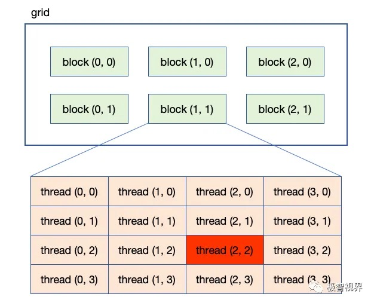

- [前言](#前言)
- [一 kernel 配置](#一-kernel-配置)
	- [1.1 grid 和 block 大小的限制](#11-grid-和-block-大小的限制)
- [二 线程全局索引计算](#二-线程全局索引计算)
- [三 网格和块配置实例](#三-网格和块配置实例)
	- [3.1 通过全局线程索引访问数据](#31-通过全局线程索引访问数据)
	- [3.2 使用二维网格和二维块对矩阵求和](#32-使用二维网格和二维块对矩阵求和)
	- [3.3 使用一维网格和一维块对矩阵求和](#33-使用一维网格和一维块对矩阵求和)
	- [3.4 总结](#34-总结)
- [三 通过全局线程索引访问数据](#三-通过全局线程索引访问数据)
- [参考资料](#参考资料)

## 前言

`Grid，Block，Thread` 都是线程的组织形式，最小的逻辑单位是 Thread，最小的硬件执行单位是 `thread warp`，若干个 Thread 组成一个Block，Block 被加载到 `SM` 上运行，多个 Block 组成一个 Grid，Grid 决定了 CUDA 内核将被启动多少次。

通过下图可以更直观理解 **grid、block 和 thread 的层次关系**。


内核启动时，需要指定 `grid` 和 `block` 的维度。语法如下：

```cpp
kernel<<<gridDim, blockDim, sharedMem, stream>>>(parameters);
```

- `gridDim`：网格的维度，可以是一维、二维或三维。
- `blockDim`：块的维度，可以是一维、二维或三维。
- `sharedMem`（可选）：每个块分配的共享内存大小（以字节为单位）。
- `stream`（可选）：CUDA 流，用于异步执行。

## 一 kernel 配置

**kernel 配置: 多维网格和多维块**，`kernel` 如何配置就决定了我们如何划分并行任务。

“CUDA” 内核的启动，需要先定义启动配置  `<<<grid_size, block_size>>>`，其用于配置执行线程的组织结构，CUDA 最多可以组织三维的网格和线程块，用 `dim3` 结构体来定义。
```bash
dim3 grid_size(Gx, Gy, Gz);
dim3 block_size(Bx, By, Bz);
```

如果第三个维度的大小是 1，可以写
```bash
dim3 grid_size(Gx, Gy);
dim3 block_size(Bx, By);
```

例如，如果要定义一个 2 × 2 × 1 的网格及 3 × 2 × 1 的线程块，可将执行配置中的 grid_size 和 block_size 分别定义为如下结构体变量：

```bash
dim3 grid_size(2, 2, 1);
dim3 block_size(3, 2, 1);
```

此核函数配置 <<<grid_size, block_size>>> 对应的的线程组织如下图所示：


在矩阵乘法 kernel 中的二维内核配置定义如下：
```cpp
// Threads per CTA dimension
int THREADS = 32;

// Blocks per grid dimension (assumes THREADS divides N evenly)
int BLOCKS = N / THREADS; // N is size (in bytes) of matrix

// Use dim3 structs for block  and grid dimensions
dim3 threads(THREADS, THREADS);
dim3 blocks(BLOCKS, BLOCKS);

// Launch kernel
matrixMul<<<blocks, threads>>>(d_a, d_b, d_c, N);
```

### 1.1 grid 和 block 大小的限制

对任何从开普勒到图灵架构的 GPU 来说，网格大小在 x、y 和 z 这 3 个方向的最大允许值分别为 $2^{31−1}$、65535 和 65535；线程块大小在 x、y 和 z 这 3 个方向的最大允许值分别为 1024、1024 和 64。另外还要求线程块总的大小，即 blockDim.x、blockDim.y 和 blockDim.z 的乘积不能大于 1024。即不管线程块是几维的，一个线程块最多只能有 $1024$ 个线程。

## 二 线程全局索引计算

**kernel 函数中是通过全局线程索引来访问 `1D/2D/3D` 张量元素的**。

前面内容我们知道 CUDA 中每一个线程都有一个唯一的标识 ID—`threadIdx`，`ThreadIdx` 的计算依赖于内核配置 `<<<grid_size, block_size>>>`。而在 kernel 函数内部，
1. 配置参数的两个变量是赋值给：`gridDim` 和 `blockDim` 内建变量（built-in variable）中。它们都是类型为 `dim3` 结构体变量，具有 x、y、z 这 3 个成员。
	- `gridDim` 表示每个维度上的线程块数量，即每个网格的尺寸。
	- `blockDim` 表示每个维度上的线程数量，即每个线程块的尺寸。
2. 为了计算 `threadIdx`，还定义了 `blockIdx`, blockIdx 和 threadIdx 都是类型为 `uint3` 的结构体变量，具有 x、y、z 这 3 个成员。其中：
	- blockIdx.x 取值范围是 [0, gridDim.x - 1];
	- blockIdx.y 取值范围是 [0, gridDim.y - 1];
	- blockIdx.z 取值范围是 [0, gridDim.z - 1];
	- threadIdx.x 取值范围是 [0, blockDim.x - 1];
	- 等等

多维网格和块的划分可以组织成以下 $9 = 3*3$ 种情况：
```bash
一维网格一维线程块；
一维网格两维线程块；
一维网格三维线程块；
两维网格一维线程块；
两维网格两维线程块；
两维网格三维线程块；
三维网格一维线程块；
三维网格两维线程块；
三维网格三维线程块；
```

对于经典的二维网格二维线程块，想要计算下图中**红色块的全局线程索引**，调用核函数的线程配置代码如下：

```cpp
dim3 grid_size(3,2);
dim3 block_size(4,4);
kernel_func<<<grid_size, block_size>>>(args);
```



全局线程索引计算过程如下：
```bash
int blockId = blockIdx.x + blockIdx.y * gridDim.x;
int threadId = threadIdx.x + threadIdx.y * blockDim.x;

int id = blockId * (blockDim.x * blockDim.y) + threadId;

// 带入计算
int blockId = 1 + 1 * 3 = 4
int threadId = 2 + 2 * 4 = 10
int id = 4 * ( 4 * 4) + 10 = 74
```

上面的九种组织情况其实都可以视为是**三维网格三维线程块**的情况，只是比如一维或者二维的时候，其他维度为 1 而已。把它们都看成三维格式，这样不管哪种线程组织方式，都可以套用三维网格三维线程块的计算方式:
```cpp
// 线程块索引
int blockId = blockIdx.x + blockIdx.y * gridDim.x + gridDim.x * gridDim.y * blockIdx.z;
// 局部线程索引
int threadId = threadIdx.z * blockDim.x * blockDim.y + threadIdx.y * blockDim.x + threadIdx.x;
// 全局线程索引
int id = blockId * (blockDim.x * blockDim.y * blockDim.z) + threadId;
```

或者如下计算方式：
```cpp
int blockId = blockIdx.x + blockIdx.y * gridDim.x
			+ gridDim.x * gridDim.y * blockIdx.z;  
int threadId = blockId * (blockDim.x * blockDim.y * blockDim.z) 
			+ (threadIdx.z * (blockDim.x * blockDim.y))
			+ (threadIdx.y * blockDim.x) + threadIdx.x;
```
具体的：

1、 grid 划分成 1 维，block 划分为 1 维
```cpp
int threadId = threadIdx.x;
int id = blockIdx.x * blockDim.x + threadId;  
```
2、 grid 划分成 1 维，block 划分为 2 维
```cpp
int threadId = threadIdx.y * blockDim.x + threadIdx.x; 
int id = blockIdx.x * blockDim.x * blockDim.y + threadId;
```
3、grid 划分成 2 维，block 划分为 2 维

```cpp
int blockId = blockIdx.x + blockIdx.y * gridDim.x; 
int threadId = threadIdx.x + threadIdx.y * blockDim.x;
int id = blockId * (blockDim.x * blockDim.y) + threadId
```


## 三 网格和块配置实例

如果使用了合适的网格和块大小来正确地组织线程，会对内核性能产生很大的影响。在矩阵加法中使用以下布局将有助于了解更多关于网格和块的启发性的用法：
- 由二维线程块构成的二维网格
- 由一维线程块构成的一维网格

### 3.1 通过全局线程索引访问数据

以下是如何在核函数中使用线程索引来访问数据的步骤：

1. 确定数据结构：首先，你需要确定你正在处理的数据结构，例如一维数组、二维矩阵（图像）、三维数组（体积数据）等。
2. **计算全局索引**：每个线程需要计算其全局索引。对于一维数据，全局索引可以通过以下方式计算：
```bash
int globalIndex = blockIdx.x * blockDim.x + threadIdx.x;
```
对于二维或三维数据，计算会更复杂，需要考虑所有维度。
3. **使用全局索引访问数据**：一旦线程有了全局索引，就可以使用它来访问设备内存中的数据。例如，如果你有一个一维数组 data，线程可以通过其全局索引访问它：
```bash
data[globalIndex];
```
4. **考虑数据存储方式**：对于多维数据，需要根据数据在内存中的存储方式（通常是行优先或列优先）来计算索引。例如，对于二维图像数据，如果以行优先方式存储，一个像素的索引可以这样计算：
```cpp
int row = blockIdx.y * blockDim.y + threadIdx.y;
int col = blockIdx.x * blockDim.x + threadIdx.x;
int globalIndex = row * width + col;
```
这里，width 是图像的宽度。
5. **确保索引在有效范围内**：在访问数据之前，线程需要检查其全局索引是否在数据的有效范围内。这可以通过简单地与数据大小比较来完成：
```cpp
if (globalIndex < dataSize) {    
	// 安全地访问数据    data[globalIndex] = ...;}
```
6. **处理数据**：一旦线程通过索引访问了数据，就可以执行所需的操作，如计算、复制或转换。

### 3.2 使用二维网格和二维块对矩阵求和

**使用块和线程建立矩阵索引**: 对于矩阵加法的核函数，首先要完成的任务是使用块和线程索引从全局内存中访问指定的数据。以列优先存储方法的 $nx\times ny$ 矩阵为例:

第一步，可以用以下公式把线程和块索引映射到矩阵坐标上：

```cpp
// [ix, iy] 是矩阵的元素的坐标索引
ix = threadIdx.x + blockIdx.x * blockDim.x;
iy = threadIdx.y + blockIdx.y * blockDim.y;
```

第二步，可以用以下公式把矩阵坐标 `(ix, iy)` 映射到全局内存中的索引/存储单元上：

```cpp
idx = iy * nx + ix
```
其中：
- `ix` 是元素所在的行索引，0 ≤ i < nx
- `iy` 是元素所在的列索引，0 ≤ j < ny
- `nx` 是矩阵的行数
  
知道了使用块和线程索引从全局内存中访问指定的数据的计算公式，就可以直接创建一个基于二维网格和二维块实现矩阵求和的核函数代码:

```cpp
__global__ void sumMatrixOnGPU2D(float *MatA, float *MatB, float *MatC, int nx, int ny)
{
    unsigned int ix = threadIdx.x + blockIdx.x * blockDim.x;
    unsigned int iy = threadIdx.y + blockIdx.y * blockDim.y;
    unsigned int idx = iy * nx + ix; // 线程索引和全局内存索引的关系

    if (ix < nx && iy < ny)
        MatC[idx] = MatA[idx] + MatB[idx];
}
```

这个核函数的关键步骤是**将每个线程从它的线程索引映射到全局线性内存索引**中，如下图所示。


使用一个二维网格和二维块按如下方法设置核函数的执行配置:

```cpp
int dimx= 32;
int dimy = 32;
dim3 block(dimx, dimy); // 定义线程块维度大小
dim3 grid((nx + block.x-1)/block.x,(ny + block.y-1)/ block.y);
```

使用上述的核函数定义和核函数配置代码替换前面文章相应部分代码，通过不同的配置编译并运行该代码，，可以得到 `Tesla M2070` 机器上运行的不同执行配置的性能对比表格。


结果显示，**增加块的数量不一定能提升内核性能**。后序文章会学习到为什么不同的执行配置会影响核函数的性能。

### 3.3 使用一维网格和一维块对矩阵求和

核函数启动中使用了一个一维块布局，因此只有 threadIdx.x 是有用的，并且使用内核中的一个循环来处理每个线程中的 `ny` 个元素，核函数代码如下所示:

```cpp
global void sumMatrixOnGPulD(float *MatA, float *MatB, float *MatC, int nx，int ny)
{
    unsigned int ix= threadIdx.x + blockIdx.x * blockDim.x;
    if(ix < nx){
        for (int iy=0; iy < ny; iy++){
            int idx = iy * nx + ix
            MatC[idx] = MatA[idx] + MatB[idx];
        }
    }
}
```

一维网格和块的配置如下：

```cpp
dim3 block (32, 1);
dim3 grid ((nx + block.x-1) / block.x, 1);
```

### 3.4 总结

从矩阵加法的例子中可以看出：
- 改变执行配置对内核性能有影响；
- 传统的核函数实现一般不能获得最佳性能；
- 对于一个给定的核函数，尝试使用不同的网格和线程块大小可以获得更好的性能。

## 三 通过全局线程索引访问数据


## 参考资料

- [极智开发 | CUDA线程模型与全局索引计算方式](https://mp.weixin.qq.com/s/IyQaarSN6V_tukt6KigkGQ)
- [C++ CUDA 设置线程块尺寸和网格尺寸](https://mp.weixin.qq.com/s/FfMWa94nLFIejilfc3DCxg)
- [C++ CUDA 核函数中如何通过索引访问数据](https://mp.weixin.qq.com/s/VuGarPnZu56hYNlkRP5cyw)
