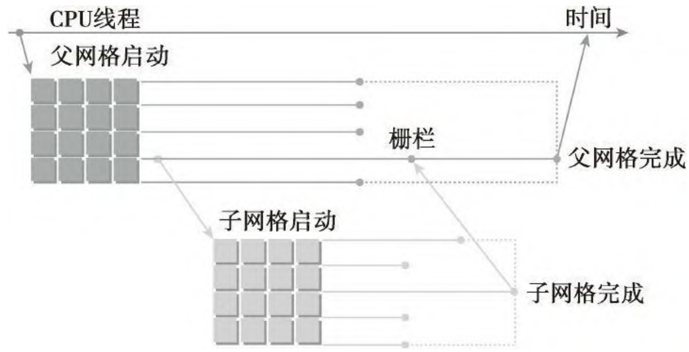
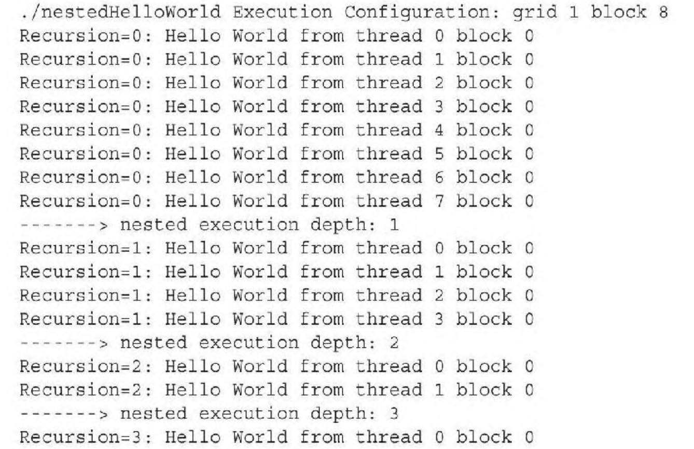

- [](#)
		- [1.3 GV100 硬件架构概述](#13-gv100-硬件架构概述)
			- [1.3.1 Volta SM 硬件结构](#131-volta-sm-硬件结构)
	- [二 理解线程束执行的本质](#二-理解线程束执行的本质)
		- [2.1 线程束和线程块](#21-线程束和线程块)
		- [2.2 线程束分化](#22-线程束分化)
		- [2.3 资源分配](#23-资源分配)
		- [2.4 指令、吞吐量、带宽](#24-指令吞吐量带宽)
		- [2.5 如何提高线程束占用率](#25-如何提高线程束占用率)
		- [2.6 用 nvprof 检测内存操作](#26-用-nvprof-检测内存操作)
	- [三 如何提高并行性](#三-如何提高并行性)
		- [3.1 避免分支化](#31-避免分支化)
		- [3.2 展开循环](#32-展开循环)
		- [3.3 动态并行](#33-动态并行)
	- [总结](#总结)

本文内容主要是以下几个小节:
- 通过配置文件驱动的方法优化内核
- 理解线程束执行的本质
- 增大 GPU 的并行性
- 掌握网格和线程块的启发式配置
- 学习多种 CUDA 的性能指标和事件
- 了解动态并行与嵌套执行

## 一 CUDA 执行模型概述

前面的内容我们学习了 `CUDA` 编程模型中主要有两个抽象（逻辑）概念：**内存层次结构和线程层次结构**，这使得我们能在 GPU 上使用 CUDA 编写并行程序。这一章的 CUDA 执行模型则揭示了 GPU 并行架构的抽象视图，使我们能够据此分析线程的并发，并提供有助于在指令吞吐量和内存访问方面编写高效代码的见解。


### 1.1 CUDA 代码执行层次

**CUDA 代码执行层次**。

GPU 上运行的代码执行层次包含多个层级。对于 “CUDA” 内核的启动，需要定义一个网格，指定协作线程块的数量以及每个线程块的大小。在线程块下方的粒度是单个线程，线程在执行过程中可以持有自己的信息和状态。此外，在逻辑层次 `grid` 和 `block` 之间还有一个硬件控制的层次：“warp”。线程块会被自动分割为 “warp” 组，即由 32 个线程组成的组，这些线程可以在 GPU 的 SIMD 单元上一起执行。

关于 `wrap` d的简单理解就是 **CUDA 采用单指令多线程（SIMT）架构来管理和执行线程，每 32 个线程为一组且被称为线程束（warp），`wrap` 是 CUDA 编程模型中的基本执行单位，在硬件 SIMD 单元上一起执行**。


**网格、块和线程的层次关系**。

通过下图我们可以更直观理解 grid、block 和 thread 的层次关系。一个网格可以包含多个块，每个块的大小可以配置，这决定了块内线程的数量。块内的线程有特别的通信机会，例如可以在程序的某个时刻进行同步。然而，每个线程都有其独立的状态和内存，代表一个独立的个体。**为了最大化 SIMD 硬件单元的利用，线程始终以 32 个为一组执行，无论块的大小如何**。


**逻辑和物理层次结构**。

下图从逻辑视图和物理硬件视图的角度描述了CUDA 编程对应的组件：


逻辑内核层次：网格、块、线程
- 使开发者能够根据问题规模结构化设计解决方案
- 线程具有独立性，可以做出各自的决策

物理内核层次：warp
- 硬件 SIMD 宽度：这是开发者无法避免的一种分组方式。
- 这意味着至少会有 32 个线程运行（即使有些线程可能不活跃）
- 历史上，“CUDA” 一直试图让新手开发者无需关心 warp
- Volta 架构之前：不理解 warp 可能会导致应用崩溃；Volta 之后：忽视 warp 可能会让应用变得更慢

**CUDA Block 执行模型**。

当运行一个内核时，组成网格的块会被提交到 GPU 的块队列中，GPU 将以并行方式处理这些块。并行度取决于具体的硬件，但对开发者来说是透明的：只需定义问题规模，即网格配置和需要运行的线程数。GPU 会在并行计算单元上处理尽可能多的块，并从块队列中持续获取任务，直到所有线程都完成执行。**每个块（及其包含的 warp）都会被分配到一个流式多处理器 (SM) 上执行**。
> 注意，多个线程块可能会被分配到同一个 `SM` 上，而且是根据 `SM` 资源的可用性进行调度的。但同一个线程块不可能分配到多个 `SM` 上。


*GPU 的核心硬件 `SM` 主要由以下部分组成*。

- CUDA 核心：基本的整数/浮点运算单元——高吞吐量、低延迟
- 加载/存储单元 (LD/ST)：用于与不同类型的内存交互，发出内存访问请求到相应控制器——可能存在高延迟
- 特殊功能单元 (SFU)：三角函数等数学运算——吞吐量较低
- 自 Turing 和 Volta 架构以来，还引入了专门的张量核心（图中未展示），专门用于矩阵计算


**什么是线程束（Warp）**

- 定义: 线程束是 CUDA 编程模型中的基本执行单位，由 32 个并行执行的线程组成。在 GPU 中，线程束是由流式多处理器（Streaming Multiprocessor, SM）调度和执行的。
- 同步性: 在一个线程束内的所有线程是同步执行的，这意味着它们在同一时刻执行相同的指令，但可以操作不同的数据。
- 调度和执行: GPU 中的调度器以线程束为单位进行调度。在每个时钟周期，SM 可以调度一个或多个线程束来执行指令。线程束中的所有线程共享同样的指令，但每个线程可以处理不同的数据元素（例如一个数组中的不同元素）。

**CUDA Warp 执行模型**。
当块被分配到特定的 SM 上时，它们的 warp 被称为为“驻留”在该 SM 上。每个周期（`cycle`），SM 会尝试找到 warp 来执行指令；显然，SM 只能选择那些已经准备就绪的 warp。因此，如果某个 warp 依赖于某个计算结果或内存传输，它可能不会被调度，这就引出了 GPU 计算单元“超额分配”的概念。即如果 SM 可选择的 warp 很多，SM 就可以立即切换到另一个 warp 来继续执行，避免 SM 空闲和隐藏延迟（latency）。

wrap 中的线程执行有两种情况：
- **wrap 收敛**: warp 作为一个整体执行，即执行的 warp 中的所有线程将运行相同的指令。
- **wrap 发散**：wrap 中的部分线程可以选择不参与已调度的指令，表现出来就是不同的线程可能位于程序的不同位置。


从图中可以看到 SM 中执行模型的一个基本示意图，展示了一个可能的执行进程。**SM 的 warp 调度器会尝试找到准备好执行的 warp，获取指令并分发给它们执行**。通常一个 warp 无法立即继续执行，因此 warp 调度器会在下一个周期`cycle`寻找其他 warp 来执行。随着时间的推移，warp 逐步推进，直到块中的所有 warp 完成其任务。

**CUDA 线程和单指令多线程 `SIMT`**。

如前所述，**`warp` 中的每个线程都有自己独立计算的值集，以及一个活跃标志**，用来指示该线程是否参与计算。即使线程作为 warp 前进，这个活跃标志就足以让线程表现出独立行为。通过选择性地启用或禁用该标志，warp 中的每个线程理论上都可以在程序运行中走不同的执行路径并达到不同的状态。不过，这是硬件设计的选择，对程序员而言是透明的。通常情况下，开发者可以编写 CUDA 代码，仿佛每个线程都是独立执行的，只有少数例外。这种架构设计允许线程表现为独立个体，但当线程不发散时，仍能利用高效的 SIMD 操作，这种设计被称为“同指令多线程”（SIMT）。

**线程索引（threadIdx）计算及意义**。

程序流程可以根据 “threadIdx”、“blockIdx”、“gridDim” 和 “blockDim” 的值发生变化。


例如，每个线程可以根据其启动 ID 动态调整行为。CUDA 提供了一些内置变量，线程可以使用这些变量来获取它们在网格或块中的 ID，以便在问题域中找到它们需要处理的目标或源位置。以图像处理为例，每个线程被分配到图像的特定二维区域来执行滤波操作。在这种情况下，网格可以配置成不同的维度。CUDA 支持最高三维的网格配置（x、y 和 z 维度），我们可以使用三维结构体作为内核启动参数。对于二维图像，通常会使用二维的网格和块配置。例如，在启动内核后，线程可以获取它们所在的块在网格中的坐标，以及块内每个线程的坐标。右侧的图展示了一个简单的例子：二维块和线程 ID 被展示，块布局为 x 轴 8 个线程，y 轴 1 个线程。编号对应于左侧代码执行时每个线程的输出。

结合另一个内置变量 “blockDim”，线程可以轻松计算它们在整个网格中的全局唯一 ID，例如它们应该处理的输出图像中的确切像素位置。

### 1.2 CUDA 线程执行模型

- 顺序执行程序（但编译器可能会重排指令）
- Volta 及之后的架构支持两种线程执行模式
  - 传统线程调度模式
  - 独立线程调度 (`ITS`)
- 在支持 ITS 的当前 GPU 上，可以通过编译器选项来选择执行模式
- 选择不同的模式可能会显著影响代码的性能和正确性!

**传统调度模式**。

传统的线程调度模式遵循“同步执行”原则，每个 `warp` 只有一个程序计数器。这意味着 **warp 中的所有线程在执行时必须同步，即同一个 warp 中的所有（32个）线程都执行相同的指令**。当有分支时，warp 必须先执行一个分支的所有情况，再执行另一个分支，这意味着 warp 中的线程存在等待情况。


这个行为可以通过以下示例来说明。假设基于线程 ID 进行了分支，（总共 8 个线程）**前四个线程会进入一个分支，而剩余的线程进入另一个分支**。但是，一旦分支所配备的线程索引确定，必须先完成当前分支的执行，才能开始另一个分支。


这种调度方式对开发者编写单个线程时有一定影响。比如，假设 warp 中有一半的线程在等待另一半线程，如上述代码示例所示。由于传统线程调度模型要求线程在完成第一个分支之前不能执行其他分支，该程序将会陷入死锁，因为 A 或 B 分支中的任一个都无法执行完毕，而每个分支都在等待对方触发的事件。

**独立线程调度（`ITS`）**
独立线程调度（ITS） 和传统调度模式的区别在于：每个线程有自己独立的程序计数器，允许不同线程保存不同的下一条指令。虽然同一个 warp 中的线程仍然无法在一个周期内执行不同的指令，但 ITS 允许 warp 根据每个线程的 PC 调度，**可以保证每个分支的代码最终都会被执行**。

新设计的一个副作用是，程序代码不能再假设线程以同步的方式前进，因为线程可以自由地保持发散状态，直到程序结束。GPU 会尝试在合适的时机让线程重新收敛，但如果希望线程以$32$个为一组执行某些指令（例如，为了利用 SIMD 优势）（例如，利用 SIMD 行为），代码中必须通过**同步命令**显式地请求这种收敛。


**设备端同步**。
除了用于同步 CPU 和 GPU 的主机端函数外，线程之间的同步也可以在设备上进行，共有 3 种同步函数：
1. `__syncwarp()`：**用于强制 warp 或其部分线程重新收敛**。
   - 通过额外的掩码参数（32 位整数）定义需要同步的线程子集，每一位代表对应 ID 的线程是否参与同步。
   - 其还可以从程序的不同位置调用，这意味着即使 warp 中的线程在执行不同的分支，也可以同步。但这样容易导致错误，不推荐。
2. `__syncthreads()`: **用于在程序中的某个点同步块内的活跃线程**。如果块内某些线程未到达该点，程序可能会出现未定义行为（通常会导致挂起）
3. `this_grid().sync()`: 可以同步整个内核启动网格，等待所有线程到达程序中的特定

### 1.3 GV100 硬件架构概述

GPU的微观结构因不同厂商、不同架构都会有所差异，但核心部件、概念、以及运行机制大同小异，NVidia Tesla 微观架构如下图所示:


下表是一份粗略的总结，介绍了不同计算能力如何对应于各个架构代际，以及它们在相应时代的 GPU 型号中引入的一些关键功能。


GV100 GPU 由多个 GPU 处理集群 (GPC)、纹理处理集群 (TPC)、流式多处理器 (`SM`-STREAMING MULTIPROCESSOR) 和内存控制器组成。**完整的 GV100 GPU 包括**: 

1. `6` 个 `GPC`，每个 GPC 都有：
- `7` 个 `TPC`（每个包含两个 SM）
- `14` 个 `SM`

1. `84` 个 Volta `SM`，每个 `SM` 都有：
- 64 个 FP32 核心
- 64 个 INT32 核心
- 32 个 FP64 核心
- 8 个张量核心（Tensor Cores）
- 4 个纹理单元（texture units）

1. 8 个 512 位内存控制器（总共 4096 位）

**总结**： 一个完整的 `GV100 GPU` 含有 `84` 个 `SM`，总共有 `5376` 个 `FP32` 核心、`5376` 个 INT32 核心、2688 个 FP64 核心、672 个Tensor Cores 和 336 个纹理单元。 每个 HBM2 DRAM 堆栈都由一对内存控制器控制。 完整的 GV100 GPU 包括总计 6144 KB 的二级缓存。 

下图显示了具有 84 个 `SM` 的完整 GV100 GPU（注意，不同的产品可以使用不同配置的 GV100）。Tesla V100 加速器使用 80 个 SM。 


表 1 比较了过去五年的 NVIDIA Tesla GPU。

下表展示了 NVIDIA Tesla GPU 的比较。


#### 1.3.1 Volta SM 硬件结构

`GV100 GPU` 有 `84` 个 `SM`。与 Pascal GP100 类似，GV100 的每个 SM 都包含 `64` 个 FP32 内核和 `32` 个 FP64 内核。 但是，`GV100 SM` 使用了**一种新的分区方法**来提高 SM 利用率和整体性能。 

- `GP100` `SM` 被划分为**两个处理块**，每个处理块具有 `32` 个 FP32 内核、16 个 FP64 内核、一个指令缓冲区、一个 `warp` 调度程序、两个调度单元和一个 128 KB 的寄存器文件。 
- `GV100` `SM` 分为**四个处理块**，每个处理块有 `16` 个 FP32 内核、8 个 FP64 内核、16 个 INT32 内核、两个用于深度学习矩阵运算的新混合精度 Tensor 内核、一个新的 L0 指令缓存、一个 warp 调度程序、一个调度单元和一个 64 KB 的寄存器文件。新的 L0 指令缓存现在用于每个分区，用以提供比以前的 NVIDIA GPU 中使用的指令缓冲区更高的效率。 

总的来说，与前几代 GPU 相比，GV100 支持更多的**线程、线程束**和**线程块**。 共享内存和 L1 资源的合并使每个 Volta SM 的共享内存容量增加到 96 KB，而 GP100 为 64 KB。

Volta GV100 流式多处理器(SM)架构如下图像所示：


## 二 理解线程束执行的本质

在逻辑上，在内核中所有的线程都是并行地运行的；但在硬件上，不是所有线程在物理上都可以同时并行地执行。

### 2.1 线程束和线程块

线程网格、线程块、线程束、SM 是如何组织运转起来的呢？

**线程束是 SM 中的基本执行单元**。当一个线程块的网格被启动后，网格中的线程块分布在 SM 中。一旦线程块被调度到一个 SM 上，线程块中的线程会被进一步划分为线程束。一个线程束由32 个连续的线程组 成，在一个线程束中，所有的线程按照单指令多线程（SIMT）方式执行；也就是说，所有线程都执行相同的指令，每个线程在私有数据上进行操作。下图展示了线程块的逻辑视图和硬件视图之间的关系。


从逻辑和物理硬件的角度看线程块和线程束的关系：

- **从逻辑角度来看，线程块是线程的集合，它们可以被组织为一维、二维或三维布局**。
- 从硬件角度来看，线程块是一维线程束的集合。在线程块中线程被组织成一维布局，每32个连续线程组成一个线程束

### 2.2 线程束分化

**在同一线程束中的线程执行不同的指令，被称为线程束分化**。线程束分化会导致性能明显地下降，其只会发生在同一个线程束中。

如果使用线程束方法（而不是线程方法）来交叉存取数据，可以避免线程束分化，并且设备的利用率可达到 100%。条件 `（tid/warpSize）%2==0` 使分支粒度是线程束大小的倍数；偶数编号的线程执行 if 子句，奇数编号的线程执行else子句。

```cpp
global_ void mathKernel2(void)
{
    int tid = blockIdx.x * blockDim.x + threadIdx.x;
    float a，b;
    a = b = 0.0f;
    if ((tid / warp_size) % 2 ==0){
        a = 100.0f;
    } else {
        b = 200.0f;
    }
    c[tid] = a + b;
}
```

### 2.3 资源分配

线程束的本地执行上下文主要由以下资源组成：
- 程序计数器
- 寄存器
- 共享内存

**对于一个给定的内核，同时存在于同一个 SM 中的线程块和线程束的数量取决于在 SM 中可用的且内核所需的寄存器和共享内存的数量**。


### 2.4 指令、吞吐量、带宽

考虑到指令延迟，指令可以被分为两种基本类型：
- **算术指令**：其延迟 `latency` 是一个算术操作从开始到它产生输出之间的时间。算术操作为 10～20 个周期。
- **内存指令**：其延迟 `latency` 是指发送出的加载或存储操作和数据到达目的地之间的时间。全局内存访问为 400～800 个周期。

如何估算隐藏延迟所需要的活跃线程束的数量？利特尔法则（Little’s Law）可以提供一个合理的近似值。它起源于队列理论中的一个定理，它也可以应用于 GPU 中，形象地说明了利特尔法则。

所需线程束数量 ＝ 延迟 × 吞吐量


带宽通常是指理论峰值，而吞吐量是指已达到的值。**带宽通常是用来描述单位时间内最大可能的数据传输量，而吞吐量是用来描述单位时间内任何形式的信息或操作的执行速度**，例如，每个周期完成多少个指令。

GPU 的内存带宽是指 GPU 在单位时间内能够从其显存（VRAM）中读取或写入的数据量，也可以理解为 **SM 访问设备内存的速度**。GPU 内存带宽的计算公式为：

$$\text{内存带宽 (GB/s)} = \text{显存频率 (GHz)} \times \text{总线宽度 (bit)} \times \text{每次传输的字节数 (Bytes/transfer)} \times 2$$

其中：
- **显存频率**：显存芯片的工作频率，通常以 `GHz` 为单位。
- **总线宽度**：显存与GPU之间的数据总线宽度，通常以 `bit` 为单位，如256-bit、384-bit等。
- **每次传输的字节数**：这是通过显存芯片每个时钟周期能够传输的字节数。对于`GDDR` 显存，通常是双倍的数据速率（DDR），因此在公式中乘以2。

以 A100-40gb 显卡为例，其显存参数如下
- 显存类型: HBM2
- 显存总线宽度: 5120位（每个通道320位，共16个通道）
- 显存频率: 1215 MHz（1.215 GHz）
- 显存带宽: 1555 GB/s（官方提供）

$$\text{A100}\ 显存带宽 = 1.215 \times \frac{5120}{8}\times 2 = 1555.2\ \text{GB/s}$$

### 2.5 如何提高线程束占用率

在每个 CUDA 核心里指令是顺序执行的。当一个线程束阻塞时，SM 切换执行其他符合条件的线程束。理想情况下，我们想要有足够的线程束占用设备的核心。占用率是每个 SM 中活跃的线程束占最大线程束数量的比值。

$$线程束占用率 = \frac{活跃的线程束数量}{最大线程束数量}$$

注意，极端地操纵线程块会限制资源的利用：
- **小线程块**：每个块中线程太少，会在所有资源被充分利用之前导致硬件达到每个 SM 的线程束数量的限制。
- **大线程块**：每个块中有太多的线程，会导致在每个 SM 中每个线程可用的硬件资源较少。

下述是 GPU 核函数配置的一些总结，以尽可能提高 GPU 计算资源利用率。
- **保持每个块 `block` 中线程数量是线程束大小（32）的倍数**；
- 避免块太小：每个块至少要有 128 或 256 个线程
- 根据内核资源的需求调整块大小；
- 块的数量要远远多于 SM 的数量，从而在设备中可以显示有足够的并行；
- 通过实验得到最佳执行配置和资源使用情况。

但值得注意的是，充分的占用率不是性能优化的唯一目标。内核一旦达到一定级别的占用率，进一步增加占用率可能不会改进性能，更高的占用率也并不一定意味着有更高的性能，因为还有其他因素限制 GPU 的性能。

`cudaDeviceSynchronize` 函数可以用来阻塞主机应用程序，直到所有的 CUDA 操作（复制、核函数等）完成。

### 2.6 用 nvprof 检测内存操作

以二维矩阵求和函数为例:
```cpp
__global__ void sumMatrixOnGPu2D(float *A, float *B, float *C, int NX, int Ny){
    unsigned int ix = blockIdx.x*blockDim.x + threadIdx.x;
  	unsigned int iy = blockIdx.y * blockDim.y + threadIdx.y;
  	unsigned int idx = iy * NX + ix; // 内存索引 idx 的计算原理参考前文代码
  	if (ix < NX && iy < NY) 
    	C[idx]=A[idx]+ B[idx];
}
```

测试一组基础线程块的配置，尤其是大小为（32，32），（32，16），（16，32）和（16，16）的线程块。在 Tesla M2070 上输出以下结果：


在 sumMatrix 内核函数中（C[idx]＝A[idx]＋B[idx]）中有 3 个内存操作：两个内存加载和一个内存存储。可以使用 nvprof 检测这些内存操作的效率。

首先，用 gld_throughput 指标检查**内核的内存的读取吞吐量**，从而得到每个执行配置的差异：

第四种情况中的加载吞吐量最高，第二种情况中的加载吞吐量大约是第四种情况的一半，但第四种情况却比第二种情况慢。所以，更高的加载吞吐量并不一定意味着更高的性能。

其次，用 gld_efficiency 指标检测**全局内存加载效率**，它表示每次全局内存加载请求中，实际被使用的数据字节与总加载数据字节的比值，计算公式如下：

$$\text{gld\_efficiency} = \frac {实际使用的全局内存加载字节数}{总全局内存加载字节数} \times 100\% $$

- 实际使用的全局内存加载字节数：核函数中实际被线程使用的字节数。
- 总全局内存加载字节数：核函数中所有线程加载的总字节数，包括未使用或无效的数据。

`gld_efficiency` 越高，说明内存访问越高效，优化方法是使用对齐访问、减少分支和提高内存访问的空间局部性。

最后两种情况下的加载效率是最前面两种情况的一半。这解释了为什么最后两种情况下更高的加载吞吐量和可实现占用率没有产生较好的性能，因为**加载的有效性（即效率）是较低的**。

最后两种情况的共同特征是它们在最内层维数中块的大小是线程束的一半。如前所述，**对网格和块启发式算法来说，最内层的维数（block.x）应该总是线程束大小的倍数**。

## 三 如何提高并行性

### 3.1 避免分支化
> 额外知识：**归约操作**（Reduction Operation）是一种将多个数据值组合成一个单一值的运算。在并行计算中，归约操作通常用于将分散在不同处理器或计算节点上的数据（如梯度）汇总起来，以便进行全局计算或同步。归约操作可以是简单的，如求和（Sum）、求平均（Mean）、求最大值（Max）或求最小值（Min），也可以是更复杂的自定义运算。

分支化指的是同一线程束（`warp`）内的线程因为**条件语句**（如 if-else、switch 等）执行不同路径，导致这些线程需要分别执行不同的指令，这会降低并行效率，导致内核性能变差。

以数组求和为例，成对的并行求和实现可以被分为以下两种类型:
- **相邻配对**: 元素与它们直接相邻的元素配对
- **交错配对**: 根据给定的跨度配对元素

相邻配对法的 `C++` 实现代码如下所示:

```cpp
#include <stdio.h>

// 相邻配对求和函数
int adjacent_pair_sum(int* arr, int n) {
    while (n > 1) {
        for (int i = 0; i < n / 2; i++) {
            arr[i] = arr[2 * i] + arr[2 * i + 1];
        }
        n /= 2; // 数组长度减半
    }
    return arr[0]; // 最终的和
}

int main() {
    int arr[] = {1, 2, 3, 4, 5, 6, 7, 8}; // 示例数组
    int n = sizeof(arr) / sizeof(arr[0]);
    
    int result = adjacent_pair_sum(arr, n);
    printf("Sum of array elements: %d\n", result);
    
    return 0;
}
```

### 3.2 展开循环

循环展开通过**将循环体中的代码“展开”成多个相似的操作，从而减少循环的执行次数和控制开销**。

如下两个数组求和代码：

```cpp
for (int i = 0; i<100;i++) {
	a[i] = b[i] + c[i]
}
```

重复操作一次循环体，迭代次数可减少为原来的一半:

```cpp
for (int i = 0; i<100;i+=2) {
	a[i] = b[i] + c[i];
	a[i + 1] = b[i+1] + c[i+1]
}
```

高级语言层面上来看，循环展开使性能提高的原因可能不是显而易见的，这种提升来其实是来自于编译器执行循环展开时低级指令的改进和优化。在 GPU 编程中，循环展开的目的是为了优化流水线处理和增加并发操作来提高计算性能。

### 3.3 动态并行

CUDA 的动态并行允许在 GPU 端直接创建和同步新的 GPU 内核。

在动态并行中，内核执行分为两种类型：父母和孩子。父线程、父线程块或父网格启动一个新的网格，即子网格。子线程、子线程块或子网格被父母启动。子网格必须在父线程、父线程块或父网格完成之前完成，只有在所有的子网格都完成之后，父母才会完成。下图说明了父网格和子网格的适用范围。



在 GPU上 嵌套输出 Hello World 的实例代码:

```cpp
__global__ void nestedHelloWorld(int const iSize, int iDepth)
{
	int tid = threadIdx.x;
	printf("Recursion=%d: Hello World from thread %d"
			"block td\n", iDepth, tid, blockIdx.x);
	// condition to stop recursive execution
	if(iSize ==1) return;
	// reduce block size to half
	int nthreads = iSize>>1;
	// thread 0 launches child grid recursively
	if(tid ==0 && nthreads >0){
		nestedHelloWorld<<<1, nthreads>>>(nthreads, ++iDepth);
		printf("------> nested execution depth: %d\n" iDepth);
	}
```

每个线程的核函数执行，会先输出 “Hello World”。接着，每个线程检查自己是否该停止。如果在这个嵌套层里线程数大于1，线程0就递归地调用一个带有线程数一半的子网格。用以下命令编译代码:

```bash
nvcc -arch=sm35 -rdc=true nestedHelloWorld.cu -o nestedHelloWorld -lcudadevrt
```
因为动态并行是由设备运行时库所支持的，所以 nestedHelloWorld 函数必须在命令行使用 `-lcudadevrt` 进行明确链接。当 `-rdc` 标志为 true 时，它强制生成可重定位的设备代码，这是动态并行的一个要求。程序编译运行后输出如下所示:



从输出信息中可见，由主机调用的父网格有1个线程块和8个线程。nestedHelloWorld 核函数递归地调用三次，每次调用的线程数是上一次的一半。

## 总结

在 GPU 设备上，CUDA 执行模型有两个最显著的特性：
- 使用 SIMT 方式在线程束中执行线程
- 在线程块与线程中分配了硬件资源

动态并行使设备能够直接创建新的工作。它确保我们可以用一种更自然和更易于理解的方式来表达递归或依赖数据并行的算法。为实现一个有效的嵌套内核，必须注意设备运行时的使用，其包括子网格启动策略、父子同步和嵌套层的深度。