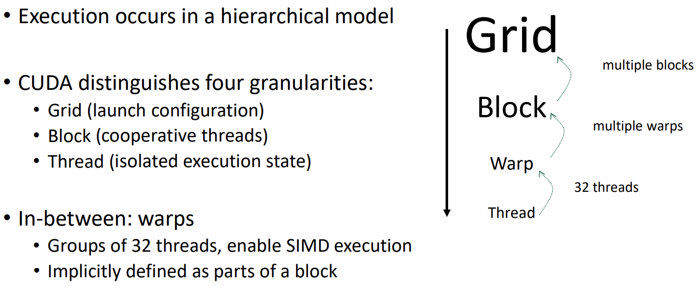
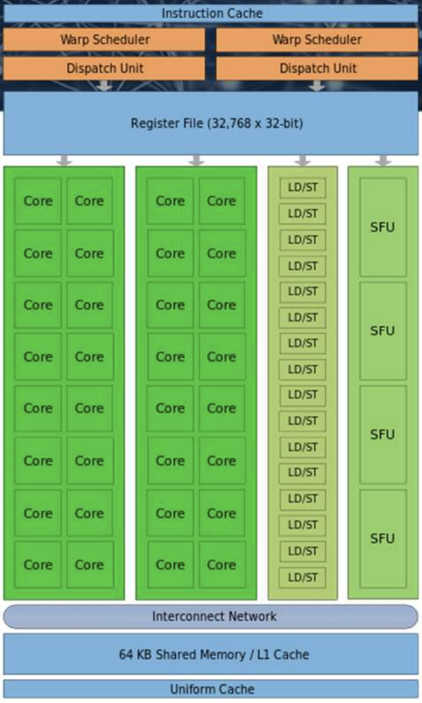
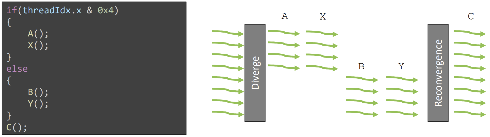
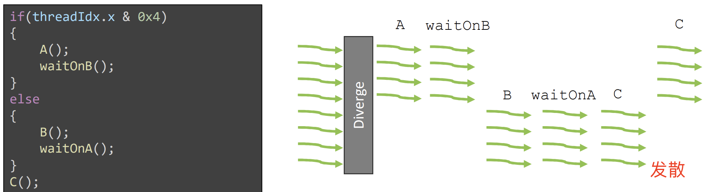
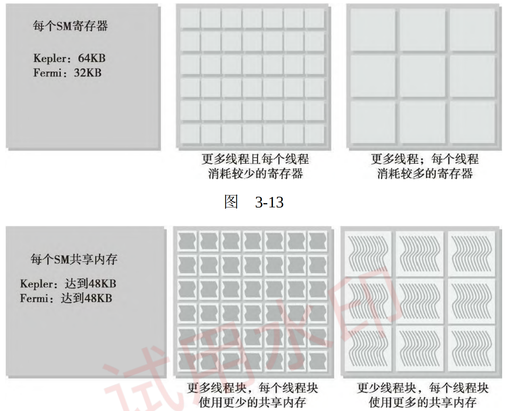
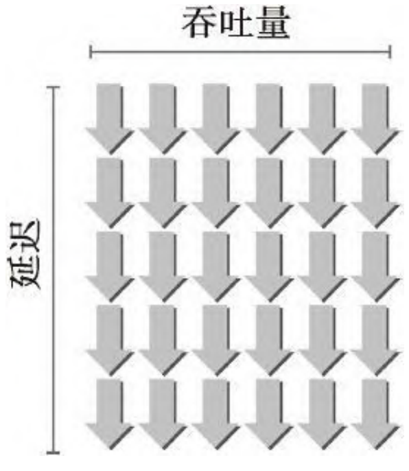

- [一 CUDA 执行模型概述](#一-cuda-执行模型概述)
	- [1.1 CUDA 代码执行层次](#11-cuda-代码执行层次)
	- [1.2 CUDA 线程执行模型](#12-cuda-线程执行模型)
- [二 线程束执行的本质](#二-线程束执行的本质)
	- [2.1 线程束和线程块](#21-线程束和线程块)
	- [2.2 线程束分化](#22-线程束分化)
	- [2.3 资源分配](#23-资源分配)
	- [2.4 指令、吞吐量、带宽](#24-指令吞吐量带宽)
	- [2.5 如何提高线程束占用率](#25-如何提高线程束占用率)

本文内容主要是以下几个小节:
- 通过配置文件驱动的方法优化内核
- 理解线程束执行的本质
- 增大 GPU 的并行性
- 掌握网格和线程块的启发式配置
- 学习多种 CUDA 的性能指标和事件
- 了解动态并行与嵌套执行

## 一 CUDA 执行模型概述

前面的内容我们学习了 `CUDA` 编程模型中主要有两个抽象（逻辑）概念：**内存层次结构和线程层次结构**，这使得我们能在 GPU 上使用 CUDA 编写并行程序。这一章的 CUDA 执行模型则揭示了 GPU 并行架构的抽象视图，使我们能够据此分析线程的并发，并提供有助于在指令吞吐量和内存访问方面编写高效代码的见解。

### 1.1 CUDA 代码执行层次

**CUDA 代码执行层次**。

GPU 上运行的代码执行层次包含多个层级。对于 “CUDA” 内核的启动，需要定义一个网格，指定协作线程块的数量以及每个线程块的大小。在线程块下方的粒度是单个线程，线程在执行过程中可以持有自己的信息和状态。此外，在逻辑层次 `grid` 和 `block` 之间还有一个硬件控制的层次：“warp”。线程块会被自动分割为 “warp” 组，即由 32 个线程组成的组，这些线程可以在 GPU 的 SIMD 单元上一起执行。**GPU 的基本硬件执行单元是 warp：一个包含 32 个线程的线程组**。




总结：`Grid，Block，thread` 都是线程的组织形式，最小的逻辑单位是一个thread，最小的硬件执行单位是 `thread warp`，若干个 thread 组成一个block，block 被加载到 SM 上运行，多个 block 组成一个 Grid。

**grid 、block 和 thread 的层次关系**。

通过下图我们可以更直观理解 grid、block 和 thread 的层次关系。一个网格可以包含多个块，每个块的大小可以配置，这决定了块内线程的数量。块内的线程有特别的通信机会，例如可以在程序的某个时刻进行同步。然而，每个线程都有其独立的状态和内存，代表一个独立的个体。**为了最大化 SIMD 硬件单元的利用，线程始终以 32 个为一组执行，无论块的大小如何**。


**逻辑和物理层次结构**。

下图从逻辑视图和物理硬件视图的角度描述了CUDA 编程对应的组件：


逻辑内核层次：网格、块、线程
- 使开发者能够根据问题规模结构化设计解决方案
- 线程具有独立性，可以做出各自的决策

物理内核层次：warp
- 硬件 SIMD 宽度：这是开发者无法避免的一种分组方式。
- 这意味着至少会有 32 个线程运行（即使有些线程可能不活跃）
- 历史上，“CUDA” 一直试图让新手开发者无需关心 warp
- Volta 架构之前：不理解 warp 可能会导致应用崩溃；Volta 之后：忽视 warp 可能会让应用变得更慢

**CUDA Block 执行模型**。

当运行一个内核时，组成网格的块会被提交到 GPU 的块队列中，GPU 将以并行方式处理这些块。并行度取决于具体的硬件，但对开发者来说是透明的：只需定义问题规模，即网格配置和需要运行的线程数。GPU 会在并行计算单元上处理尽可能多的块，并从块队列中持续获取任务，直到所有线程都完成执行。**每个块（及其包含的 warp）都会被分配到一个流式多处理器 (SM) 上执行**。
> 注意，多个线程块可能会被分配到同一个 `SM` 上，而且是根据 `SM` 资源的可用性进行调度的。但同一个线程块不可能分配到多个 `SM` 上。


*GPU 的核心硬件 `SM` 主要由以下部分组成*。

- CUDA 核心：基本的整数/浮点运算单元——高吞吐量、低延迟
- 加载/存储单元 (LD/ST)：用于与不同类型的内存交互，发出内存访问请求到相应控制器——可能存在高延迟
- 特殊功能单元 (SFU)：三角函数等数学运算——吞吐量较低
- 自 Turing 和 Volta 架构以来，还引入了专门的张量核心（图中未展示），专门用于矩阵计算



- 一个 `SM` 中最多能拥有的线程块个数为 Nb = 16（开普勒架构和图灵架构）或者 Nb = 32（麦克斯韦架构、帕斯卡架构和伏特架构）；
- 一个 `SM` 中最多能拥有的线程个数为 Nt = 2048（从开普勒架构到伏特架构）或者 Nt = 1024（图灵架构）。

**什么是线程束（Warp）**

- 定义: 线程束是 CUDA 编程模型中的基本执行单位，由 32 个并行执行的线程组成。在 GPU 中，线程束是由流式多处理器（Streaming Multiprocessor, SM）调度和执行的。
- 同步性: 在一个线程束内的所有线程是同步执行的，这意味着它们在同一时刻执行相同的指令，但可以操作不同的数据。
- 调度和执行: GPU 中的调度器以线程束为单位进行调度。在每个时钟周期，SM 可以调度一个或多个线程束来执行指令。线程束中的所有线程共享同样的指令，但每个线程可以处理不同的数据元素（例如一个数组中的不同元素）。

**CUDA Warp 执行模型**。
当块被分配到特定的 SM 上时，它们的 warp 被称为为“驻留”在该 SM 上。每个周期（`cycle`），SM 会尝试找到 warp 来执行指令；显然，SM 只能选择那些已经准备就绪的 warp。因此，如果某个 warp 依赖于某个计算结果或内存传输，它可能不会被调度，这就引出了 GPU 计算单元“超额分配”的概念。即如果 SM 可选择的 warp 很多，SM 就可以立即切换到另一个 warp 来继续执行，避免 SM 空闲和隐藏延迟（latency）。

wrap 中的线程执行有两种情况：
- **wrap 收敛**: warp 作为一个整体执行，即执行的 warp 中的所有线程将运行相同的指令。
- **wrap 发散**：wrap 中的部分线程可以选择不参与已调度的指令，表现出来就是不同的线程可能位于程序的不同位置。


从图中可以看到 SM 中执行模型的一个基本示意图，展示了一个可能的执行进程。**SM 的 warp 调度器会尝试找到准备好执行的 warp，获取指令并分发给它们执行**。通常一个 warp 无法立即继续执行，因此 warp 调度器会在下一个周期`cycle`寻找其他 warp 来执行。随着时间的推移，warp 逐步推进，直到块中的所有 warp 完成其任务。

**CUDA 线程和单指令多线程 `SIMT`**。

如前所述，**`warp` 中的每个线程都有自己独立计算的值集，以及一个活跃标志**，用来指示该线程是否参与计算。即使线程作为 warp 前进，这个活跃标志就足以让线程表现出独立行为。通过选择性地启用或禁用该标志，warp 中的每个线程理论上都可以在程序运行中走不同的执行路径并达到不同的状态。不过，这是硬件设计的选择，对程序员而言是透明的。通常情况下，开发者可以编写 CUDA 代码，仿佛每个线程都是独立执行的，只有少数例外。这种架构设计允许线程表现为独立个体，但当线程不发散时，仍能利用高效的 SIMD 操作，这种设计被称为“同指令多线程”（SIMT）。

**线程索引（threadIdx）计算及意义**。

程序流程可以根据 “threadIdx”、“blockIdx”、“gridDim” 和 “blockDim” 的值发生变化。

每个线程可以根据自己的启动 ID 自主调整行为。CUDA 提供了一些内置变量，线程可以使用这些变量来获取它们在网格或块中的 ID，以便在问题域中找到它们需要处理的目标或源位置。

以图像处理-滤波操作为例每个线程被分配到图像的特定二维区域来执行滤波操作。在这种情况下，网格可以通过多种方式配置。在这种情况下，网格可以配置成不同的维度。CUDA 支持最高三维的网格配置（x、y 和 z 维度）。**对于二维图像，利用二维块和网格维度是合理的选择**。例如，在启动特定内核后，每个线程可以获取该线程在网格中的块坐标，以及块内的线程坐标。下面的图像展示了一个简单的例子，其中 2D 块和线程 ID 对应的是一个使用 x 轴上 8 个线程和 y 轴上 1 个线程的简单块布局。图中的编号对应于左侧代码运行时每个线程生成的输出。

结合另一个内置变量 blockDim，线程也可以轻松找到其在整个网格中的唯一全局 ID，例如确定其在输出图像中应计算的确切像素。


### 1.2 CUDA 线程执行模型

- 顺序执行程序（但编译器可能会重排指令）
- Volta 及之后的架构支持两种线程执行模式
  - 传统线程调度模式
  - 独立线程调度 (`ITS`)
- 在支持 ITS 的当前 GPU 上，可以通过编译器选项来选择执行模式
- 选择不同的模式可能会显著影响代码的性能和正确性!

**传统调度模式**。

传统的线程调度模式遵循“同步执行”原则，每个 `warp` 只有一个程序计数器。这意味着 **warp 中的所有线程在执行时必须同步，即同一个 warp 中的所有（32个）线程都执行相同的指令**。当有分支时，warp 必须先执行一个分支的所有情况，再执行另一个分支，这意味着 warp 中的线程存在等待情况。



这个行为可以通过以下示例来说明。假设基于线程 ID 进行了分支，（总共 8 个线程）**前四个线程会进入一个分支，而剩余的线程进入另一个分支**。但是，一旦分支所配备的线程索引确定，必须先完成当前分支的执行，才能开始另一个分支。


这种调度方式对开发者编写单个线程时有一定影响。比如，假设 warp 中有一半的线程在等待另一半线程，如上述代码示例所示。由于传统线程调度模型要求线程在完成第一个分支之前不能执行其他分支，该程序将会陷入死锁，因为 A 或 B 分支中的任一个都无法执行完毕，而每个分支都在等待对方触发的事件。

**独立线程调度（`ITS`）**
独立线程调度（ITS） 和传统调度模式的区别在于：每个线程有自己独立的程序计数器，允许不同线程保存不同的下一条指令。虽然同一个 warp 中的线程仍然无法在一个周期内执行不同的指令，但 ITS 允许 warp 根据每个线程的 PC 调度，**可以保证每个分支的代码最终都会被执行**。

新设计的一个副作用是，程序代码不能再假设线程以同步的方式前进，因为线程可以自由地保持发散状态，直到程序结束。GPU 会尝试在合适的时机让线程重新收敛，但如果希望线程以$32$个为一组执行某些指令（例如，为了利用 SIMD 优势）（例如，利用 SIMD 行为），代码中必须通过**同步命令**显式地请求这种收敛。



**设备端同步**。
除了用于同步 CPU 和 GPU 的主机端函数外，线程之间的同步也可以在设备上进行，共有 3 种同步函数：
1. `__syncwarp()`：**用于强制 warp 或其部分线程重新收敛**。
   - 通过额外的掩码参数（32 位整数）定义需要同步的线程子集，每一位代表对应 ID 的线程是否参与同步。
   - 其还可以从程序的不同位置调用，这意味着即使 warp 中的线程在执行不同的分支，也可以同步。但这样容易导致错误，不推荐。
2. `__syncthreads()`: **用于在程序中的某个点同步块内的活跃线程**。如果块内某些线程未到达该点，程序可能会出现未定义行为（通常会导致挂起）
3. `this_grid().sync()`: 可以同步整个内核启动网格，等待所有线程到达程序中的特定


## 二 线程束执行的本质

在逻辑上，在内核中所有的线程都是并行地运行的；但在硬件上，不是所有线程在物理上都可以同时并行地执行。

### 2.1 线程束和线程块

线程网格、线程块、线程束、SM 是如何组织运转起来的呢？

**线程束是 SM 中的基本执行单元**。当一个线程块的网格被启动后，网格中的线程块分布在 SM 中；一旦线程块被调度到一个 SM 上，线程块中的线程会被进一步划分为线程束；一个线程束由 32 个连续的线程组成，在一个线程束中，所有的线程按照单指令多线程（SIMT）方式执行；也就是说，所有线程都执行相同的指令，每个线程在私有数据上进行操作。下图展示了线程块的逻辑视图和硬件视图之间的关系。


从逻辑和物理硬件的角度看线程块和线程束的关系：

- **从逻辑角度来看，线程块是线程的集合，它们可以被组织为一维、二维或三维布局**。
- 从硬件角度来看，线程块是一维线程束的集合。在线程块中线程被组织成一维布局，每32个连续线程组成一个线程束

### 2.2 线程束分化

**在同一线程束中的线程执行不同的指令，被称为线程束分化**。线程束分化会导致性能明显地下降，其只会发生在同一个线程束中。

如果使用线程束方法（而不是线程方法）来交叉存取数据，可以避免线程束分化，并且设备的利用率可达到 100%。条件 `（tid/warpSize）%2==0` 使分支粒度是线程束大小的倍数；偶数编号的线程执行 if 子句，奇数编号的线程执行else子句。

```cpp
global_ void mathKernel2(void)
{
    int tid = blockIdx.x * blockDim.x + threadIdx.x;
    float a，b;
    a = b = 0.0f;
    if ((tid / warp_size) % 2 ==0){
        a = 100.0f;
    } else {
        b = 200.0f;
    }
    c[tid] = a + b;
}
```

### 2.3 资源分配

线程束的本地执行上下文主要由以下资源组成：
- 程序计数器
- 寄存器
- 共享内存

**对于一个给定的内核，同时存在于同一个 SM 中的线程块和线程束的数量取决于在 SM 中可用的且内核所需的寄存器和共享内存的数量**。



### 2.4 指令、吞吐量、带宽

考虑到指令延迟，指令可以被分为两种基本类型：
- **算术指令**：其延迟 `latency` 是一个算术操作从开始到它产生输出之间的时间。算术操作为 10～20 个周期。
- **内存指令**：其延迟 `latency` 是指发送出的加载或存储操作和数据到达目的地之间的时间。全局内存访问为 400～800 个周期。

如何估算隐藏延迟所需要的活跃线程束的数量？利特尔法则（Little’s Law）可以提供一个合理的近似值。它起源于队列理论中的一个定理，它也可以应用于 GPU 中，形象地说明了利特尔法则。

所需线程束数量 ＝ 延迟 × 吞吐量



带宽通常是指理论峰值，而吞吐量是指已达到的值。**带宽通常是用来描述单位时间内最大可能的数据传输量，而吞吐量是用来描述单位时间内任何形式的信息或操作的执行速度**，例如，每个周期完成多少个指令。

GPU 的内存带宽是指 GPU 在单位时间内能够从其显存（VRAM）中读取或写入的数据量，也可以理解为 **SM 访问设备内存的速度**。GPU 内存带宽的计算公式为：

$$\text{内存带宽 (GB/s)} = \text{显存频率 (GHz)} \times \text{总线宽度 (bit)} \times \text{每次传输的字节数 (Bytes/transfer)} \times 2$$

其中：
- **显存频率**：显存芯片的工作频率，通常以 `GHz` 为单位。
- **总线宽度**：显存与GPU之间的数据总线宽度，通常以 `bit` 为单位，如256-bit、384-bit等。
- **每次传输的字节数**：这是通过显存芯片每个时钟周期能够传输的字节数。对于`GDDR` 显存，通常是双倍的数据速率（DDR），因此在公式中乘以2。

以 A100-40gb 显卡为例，其显存参数如下
- 显存类型: HBM2
- 显存总线宽度: 5120位（每个通道320位，共16个通道）
- 显存频率: 1215 MHz（1.215 GHz）
- 显存带宽: 1555 GB/s（官方提供）

$$\text{A100}\ 显存带宽 = 1.215 \times \frac{5120}{8}\times 2 = 1555.2\ \text{GB/s}$$

### 2.5 如何提高线程束占用率

在每个 CUDA 核心里指令是顺序执行的。当一个线程束阻塞时，SM 切换执行其他符合条件的线程束。理想情况下，我们想要有足够的线程束占用设备的核心。占用率是每个 SM 中活跃的线程束占最大线程束数量的比值。

$$线程束占用率 = \frac{活跃的线程束数量}{最大线程束数量}$$

注意，极端地操纵线程块会限制资源的利用：
- **小线程块**：每个块中线程太少，会在所有资源被充分利用之前导致硬件达到每个 SM 的线程束数量的限制。
- **大线程块**：每个块中有太多的线程，会导致在每个 SM 中每个线程可用的硬件资源较少。

下述是 GPU 核函数配置的一些总结，以尽可能提高 GPU 计算资源利用率。
- **保持每个块 `block` 中线程数量是线程束大小（32）的倍数**；
- 避免块太小：每个块至少要有 128 或 256 个线程
- 根据内核资源的需求调整块大小；
- 块的数量要远远多于 SM 的数量，从而在设备中可以显示有足够的并行；
- 通过实验得到最佳执行配置和资源使用情况。

但值得注意的是，充分的占用率不是性能优化的唯一目标。内核一旦达到一定级别的占用率，进一步增加占用率可能不会改进性能，更高的占用率也并不一定意味着有更高的性能，因为还有其他因素限制 GPU 的性能。