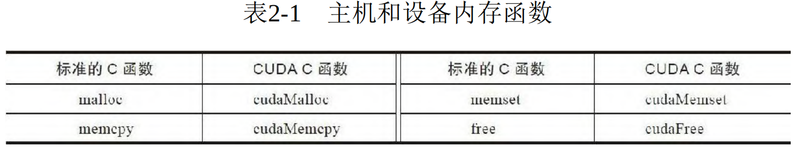
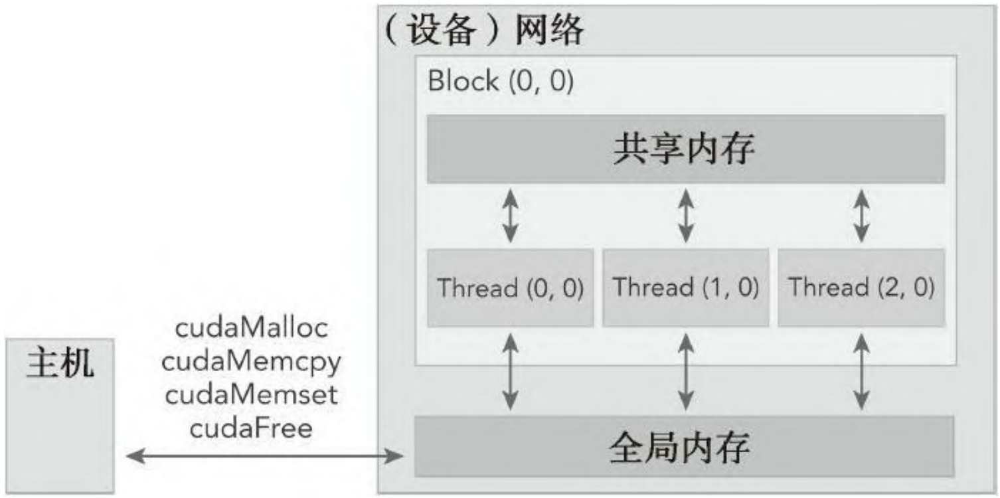
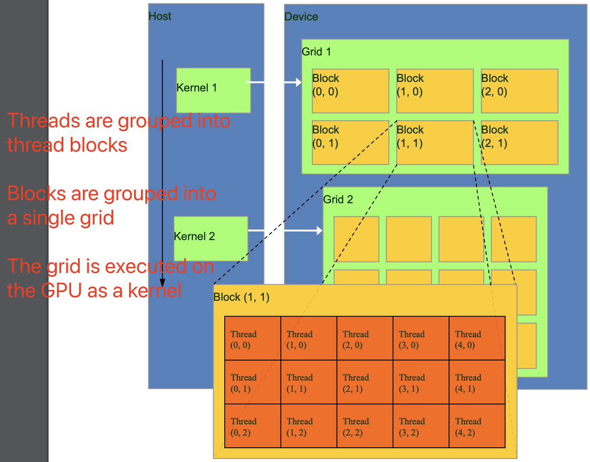
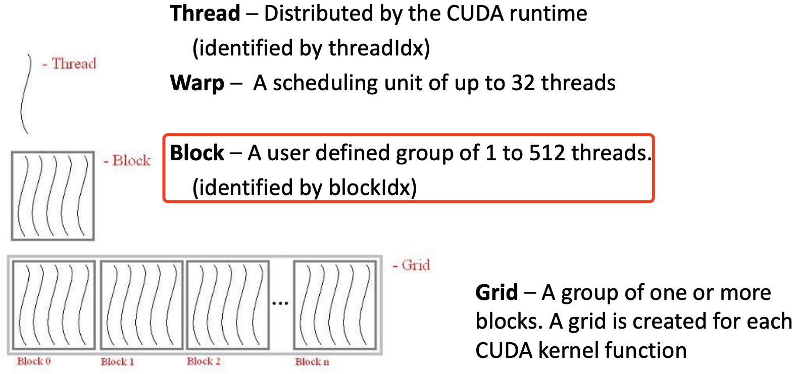
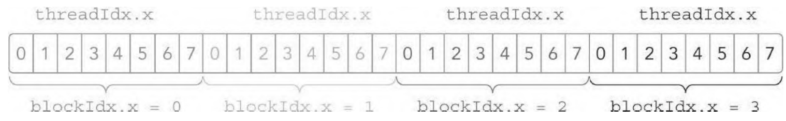
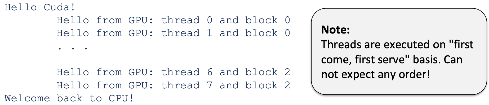
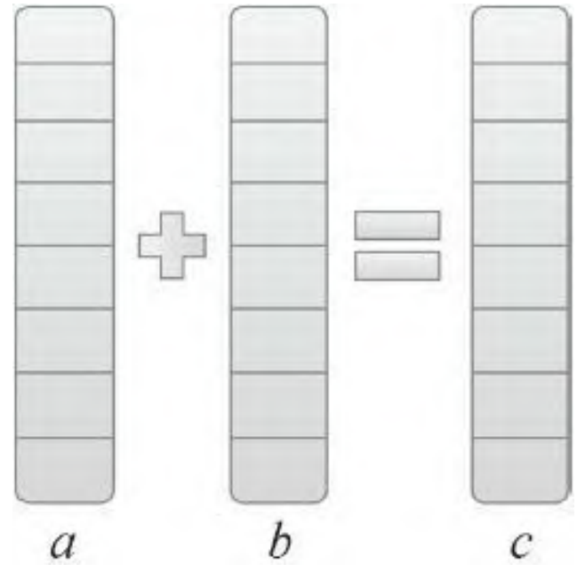
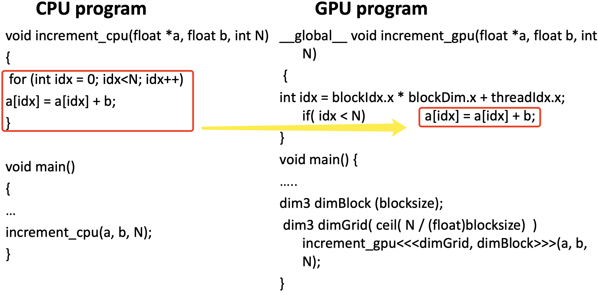
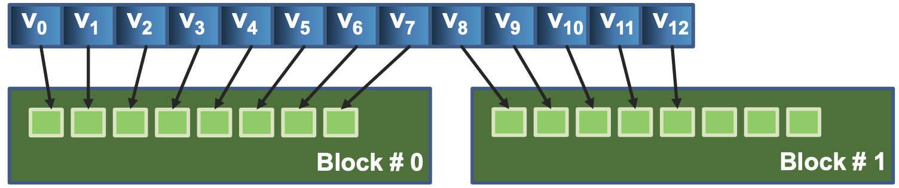

- [一 CUDA 编程模型概述](#一-cuda-编程模型概述)
  - [1.2 内存管理](#12-内存管理)
    - [1.2.1 内存层次结构](#121-内存层次结构)
  - [1.3 线程管理](#13-线程管理)
    - [1.3.1 线程层次结构](#131-线程层次结构)
- [二 CUDA 核函数开发](#二-cuda-核函数开发)
  - [2.1 CUDA 编程结构](#21-cuda-编程结构)
  - [2.2 核函数配置和调用](#22-核函数配置和调用)
- [参考资料](#参考资料)

## 一 CUDA 编程模型概述

CUDA 是 NVIDIA 的通用并行计算架构（编程模型），是在 C 语言基础上扩展的。借助于CUDA，你可以像编写 C/C++ 语言程序一样实现并行算法。

`CUDA` 编程模型提供了一个计算机架构抽象作为应用程序和其可用硬件之间的桥梁，并利用 GPU 架构的计算能力提供了以下几个特有功能：
1. cuda 线程层次：一种通过层次结构在 GPU 中组织线程的方法；
2. cuda 内存层次：一种通过层次结构在 GPU 中访问内存的方法。

### 1.2 内存管理

CUDA 编程的一个关键是内存管理，，CUDA运行时除了负责分配与释放设备内存，也负责在主机内存和设备内存之间传输数据。表2-1 列出了标准的 C 函数以及相应地针对内存操作的 CUDA C 函数。



1，`cudaMalloc`: 负责分配 GPU 内存，函数原型为：
```cpp
__host__ ​__device__ ​cudaError_t cudaMalloc ( void** devPtr, size_t size )
```

**参数**：
- `devPtr`：指向已分配设备内存的指针
- `size`：请求的分配内存大小（以字节为单位）

`__device__` 是一个限定词，声明一个函数是：在设备上执行的，和仅可从设备调用。
`__host__` 也是限定词声明的函数是：在主机上执行的，和仅可从主机调用。

`__host__` 限定词也可以用于与 `__device__` 限定词的组合，这种的情况下，这个函数是为主机和设备双方编译。

2，`cudaMemcpy`: 负责主机和设备之间的数据传输，同步方式执行，在函数返回以及传输操作完成之前主机应用程序是阻塞的。其函数原型为：

```cpp
__host__​cudaError_t cudaMemcpy ( void* dst, const void* src, size_t count, cudaMemcpyKind kind )
```

此函数从 `src` 指向的源存储区复制一定数量的字节到 `dst` 指向的目标存储区。复制方向由 kind 指定，其中的 kind 有以下几种：

```bash
cudaMemcpyHostToHost = 0
Host -> Host
cudaMemcpyHostToDevice = 1
Host -> Device
cudaMemcpyDeviceToHost = 2
Device -> Host
cudaMemcpyDeviceToDevice = 3
Device -> Device
cudaMemcpyDefault = 4 # 在这种情况下，传输类型是从指针值推断出来的
```

3，`cudaMemset`: 将 GPU 设备内存的指定区域初始化或设置为某个值，该函数异步执行，除非操作的是固定的主机内存。函数原型为:

```c
__host__​cudaError_t cudaMemset ( void* devPtr, int  value, size_t count )
```

**参数：**
- `devPtr`: 指向设备内存的指针。
- `value`: 要设置的字节值（通常为 0）。
- `count`: 要设置的内存大小（以字节为单位）。

**返回值：**
- 成功返回 cudaSuccess。
- 可能返回错误，如 cudaErrorInvalidValue 或其他错误。

#### 1.2.1 内存层次结构

CPU/GPU 内存往往存在一种组织结构（hierarchy）。在这种结构中，含有多种类型的内存，每种内存分别具有不同的容量和延迟（latency，可以理解为处理器等待内存数据的时间）。一般来说，延迟低（速度高）的内存容量小，延迟高（速度低）的内存容量大。

在 GPU 内存层次结构中，最主要的两种内存是**全局内存和共享内存**。全局类似于 CPU 的系统内存，而共享内存类似于 CPU 的缓存。但 GPU 的共享内存可以由 CUDA C 的内核直接控制。



### 1.3 线程管理

当核函数在主机端启动时，它的执行会移动到设备上，此时设备中会产生大量的线程并且每个线程都执行由核函数指定的语句。**由一个内核 `kernel` 启动所产生的所有线程统称为一个网格 `grid`，同一网格中的所有线程共享相同的全局内存空间。一个网格由多个线程块 `block` 构成，一个线程块包含一组线程 `thread`**，同一线程块内的线程协作可以通过同步和共享内存方式实现。


网格、块和线程的组成关系如下图所示:



不同块内的线程不能协作，每个块和块内的线程都有一个唯一的 ID。线程 ID = $(\text{blockIdx} * \text{blockDim})+\text{threadIdx}$（一维块）
- `threadIdx` – 线程 ID（块内的线程索引）
- `blockIdx` – 块 ID（线程块在线程网格内的索引）
- `blockDim` – 块的尺寸

当执行一个核函数时，**CUDA 运行时为每个线程分配坐标变量 blockIdx（块索引） 和 threadIdx（线程索引）**，每个线程也都可以输出自己的线程索引、块索引、块维度和网格维度。

blockIdx 和 threadIdx 都是 `dim3` 类型的变量，基于 `uint3` 定义的整数型向量，包含 `3` 个无符号整数的结构，可以通过 `x、y、z` 三个字段来指定。

```cpp
blockIdx.x
blockIdx.y
blockIdx.z
threadIdx.x
threadIdx.y
threadIdx.z
```

**在启动内核之前需要先定义主机端的网格和块变量**，并从主机端通过由 `x、y、z` 三个字段决定的矢量结构来访问它们。注意，**网格大小是块大小的倍数**。

```cpp
int N = 1000;
dim3 block (1024);
dim3 grid ((N + block.x - 1) / block.x)
```

**注意**：使用 $(\text{N} + \text{block.x} - 1) / \text{block.x}$ 而不是 $\text{N} / \text{block.x}$ 的原因是为了**处理未对齐的元素和向上取整**。

对于一个给定的数据大小，确定网格和块尺寸的一般步骤为：
1. 确定块的大小
2. 在已知数据大小和块大小的基础上计算网格维度

而要确定块尺寸，通常需要考虑：
- 内核的性能特性
- GPU 资源的限制

#### 1.3.1 线程层次结构

内核启动的网格和线程块的维度会影响性能（优化途径），另外网格和线程块的维度是存在限制的，线程块的主要限制因素就是可利用的计算资源，如寄存器，共享内存等。网格和线程块从逻辑上代表了一个核函数的线程层次结构。



## 二 CUDA 核函数开发

### 2.1 CUDA 编程结构

在 CUDA 的架构下，一个程序分为两个部份：`host` 端和 `device` 端。Host 端是指在 CPU 上执行的部份，而 device 端则是 GPU 上执行的部份。Device 端的程序又称为 "kernel"。通常 host 端程序会将数据准备好后，复制到 GPU 内存中，再由 GPU 执行 device 端程序，完成后再由 host 端程序将结果从 GPU 内存中取回。

**CUDA 开发基本思路**:
1. 为主机和设备分配相同大小的内存
2. 将数据从主机传送到设备
3. 运行**内核 kernel 函数**对数据进行计算
4. 将数据传回主机

cuda c 程序代码主逻辑：
```c
int main( void) {
    /* 1. allocate memory on GPU */
    /* 2. Copy data from Host to GPU */
    /* 3. Execute GPU kernel */
    /* 4. Copy data from GPU back to Host */
    /* 5. Free GPU memory */
    return 0;
}
```

### 2.2 核函数配置和调用

**1，核函数配置**

```cpp
// 核函数调用形式
kernel_name<<<gird, block>>>(argument list); 
```

`<<<>>>` 运算符内是核函数的执行配置，利用执行配置可以指定线程在 GPU 上调度运行的方式，即。执行配置参数：
- 第一个值是**网格 grid 维度**，也就是启动块的数目。
- 第二个值是**线程块 block 维度**，也就是每个块中线程的数目。

这也意味着通过指定网格和块的维度，我们可以配置：
- **内核函数中线程的数目**；
- **内核中使用的线程布局**。

同一个块中的线程之间可以相互协作，不同块内的线程不能协作。

**1，核函数和变量类型修饰符**

核函数修饰符：
- `__device__`:在设备端执行和调用。
- `__global__`: 在设备端执行，可从主机端也可从计算能力在 3 以上的设备中调用。
- `__host__`: 在主机端执行和调用。

```c
void increment_cpu(float *a, float b, int N) // CPU program
__global__ void increment_gpu(float *a, float b, int N) // GPU program
```

注意，`__device__` 和 `__host__` 修饰符可以一齐使用，这样函数可以同时在主机和设备端进行编译。核函数是在设备端执行的代码，核函数具有以下限制:
- 只能访问设备内存
- 必须具有 `void` 返回类型
- 不支持可变数量的参数
- 不支持静态变量
- 显示异步行为

变量类型修饰符（用于指定变量的存储方式）：
- `__device__`: 存储在全局内存中
- `__shared__`: 存储在共享内存中
- `__constant__`: 存储在常量内存中

```c
__global__ void increment_gpu(float *a, float b, int N)
{
    __shared__ float shared[];
}
```

**2，调用核函数和核函数配置**

核函数调用和常规函数调用有很大区别，其在 `main()` 函数中的调用形式如下所示:

```c
void main(){
    int blocks = 256;
    int threadsperblock = 512;
    mycudafunc<<<blocks,threadsperblock>>>(argument list);
    cudaDeviceSynchonize();
}
```

**核函数的调用与主机线程是异步的**。核函数调用结束后，控制权立刻返回给主机端。我们可以**调用以下函数来强制主机端程序等待所有的核函数执行结束**。另外，有些 CUDA runtime API 在主机和设备之间是隐式同步的，如 `cudaMemcpy` 函数在主机和设备之间拷贝数据时，主机端隐式同步，即主机端程序必须等待数据拷贝完成后才能继续执行程序。

**`<<<>>>` 运算符内是核函数的执行配置，用于配置内核函数中线程的数目和内核中使用的线程布局**。执行配置参数：
- blocks: **网格 grid 维度**，也就是启动块的数目。
- threadsperblock: **线程块 block 维度**，也就是每个块中线程的数目。

假设有 `32` 个数据元素用于计算，如果每 `8` 个元素一个块，则需要启动 `4`个块，配置代码和线程布局图如下所示:

```cpp
kernel_name<<<4, 8>>>(argument list); 
```



一个完整的 cuda 核函数定义及调用如下所示：
```c
/* Function executed on device (GPU */
__gloabl__ void hello(void) {
    printf("\tHello cuda world, from gpu: thread: %d, block: %d\n", threadIdx.x, blockIdx.x);
}

int main(void) {
    int blocks = 3;
    int threadsperblock = 8;
    printf("hello cuda! \n");
    /* execute function on device (GPU) */
    hello<<<blocks,threadsperblock>>>(); 
    /* wait until all threads finish their job */
    cudaDeviceSynchronize();
    printf("Welcom comeback to cpu!\n");

    return 0;
}
```

使用 NVIDIA 的 nvcc 编译器编译和构建程序，运行结果如下所示。

```bash
nvcc -o helloCuda helloCuda.cu -arch sm_20
```


`CUDA` 程序能够编译运行，但是结果不一定正确，那么如何验证核函数是否正确运行呢？首先可以通过在核函数中添加 `printf` 函数打印相关信息，其次是将执行参数设置为 `<<<1，1>>>`，强制用一个块和一个线程执行核函数，模拟串行执行程序，方便调试和验证结果是否正确。

**3，GPU 内存分配、释放和复制**

主机 (CPU) 管理 GPU 内存的常用函数:
- cudaMalloc (void ** devPtr, size_t size): 在设备上分配内存。
- cudaMemset (void * devPtr, int value, size_t count): 将设备内存初始化或设置为一个值。
- cudaFree (void* devPtr): 释放设备上的内存。
- cudaMemcpy ( void *dst, void *src, size_t count, cudaMemcpyKind kind): 在主机和设备之间复制数据。

```c
void main() {
    int nbytes = 1024 * sizeof(int); // 1024个int数据占据的字节数
    int* p_arr = 0;
    cudaMalloc((void**)&p_arr, nbytes); // 分配设备内存
    cudaMemset(p_arr, 1, nbytes); // 设备内存值初始化
    cudaFree(p_arr); // 设备内存释放

    return 0;
}
```

**4，主机端同步**

所有内核启动都是异步的：
- 控制权会立即返回给 CPU
- 内核在所有先前的 CUDA 调用完成后开始执行

内存复制是同步的：
- 复制完成后，控制权返回给 CPU
- 复制操作在所有先前的 CUDA 调用完成后开始

cudaThreadSynchronize()
- 会阻塞，直到所有先前的 CUDA 调用完成

异步 CUDA 调用的优势：
- 支持非阻塞的内存复制
- 能够实现内存复制与内核执行的重叠

**5，cuda 代码实例-向量相加**

通过两个数组相加的示例来学习如何使用 `CUDA C` 编程。如下图所示，数组 a 的第一个元素与数组 b 的第一个元素相加，得到的结果作为数组 c 的第一个元素，重复这个过程直到数组中的所有元素都进行了一次运算。



首先，要理解一个概念就是，无论是数组相加还是矩阵相乘算法，gpu 的实现逻辑已经和 cpu 不一样了，cpu 需要用 for 循环迭代多次实现的操作，gpu 用一行代码就可实现了。

<center class="half">
    
</center>

先看 cpu 程序如何实现:

```c
#include <stdio.h>
#include <stdlib.h>
#include <time.h>

// 数组初始化函数
void initialArrays(float *array1, float *array2, int numElements ) {
    for (int i = 0; i < numElements ; i++) {
        array1[i] = (float)rand() / RAND_MAX * 100.0; // 生成 0 到 100 之间的随机浮点数
        array2[i] = (float)rand() / RAND_MAX * 1000.0; // 生成 0 到 1000 之间的随机浮点数
        
    }
}
// 数组相加的函数
void addArrays(float *array1, float *array2, float *result, int numElements ) {
    for (int i = 0; i < numElements ; i++) {
        *(result + i) = *(array1 + i) + *(array2 + i);
    }
}

// 打印数组的函数
void printArray(float *array, int numElements ) {
    for (int i = 0; i < numElements ; i++) {
        printf("%f ", *(array + i));
    }
    printf("\n");
}

int main() {
    int numElements  = 1000000;  // 数组的长度
    srand(time(NULL)); // 初始化随机数种子

    // 使用 malloc 动态分配内存
    float *array1 = (float *)malloc(numElements  * sizeof(float));
    float *array2 = (float *)malloc(numElements  * sizeof(float));
    float *result = (float *)malloc(numElements  * sizeof(float));

    // 初始化数组
    initialArrays(array1, array2, numElements );
    // 调用函数进行数组相加
    addArrays(array1, array2, result, numElements );

    // 打印结果数组
    printf("Result array: ");
    printArray(result, numElements );

    // 释放动态分配的内存
    free(array1);
    free(array2);
    free(result);

    return 0;
}
```

**基于上述代码修改后的 CUDA C 代码如下所示**:

```c
#include <stdio.h>
#include <stdlib.h>
#include <time.h>

// 数组初始化函数
void initialArrays(float *array1, float *array2, int numElements ) {
    for (int i = 0; i < numElements ; i++) {
        array1[i] = (float)rand() / RAND_MAX * 100.0; // 生成 0 到 100 之间的随机浮点数
        array2[i] = (float)rand() / RAND_MAX * 1000.0; // 生成 0 到 1000 之间的随机浮点数
        
    }
}
// 数组相加的函数
__global__ void addArrays(const float *array1, const float *array2, float *result, int numElements ) {
    const int i = blockDim.x * blockIdx.x + threadIdx.x; // 线程索引id
    if(i < numElements ) result[i] = array1[i] + array2[i]; // 加了 if 判断来限制内核不能非法访问全局内存
}

// 打印数组的函数
void printArray(float *array, int numElements ) {
    for (int i = 0; i < numElements ; i++) {
        printf("%f ", *(array + i));
    }
    printf("\n");
}

int main() {
    int numElements  = 1000000;  // 数组的长度
    srand(time(NULL)); // 初始化随机数种子

    // 使用 malloc 动态分配 CPU 内存
    float *h_array1 = (float *)malloc(numElements  * sizeof(float));
    float *h_array2 = (float *)malloc(numElements  * sizeof(float));
    float *h_result = (float *)malloc(numElements  * sizeof(float));
    initialArrays(h_array1, h_array2, numElements ); // 初始化数组

    /* 1. 使用 cudaMalloc 动态分配 GPU 内存 */
    float *d_array1, *d_array2, *d_result; 
    cudaMalloc((void**)&d_array1, sizeof(float) * numElements ); // (void**) 强制类型转换
    cudaMalloc((void**)&d_array2, sizeof(float) * numElements );
    cudaMalloc((void**)&d_result, sizeof(float) * numElements )

    /* 1. 使用 cudaMemcpy 函数把数据从主机内存拷贝到 GPU 的全局内存中 */
    cudaMemcpy(d_array1, h_array1, numElements , cudaMemcpyHostToDevice);
    cudaMemcpy(d_array2, h_array2, numElements , cudaMemcpyHostToDevice);
    
    /* 3. 调用 CUDA 内核函数执行向量加法 */
    const int  threadsPerBlock = 256; // 线程块大小
    const int blocksPerGrid = (numElements  +  threadsPerBlock - 1) /  threadsPerBlock; // 网格大小：也是线程块数量
    addArrays<<<blocksPerGrid,  threadsPerBlock>>>(d_array1, d_array2, d_result, numElements );

    /* 4. 将数据从 GPU 复制回主机 */
    cudaMemcpy(h_result, d_result, numElements , cudaMemcpyDeviceToHost);

    // 打印结果数组
    printf("Result array: ");
    printArray(h_result, numElements );

    /* 5. 释放动态分配的 CPU 和 GPU 内存 */
    free(h_array1);
    free(h_array2);
    free(h_result);
    cudaFree(d_array1);
    cudaFree(d_array2);
    cudaFree(d_result);
    return 0;
}
```

使用 `nvcc` 编译该程序，并指定与 GeForce RTX 2070 对应的计算能力（读者可以选用自己所用 GPU 的计算能力）：

```bash
$ nvcc -arch=sm_75 add1.cu
```

## 参考资料

- 《CUDA C 编程权威指南》
- [GPU Architecture and Programming](https://homepages.laas.fr/adoncesc/FILS/GPU.pdf)
