- [一 CUDA 编译过程](#一-cuda-编译过程)
  - [1.1 PTX 和 SASS](#11-ptx-和-sass)
  - [1.2 cuda 编译过程总结](#12-cuda-编译过程总结)
- [二 GPU 架构深入理解](#二-gpu-架构深入理解)
  - [2.1 Warp 概述](#21-warp-概述)
  - [2.2 wrap 调度](#22-wrap-调度)
- [三 CUDA 内存空间](#三-cuda-内存空间)
  - [3.1 全局内存](#31-全局内存)
  - [3.2 共享内存](#32-共享内存)
    - [3.2.1 避免 bank 冲突](#321-避免-bank-冲突)
  - [3.2.2 共享内存：适用场景](#322-共享内存适用场景)
  - [3.3 寄存器 vs 共享内存 vs 全局内存](#33-寄存器-vs-共享内存-vs-全局内存)
- [参考资料](#参考资料)

前面学习了 CUDA 编程模型的基本概念，内核配置以及内核调用，我们会编写简单的 CUDA 代码了，本文将深入探讨 CUDA 编程模型是如何映射到 GPU 底层硬件架构的，并探讨影响性能的各种底层因素。

## 一 CUDA 编译过程

将 CUDA 映射到底层硬件的第一步是将 CUDA C++ 代码编译成机器代码，即将 CUDA 程序编译为在 GPU 上运行的可执行代码的过程。

前面文章我们讲了一个典型的 CUDA 程序由两种代码组成：主机代码（在 CPU 上运行）和设备代码（在 GPU 上运行），从编程模型的角度看就是：内核函数和内核调用函数。

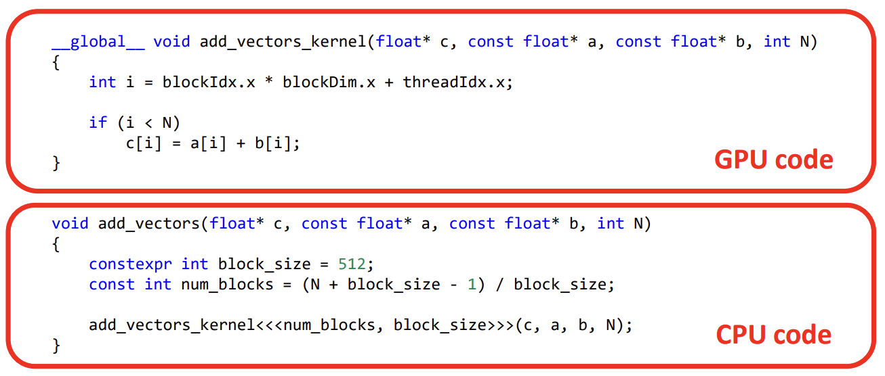

CUDA 代码的编译过程如下图所示：

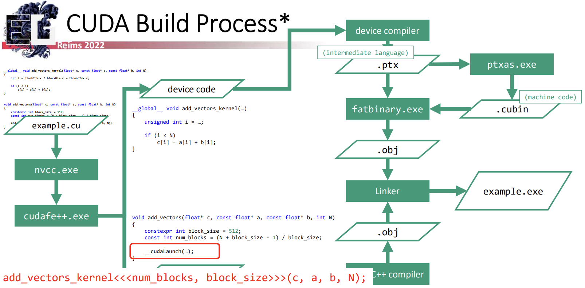

使用 nvcc 编译 cuda 源文件时，nvcc 执行的第一步是运行 CUDA C++ 前端工具 cudafe++ 对输入源文件进行处理。该工具会将输入的源代码拆分为独立的源文件，一个是被 CPU 编译的代码，另一个是被 GPU 编译的代码。同时将 CUDA 特定的语法结构（如内核启动）替换为 CUDA 运行时库调用。
- 生成的 CPU 代码就是标准 C++，可以交由主机的 C++ 编译器编译，最终生成常规的目标文件。
- GPU 的设备代码则交给设备 C++ 编译器，生成 PTX 汇编代码（.ptx），这是一种 **GPU 代码的中间表示，类似于 LLVM**。然后，ptxas 工具可以将这种 PTX 代码汇编为 CUDA 二进制文件（.cubin），该文件包含针对特定目标 GPU 架构的实际机器代码。接着，fatbinary 工具将这些 PTX 代码及其预编译的 GPU 二进制文件打包进目标文件（.obj）中。

最终，CPU 和 GPU 的目标文件会被链接生成一个可执行文件。在运行时，生成的 CPU 代码会调用 CUDA 运行时库来管理 GPU 任务，运行时库负责加载 GPU 二进制文件，如果找不到预编译的二进制文件，系统将会回退到 JIT 编译 PTX 代码。

### 1.1 PTX 和 SASS

在 CUDA 中会遇到两种层次的汇编语言。第一个是并行线程执行（PTX），它作为 GPU 代码的中间表示，类似于 LLVM，PTX 语言相对易读且有详细的文档说明。PTX 可以被 CUDA 驱动程序直接使用，或通过 ptxas 命令行工具转化为特定 GPU 的可执行机器代码。

PTX 和 gpu 上实际运行的指令集在架构上有一定相似性，不同处是 PTX 会包含一些高级特性，例如函数和简化的控制流机制，它的抽象指令通常会被映射为一系列复杂的机器指令。要深入理解某段 CUDA 代码的性能表现（例如在性能分析和优化过程中），往往需要进一步分析实际的机器代码。
> 使用 triton 编写的 kernel 代码最终就是被编译成 PTX 代码。

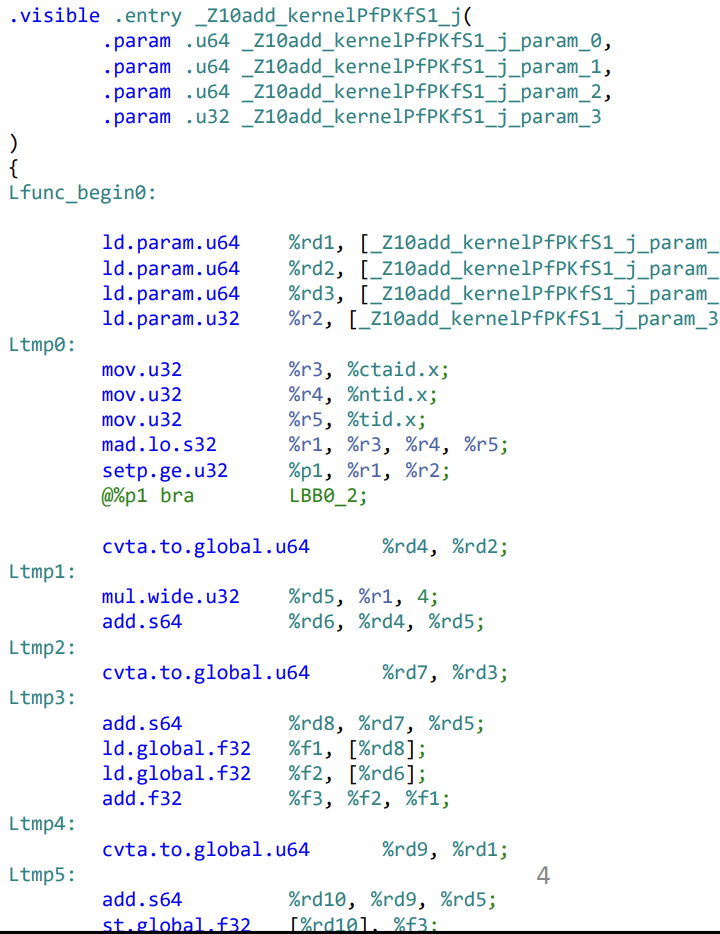

理解 PTX 的一些关键词:
- 虚拟的 GPU 架构
- 中间语言目标
- 需要转换为实际的机器代码
  - 通过 ptxas.exe 转换为实际的机器代码
  - 在运行时由驱动程序通过 JIT 进行翻译
- 类似于 LLVM、SPIR-V 和 DXIL
- 相对高级
- 具备详尽的文档支持

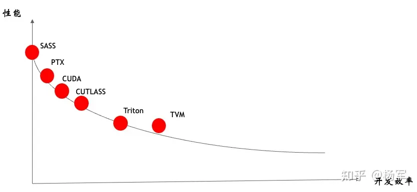

在 CUDA 编程中接触到的第二种汇编语言是 `SASS`，表示特定 GPU 上实际执行的**机器指令**。我们可以使用 nvdisasm 工具将 CUDA 二进制文件反汇编为 SASS。和 PTX 不同，SASS 的文档非常少，甚至它的名称 “shader assembly”（着色器汇编）的缩写也是推测得来的。

目前，关于 SASS 的公开信息极为有限，主要依赖于 CUDA 工具包文档中的少量指令说明以及一些逆向工程的研究。关于机器指令集工作机制的更多信息还可以通过 NVIDIA 在 SIMT 执行相关的专利中找到一些启示。

### 1.2 cuda 编译过程总结

1. CUDA C++ 被分为主机代码和设备代码：分别进行编译
2. 生成的主机代码负责加载 .exe 文件中存储的相应 GPU 二进制文件以及将 kernel<<<…>>>(…) 语法转换为 API 调用
3. “Fat 二进制” 文件包含以下内容：
   - 适用于不同计算能力的 PTX 代码：使得二进制文件能够针对未知的 GPU 架构
   - 针对特定 GPU 架构的预编译机器代码：在已知设备上提供最佳性能

## 二 GPU 架构深入理解

CPU 架构设计主要是针对优化 latency，GPU 架构设计是提升 throughput。

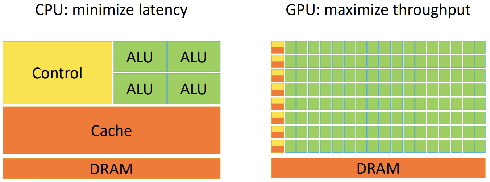

与其将芯片资源投入到大缓存、复杂的乱序执行控制逻辑等用于加速单个控制流进展的机制上，GPU架构更倾向于用这些资源构建简单但数量众多的核心，并配备大容量寄存器文件，以便能够保持多个独立控制流的执行上下文驻留在芯片上，从而快速切换。为了进一步提高计算资源的使用效率，GPU还采用 SIMD 方法，每个控制逻辑都配备多个算术逻辑单元（ALU），允许在执行相同指令的情况下处理不同的数据，实现并行执行。

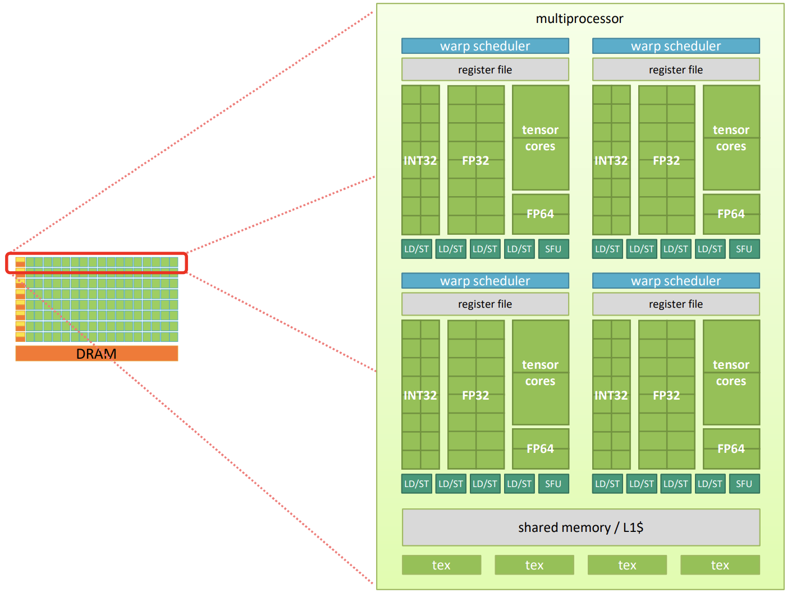

深入研究典型 GPU 的架构，会发现其本质上是一个由 `SIMD` 核心组群（groups of groups of SIMD cores）组成的两级层次结构。简单来说就是，**GPU 本身由多个多处理器（multiprocessors）组成，每个多处理器包含若干 `warp` 调度器（warp schedulers）**。每个 warp 调度器配备一个寄存器文件、一组 32 位整数（INT32）、32 位浮点数（FP32）、64 位浮点数（FP64）以及张量核心 ALUs，加载/存储单元（LD/ST），还有一个特殊功能单元（SFU）。此外，每个多处理器还具备本地共享内存和若干在 warp 调度器之间共享的纹理单元。部分本地共享内存用作一级缓存（L1$），剩余的部分可以用于加速同一多处理器内线程的快速通信。

举个例子，GV100 GPU 的计算核心包括: 

1. `6` 个 `GPC`，每个 GPC 都有：
- `7` 个 `TPC`（每个包含两个 SM）
- `14` 个 `SM`

2. `84` 个 Volta `SM`，每个 `SM` 都有：
- 64 个 FP32 核心
- 64 个 INT32 核心
- 32 个 FP64 核心
- 8 个张量核心（Tensor Cores）
- 4 个纹理单元（texture units）

### 2.1 Warp 概述

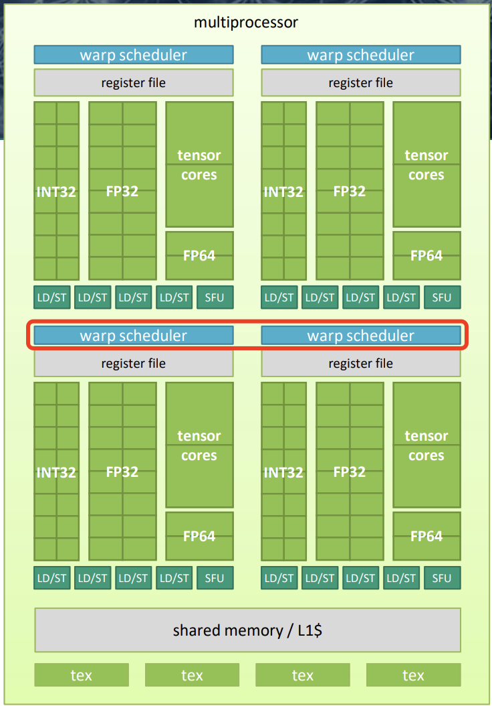

- warp：由 32 个线程组成的组，wrap 执行是基于 `SIMT` 模式。
- 每个 warp 调度器可以调度多个硬件单元，包括：
    - 算术逻辑单元（ALU）
    - 支持 FP32、INT32、FP64 以及张量核心的运算单元
    - 特殊功能单元，如平方根（sqrt）、指数（exp）等
    - 加载和存储单元

- 多个 warp 的线程上下文会同时驻留在芯片上，以实现延迟隐藏。
- 每个时钟周期:
    - warp 调度器选择符合条件的 warp
    - 从该 warp 调度指令

具体来说，wrap 是 GPU 的基本硬件执行单元，为了在 GPU 上运行 kernel 代码，warp 调度器会分配若干 warps 来执行，每个 warp 所有线程的执行上下文都保存在与负责该 warp 的调度器相关的寄存器文件中。将所有 warp 内线程的执行上下文保存在对应调度器的寄存器文件中。**warp 调度器的工作是将这些线程的执行任务映射到负责的硬件单元（如 ALU）**。

当调度器可以发出新指令时（通常每个时钟周期，前提是所有资源都未被占用），它会从准备就绪的 warp 中挑选下一条指令（即无需等待之前操作结果的指令）并将其调度到合适的硬件单元上执行。

### 2.2 wrap 调度

如何理解 wrap 调度实现延迟隐藏（Latency Hiding）呢？

## 三 CUDA 内存空间

CUDA 内存空间/层次：

1. 全局内存：所有线程共享；支持读写操作；有 L2 和 L1 缓存；通用数据存储用途。
2. 本地内存：线程私有；用于寄存器溢出和栈存储；支持读写操作；同样有 L2 和 L1 缓存。
3. 寄存器：线程独占。
4. 共享内存：**同一 block 内的线程共享**；支持低延迟的线程间通信。
5. 纹理内存：只读；优化了空间局部访问；提供硬件级的过滤、格式转换和边界处理功能。
6. 常量内存: 只读，为广播式访问进行了性能优化。

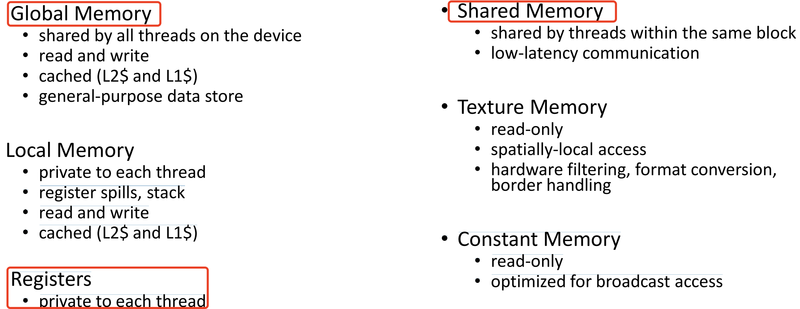

### 3.1 全局内存

全局内存有以下特点：
1. 通用数据存储
2. 基于设备内存构建：
    - 用于处理输入和输出数据；
    - 采用线性数组结构
3. 速度相对较慢
	- 带宽大约为 300–700 GiB/s（GDDR5/6 与 HMB2 对比）
	- 非缓存合并访问时需 375 个周期
	- L2 缓存访问需 190 个周期
	- L1 缓存访问需 30 个周期

全局内存是最重要的内存空间。它对应设备内存，所有在 GPU 上运行的线程都可以访问。因为其访问范围广泛，所以内存访问可能需要从设备内存传输到其他地方，或从其他地方传输到设备内存。因此，**充分利用缓存和合理的访问模式对性能提升至关重要**。

一个简单的内核示例来演示将数据从一个数组复制到另一个数组的过程，说明了**内存访问合并**的重要性。

其中实验用的 GPU 硬件特性：
- 68 个 SM
- 每个 SM 支持 2048 个线程
- L2 缓存容量为 5120 KB
- L1 缓存容量为 128 KB
- 每个线程可使用 $64 = 128\text{KB} / 2048$ 字节的 L1 缓存和 37 字节的 L2 缓存

每个缓存行为 128 字节，并分为 4 个 32 字节的扇区。每次内存事务的长度为 32 字节，系统只从内存中读取实际请求的 32 字节扇区。

第一个测试，warp 中的所有线程都访问了连续的内存地址。

<center class="half">
    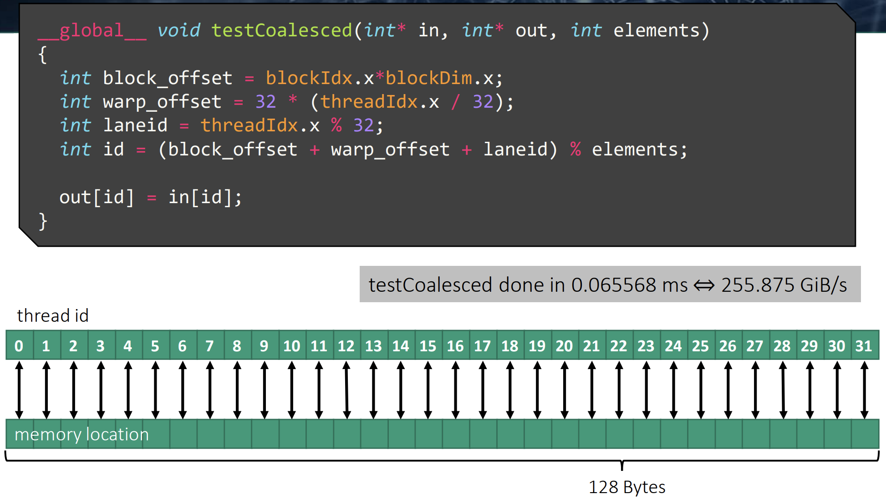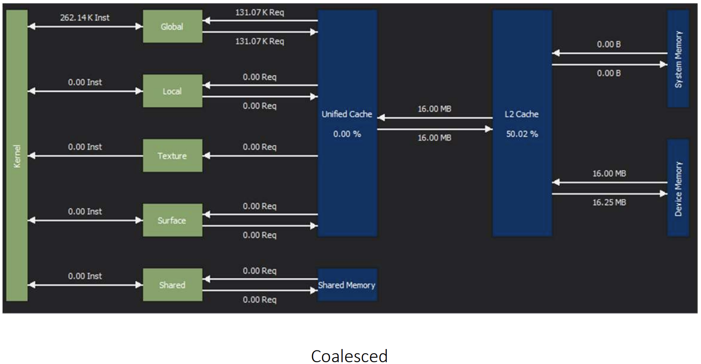
</center>

第二次测试，虽然 warp 中的线程不再访问连续的内存地址，但它们的内存访问仍然局限在 `128B` 的缓存行范围内。测试结果显示，性能与之前相差无几。

<center class="half">
    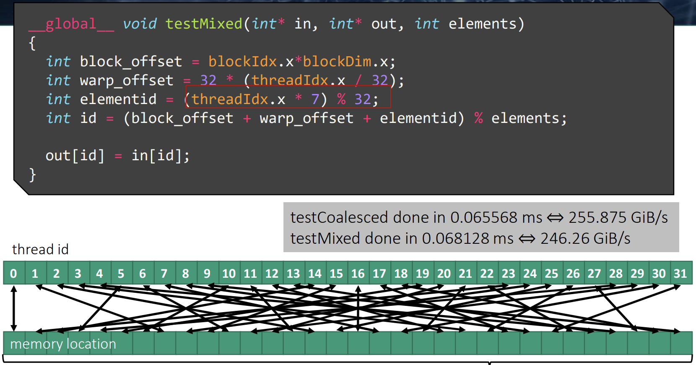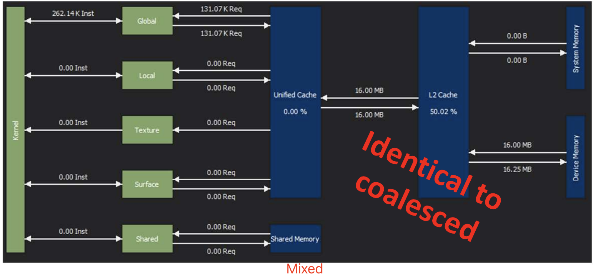
</center>

第三次测试，在连续线程访问的内存地址之间引入步长时，warp 的内存访问会分散到多个缓存行中。随着步长的增大，性能会大致按 warp 需要加载的缓存行数量呈线性下降。

与完美的合并访问基线相比，我们发现 SM 与 L2 缓存之间的内存传输量确实与需要加载的缓存行数量呈线性增加。虽然每个 kernel 访问的数据量相同，但由于内存访问模式存在空隙，导致内存访问效率显著降低。

<center class="half">
    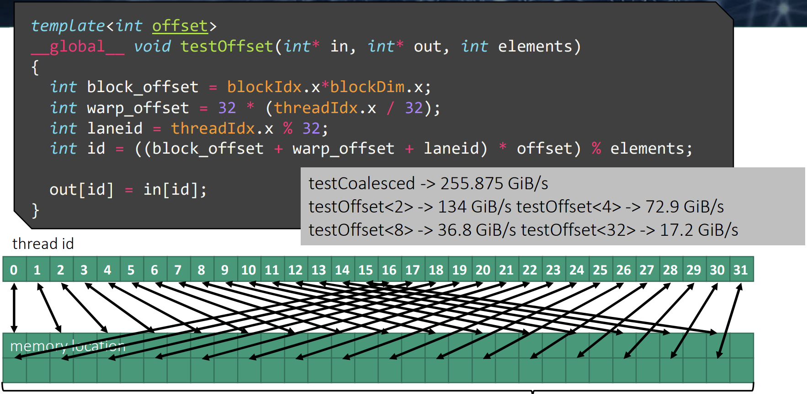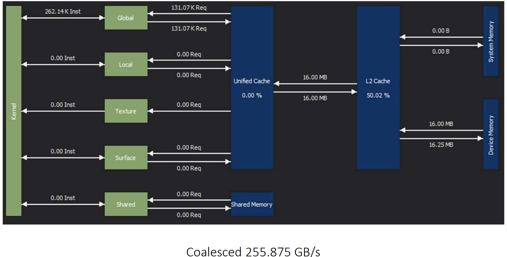
</center>

### 3.2 共享内存

共享内存将每个 SM 上的本地片上内存暴露给 CUDA 程序。虽然共享内存的大小有限，但其访问速度极快，并且所有同一线程块内的线程可以共享，因此非常适合低延迟的线程间通信。

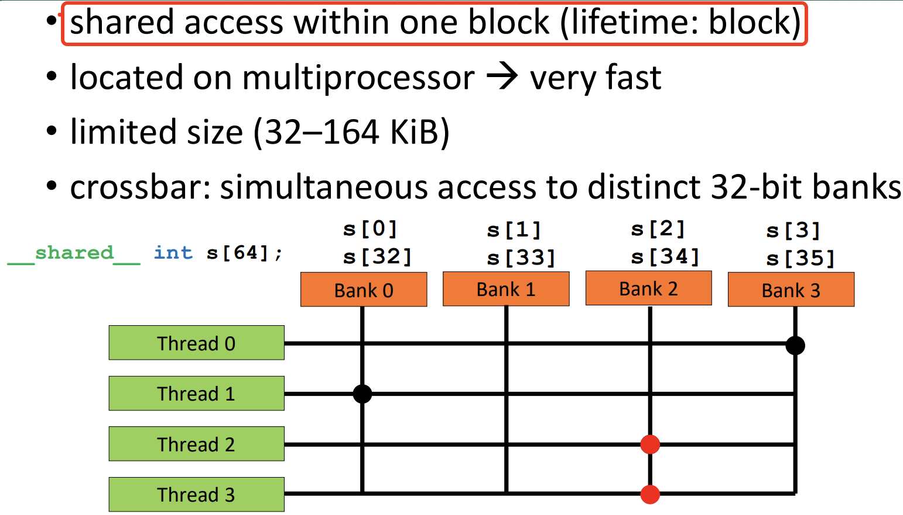

要有效利用共享内存，必须需注意内存访问模式。共享内在物理上被划分为 32 个（刚好等于一个线程束中的线程数目，即内建变量 warpSize 的值）同样宽度的、能被同时访问的内存 bank，这样每 32 个连续的 4 字节元素会分布到 32 个连续的内存 banks 中。

每个 bank 可以处理来自其负责地址的 4 字节加载和存储操作。warp 中的 32 个线程通过交叉开关连接到内存 bank，但**同一时刻一个 bank 只能服务一个线程**。如果两个或更多线程尝试同时访问由同一内存 bank 提供的地址，它们的访问将被串行化，导致性能下降。这种情况称为 N 路 bank 冲突，即 N 个线程同时访问同一 bank 的地址。一个值得注意的例外情况是，多个线程尝试读取同一个 bank 提供的相同地址。在这种情况下，所有线程都可以通过广播结果同时服务。

#### 3.2.1 避免 bank 冲突

为了更好地理解共享内存的使用，来看一个例子。在某个内核执行过程中，内核需要先对一个 32×32 元素矩阵的列求和，随后再对行进行求和。矩阵是按行优先方式存储的，内核利用 warp 中的 32 个线程并行地对每列或每行进行求和计算。对于列的求和，内核逐行计算，每个线程将相应列的元素累加到其和中。在这种访问模式下，每个线程访问的元素来自不同的内存 bank。对于行的求和，内核逐列计算，每个线程访问的元素来自同一 bank，导致最严重的 32 路 bank 冲突。

<center class="half">
    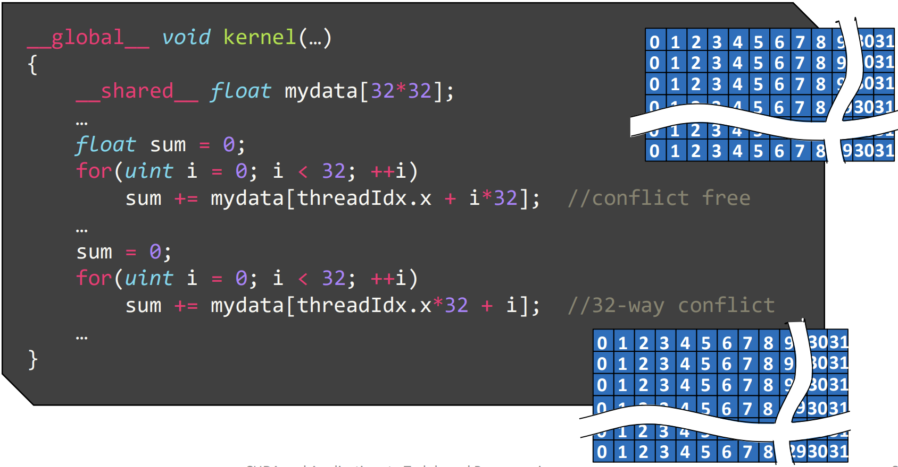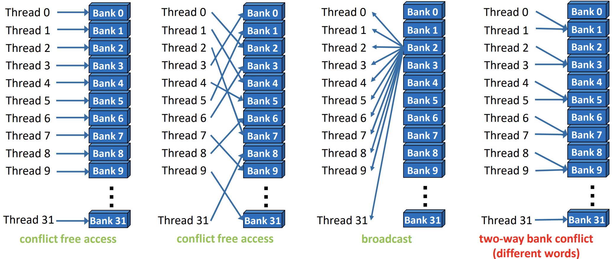
</center>

解决这个问题的技巧是在矩阵中添加一个虚拟列进行填充。这样可以改变访问模式，避免银行冲突。

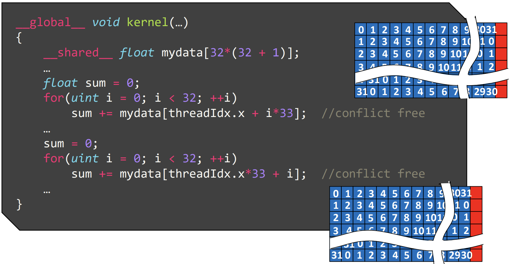

### 3.2.2 共享内存：适用场景

- 线程间通信
- 减少全局内存访问，通过手动缓存优化
- 调整全局内存访问模式以提高效率

```c++
__global__ void transp(float* global_data, float* global_data2){
    extern __shared__ float data[];
    uint linid1 = blockIdx.x*32 + threadIdx.x + blockIdx.y*32*width;
    uint linid2 = blockIdx.x*32*width + threadIdx.x + blockIdx.y*32;
    for(uint i = 0; i < 32; ++i)
        data[threadIdx.x + i*33] = global_data[linid1 + i*width];
    __syncthreads();
    for(uint j = 0; j < 32; ++j)
        global_data2[linid2 + j*width] = data[threadIdx.x*33+j] ;}
```

- 线程间通信
- 减少全局内存访问，使用手动缓存优化
- 调整全局内存访问模式
- 使用索引进行访问

```cpp
__global__ void kernel(…)
{
    uint mydata[8]; //will be spilled to local memoryfor(uint i = 0; i < 8; ++i)
    mydata[i] = complexfunc(i, threadIdx.x);
    uint res = 0;
    for(uint i = 0; i < 64; ++i)
        res += secondfunc(mydata[(threadIdx.x + i) %8], mydata[i*threadIdx.x % 8]);}
```

- 线程间通信
- 通过手动缓存减少全局内存访问
- 优化全局内存的访问模式
- 采用索引方式访问数据

```cpp
__global__ void kernel(…)
{
    __shared__ uint allmydata[8*BlockSize];
    uint *mydata = allmydata + 8*threadIdx.x;
    for(uint i = 0; i < 8; ++i)
        mydata[i] = complexfunc(i, threadIdx.x);
    uint res = 0;
    for(uint i = 0; i < 64; ++i)
        res += secondfunc(mydata[(threadIdx.x + i) % 8], mydata[i*threadIdx.x % 8]);
```

- 线程间通信
- 通过手动缓存减少全局内存访问
- 优化全局内存的访问模式
- 使用索引访问数据
- 合并耗时的操作以提高效率

```cpp
__global__ void kernel(uint *global_count, …)
{
    __shared__ uint blockcount;
    blockcount = 0;
    __syncthreads();
    uint myoffset = atomicAdd(&blockcount, myadd);
    __syncthreads();
    if(threadIdx.x == 0)
        blockcount = atomicAdd(global_count, blockcount);
    __syncthreads();
    myoffset += blockcount;
}
```
### 3.3 寄存器 vs 共享内存 vs 全局内存

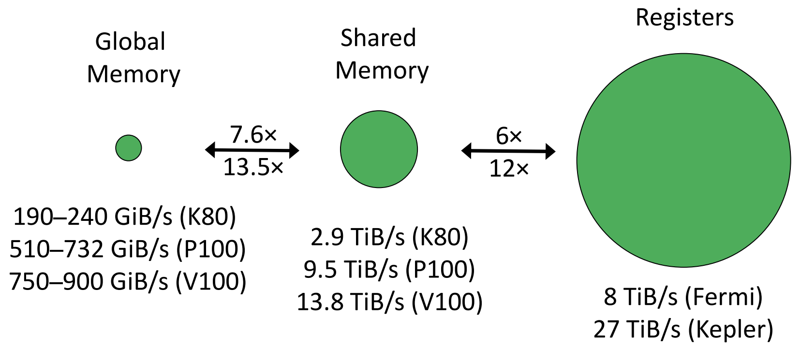

## 参考资料

- [CUDA and Applications to Task-based Programming](https://cuda-tutorial.github.io/part2_22.pdf)
