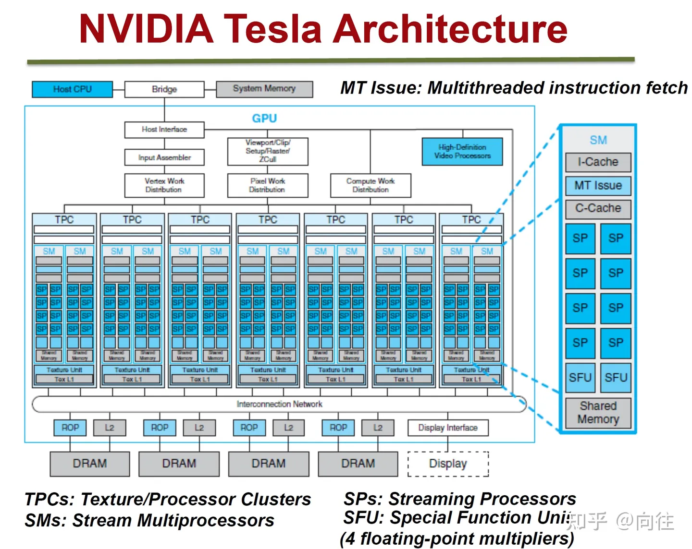
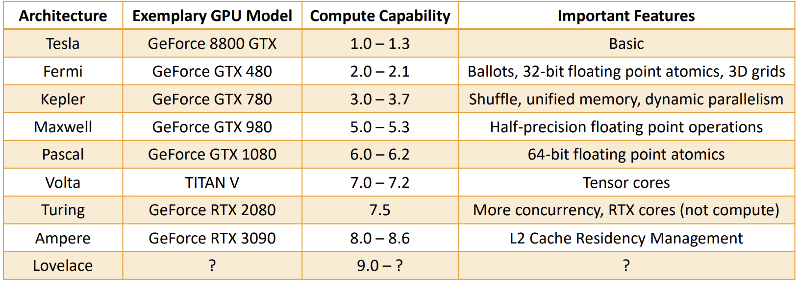
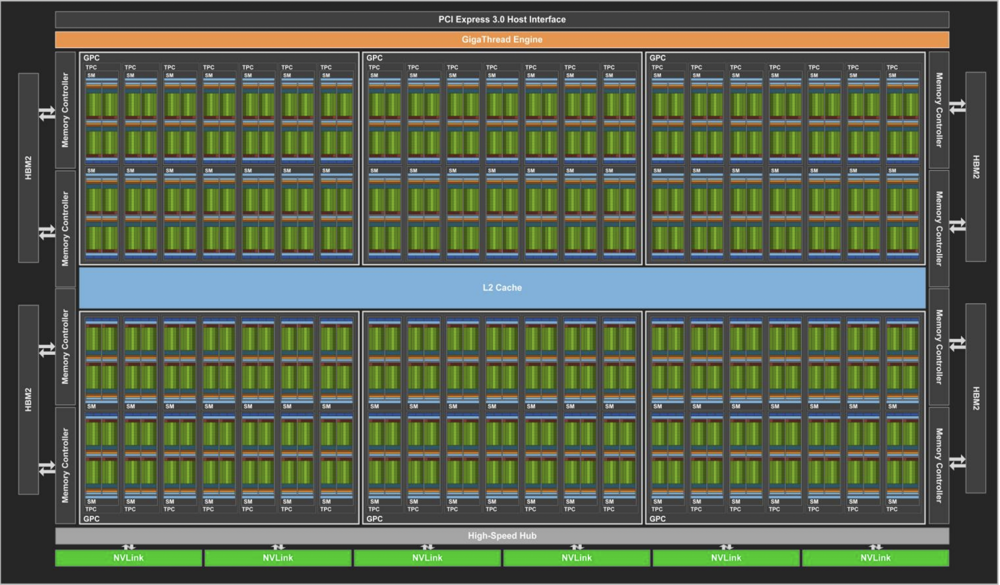
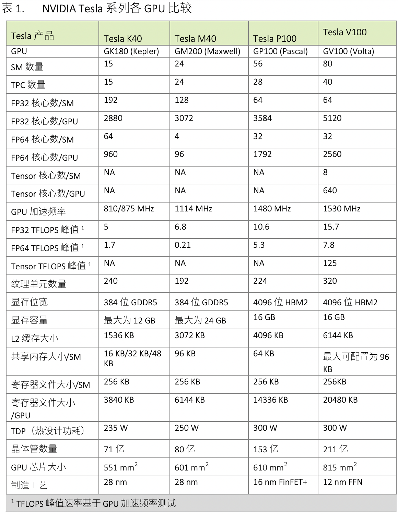
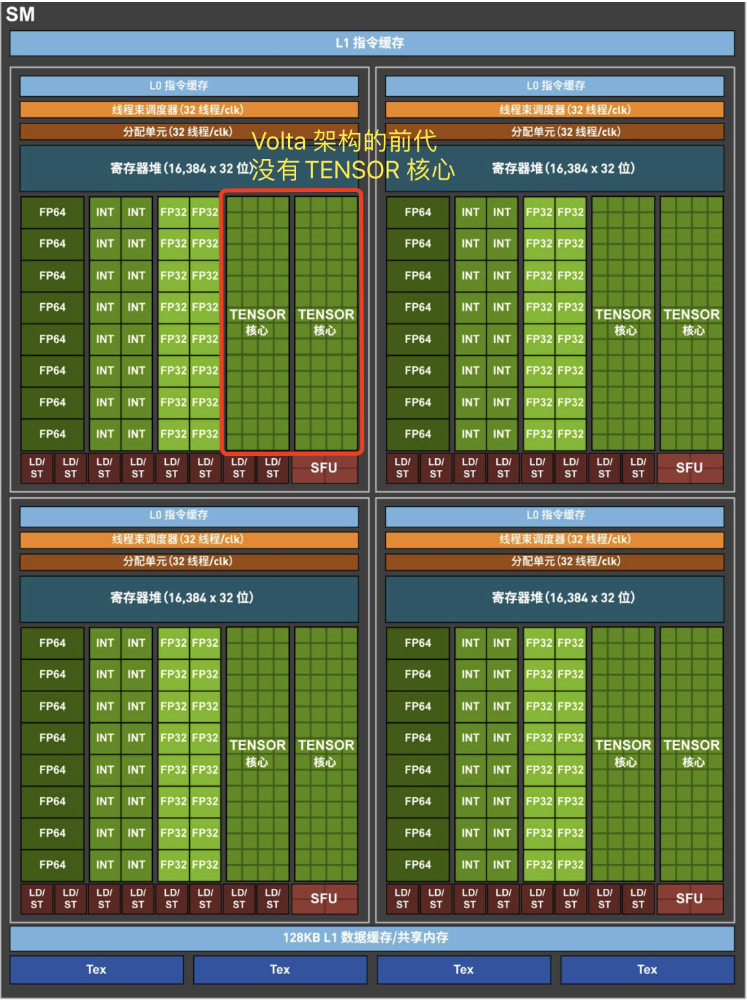

## 一 GV100 硬件架构概述

GPU的微观结构因不同厂商、不同架构都会有所差异，但核心部件、概念、以及运行机制大同小异，NVidia Tesla 微观架构如下图所示:



下表是一份粗略的总结，介绍了不同计算能力如何对应于各个架构代际，以及它们在相应时代的 GPU 型号中引入的一些关键功能。



GV100 GPU 由多个 GPU 处理集群 (GPC)、纹理处理集群 (TPC)、流式多处理器 (`SM`-STREAMING MULTIPROCESSOR) 和内存控制器组成。**完整的 GV100 GPU 包括**: 

1. `6` 个 `GPC`，每个 GPC 都有：
- `7` 个 `TPC`（每个包含两个 SM）
- `14` 个 `SM`

1. `84` 个 Volta `SM`，每个 `SM` 都有：
- 64 个 FP32 核心
- 64 个 INT32 核心
- 32 个 FP64 核心
- 8 个张量核心（Tensor Cores）
- 4 个纹理单元（texture units）

1. 8 个 512 位内存控制器（总共 4096 位）

**总结**： 一个完整的 `GV100 GPU` 含有 `84` 个 `SM`，总共有 `5376` 个 `FP32` 核心、`5376` 个 INT32 核心、2688 个 FP64 核心、672 个Tensor Cores 和 336 个纹理单元。 每个 HBM2 DRAM 堆栈都由一对内存控制器控制。 完整的 GV100 GPU 包括总计 6144 KB 的二级缓存。 

下图显示了具有 84 个 `SM` 的完整 GV100 GPU（注意，不同的产品可以使用不同配置的 GV100）。Tesla V100 加速器使用 80 个 SM。 


表 1 比较了过去五年的 NVIDIA Tesla GPU。

下表展示了 NVIDIA Tesla GPU 的比较。



### 1.1 Volta SM 硬件结构

`GV100 GPU` 有 `84` 个 `SM`。与 Pascal GP100 类似，GV100 的每个 SM 都包含 `64` 个 FP32 内核和 `32` 个 FP64 内核。 但是，`GV100 SM` 使用了**一种新的分区方法**来提高 SM 利用率和整体性能。 

- `GP100` `SM` 被划分为**两个处理块**，每个处理块具有 `32` 个 FP32 内核、16 个 FP64 内核、一个指令缓冲区、一个 `warp` 调度程序、两个调度单元和一个 128 KB 的寄存器文件。 
- `GV100` `SM` 分为**四个处理块**，每个处理块有 `16` 个 FP32 内核、8 个 FP64 内核、16 个 INT32 内核、两个用于深度学习矩阵运算的新混合精度 Tensor 内核、一个新的 L0 指令缓存、一个 warp 调度程序、一个调度单元和一个 64 KB 的寄存器文件。新的 L0 指令缓存现在用于每个分区，用以提供比以前的 NVIDIA GPU 中使用的指令缓冲区更高的效率。 

总的来说，与前几代 GPU 相比，GV100 支持更多的**线程、线程束**和**线程块**。 共享内存和 L1 资源的合并使每个 Volta SM 的共享内存容量增加到 96 KB，而 GP100 为 64 KB。

Volta GV100 流式多处理器(SM)架构如下图像所示：



## 二 GPU 设备管理

### 2.1 使用运行时 API 查询 GPU 信息

可以使用以下函数查询关于 GPU 设备的所有信息：
```bash
cudaError t cudaGetDeviceProperties(cudaDeviceProp* prop, int device);
```

`cudaDeviceProp` 结构体包含了 CUDA 设备的属性信息，可以通过该[网址](https://docs.nvidia.com/cuda/cuda-runtime-api/structcudaDeviceProp.html)查看其内容。以下是一些关键成员及其意义：
- name: 设备的名称（字符串）。
- `totalGlobalMem`: 设备的全局内存总量（以字节为单位）。
- `sharedMemPerBlock`: 每个线程块的共享内存大小（以字节为单位）。
- `regsPerBlock`: 每个线程块的寄存器数量。
- warpSize: 每个 warp 的线程数量（通常为 32）。
- maxThreadsPerBlock: 每个线程块的最大线程数。
- maxThreadsDim[3]: 每个线程块在 3 个维度（x, y, z）上的最大线程数。
- maxGridSize[3]: 网格在 3 个维度（x, y, z）上的最大尺寸。
- clockRate: 核心时钟频率（以千赫兹为单位）。
- totalConstMem: 设备的常量内存大小（以字节为单位）。
- `multiProcessorCount`: 多处理器的数量（SM 数量）。
- `computeCapability`: 计算能力，包含 major 和 minor 版本号。

实例代码如下所示：

```cpp
#include <stdio.h>
#include <cuda_runtime.h>

int main() {
    int deviceCount;
    cudaGetDeviceCount(&deviceCount);

    for (int device = 0; device < deviceCount; device++) {
        cudaDeviceProp prop;
        cudaGetDeviceProperties(&prop, device);

        printf("Device %d: %s\n", device, prop.name);
        printf("  Total Global Memory: %lu bytes\n", prop.totalGlobalMem);
        printf("  Shared Memory Per Block: %lu bytes\n", prop.sharedMemPerBlock);
        printf("  Registers Per Block: %d\n", prop.regsPerBlock);
        printf("  Warp Size: %d\n", prop.warpSize);
        printf("  Max Threads Per Block: %d\n", prop.maxThreadsPerBlock);
        printf("  Max Threads Dimension: (%d, %d, %d)\n",
               prop.maxThreadsDim[0], prop.maxThreadsDim[1], prop.maxThreadsDim[2]);
        printf("  Max Grid Size: (%d, %d, %d)\n",
               prop.maxGridSize[0], prop.maxGridSize[1], prop.maxGridSize[2]);
        printf("  Clock Rate: %d kHz\n", prop.clockRate);
        printf("  Total Constant Memory: %lu bytes\n", prop.totalConstMem);
        printf("  Multi-Processor Count: %d\n", prop.multiProcessorCount);
        printf("  Compute Capability: %d.%d\n", prop.major, prop.minor);
    }

    return 0;
}
```

编译运行代码后输出结果如下所示：
```bash
Device 0: GeForce GTX 1080
  Total Global Memory: 8589934592 bytes
  Shared Memory Per Block: 49152 bytes
  Registers Per Block: 65536
  Warp Size: 32
  Max Threads Per Block: 1024
  Max Threads Dimension: (1024, 1024, 64)
  Max Grid Size: (2147483647, 65535, 65535)
  Clock Rate: 1733000 kHz
  Total Constant Memory: 65536 bytes
  Multi-Processor Count: 20
  Compute Capability: 6.1
```

### 2.2 使用 nvidia-smi 查询 GPU 信息

使用 nvidia-smi 工具的常用命令:

```bash
# 1, 持续监控 GPU 使用情况（每秒更新一次）
nvidia-smi -l 1 
# 2, 以 CSV 格式输出 GPU 的索引、名称、驱动程序版本、总内存和已用内存的信息，方便进一步处理或分析
nvidia-smi --query-gpu=index,name,driver_version,memory.total,memory.used --format=csv
# 3, 显示所有 GPU 的进程信息
nvidia-smi pmon -s um
```

### 2.3 在运行时设置设备

对于于一个有 N 个 GPU 的系统，nvidia-smi 从 0 到 N―1 标记设备 ID。使用环境变量 `CUDA_VISIBLE_DEVICES`，就可以在运行时指定所选的GPU 且无须更改应用程序。

例如，设置运行时环境变量 `CUDA_VISIBLE_DEVICES=2`。nvidia 驱动程序会屏蔽其他GPU，这时设备 2 作为设备 0 出现在应用程序中。

也可以使用CUDA_VISIBLE_DEVICES指定多个设备。例如，如 `CUDA_VISIBLE_DEVICES=2，3`，在运行时，nvidia 驱动程序将只使用 ID 为 2 和 3 的设备，并且会将设备 ID 分别映射为 0 和 1。

## 三 内核函数计时和性能判断

### 3.1 用 CPU 计时器计时

最简单的方法是在主机端使用一个 CPU 或 GPU 计时器来计算内核的执行时间。

1，借助 `time.h` 库实现计时功能:

```cpp
int iLen = 1024;
dim3 block (iLen);
dim3 grid ((N + block - 1) / block)

clock_t start, end;
double cpu_time_used;
start = clock();  // 开始时间

addArrays<<<grid, block>>>(d_array1, d_array2, d_result);
cudaDeviceSynchronize() // 等待所有的 GPU 线程运行结束

end = clock();    // 结束时间
cpu_time_used = ((double)(end - start)) / CLOCKS_PER_SEC;  // 计算运行时间

printf("sumArraysOnGPU <<<%d, %d>>> Time taken: %f seconds\n", grid.x, block.x, cpu_time_used);
```

### 3.2 用 nvprof 工具计时

自CUDA 5.0以来，NVIDIA 提供了一个名为 `nvprof` 的命令行分析工具，可以帮助从应用程序的 CPU 和 GPU 活动情况中获取时间线信息，其包括内核执行、内存传输以及 CUDA API 的调用。其用法如下:

```bash
nvprof [nvprof_args] <application> [application_args]
```

1，基本使用：要分析一个 CUDA 程序，你可以直接用 nvprof 来运行它：
```bash
nvprof ./your_cuda_program
```

2，分析特定内核：如果你只对特定的内核感兴趣，可以使用 --kernels 选项来指定：

```bash
nvprof --kernels kernel_name ./your_cuda_program
```

3，查看内存传输情况：要查看内存传输（数据从主机到设备或设备到主机）的统计信息：
```bash
nvprof --print-gpu-trace ./your_cuda_program
```

4，结合其他工具：nvprof 可以与 nvvp（NVIDIA Visual Profiler）配合使用，生成 .nvprof 文件并用图形化工具进一步分析。
```bash
nvprof --output profile.nvprof ./your_cuda_program
nvvp profile.nvprof
```

注意：NVIDIA 已经建议使用 Nsight Compute 和 Nsight Systems 作为 nvprof 的替代工具，这些工具提供了更强大和全面的性能分析功能。

### 3.3 GPU 的理论最大性能

应用程序的测量值与理论峰值进行比较，可以判定你的应用程序的性能是**受限于算法还是受限于内存带宽的**。以 Tesla K10 为例，可以得到理论上的**操作：字节比率**（`ops:byte ratio`）：

$$\frac{\text{算力}}{\text{内存带宽}} = \frac{4.58\ TFLOPS}{320\ GB/s} = 13.6$$

也就是 13.6个指令：1个字节。对于 Tesla K10 而言，**如果你的应用程序每访问一个字节所产生的指令数多于 13.6，那么你的应用程序受算法性能限制，GPU 将被充分利用**；反之则受访存限制，GPU 没有被充分应用。

## 参考资料

- 《CUDA C 编程权威指南》
- [GPU Architecture and Programming](https://homepages.laas.fr/adoncesc/FILS/GPU.pdf)