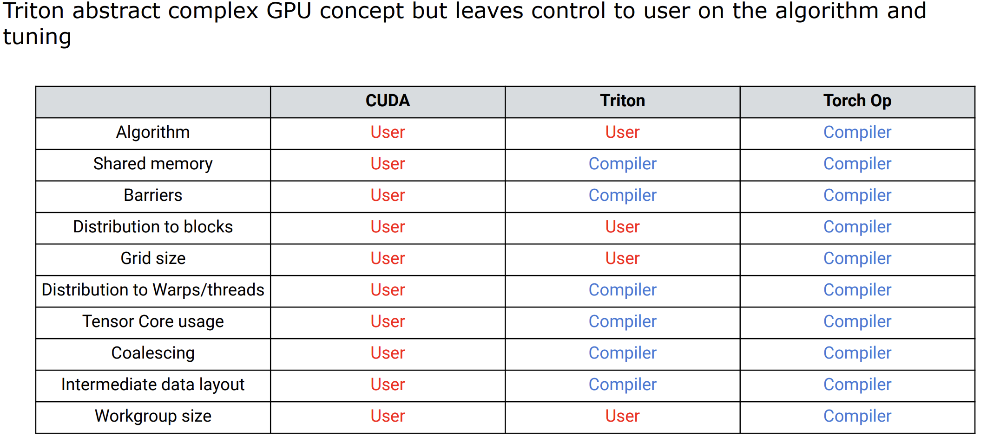
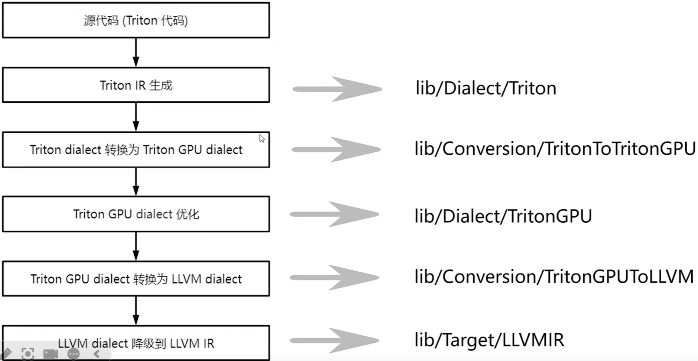
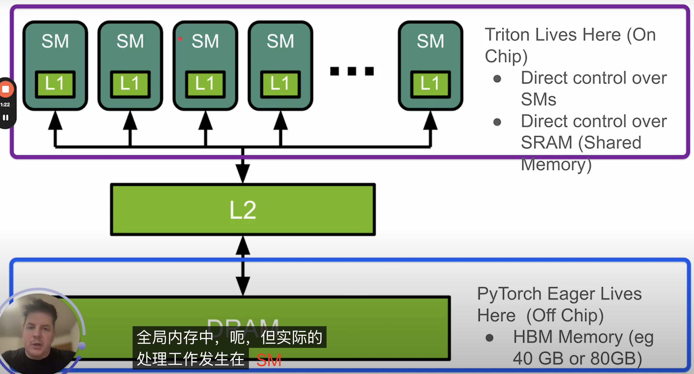

- [一 tensor 知识](#一-tensor-知识)
  - [理解张量维度](#理解张量维度)
  - [理解 torch.matmul](#理解-torchmatmul)
  - [理解 dim 参数](#理解-dim-参数)
  - [规约操作](#规约操作)
- [二 cuda 基础](#二-cuda-基础)
  - [矩阵元素指针算术](#矩阵元素指针算术)
  - [网格、块和内核](#网格块和内核)
  - [cuda 执行模型](#cuda-执行模型)
  - [num\_warps 概念作用](#num_warps-概念作用)
- [三 triton 基础](#三-triton-基础)
  - [triton 定义](#triton-定义)
  - [triton 特性](#triton-特性)
  - [triton 编译过程](#triton-编译过程)
  - [triton 保留关键字](#triton-保留关键字)
  - [Pytorch 与 Triton 中的地址计算对比](#pytorch-与-triton-中的地址计算对比)
  - [triton 和 cuda 特性的对比](#triton-和-cuda-特性的对比)
  - [参考资料](#参考资料)

## 一 tensor 知识

### 理解张量维度

在 PyTorch 中，张量的维度（或称为“秩”）决定了数据的结构和形状：

- 1D 张量：向量。例如，长度为 5 的向量 [1, 2, 3, 4, 5]。
- 2D 张量：矩阵。例如，形状为 (3, 4) 的矩阵。
- 3D 张量：通常用于 NLP，形状为 (batch_size, sequence_length, hidden_size)。
- 4D 张量：通常用于 CV，形状为 (batch_size, channels, height, width)。

在一个 $M$ 行 $N$ 列的二维数组中，$M$ 是第 0 维，即行数；$N$ 是第 1 维，即列数。那么怎么肉眼判断更复杂的张量数据维度呢，举例：
```python
import torch

# 示例张量
tensor = torch.tensor([[[0.6238, -0.9315, 0.2173, 0.1954, -1.1565],
                        [0.4559, 0.1531, 0.4178, 1.0225, 0.5923],
                        [0.0499, 0.4024, -1.2547, -0.5042, -0.0231],
                        [-1.1253, 0.3145, 0.8796, 0.4516, -0.0915]],

                       [[1.5794, -0.6367, -0.2559, 0.1237, -0.1951],
                        [0.1012, 0.0357, -0.5699, 1.0983, -0.2084],
                        [-0.7019, 0.5872, 0.7736, 0.7423, -0.7894],
                        [-0.3248, -0.5316, 1.2029, 0.2852, -0.4565]],

                       [[-0.0073, 1.4143, -0.1859, -0.7211, -0.8652],
                        [-0.3173, -0.4816, 0.1174, -0.1554, 0.9385],
                        [0.1283, -0.6547, 0.3687, -0.1948, 0.7754],
                        [-0.2185, -1.0437, 1.5963, -0.3284, -0.3654]]])
```
**判断规则**：方括号 `[` 的嵌套层数代表张量的维度。最外层括号的元素数量是第 0 维的大小，往内推。
以上述张量为例分析：
```python
tensor([[[ 0.6238, -0.9315,  0.2173,  0.1954, -1.1565], ... ]])
```
- 最外层 [ 里有 3 个子列表 -> 第 0 维大小为 3。
- 第二层 [ 里有 4 个子列表 -> 第 1 维大小为 4。
- 第三层 [ 里有 5 个元素 -> 第 2 维大小为 5。

因此，这个张量是 3 维张量，形状为 `[3, 4, 5]`。

### 理解 torch.matmul

`torch.matmul` 在处理多维张量时，会将最后两个维度视为矩阵执行矩阵乘法，其余的维度（必须相等）作为批次维度，逐个进行矩阵运算。

```python
>>> A = torch.randn([4,5,9])
>>> B = torch.randn([4,9,5])
>>> C = torch.matmul(A, B)
>>> C.shape
torch.Size([4, 5, 5])
```

### 理解 dim 参数

dim 参数在 pytorch 函数中的定义指**沿着 dim 这个维度进行操作**：求和/求平均/求累加，以及删除、增加指定 dim。如 x 的 shape 为 [2, 5, 3]，则：
- `dim = 0`，即沿着具有 2 个元素的那个维度/轴进行操作
- `dim = 1`，即沿着具有 5 个元素的那个维度/轴进行操作
- `dim = 2`，即沿着具有 3 个元素的那个维度/轴进行操作

再看具体示例：
```bash
>>> x = torch.randint(1, 10, [2,5,3], dtype=torch.float32)
>>> x
tensor([[[8., 1., 6.],
         [1., 5., 9.],
         [5., 7., 1.],
         [5., 1., 2.],
         [8., 4., 4.]],

        [[3., 3., 7.],
         [7., 4., 3.],
         [7., 7., 5.],
         [8., 3., 9.],
         [1., 1., 8.]]])
>>> x.shape
torch.Size([2, 5, 3])

# 如执行 y = torch.mean(x, dim = 0)，则 y[0,0] = (x[0, 0, 0] + x[1, 0, 0]) / 2 = (8. + 3.) / 2 = 5.5; y[2, 2] = (x[0, 2, 2] + x[1, 2, 2]) = (1. + 5.) / 2 = 3.0
>>> y = torch.mean(x, dim = 0)
>>> y
tensor([[5.5000, 2.0000, 6.5000],
        [4.0000, 4.5000, 6.0000],
        [6.0000, 7.0000, 3.0000],
        [6.5000, 2.0000, 5.5000],
        [4.5000, 2.5000, 6.0000]])

# 如执行 y = torch.mean(x, dim = 2)， 则 y[1, 4] = (x[1, 4, 0] + x[1, 4, 1] + x[1, 4, 2]) / 3
>>> y = torch.mean(x, dim = 2)
>>> y
tensor([[5.0000, 5.0000, 4.3333, 2.6667, 5.3333],
        [4.3333, 4.6667, 6.3333, 6.6667, 3.3333]])
```

### 规约操作

**规约操作**（Reduction Operation）是指将多元素的输入数据按某种规则缩减为单一结果的操作。常见的规约操作包括 **求和、求最大值、求最小值、求均值**等。这些操作广泛应用于数据处理、并行计算和深度学习中，用于简化大量数据或归纳数据特性。

在深度学习中，规约操作通常用于对张量（tensor）数据进行分组聚合计算，表现结果就是会进行维度压缩。例如，某些神经网络层的输出可能需要通过规约操作进行归一化，或在损失函数的计算中将多个样本的损失值规约为一个标量。

`Pytorch` 中常用的规约算子有：
- `torch.sum`：按指定维度对张量元素求和，没有指定维度就对所有元素求和。
- `torch.prod`：按指定维度对元素求积。
- `torch.mean`：按指定维度对张量元素求均值。
- `torch.max`：按指定维度对张量元素求最大值。
- `torch.min`：按指定维度对张量元素求最小值。
- `torch.cumsum` 按指定维度计算累积和。
- `torch.argmax` 和 `torch.argmin`：分别返回最大值和最小值的索引。
- `torch.all`：按指定维度检查所有元素是否为 True。
- `torch.any`：按指定维度检查是否存在 True 元素。

1，torch.mean 函数用于计算张量沿指定维度的平均值。其基本语法和参数解释如下：

```python
torch.mean(input, dim, keepdim=False, *, dtype=None) -> Tensor
```
- `input`：输入张量。
- `dim`：沿哪个维度计算平均值。可以是单个整数或整数元组。
- `keepdim`：是否保留被缩减的维度。默认为 False。
- `dtype`：输出张量的数据类型。

1. 从计算过程理解：**沿着（跨） dim 进行操作（算均值）**。
   - 常规矩阵操作的 2D 张量，dim = 0 表示跨行操作，即对每一列中的所有元素进行均值计算。
   - NLP 领域的 3D 张量 `(batch_size, sequence_length, embedding_size)`，`dim = 2` 表示跨嵌入层维度算均值，对于每个 (batch, sequence) 位置，计算嵌入维度上的均值，如创建一个形状为 (4, 16, 4) 的 3D 张量计算位置 (0, 0, \:) 的均值 $\text{mean}(x[0, 0:]) = \frac{x[0,0,0] + x[0,0,1] + x[0,0,2] + x[0,0,3]}{4}$。
   - CV 领域的 4D 张量 `(batch_size, channels, height, width)`，`dim = 0` 表示跨 batch_size 维度上计算均值，对一个批次中的所有样本进行平均。如创建一个形状为 (2, 3, 3, 3) 的 4D 张量，计算位置 (0, 0, 0) 的均值 = $\text{mean}(x[:, 0, 0, 0]) = \frac{x[0, 0, 0, 0] + x[1, 0, 0, 0]}{2}$。

2. 从输出张量的形状理解：
   - NLP 领域的 3D 张量，dim = 2，输出张量的形状去掉这个 dim 维度，得到输出张量形状为 `(batch_size, sequence_length)`。
   - CV 领域的 4D 张量，dim = 0，输出张量形状为 `(channels, height, width)`。

2，`torch.sum` 沿着指定维度求和。
```bash
>>> x = torch.randn([4,5])
>>> x
tensor([[ 1.1141,  1.7091, -0.5543,  0.3417, -0.0838],
        [-0.6697, -0.3165,  0.3772, -0.4377, -0.9850],
        [-1.3976,  1.3172, -0.6791,  0.1030, -0.5817],
        [ 0.3079, -0.5911,  1.2357, -1.0891,  0.8422]])
>>> x.sum(dim=0)
tensor([-0.6453,  2.1187,  0.3796, -1.0821, -0.8082])
>>> x.sum(dim=1)
tensor([ 2.5269, -2.0317, -1.2381,  0.7056])
```

当 dim = 0 时，就是沿着 `dim = 0`即 `x` 轴进行累加，sum 函数为规约函数会压缩维度，所以x.sum(dim=0) 结果为 tensor([-0.6453,  2.1187,  0.3796, -1.0821, -0.8082])，形状为 `[5]`。

3，`torch.cumprod` 沿着 dim 维度计算累积。`min()` 沿着指定 dim 找

```bash
>>> x = torch.Tensor([ # shape is [2, 5]
...     [2,3,4,5,6],
...     [9,8,7,6,5,]
... ])

>>> print(torch.cumprod(x, dim = 0))
tensor([[ 2.,  3.,  4.,  5.,  6.],
        [18., 24., 28., 30., 30.]])

>>> print(torch.cumprod(x, dim = 1)) # output shape is [2, 5]
tensor([[2.0000e+00, 6.0000e+00, 2.4000e+01, 1.2000e+02, 7.2000e+02],
        [9.0000e+00, 7.2000e+01, 5.0400e+02, 3.0240e+03, 1.5120e+04]])

>>> torch.min(x, dim = 0) # output shape is [5]
torch.return_types.min(
values=tensor([2., 3., 4., 5., 5.]),
indices=tensor([0, 0, 0, 0, 1]))

>>> print(torch.max(x, dim = 1)) # output shape is [2]
torch.return_types.max(
values=tensor([6., 9.]),
indices=tensor([4, 0]))

>>> torch.mean(x, dim = 0, keepdim = True) # output shape is [1, 5]
tensor([[5.5000, 5.5000, 5.5000, 5.5000, 5.5000]]) 
```

## 二 cuda 基础

### 矩阵元素指针算术

为了访问矩阵中的特定元素，使用指针算术计算其线性地址。对于矩阵 $A$  形状为 $(M, K)$，元素 $A[m, k]$ 的线性地址计算如下：

$$\text{Address}(A[m, k]) = A_{\text{ptr}} + m \times K + k$$

其中：
- $A_{\text{ptr}}$ 是矩阵 $A$ 的起始指针（即  A[0,0]  的地址）。
- $m \times K$  是跳过前 $m$ 行的元素数量。
- $k$ 是当前行中跳过的元素数量。

**子块地址计算方法**：

对于矩阵 $A$ 形状为 $(M, K)$，元素顺序为：
\[
A = \begin{bmatrix}
A[0,0] & A[0,1] & \dots & A[0,K-1] \\
A[1,0] & A[1,1] & \dots & A[1,K-1] \\
\vdots & \vdots & \ddots & \vdots \\
A[M-1,0] & A[M-1,1] & \dots & A[M-1,K-1]
\end{bmatrix}
\]
内存中的存储顺序：
\[
A[0,0], A[0,1], \dots, A[0,K-1], A[1,0], A[1,1], \dots, A[1,K-1], \dots, A[M-1,K-1]
\]

在分块矩阵乘法中，矩阵被划分为多个子块。每个子块由其在行和列方向上的起始索引定义。矩阵子块加载、存储和计算的伪代码：
```bash
# Do in parallel
for m in range(0, M, BLOCK_SIZE_M):
  # Do in parallel
  for n in range(0, N, BLOCK_SIZE_N):
    acc = zeros((BLOCK_SIZE_M, BLOCK_SIZE_N), dtype=float32)
    for k in range(0, K, BLOCK_SIZE_K):
      a = A[m : m+BLOCK_SIZE_M, k : k+BLOCK_SIZE_K]
      b = B[k : k+BLOCK_SIZE_K, n : n+BLOCK_SIZE_N]
      acc += dot(a, b)
    C[m : m+BLOCK_SIZE_M, n : n+BLOCK_SIZE_N] = acc
```

- a_block 地址范围：从 m 到 m + BLOCK_SIZE_M，列索引范围 k: k + BLOCK_SIZE_K。对应的子块矩阵元素地址是二维的，假设矩阵存储是行连续的，则地址范围为 (A_ptr + m * K + k, A_ptr + (m + BLOCK_SIZE_M) * K + k + BLOCK_SIZE_K) -1。
- b_block 地址范围：B_ptr + k * N + n, B_ptr + (k + BLOCK_SIZE_K) * N + (n + BLOCK_SIZE_N) - 1。

如果是 triton 中实现上述地址的计算，对应代码为:

```python
# 1，行块和列块 id，即第几个块
pid_m = tl.program_id(axis=0) # 这里的 pid_m 就是上面的 m 变量
pid_n = tl.program_id(axis=0)
# 2，行和列索引范围
# pid_m * BLOCK_SIZE_M 是块在行方向的起始行索引，加上 tl.arange(0, BLOCK_SIZE_M)[:, None] 生成的行偏移量。
offsets_m = pid_m + tl.arange(0, BLOCK_SIZE_M)[:, None]
# pid_n * BLOCK_SIZE_N 是块在列方向的起始列索引，加上 tl.arange(0, BLOCK_SIZE_N)[None, :] 生成的列偏移量。
offsets_n = pid_n + tl.arange(0, BLOCK_SIZE_N)[None,:]

acc = tl.zeros((BLOCK_SIZE_M, BLOCK_SIZE_N), dtype=tl.float32)
for k in range(0, K, BLOCK_SIZE_K):
    offsets_ak = k + tl.arange(0, BLOCK_SIZE_K)[None,:]
    offsets_bk = k + tl.arange(0, BLOCK_SIZE_K)[:, None]

    # offsets_m * K：跳过前 offsets_m 行，每行有 K 个元素。
    a_idx = A_ptr + offsets_m * K + offsets_ak 
    b_idx = B_ptr + offsets_bk * N + offsets_n

    a_block = tl.load(a_idx, mask=(offsets_m < M) & (offsets_ak < K), other=0.0)
    b_block = tl.load(b_idx, mask=(offsets_bk < K) & (offsets_n < N), other=0.0)
    acc = tl.dot(a, b, acc=acc)

# offs_m * N：跳过前 offs_m 行，每行有 N 个元素。offsets_n：当前块负责的列偏移量。
c_idx = C_ptr + offsets_m * N + offsets_n
tl.store(c_ptr + c_idx, acc, mask = (offsets_m < M) & (offsets < N), other=0.0)
```

`META['BLOCK_SIZE']` 表示每个块（`block`）的大小，这个值很重要，因为它直接影响到内核的并行性和性能。Pytorch 中行步幅通常等于列数。

### 网格、块和内核

**不同的 grid 则可以执行不同的程序（即 kernel）**。`grid` 定义了内核（kernel）执行的网格大小，即有多少个块（`blocks`）将被启动来执行一个内核，同时每个块包含 'BLOCK_SIZE' 个线程（`threads`），一个 block 中的 thread 能存取同一块共享的内存。

与 cuda 编程把 thread 当作并行执行的基本单位不同，在 Triton 中，**块 block 才是内核并行执行的基本单位**，每个块负责处理任务的一个子集，通过合理划分块大小，可以充分利用 GPU 的并行计算能力。

### cuda 执行模型

在执行 CUDA 程序的时候，每个 SP（stream processor） 对应一个 thread，每个 SM（stream multiprocessor）对应一个 Block。

### num_warps 概念作用

**`CUDA` 采用单指令多线程（`SIMT`）架构来管理和执行线程，`wrap` 是 CUDA 编程模型中的基本执行单位，一般每 32 个线程为一组且被称为线程束（warp），在硬件 SIMD 单元上一起执行**。

`num_warps` 变量则决定了每个线程块中要使用的 `warp` 数量。线程块中的线程数通常是 warp 数量的倍数，假如 num_warps 是 4，那么每个 block 会包含 4 个 warp，即 block_size = 128 个线程（4 * 32）。

`num_warps` 的作用：
- 并行度控制：num_warps 参数让开发者可以更灵活地控制每个线程块的并行度，进而影响并发性能。通过选择合适的 num_warps 值，能够在更好地利用 GPU 资源的同时，避免资源浪费。
- 硬件利用效率：在不同的 GPU 硬件上，选择适当的 warp 数量，可以有效提升 GPU 核心的利用率。例如，更多的 warp 可以更好地隐藏内存访问延迟，提高并行效率。
- 与共享内存和寄存器的平衡：Triton 中每个线程块都有一定的共享内存和寄存器资源，num_warps 会影响这些资源的分配。增大 num_warps 会增加并行线程数，但可能导致每个线程可用的共享内存或寄存器变少。选择合适的值，可以在并行度和资源利用之间取得平衡。

## 三 triton 基础

### triton 定义

`Triton` 是一种用于并行编程的语言和编译器，它旨在提供一个基于 Python 的编程环境，帮助高效编写自定义的深度神经网络（DNN）计算核，并在现代 GPU 硬件上以最大吞吐量运行。

Triton 的编程在语法和语义上与 `Numpy` 和 `PyTorch` 非常相似。然而，作为低级语言，开发者需要注意很多细节，特别是在内存加载和存储方面，这对于在低级设备上实现高速计算非常关键。

Triton 定义：

- Intermediate Lauguge：基于 Python 的DSL
- tiled Neural Network Compute：面向 GPU 体系特点，自动分析和实施神经网络计算的分块
- Compiler：编译器

**一句话总结：Triton 既是语言，也是编译器**。

### triton 特性

Triton 是关心分块（tile）的技术，和 pytorch 的输入是张量视图b不同，triton 的操作对象是张量指针，其更关心张量布局和如何分块（影响 kernel 性能），使用 triton 编写 kernel 性能下限很高，且开发时间大大减少。**Triton 有 3 个重要的特性**：
1. 粒度为 Block(tile)：更关心 block（即 SM 和 CUDA 的 block 不完全一样），而不是 grid、block、thread 这样严格而又复杂的线程组织结构。
2. 优化 Pass: 借助一系列的优化 Pass，它可以达到和 cuBLAS 等算子库接近的水平。
3. 和 pytorch 无缝衔接: 输入是 torch 张量指针。



**triton 算子和 torch eager 算子区别**：

1. triton 的操作对象是张量指针，torch 的输入是张量视图。
	-  张量指针：关心张量布局，使用偏移量访问存储。
	-  张量视图：关心张量形状，可能在储存上不连续。
2. 通用算子领域，优化的 triton 算子性能可和 cuda 算子持平；在自定义算子、融合算子领域，短期内 triton 算子性能能更高。
   
### triton 编译过程

triton kernel -> triton IR -> LLVM IR -> PTX，最后配合 runtime 运行。

上述编译过程通过 `@triton.jit` 装饰器完成，具体来说是遍历提供的 Python 函数的抽象语法树（AST），并使用常见的 `SSA` 构建算法即时生成 `Triton-IR`。然后，编译器后端会简化、优化并自动并行化所产生的 `IR` 代码，再将其转换为高质量的 `LLVM-IR`，最后生成 PTX 并在 NVIDIA GPU 上执行。



triton 操作 sram 和 pytorch eager 操作 hbm



### triton 保留关键字

最新版的 triton3.0.0 有以下几种保留关键字（也称为元参数，kernel 调用的时候看到这些参数无需感到困惑，如果你设置了相关参数，编译器才会启动相关并行优化，没设置，就会自动抛弃这些关键字）。
```python
RESERVED_KWS = ["num_warps", "num_stages", "num_ctas", "enable_fp_fusion", "grid", "maxnreg"]
```

1. `num_warps`: 用于设置 kernel 中线程束（`warp`）的数量。如果 kernel 的 num_warps = 8，那么 kernel 将会使用 256 个线程并行运行。
2. `num_stages`：决定编译器为软件流水线循环（software-pipelining loops）分配的阶段数。主要用于在 SM80+ GPU（Ampere 架构）上执行矩阵乘法。（所谓流水线化，指的是允许多个循环的迭代同时进行，即后续迭代在前一个迭代尚未完成时就开始，每个迭代可以部分重叠执行以提高计算性能）
3. `num_ctas`: 每个 SM（流多处理器）上并发执行的线程块（CTA）数量。
4. `grid`: 控制 Triton 内核的 Grid 结构，代表 block 数目和维度。
5. `enable_fp_fusion`：启用浮点运算融合，将多个浮点操作融合在同一流水线中执行，进一步提升性能，减少多次执行的开销；
6. `maxnreg`：用于控制每个线程块（Block）所能使用的最大寄存器数量

### Pytorch 与 Triton 中的地址计算对比

以下是图片中表格的 Markdown 源码：

| 步骤 | Python(PyTorch) | Triton |
| --- | --- | --- |
| **矩阵存储方式** | 行优先(Row-Major Order) | 行优先(Row-Major Order) |
| **子块访问方式** | 使用切片操作 `C[m:m+BLOCK_SIZE_M, n:n+BLOCK_SIZE_N]` | 通过线性地址计算 `C_ptr + offs_m*N + offs_n` |
| **地址计算方法** | 自动管理,无需手动计算 | 手动计算线性地址,需考虑行优先存储和偏移量 |
| **并行化处理** | 通常在高级抽象层实现并行化 | 通过程序 `ID(pid_m,pid_n)` 映射到特定子块 |
| **掩码与边界处理** | 自动处理边界(切片超出范围会自动截断) | 需要手动处理边界,使用掩码 `mask=(offs_m < M) & (x_k < K)`|
| **数据加载与存储** | 直接访问子块数据 | 使用 `t1.load` 和 `t1.store` 进行数据加载与存储 |
| **子块累加与乘法** | 使用标准的矩阵乘法操作 | 使用 `t1.dot` 进行子块乘法并累加 |

### triton 和 cuda 特性的对比

下述表格将 Triton 与 CUDA 的关键特性进行了对比，Triton 的编程模型在设计上的一大优势在于无需手动划分块，即 Block-wise 编程，Block 上面的归用户处理，Block 内部的归 Triton compiler 自动化处理。同时 Triton 在内存、TensorCore 以及向量化等方面都是自动进行的，可以简化一些 CUDA 编程中的手动优化过程，提供更多的自动化特性以提高开发效率和性能。

|  | CUDA | Triton |
| --- | --- | --- |
| Memory | Global/Shared/Local | Automatic |
| Parallelism | Threads/Blocks/Warps | Mostly Blocks |
| Tensor Core | Manual | Automatic |
| Vectorization | .8/.16/.32/.64/.128 | Automatic |
| Async SIMT | Support | Limited |
| Device Function | Support | Not Walable |

### 参考资料

- [OpenAI Triton分享：Triton概述](https://zhuanlan.zhihu.com/p/750277836)
- [谈谈对OpenAI Triton的一些理解](https://zhuanlan.zhihu.com/p/613244988)
- [SOTA Deep Learning Tutorials](https://www.youtube.com/@sotadeeplearningtutorials9598)
- [理解科学计算(numpy,pytorch)中的dim参数](https://nymrli.top/about/)
- [浅析 Triton 执行流程](https://www.cnblogs.com/BobHuang/p/18324040#scroller-15)