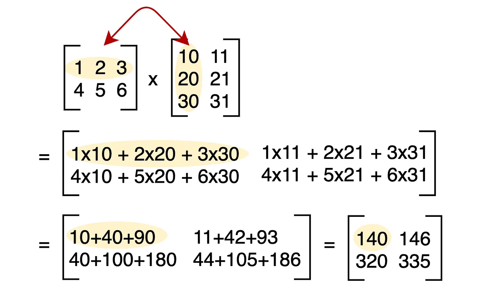
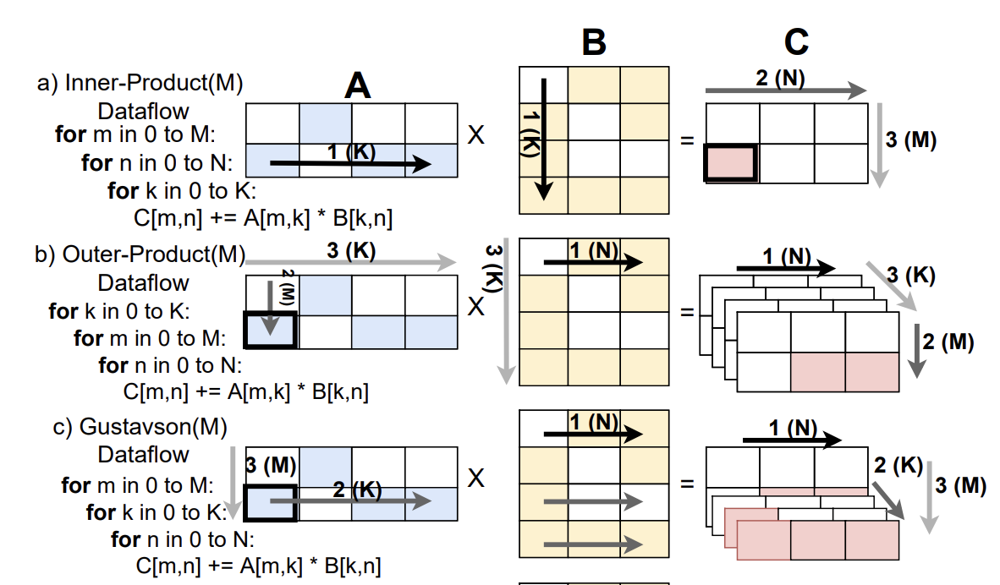
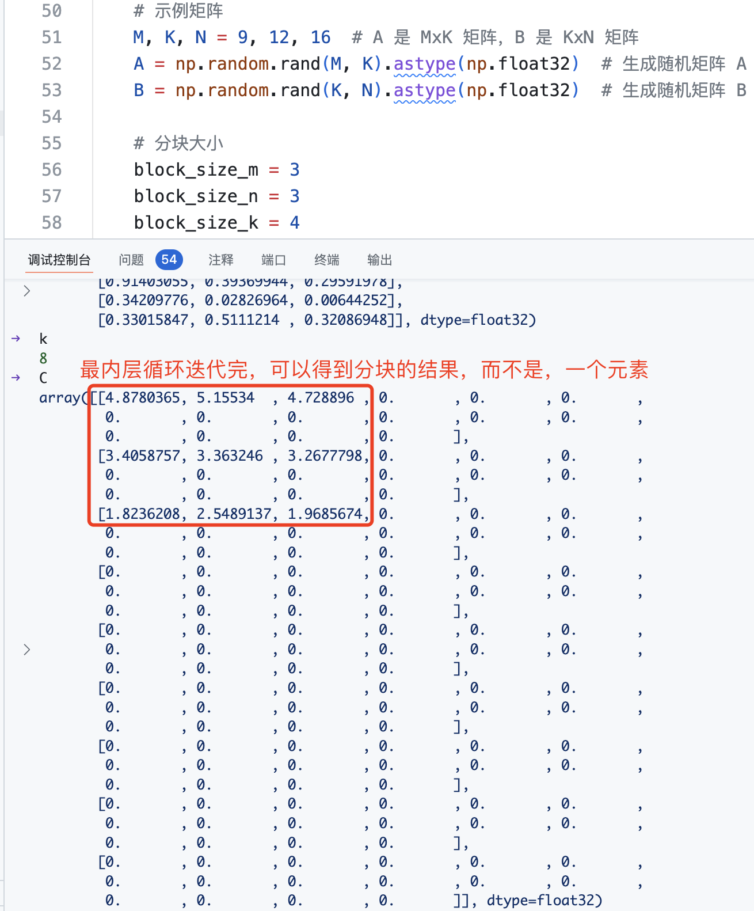
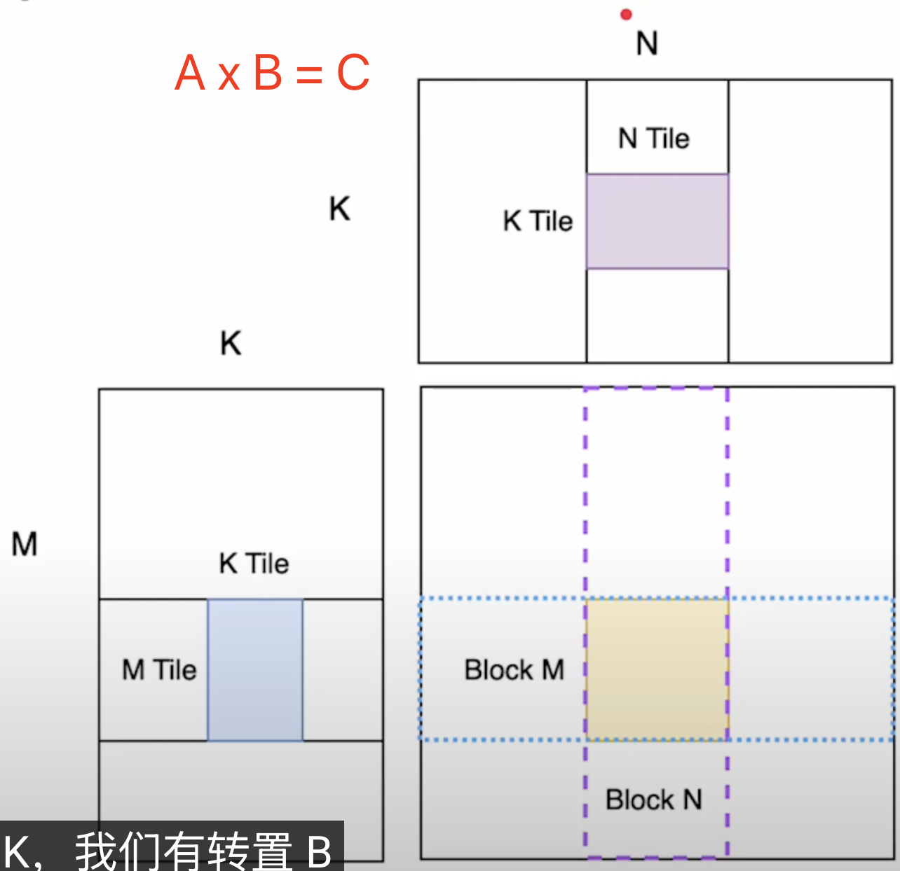
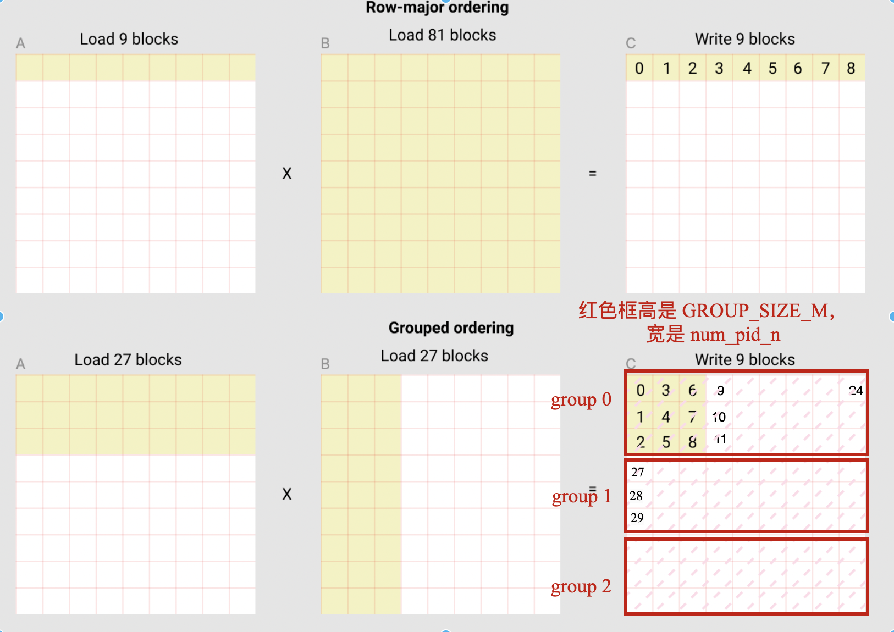
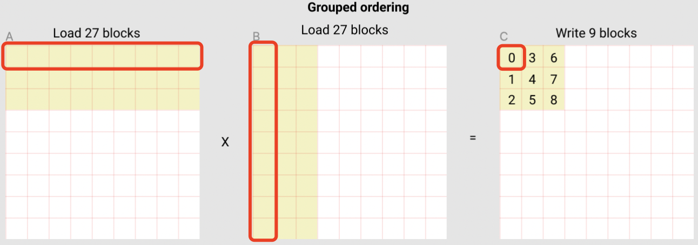

- [1. 矩阵乘法](#1-矩阵乘法)
- [2. 分块矩阵乘法](#2-分块矩阵乘法)
- [3. 更快的矩阵乘法 kernel](#3-更快的矩阵乘法-kernel)
  - [3.1 block 的计算顺序](#31-block-的计算顺序)
  - [2.2 block 元素的地址计算](#22-block-元素的地址计算)
  - [2.3 子块的矩阵乘法](#23-子块的矩阵乘法)
  - [2.4 算子融合](#24-算子融合)
- [3. Triton 编程和 CUDA 编程的相同及不同](#3-triton-编程和-cuda-编程的相同及不同)
- [参考资料](#参考资料)

torch 中 Tensor 的乘法有几种方法，如 *、torch.mul、torch.multiply、torch.dot、torch.mv、torch.mm、torch.matmul、torch.einsum 等，主要分为 3 种：
1. **逐元素（element-wise）乘法**：对于两个Tensor对象（如矩阵和矩阵、矩阵和实数等，向量也是矩阵的一种），分别按对应元素进行实数普通乘法。\*、torch.mul、torch.multiply 三者操作含义是相同的。torch.multiply 是 torch.mul 的别名，* 是 torch.mul 的简写。
2. **矩阵点乘也叫矩阵乘法**：`c = torch.matmul(x, y)`。
3. **爱因斯坦求和约定函数**：能够包含上面所有乘法运算，如矩阵乘法 `torch.einsum("ij,jk->ik", x, y)`。

另外，torch.dot 函数计算两个一维张量的点积也常用。数学中，两个一维向量的内积，对应元素相乘然后再相加，得到一个实数。要求两个张量元素个数相同。

### 1. 矩阵乘法

矩阵乘法是线性代数中的基本操作之一，定义如下：

给定两个矩阵 A 和 B，其中 A 的维度为 (M × K)，B 的维度为 (K × N)，则它们的乘积 C = A × B 的维度为 (M × N)，且 C 中的元素 C[i][j] 由以下公式计算：

$$C[i][j] = \sum_{k=1}^{K} A[i][k] \times B[k][j]$$



不带任何优化的矩阵乘法 python 代码如下所示:

```python
def matrix_multiply(A, B):
    # A B 都是二维列表
    rows_A = len(A)
    cols_A = len(A[0])
    rows_B = len(B)
    cols_B = len(B[0])
    assert cols_A == rows_B
    # 初始化矩阵 C，形状为 [rows_A, cols_B]
    C = [0 for _ in range(cols_B)] for _ in range(rows_A)
    for i in range(rows_A):
        for j in range(cols_B):
            for k in range(rows_B):
                C[i][j] += A[i][k] * B[k][j]

    return C
```

很明显，在进行矩阵乘法时，要使用三重嵌套循环，将矩阵元素进行正确的组合。实现 GEMM 需要在 $M$ 和  $N$ 维度上迭代，同时在共享维度 $K$ 上共同迭代。

“共同迭代”意味着我们在进行矩阵相乘时，矩阵 A 和 B 在共享的维度 $K$ 上同时进行迭代。根据我们在嵌套循环中选择哪一层进行共同迭代，矩阵乘法的数据流会有所不同：

- 内积法（`IP`，Inner Product）：将共同迭代放在最内层循环。这种方式关注结果矩阵中的单个元素，并通过在共享维度上迭代来累加它的值。此方法一次生成一个完整的结果元素，不需要合并部分和。
- 外积法（`OP`，Outer Product）：将共同迭代放在最外层循环。此方式从矩阵 A 的一行和矩阵 B 的一列相乘生成一个完整矩阵，然后将多个矩阵结果合并，得到最终结果。此方法一次生成多个部分和，因此需要硬件支持合并，且可能增加内存访问量。
- Gustavson 算法（`Gust`）：将共同迭代放在中间循环。在这种方式中，当前 A 的一行和 B 的一列的部分和会被计算，随后聚合为最终结果。

除了在共享维度 $K$ 上共同迭代外，遍历 $M$ 和 $N$ 维度的顺序也会影响计算模式。对于每种数据流（IP、OP 和 Gustavson），改变 $M$ 和 $N$ 的循环顺序可以产生两种不同的计算模式。因此总共有六种可能的变体。

选择不同的变体主要取决于“数据重用”的效率。在计算中，重用（reuse）已经加载到高速内存（如缓存）中的数据可以提高效率。通过**优先考虑某个维度的驻留性（即保持其靠近处理单元），可以更好地重用数据，从而使计算更加高效**。下图展示了三种不同的数据流模式。



### 2. 分块矩阵乘法

虽然经验证，上述矩阵乘法函数结果正确，但是很明显这样的实现性能是不够的。可以考虑**分块矩阵乘法**（Tiled Matrix MultiplicationMultiplication），即将矩阵分块（计算拆分），每次计算一部分内容。分块的目的就是优化访存，通过分块之后让访存都集中在一定区域，能够提高了数据局部性，从而提高 Cache 利用率，性能就会更好。分块矩阵乘法伪代码如下所示：

```python
# Do in parallel
for m in range(0, M, BLOCK_SIZE_M):
  # Do in parallel
  for n in range(0, N, BLOCK_SIZE_N):
    acc = zeros((BLOCK_SIZE_M, BLOCK_SIZE_N), dtype=float32)
    for k in range(0, K, BLOCK_SIZE_K):
      a = A[m : m+BLOCK_SIZE_M, k : k+BLOCK_SIZE_K]
      b = B[k : k+BLOCK_SIZE_K, n : n+BLOCK_SIZE_N]
      acc += dot(a, b)
    C[m : m+BLOCK_SIZE_M, n : n+BLOCK_SIZE_N] = acc
```
> 注意，这里的代码更多的是为了表现矩阵乘法的思路，更详细的 c++ 实现可以参考[这里](https://github.com/HarleysZhang/cv_note/blob/master/7-high-performance_computing/%E9%80%9A%E7%94%A8%E7%9F%A9%E9%98%B5%E4%B9%98%E7%AE%97%E6%B3%95%E4%BB%8E%E5%85%A5%E9%97%A8%E5%88%B0%E5%AE%9E%E8%B7%B5.md)。

用**分块**（Block）的方法，将大矩阵划分为更小的子块，逐块进行乘法计算并累加结果。矩阵子块乘法（acc += dot(a, b)）：
- dot(a, b)：这是两个矩阵子块 a 和 b 的乘积，即矩阵乘法操作。
- 每次计算的结果累积到 acc 中，确保不同的 k 块对的结果都正确累加到 acc。

```bash
+——--+—-——+     +——--+—-——+     +——————————---+—-—————————-—+
| A1 | A2 |     | B1 | B2 |     | A1.B1+A2.B3 | A1.B2+A2.B4 |
+——--+—-——+ dot +——--+—-——+  =  +——————————---+—-—————————-—+
| A3 | A4 |     | B3 | B4 |     | A3.B1+A4.B3 | A3.B2+A4.B4 |
+——--+—-——+     +——--+—-——+     +——————————---+—-—————————-—+
```
分块矩阵乘法原理的如下图所示：


小块矩阵结果如下所示：


Python 完整矩阵乘法及分块矩阵乘法优化的代码如下所示:
```python
import torch,time
import numpy as np


def matrix_multiply(A, B):
    # A B 都是二维列表
    rows_A = len(A)
    cols_A = len(A[0])
    rows_B = len(B)
    cols_B = len(B[0])
    assert cols_A == rows_B
    # 初始化矩阵 C，形状为 [rows_A, cols_B]
    C = [[0 for _ in range(cols_B)] for _ in range(rows_A)]
    for i in range(rows_A):
        for j in range(cols_B):
            for k in range(rows_B):
                C[i][j] += A[i][k] * B[k][j]

    return C

def block_matrix_multiply(A, B, block_size_m, block_size_n, block_size_k):
    # 获取矩阵 A 和 B 的维度
    M, K = A.shape
    K_b, N = B.shape
    
    assert K == K_b, "矩阵 A 的列数必须等于矩阵 B 的行数"

    # 初始化结果矩阵 C
    C = np.zeros((M, N), dtype=np.float32)

    # 分块矩阵乘法
    for m in range(0, M, block_size_m):
        for n in range(0, N, block_size_n):
            # 初始化累加器块
            acc = np.zeros((block_size_m, block_size_n), dtype=np.float32)
            for k in range(0, K, block_size_k):
                # 取矩阵 A 和 B 的子块
                a_block = A[m:m+block_size_m, k:k+block_size_k]
                b_block = B[k:k+block_size_k, n:n+block_size_n]
                
                # 累加块的矩阵乘法结果
                acc += np.dot(a_block, b_block) # 本质上就是小块矩阵乘法
            
            # 将累加结果赋值给结果矩阵 C 的对应子块
            C[m:m+block_size_m, n:n+block_size_n] = acc

    return C

if __name__ == "__main__":
    # 示例矩阵
    M, K, N = 9, 12, 16  # A 是 MxK 矩阵，B 是 KxN 矩阵
    A = np.random.rand(M, K).astype(np.float32)  # 生成随机矩阵 A
    B = np.random.rand(K, N).astype(np.float32)  # 生成随机矩阵 B
    
    # 分块大小
    block_size_m = 3
    block_size_n = 3
    block_size_k = 4
    
    start_time = time.time()
    C_python = matrix_multiply(A, B) # 普通矩阵乘法
    matmul_time = time.time() - start_time
    
    start_time = time.time()
    C_block = block_matrix_multiply(A, B, block_size_m, block_size_n, block_size_k) # 调用分块矩阵乘法
    block_matmul_time = time.time() - start_time
    
    start_time = time.time()
    C_np = np.dot(A, B) # numpy 矩阵乘法
    np_matmul_time = time.time() - start_time
    
    # print("NumPy 矩阵乘法结果:\n", C_python)
    # print("分块矩阵乘法结果:\n", C_block)
    # print("NumPy 矩阵乘法结果:\n", C_np)
    
    # 验证两者结果是否相等
    if np.allclose(C_block, C_np, atol=1e-6) and np.allclose(C_python, C_np, atol=1e-6) :
        print("\n结果验证通过: 分块矩阵乘法和普通矩阵乘法与 NumPy 结果一致！")
    else:
        print("\n结果验证失败: 分块矩阵乘法普通矩阵乘法与 NumPy 结果不一致。")
        
    # 输出时间
    print(f"python matmul 时间: {matmul_time * 1000:.2f} ms")
    print(f"Python block matmul 时间: {block_matmul_time * 1000:.2f} ms")
    print(f"numpy matmul 时间: {np_matmul_time * 1000:.2f} ms")
```
> 缓存命中率（Cache Hit Rate）是衡量缓存系统性能的一个重要指标，表示缓存请求中成功命中的比例，即从缓存中直接读取数据的次数占总访问次数的百分比。

### 3. 更快的矩阵乘法 kernel

#### 3.1 block 的计算顺序

对于矩阵乘法 $A*B=C$，$A$ 的大小是 $M \times K$, $B$ 是 $K\times N$，$C$ 的大小是 $M\times N$, 分块矩阵优化的思路是每次只算出 $C$ 的一部分，假设每次"循环"算的大小是 $\text{BLOCK\_SIZE\_M} \times \text{BLOCK\_SIZE\_N}$ , 那么总共要 "循环" $\frac{M}{BLOCK\_SIZE\_M} \times \frac{N}{BLOCK\_SIZE\_N}$ 次。



循环次数（也是 grid 大小，kernel 程序实例数，block 数目）确定了，但是按照什么样的顺序来循环（读区数据的顺序和范围）是有不同选择的，不同的选择会影响 kernel 的内存访问效率。


上图中每个黄色小块的大小是 `BLOCK_SIZE_M x BLOCK_SIZE_N`, 也就是一个  `block`。图分别展示了矩阵乘法 kernel 的两种循环方式：
1. 上面一种叫做 `row-major ordering`（行优先顺序）, 就是最直接的按照行的模型一个block一个block 地往下进行。对应的需要将 90 个块加载到 SRAM 中才能计算出前 9 个输出块。
2. 下面的叫做 `grouped ordering`, 这种思路不常见, 基本思路是先做 9 个 block, 形成一个大点的 super-block, 然后再进行到下一个 super-block。这种方法只需加载 54 个 block，就能得到前 9 个输出块，数据的 reuse 做得好。

看懂图的黄色小块过程，再来看代码就容易点，说简单点，代码大部分就是为了一个目的：当我们从 `0` 到 `80` 逐渐增加 `pid` 的时候，按照 `grouped ordering` 的顺序处理黄色小块。即
```bash
for pid in range(80):
    load_memory(pid_m, pid_n) # (pid_m, pid_n) 是黄色小块的坐标
```
上述伪代码的真正 triton 实现如下所示:

```python
# Program ID
pid = tl.program_id(axis=0) 
num_pid_m = tl.cdiv(M, BLOCK_SIZE_M) 
num_pid_n = tl.cdiv(N, BLOCK_SIZE_N) 

num_pid_in_group = GROUP_SIZE_M * num_pid_n
group_id = pid // num_pid_in_group 
first_pid_m = group_id * GROUP_SIZE_M
group_size_m = min(num_pid_m - first_pid_m, GROUP_SIZE_M) 

pid_m = first_pid_m + ((pid % num_pid_in_group) % group_size_m)
pid_n = (pid % num_pid_in_group) // group_size_m
```



代码变量意义拆解：
- `num_pid_in_group`: 表示这个红色框 (高是 GROUP_SIZE_M , 宽是 num_pid_n) 里总共有多少黄色小块，一个红色框就是一个 group。
- `group_id` 当前的这次 "循环"，是在第几个红色框里。
- `first_pid_m` 当前所在的 group 中的第一个黄色小块, 它在全局中是第几个黄色小块 (在 `m` 维度上)。
- `group_size_m`：重复算一遍 group_size_m 是因为最后一个 group 可能占不满, 会小一点。

最后两行就得到，当前这轮循环是处理（pid_m, pid_n）位置的黄色小块。
```python
pid_m = first_pid_m + (pid % group_size_m)
pid_n = (pid % num_pid_in_group) // group_size_m
```

- 第一行保证 `pid_m` 一定是小于 first_pid_m + group_size_m 的。
- 第二行保证 `pid_n` 一定是**按列**从左到右遍历的, 也就是 n 这个维度是 0, 0, 0（第0列）, 1, 1, 1, 2, 2, 2, ... 这样来的。

如果是上面提到的第一种 `row-major ordering` 的方式, 那么 pid_m 和 pid_n 的计算方式是:
```python
pid_m = pid // num_pid_n
pid_m = pid % num_pid_n
```

遍历顺序也是图中黄色小块中的黑色数字，这种方式虽然遍历顺序简单，但是计算同样数量的黄色小块，需要的处理的黄色小块明显更多，内存读取不高效。

#### 2.2 block 元素的地址计算

kernel 函数每次调用都会对应一个 `pid`，前面的内容就是讲怎么找到当前这个 `pid` 对应 `C` 中的哪个 block (黄色小块)。具体到 block 内部，这里假设我们要计算 C 中的第一个 block, block-0，计算这个 block 需要的 A 和 B 矩阵中的 9 个 block。



**block-0 计算的过程本质上就是分块矩阵的计算过程**，从 A 中取第一行 9 个 block 的第一个，从 B 取第一列9个 block 的第一个，相乘并累加到 accumulator 中, 直到 9 个 block 做完, 就得到了 C 中的第一个 block。

可以看出，即使在 pid 内部也是需要循环的，循环的次数是 9，K 维度上块数 = `tl.cdiv(K, BLOCK_SIZE_K)`。

每个 block 中都有很多 elements，如何找到这些 elements 的 pointers_list 呢？Python 代码逻辑很简单，直接切片就可以得到：
- 获取矩阵 A 的子块：A[m:m+block_size_m, k:k+block_size_k]
- 获取矩阵 B 的子块：B[k:k+block_size_k, n:n+block_size_n] 

对于行优先存储的二维张量 `X`，元素 `X[i, j]` 的内存位置为：`&X[i, j] = X + i*stride_xi + j*stride_xj`。因此，矩阵 A 的指针块 `[m : m+BLOCK_SIZE_M, k : k+BLOCK_SIZE_K]` 和矩阵 B 的指针块 `[k : k+BLOCK_SIZE_K, n : n+BLOCK_SIZE_N]` 可以用以下伪代码表示：

```bash
&A[m : m+BLOCK_SIZE_M, k:k+BLOCK_SIZE_K] =  a_ptr + (m : m+BLOCK_SIZE_M)[:, None]*A.stride(0) + (k : k+BLOCK_SIZE_K)[None, :]*A.stride(1);
&B[k : k+BLOCK_SIZE_K, n:n+BLOCK_SIZE_N] =  b_ptr + (k : k+BLOCK_SIZE_K)[:, None]*B.stride(0) + (n : n+BLOCK_SIZE_N)[None, :]*B.stride(1);
```
上述伪代码第一行相当于通过 `a_ptr + row_offset + col_offset` 计算出矩阵 A 子块中每个元素的内存地址。拆解分析第一行伪代码：
- `a_ptr`: 矩阵 A 在内存中的基地址，即第一个元素地址
- `(m : m+BLOCK_SIZE_M)[:, None] * A.stride(0)`: 表示切片后将一维数组转为二维列向量（形状为 [BLOCK_SIZE_M, 1]）），再乘以行偏移，最终得到**子块行的内存偏移量**。
- `( : k+BLOCK_SIZE_K)[None, :]*A.stride(1)`: 切片后将一维数组转为二维行向量（形状为 [1, BLOCK_SIZE_K]），再乘以列偏移，最终得到**子块列的内存偏移量**。

> A.stride(0)：行步幅，通常等于列数（每行有多少元素）。A.stride(1)：列步幅，通常为1，因为行主序中，列元素是连续存储的。

因为通过 `a_ptr + row_offset + col_offset` 可以计算出矩阵 A 子块中每个元素的内存地址。所以，Trion 中计算 element 的 pointer 代码如下所示：
```python
# 额外的取模操作来处理 M 不是 BLOCK_SIZE_M 的倍数，或 N 不是 BLOCK_SIZE_N 的倍数的情况。
offs_am = (pid_m * BLOCK_SIZE_M + tl.arange(BLOCK_SIZE_M)) % M
offs_bn = (pid_n * BLOCK_SIZE_N + tl.arange(BLOCK_SIZE_N)) % N
offs_k = tl.arange(BLOCK_SIZE_K)
a_ptrs = a_ptr + (offs_am[:, None] * stride_am + offs_k * stride_ak)
b_ptrs = b_ptr + (offs_k[:,None] * stride_bk + offs_k * stride_bk)
```

offs_am 和 offs_k 分别是 A 矩阵 9 个 block 中第一个 block 中, 每个 element 在整个 A 矩阵中的 **m 维度的 index 和 k 维度的 index**，都是 list 类型。

有了 m 维度 和 k 维度的 index, 就可以让它们各自和 m 维度 和 k 维度的 stride 相乘, 然后和 a_ptr 相加, 就可以得到 A 矩阵 9 个 block 中第一个 block 中所有 elements 的地址（指针）。
```python
a_ptrs = a_ptr + (offs_am[:, None] * stride_am + offs_k * stride_ak)
```

#### 2.3 子块的矩阵乘法

```python
# -----------------------------------------------------------
# Iterate to compute a block of the C matrix.
# We accumulate into a `[BLOCK_SIZE_M, BLOCK_SIZE_N]` block
# of fp32 values for higher accuracy.
# `accumulator` will be converted back to fp16 after the loop.
accumulator = tl.zeros((BLOCK_SIZE_M, BLOCK_SIZE_N), dtype=tl.float32)
for k in range(0, tl.cdiv(K, BLOCK_SIZE_K)):
    a = tl.load(a_ptrs, mask = offs_k[None, :] < K - k * BLOCK_SIZE_K, other=0.0)
    b = tl.load(b_ptrs, mask = offs_k[None, :] < K - k * BLOCK_SIZE_K, other=0.0)
    #  We accumulate along the K dimension.
    accumulator += tl.dot(a, b)
    # Advance the ptrs to the next K block.
    a_ptrs += BLOCK_SIZE_K * stride_ak
    b_ptrs += BLOCK_SIZE_K * stride_bk
```

首先，创建一个 accumulator，然后根据 pointers 来 load A block 中的 elements。

```python
a = tl.load(a_ptrs, mask = offs_k[None, :] < K - k * BLOCK_SIZE_K, other=0.0)
```
这里 mask 的设置很重要，因为很多时候 K 可能不能被 BLOCK_SIZE_K 整除, 到每一行最后一个 block 的时候, 实际大小是不足 BLOCK_SIZE_K 的。所以我们在 load 时候, 需要把这块考虑进去。

另外，上述代码，很明显发现，真正涉及到数学计算的代码只有一行。

```python
accumulator += tl.dot(a, b)
```

换言之，triton kernel 几乎所有的代码都是在做好 elements 的分块，这也是写好 kernel 代码的关键-**如何分块**。

#### 2.4 算子融合

`leaky_relu` 激活函数如下:
```python
# We can fuse `leaky_relu` by providing it as an `ACTIVATION` meta-parameter in `_matmul`.
@triton.jit
def leaky_relu(x):
    x = x + 1
    return tl.where(x >= 0, x, 0.01 * x)
```

Kernel Fuse 的好在于可以只用 load 一次数据, 然后在这个数据上面进行多种计算, 这样就把本来需要多次 load 的时间省下来了。
```python
 # You can fuse arbitrary activation functions here
# while the accumulator is still in FP32!
if ACTIVATION == "leaky_relu":
    accumulator = leaky_relu(accumulator)
c = accumulator.to(tl.float16)

# -----------------------------------------------------------
# Write back the block of the output matrix C with masks.
offs_cm = pid_m * BLOCK_SIZE_M + tl.arange(0, BLOCK_SIZE_M)
offs_cn = pid_n * BLOCK_SIZE_N + tl.arange(0, BLOCK_SIZE_N)
c_ptrs = c_ptr + stride_cm * offs_cm[:, None] + stride_cn * offs_cn[None, :]
c_mask = (offs_cm[:, None] < M) & (offs_cn[None, :] < N)
tl.store(c_ptrs, c, mask=c_mask)
```

最终，完整矩阵乘法 kernel 及其调用函数代码如下:

```python
import torch

import triton
import triton.language as tl


# `triton.jit`'ed functions can be auto-tuned by using the `triton.autotune` decorator, which consumes:
#   - A list of `triton.Config` objects that define different configurations of
#       meta-parameters (e.g., `BLOCK_SIZE_M`) and compilation options (e.g., `num_warps`) to try
#   - An auto-tuning *key* whose change in values will trigger evaluation of all the
#       provided configs
@triton.autotune(
    configs=[
        triton.Config({'BLOCK_SIZE_M': 128, 'BLOCK_SIZE_N': 256, 'BLOCK_SIZE_K': 64, 'GROUP_SIZE_M': 8}, num_stages=3, num_warps=8),
        triton.Config({'BLOCK_SIZE_M': 64, 'BLOCK_SIZE_N': 256, 'BLOCK_SIZE_K': 32, 'GROUP_SIZE_M': 8}, num_stages=4, num_warps=4),
        triton.Config({'BLOCK_SIZE_M': 128, 'BLOCK_SIZE_N': 128, 'BLOCK_SIZE_K': 32, 'GROUP_SIZE_M': 8}, num_stages=4, num_warps=4),
        triton.Config({'BLOCK_SIZE_M': 128, 'BLOCK_SIZE_N': 64, 'BLOCK_SIZE_K': 32, 'GROUP_SIZE_M': 8}, num_stages=4, num_warps=4),
        triton.Config({'BLOCK_SIZE_M': 64, 'BLOCK_SIZE_N': 128, 'BLOCK_SIZE_K': 32, 'GROUP_SIZE_M': 8}, num_stages=4, num_warps=4),
        triton.Config({'BLOCK_SIZE_M': 128, 'BLOCK_SIZE_N': 32, 'BLOCK_SIZE_K': 32, 'GROUP_SIZE_M': 8}, num_stages=4, num_warps=4),
        triton.Config({'BLOCK_SIZE_M': 64, 'BLOCK_SIZE_N': 32, 'BLOCK_SIZE_K': 32, 'GROUP_SIZE_M': 8}, num_stages=5, num_warps=2),
        triton.Config({'BLOCK_SIZE_M': 32, 'BLOCK_SIZE_N': 64, 'BLOCK_SIZE_K': 32, 'GROUP_SIZE_M': 8}, num_stages=5, num_warps=2),
    ],
    key=['M', 'N', 'K'],
)
@triton.jit
def matmul_kernel(
    # Pointers to matrices
    a_ptr, b_ptr, c_ptr,
    # Matrix dimensions
    M, N, K,
    # The stride variables represent how much to increase the ptr by when moving by 1
    # element in a particular dimension. E.g. `stride_am` is how much to increase `a_ptr`
    # by to get the element one row down (A has M rows).
    stride_am, stride_ak,
    stride_bk, stride_bn,
    stride_cm, stride_cn,
    # Meta-parameters
    BLOCK_SIZE_M: tl.constexpr, BLOCK_SIZE_N: tl.constexpr, BLOCK_SIZE_K: tl.constexpr,
    GROUP_SIZE_M: tl.constexpr,
    ACTIVATION: tl.constexpr,
):
    """Kernel for computing the matmul C = A x B.
    A has shape (M, K), B has shape (K, N) and C has shape (M, N)
    """
    # -----------------------------------------------------------
    # Map program ids `pid` to the block of C it should compute.
    # This is done in a grouped ordering to promote L2 data reuse.
    # See above `L2 Cache Optimizations` section for details.
    pid = tl.program_id(axis=0)
    num_pid_m = tl.cdiv(M, BLOCK_SIZE_M)
    num_pid_n = tl.cdiv(N, BLOCK_SIZE_N)
    num_pid_in_group = GROUP_SIZE_M * num_pid_n
    group_id = pid // num_pid_in_group
    first_pid_m = group_id * GROUP_SIZE_M
    group_size_m = min(num_pid_m - first_pid_m, GROUP_SIZE_M)
    pid_m = first_pid_m + (pid % group_size_m)
    pid_n = (pid % num_pid_in_group) // group_size_m

    # ----------------------------------------------------------
    # Create pointers for the first blocks of A and B.
    # We will advance this pointer as we move in the K direction
    # and accumulate
    # `a_ptrs` is a block of [BLOCK_SIZE_M, BLOCK_SIZE_K] pointers
    # `b_ptrs` is a block of [BLOCK_SIZE_K, BLOCK_SIZE_N] pointers
    # See above `Pointer Arithmetics` section for details
    offs_am = (pid_m * BLOCK_SIZE_M + tl.arange(0, BLOCK_SIZE_M)) % M
    offs_bn = (pid_n * BLOCK_SIZE_N + tl.arange(0, BLOCK_SIZE_N)) % N
    offs_k = tl.arange(0, BLOCK_SIZE_K)
    a_ptrs = a_ptr + (offs_am[:, None] * stride_am + offs_k[None, :] * stride_ak)
    b_ptrs = b_ptr + (offs_k[:, None] * stride_bk + offs_bn[None, :] * stride_bn)

    # -----------------------------------------------------------
    # Iterate to compute a block of the C matrix.
    # We accumulate into a `[BLOCK_SIZE_M, BLOCK_SIZE_N]` block
    # of fp32 values for higher accuracy.
    # `accumulator` will be converted back to fp16 after the loop.
    accumulator = tl.zeros((BLOCK_SIZE_M, BLOCK_SIZE_N), dtype=tl.float32)
    for k in range(0, tl.cdiv(K, BLOCK_SIZE_K)):
        # Load the next block of A and B, generate a mask by checking the K dimension.
        # If it is out of bounds, set it to 0.
        a = tl.load(a_ptrs, mask=offs_k[None, :] < K - k * BLOCK_SIZE_K, other=0.0)
        b = tl.load(b_ptrs, mask=offs_k[:, None] < K - k * BLOCK_SIZE_K, other=0.0)
        # We accumulate along the K dimension.
        accumulator += tl.dot(a, b)
        # Advance the ptrs to the next K block.
        a_ptrs += BLOCK_SIZE_K * stride_ak
        b_ptrs += BLOCK_SIZE_K * stride_bk
    # You can fuse arbitrary activation functions here
    # while the accumulator is still in FP32!
    if ACTIVATION == "leaky_relu":
        accumulator = leaky_relu(accumulator)
    c = accumulator.to(tl.float16)

    # -----------------------------------------------------------
    # Write back the block of the output matrix C with masks.
    offs_cm = pid_m * BLOCK_SIZE_M + tl.arange(0, BLOCK_SIZE_M)
    offs_cn = pid_n * BLOCK_SIZE_N + tl.arange(0, BLOCK_SIZE_N)
    c_ptrs = c_ptr + stride_cm * offs_cm[:, None] + stride_cn * offs_cn[None, :]
    c_mask = (offs_cm[:, None] < M) & (offs_cn[None, :] < N)
    tl.store(c_ptrs, c, mask=c_mask)


# We can fuse `leaky_relu` by providing it as an `ACTIVATION` meta-parameter in `_matmul`.
@triton.jit
def leaky_relu(x):
    x = x + 1
    return tl.where(x >= 0, x, 0.01 * x)

def matmul(a, b, activation=""):
    # Check constraints.
    assert a.shape[1] == b.shape[0], "Incompatible dimensions"
    assert a.is_contiguous(), "Matrix A must be contiguous"
    assert b.is_contiguous(), "Matrix B must be contiguous"
    M, K = a.shape
    K, N = b.shape
    # Allocates output.
    c = torch.empty((M, N), device=a.device, dtype=a.dtype)
    # 1D launch kernel where each block gets its own program.
    grid = lambda META: (
        triton.cdiv(M, META['BLOCK_SIZE_M']) * triton.cdiv(N, META['BLOCK_SIZE_N']),
    )
    matmul_kernel[grid](
        a, b, c,
        M, N, K,
        a.stride(0), a.stride(1),
        b.stride(0), b.stride(1),
        c.stride(0), c.stride(1),
        ACTIVATION=activation
    )
    return c
```

### 3. Triton 编程和 CUDA 编程的相同及不同

1，Triton 和 CUDA 编程的大体结构都是一样的. 无非 定义kernel function --> 确定 kernel function "循环" 执行多少次 --> 调用 kernel function. 而且, 为了可行性, Triton 把 CUDA 中 pointer 的概念引入到 python 里面. 

2，Triton 相对于 CUDA 做了一些简化. 比如, Triton 里面, kernel function 处理数据的量级是 block, 所以在确定 "循环次数" 的时候也是确定有多少这样的 block。CUDA 里面, kernel function 处理的对象是一个个的 scalar, 在确定 "循环次数" 的时候也是要看有多少这样的 scalar。而且 CUDA 中的 "循环次数" 是有分级的, 分别为 thread, thread block, thread grid。多个 thread 构成一个 thread block, 多个 thread block 构成一个 thread grid。而这三个级别中, 可以保证的是同一个 thread block (CTA) 中不同 thread 之间有共享的 shared memory 因为他们是可以同步和通信的 (而这又是由 GPU 硬件决定的)。

3，Triton 里面我们有 pid = tl.program_id(axis=0) 来定位当前是第几次"循环", CUDA 里面, 这个要复杂一些, 有这么几个变量: threadIdx.x, threadIdx.y, threadIdx.z 分别代表当前 thread 在其所在的 thread block 的 xyz 坐标。blockIdx.x, blockIdx.x,  blockIdx.x  分别代表当前 thread block 在其所在的 thread grid 的 xyz 坐标。blockDim.x, blockDim.x,  blockDim.x  分别代表当前 thread block 在 xyz 维度分别有多少个 threadgridDim.x, gridDim.x,  gridDim.x  分别代表当前 thread grid 在 xyz 维度分别有多少个 thread block 可以看到 CUDA 更加细致些, 直接到 thread 级别, 而 Triton 的思路是, 反正最后都是要一个 block 一个 block 处理的, 所以就把编程接口的级别订到了 block。

### 参考资料

- https://arxiv.org/pdf/2204.03826
- [Matrix Multiplication](https://triton-lang.org/main/getting-started/tutorials/03-matrix-multiplication.html)
- [知乎-如何入门 OpenAI Triton 编程?](https://www.zhihu.com/question/622685131?login=from_csdn)
- [Dense Matrix Dense Matrix Tiled Multiplication (GEMM)](https://www.cs.sfu.ca/~ashriram/Courses/CS7ARCH/hw/hw4.html)