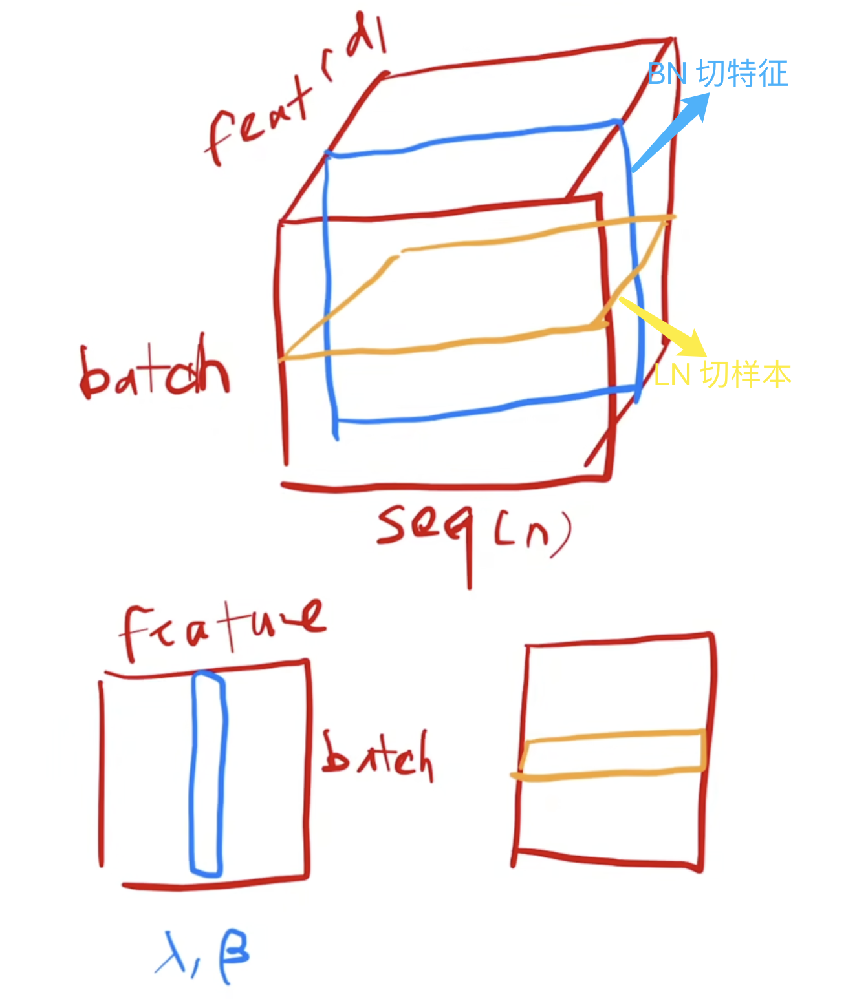
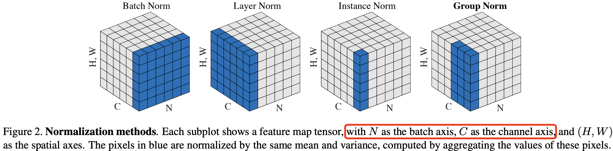

- [1. LN 原理](#1-ln-原理)
- [2 BN、LN、IN 和 GN 计算上的区别](#2-bnlnin-和-gn-计算上的区别)
- [3. LN 前向传播内核](#3-ln-前向传播内核)
- [参考资料](#参考资料)

### 1. LN 原理

LN 作用是减少了不同特征之间的依赖关系，可以使得模型训练更加稳定，收敛更快，并提高了模型的泛化能力。`Batch Norm` 和 `Layer Norm` 的区别一句话总结就是 `bn` 是切特征，`ln` 是切样本。

* `BN`: 对于每个特征维度，计算它在整个批次中的均值和标准差，然后对该特征进行归一化。
* `LN`: 对每个样本单独计算其所有特征的均值和标准差，然后在该样本内进行归一化。



`Layer Norm` 操作具体来说，它接受一个**向量** $\boldsymbol{x}$ 作为输入，输出一个与之形状相同的向量 $\boldsymbol{y}$。归一化通过对 $\boldsymbol{x}$ 减去均值并除以标准差来实现。完成归一化后，再应用具有可学习参数 $\boldsymbol{\gamma}$（权重）和 $\boldsymbol{\beta}$（偏置）的线性变换。前向传播过程可以表示如下：
$$y = \frac{x - E[x]}{\sqrt{(Var(x) + \epsilon)}} * \gamma + \beta$$

其中 $\epsilon$ 是一个很小的常数添加到分母以实现数值稳定性。

### 2 BN、LN、IN 和 GN 计算上的区别

特征归一化方法家族，包括 BN（批归一化）、LN（层归一化）、IN（实例归一化）和 GN（组归一化），都执行如下计算：
\[
\hat{x}_i = \frac{x_i - \mu_i}{\sigma_i}. \tag{1}
\]
其中，$x$ 是由某一层计算出的**特征**，$i$ 代表特征的索引。

对于 2D 图像来说，$i = (i_N, i_C, i_H, i_W)$ 是一个 4D 向量，按照 $(N, C, H, W)$ 的顺序索引特征，其中 $N$ 代表批次维度，$C$ 代表通道维度，$H$ 和 $W$ 代表空间高度和宽度。

公式（1）中的 $\mu$ 和 $\sigma$ 分别是均值和标准差，通过以下方式计算：

$$\mu_i = \frac{1}{m} \sum_{k \in S_i} x_k, \quad \sigma_i = \sqrt{\frac{1}{m} \sum_{k \in S_i} (x_k - \mu_i)^2 + \epsilon}, \tag{2}$$

其中 $\epsilon$ 为一个小常数。\(S_i\) 是用于计算均值和标准差的像素集合， \(m\) 是该集合的大小。不同特征归一化方法的主要区别在于如何定义集合 \(S_i\) （公式 2 所示），对于 2D 图像的具体定义如下：

在批归一化（Batch Norm, BN）[26] 中，集合 \(S_i\) 定义为：
$$S_i = \{k \mid k_C = i_C \}$$其中 \(i_C\) （以及 \(k_C\)）表示 \(i\) （以及 \(k\)）沿着通道维度（C 轴）的子索引。这意味着具有相同通道索引的像素被一同归一化，换句话说，$\text{BN}$ 对每个通道沿着 (N, H, W) 轴计算均值和标准差。

在层归一化（Layer Norm, LN）[3] 中，集合定义为：
\[
S_i = \{k \mid k_N = i_N \}
\]这意味着 $\text{LN}$ 对每个样本沿着 (C, H, W) 轴计算均值和标准差。

在实例归一化（Instance Norm, IN）[61] 中，集合定义为：\[S_i = \{k \mid k_N = i_N, k_C = i_C \}\]这意味着 $\text{IN}$ 对每个样本的每个通道沿着 (H, W) 轴计算均值和标准差。下图显示了 BN、LN 和 IN 之间的关系。



### 3. LN 前向传播内核

结合前面向量相加、softmax 算子、矩阵乘法内核的实现，我们可以自行实现 LN 层的内核代码了。输入 x 是二维的，因此**计算是逐行进行的**。值得说明的是，每行的元素数量（N）是比较多的，一般超过 BLOCK_SIZE，因此需要对一行元素的数量分块计算，在 kernel 内用 for 循环遍历。
```python
import torch

import triton
import triton.language as tl
@triton.jit
def _layer_norm_fwd_fused(
    X, # pointer to the input
    Y, # pointer to the output
    W, # pointer to the weight
    B, # pointer to the bias
    Mean,  # pointer to the mean
    Rstd,  # pointer to the 1/std
    stride,  # how much to increase the pointer when moving by 1 row
    N,  # number of columns in X
    eps,  # epsilon to avoid division by zero
    BLOCK_SIZE: tl.constexpr,
):
    # 一行的元素数量 N 一般远超 BLOCK_SIZE，故需要对 N 进行分块计算
    row_idx = tl.programs(0)
    X += row_idx * stride
    Y += row_idx * stride
    # 计算均值
    mean = 0
    _mean = tl.zeros([BLOCK_SIZE], dtype=tl.float32)
    for off in range(0, N, BLOCK_SIZE):
        col_offsets = off + tl.arange(0, BLOCK_SIZE)
        x_sub = tl.load(X + col_offsets, mask = col_offsets<N, other=0.).to(tl.float32)
        _mean += x_sub
    mean = tl.sum(_mean, axis = 0) / N
    # 计算方差
    _var = tl.zeros([BLOCK_SIZE], dtype=tl.float32)
    for off in range(0, N, BLOCK_SIZE):
        col_offsets = off + tl.arange(0, BLOCK_SIZE)
        x = tl.load(X + col_offsets, mask = col_offsets<N, other=0.).to(tl.float32)
        x = tl.where(cols < N, x - mean, 0.)
        _var += x*x
    var = torch.sum(_var, axis = 0) / N
    rstd = 1 / tl.sqrt(var + eps)

    # 写均值和方差到内存
    tl.store(Mean + row_idx, mean)
    tl.store(Rstd + row_idx, rstd)

    # 算LN
    for off in range(0, N, BLOCK_SIZE):
        col_offsets = off + tl.arange(0, BLOCK_SIZE)
        mask = col_offsets < N
        w = tl.load(W + col_offsets, mask=mask)
        b = tl.load(B + col_offsets, mask=mask)
        x = tl.load(X + col_offsets, mask = mask, other=0.).to(tl.float32)
        x_hat = (x - mean) * rstd
        y = x_hat*w + b
        # 将LN写到输出内存地址
        tl.store(Y + col_offsets, y, mask=mask)
```

内核实现好了之后，调用内核的函数也好编写了，代码如下：
```python
class LayerNorm(torch.autograd.Function):
    @staticmethod
    def forward(ctx, x, normalized_shape, weight, bias, eps):
        # allocate output
        y = torch.empty_like(x)
        # reshape input data into 2D tensor
        x_arg = x.reshape(-1, x.shape[-1])
        M, N = x_arg.shape
        mean = torch.empty((M, ), dtype=torch.float32, device=x.device)
        rstd = torch.empty((M, ), dtype=torch.float32, device=x.device)
        # Less than 64KB per feature: enqueue fused kernel
        MAX_FUSED_SIZE = 65536 // x.element_size()
        BLOCK_SIZE = min(MAX_FUSED_SIZE, triton.next_power_of_2(N))
        if N > BLOCK_SIZE:
            raise RuntimeError("This layer norm doesn't support feature dim >= 64KB.")
        # heuristics for number of warps
        num_warps = min(max(BLOCK_SIZE // 256, 1), 8)
        # enqueue kernel
        _layer_norm_fwd_fused[(M, )](  # grid 形状为一维，大小就是输入 x 的行数
            x_arg, y, weight, bias, mean, rstd,  #
            x_arg.stride(0), N, eps,  #
            BLOCK_SIZE=BLOCK_SIZE, num_warps=num_warps, num_ctas=1)
        ctx.save_for_backward(x, weight, bias, mean, rstd)
        ctx.BLOCK_SIZE = BLOCK_SIZE
        ctx.num_warps = num_warps
        ctx.eps = eps
        return y
```

内核函数测试代码如下所示:

```python
layer_norm = LayerNorm.apply
def test_layer_norm(M, N, dtype, eps=1e-5, device='cuda'):
    # create data
    x_shape = (M, N)
    w_shape = (x_shape[-1], )
    weight = torch.rand(w_shape, dtype=dtype, device=device, requires_grad=True)
    bias = torch.rand(w_shape, dtype=dtype, device=device, requires_grad=True)
    x = -2.3 + 0.5 * torch.randn(x_shape, dtype=dtype, device=device)
    dy = .1 * torch.randn_like(x)
    # forward pass
    y_tri = layer_norm(x, w_shape, weight, bias, eps)
    y_ref = torch.nn.functional.layer_norm(x, w_shape, weight, bias, eps).to(dtype)
    # compare
    assert torch.allclose(y_tri, y_ref, atol=1e-2, rtol=0)

if __name__ == "__main__":
    test_layer_norm(1151, 8192, torch.float16)
```

### 参考资料
- [triton tutorial-Layer Normalization](https://triton-lang.org/main/getting-started/tutorials/05-layer-norm.html)
- [Jimmy Lei Ba and Jamie Ryan Kiros and Geoffrey E. Hinton, “Layer Normalization”, Arxiv 2016](https://arxiv.org/pdf/1607.06450)
- [Batch Normalization: Accelerating Deep Network Training by Reducing Internal Covariate Shift](https://arxiv.org/pdf/1502.03167)
- [Group Normalization](https://arxiv.org/pdf/1803.08494)