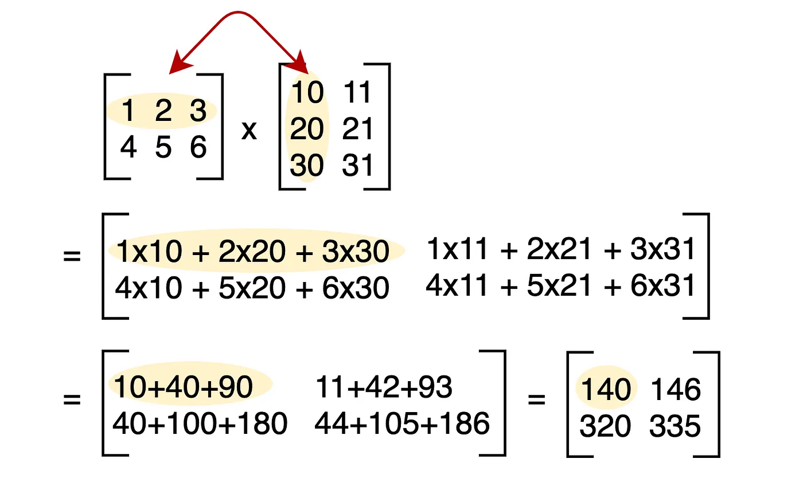
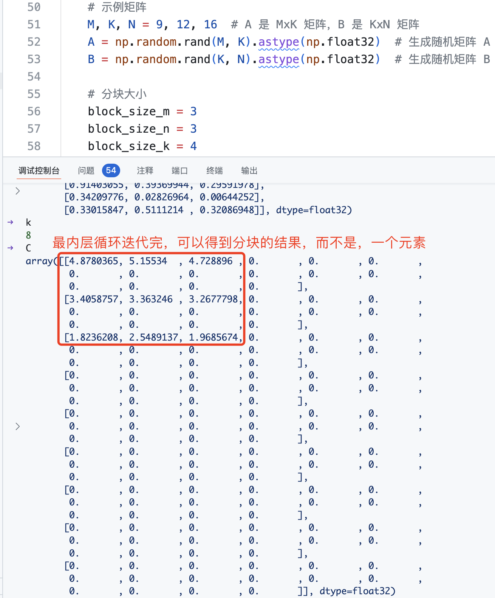

- [1. 矩阵乘法](#1-矩阵乘法)
- [2. 矩阵乘法 kernel](#2-矩阵乘法-kernel)
  - [2.1 指针算法](#21-指针算法)
  - [2.2 L2 cache 优化](#22-l2-cache-优化)

缓存命中率（Cache Hit Rate）是衡量缓存系统性能的一个重要指标，表示缓存请求中成功命中的比例，即从缓存中直接读取数据的次数占总访问次数的百分比。

torch 中 Tensor 的乘法有几种方法，如 *、torch.mul、torch.multiply、torch.dot、torch.mv、torch.mm、torch.matmul、torch.einsum 等，主要分为 3 种：
1. **逐元素（element-wise）乘法**：对于两个Tensor对象（如矩阵和矩阵、矩阵和实数等，向量也是矩阵的一种），分别按对应元素进行实数普通乘法。\*、torch.mul、torch.multiply 三者操作含义是相同的。torch.multiply 是 torch.mul 的别名，* 是 torch.mul 的简写。
2. **矩阵点乘也叫矩阵乘法**：`c = torch.matmul(x, y)`。
3. **爱因斯坦求和约定函数**：能够包含上面所有乘法运算，如矩阵乘法 `torch.einsum("ij,jk->ik", x, y)`。

另外，torch.dot 函数计算两个一维张量的点积也常用。数学中，两个一维向量的内积，对应元素相乘然后再相加，得到一个实数。要求两个张量元素个数相同。

### 1. 矩阵乘法

矩阵乘法是线性代数中的基本操作之一，定义如下：

给定两个矩阵 A 和 B，其中 A 的维度为 (M × K)，B 的维度为 (K × N)，则它们的乘积 C = A × B 的维度为 (M × N)，且 C 中的元素 C[i][j] 由以下公式计算：

$$C[i][j] = \sum_{k=1}^{K} A[i][k] \times B[k][j]$$



不带任何优化的矩阵乘法 python 代码如下所示:

```python
def matrix_multiply(A, B):
    # A B 都是二维列表
    rows_A = len(A)
    cols_A = len(A[0])
    rows_B = len(B)
    cols_B = len(B[0])
    assert cols_A == rows_B
    # 初始化矩阵 C，形状为 [rows_A, cols_B]
    C = [0 for _ in range(cols_B)] for _ in range(rows_A)
    for i in range(rows_A):
        for j in range(cols_B):
            for k in range(rows_B):
                C[i][j] += A[i][k] * B[k][j]

    return C
```
虽然经验证，上述矩阵乘法函数结果正确，但是很明显这样的实现性能是不够的。可以考虑**分块矩阵优化**，即将矩阵分块（计算拆分），每次计算一部分内容。分块的目的就是优化访存，通过分块之后让访存都集中在一定区域，能够提高了数据局部性，从而提高 Cache 利用率，性能就会更好。分块矩阵乘法代码如下所示：

```python
# Do in parallel
for m in range(0, M, BLOCK_SIZE_M):
  # Do in parallel
  for n in range(0, N, BLOCK_SIZE_N):
    acc = zeros((BLOCK_SIZE_M, BLOCK_SIZE_N), dtype=float32)
    for k in range(0, K, BLOCK_SIZE_K):
      a = A[m : m+BLOCK_SIZE_M, k : k+BLOCK_SIZE_K]
      b = B[k : k+BLOCK_SIZE_K, n : n+BLOCK_SIZE_N]
      acc += dot(a, b)
    C[m : m+BLOCK_SIZE_M, n : n+BLOCK_SIZE_N] = acc
```
> 注意，这里的代码更多的是为了表现矩阵乘法的思路，更详细的 c++ 实现可以参考[这里](https://github.com/HarleysZhang/cv_note/blob/master/7-high-performance_computing/%E9%80%9A%E7%94%A8%E7%9F%A9%E9%98%B5%E4%B9%98%E7%AE%97%E6%B3%95%E4%BB%8E%E5%85%A5%E9%97%A8%E5%88%B0%E5%AE%9E%E8%B7%B5.md)。

用**分块**（Block）的方法，将大矩阵划分为更小的子块，逐块进行乘法计算并累加结果。矩阵子块乘法（acc += dot(a, b)）：
- dot(a, b)：这是两个矩阵子块 a 和 b 的乘积，即矩阵乘法操作。
- 每次计算的结果累积到 acc 中，确保不同的 k 块对的结果都正确累加到 acc。

小块矩阵结果如下所示：


Python 完整矩阵乘法及分块矩阵乘法优化的代码如下所示:
```python
import torch,time
import numpy as np


def matrix_multiply(A, B):
    # A B 都是二维列表
    rows_A = len(A)
    cols_A = len(A[0])
    rows_B = len(B)
    cols_B = len(B[0])
    assert cols_A == rows_B
    # 初始化矩阵 C，形状为 [rows_A, cols_B]
    C = [[0 for _ in range(cols_B)] for _ in range(rows_A)]
    for i in range(rows_A):
        for j in range(cols_B):
            for k in range(rows_B):
                C[i][j] += A[i][k] * B[k][j]

    return C

def block_matrix_multiply(A, B, block_size_m, block_size_n, block_size_k):
    # 获取矩阵 A 和 B 的维度
    M, K = A.shape
    K_b, N = B.shape
    
    assert K == K_b, "矩阵 A 的列数必须等于矩阵 B 的行数"

    # 初始化结果矩阵 C
    C = np.zeros((M, N), dtype=np.float32)

    # 分块矩阵乘法
    for m in range(0, M, block_size_m):
        for n in range(0, N, block_size_n):
            # 初始化累加器块
            acc = np.zeros((block_size_m, block_size_n), dtype=np.float32)
            for k in range(0, K, block_size_k):
                # 取矩阵 A 和 B 的子块
                a_block = A[m:m+block_size_m, k:k+block_size_k]
                b_block = B[k:k+block_size_k, n:n+block_size_n]
                
                # 累加块的矩阵乘法结果
                acc += np.dot(a_block, b_block) # 本质上就是小块矩阵乘法
            
            # 将累加结果赋值给结果矩阵 C 的对应子块
            C[m:m+block_size_m, n:n+block_size_n] = acc

    return C

if __name__ == "__main__":
    # 示例矩阵
    M, K, N = 9, 12, 16  # A 是 MxK 矩阵，B 是 KxN 矩阵
    A = np.random.rand(M, K).astype(np.float32)  # 生成随机矩阵 A
    B = np.random.rand(K, N).astype(np.float32)  # 生成随机矩阵 B
    
    # 分块大小
    block_size_m = 3
    block_size_n = 3
    block_size_k = 4
    
    start_time = time.time()
    C_python = matrix_multiply(A, B) # 普通矩阵乘法
    matmul_time = time.time() - start_time
    
    start_time = time.time()
    C_block = block_matrix_multiply(A, B, block_size_m, block_size_n, block_size_k) # 调用分块矩阵乘法
    block_matmul_time = time.time() - start_time
    
    start_time = time.time()
    C_np = np.dot(A, B) # numpy 矩阵乘法
    np_matmul_time = time.time() - start_time
    
    # print("NumPy 矩阵乘法结果:\n", C_python)
    # print("分块矩阵乘法结果:\n", C_block)
    # print("NumPy 矩阵乘法结果:\n", C_np)
    
    # 验证两者结果是否相等
    if np.allclose(C_block, C_np, atol=1e-6) and np.allclose(C_python, C_np, atol=1e-6) :
        print("\n结果验证通过: 分块矩阵乘法和普通矩阵乘法与 NumPy 结果一致！")
    else:
        print("\n结果验证失败: 分块矩阵乘法普通矩阵乘法与 NumPy 结果不一致。")
        
    # 输出时间
    print(f"python matmul 时间: {matmul_time * 1000:.2f} ms")
    print(f"Python block matmul 时间: {block_matmul_time * 1000:.2f} ms")
    print(f"numpy matmul 时间: {np_matmul_time * 1000:.2f} ms")
```

### 2. 矩阵乘法 kernel

#### 2.1 指针算法
获取矩阵 A 和 B 字块的 python 切片代码如下所示：
- 获取矩阵 A 的子块：A[m:m+block_size_m, k:k+block_size_k]：
- 获取矩阵 B 的子块：B[k:k+block_size_k, n:n+block_size_n] 

对于行优先存储的二维张量 `X`，元素 `X[i, j]` 的内存位置为：`&X[i, j] = X + i*stride_xi + j*stride_xj`。因此，矩阵 A 的指针块 `[m : m+BLOCK_SIZE_M, k : k+BLOCK_SIZE_K]` 和矩阵 B 的指针块 `[k : k+BLOCK_SIZE_K, n : n+BLOCK_SIZE_N]` 可以用以下伪代码表示：

```bash
&A[m : m+BLOCK_SIZE_M, k:k+BLOCK_SIZE_K] =  a_ptr + (m : m+BLOCK_SIZE_M)[:, None]*A.stride(0) + (k : k+BLOCK_SIZE_K)[None, :]*A.stride(1);
&B[k : k+BLOCK_SIZE_K, n:n+BLOCK_SIZE_N] =  b_ptr + (k : k+BLOCK_SIZE_K)[:, None]*B.stride(0) + (n : n+BLOCK_SIZE_N)[None, :]*B.stride(1);
```

上述伪代码第一行相当于通过 `a_ptr + row_offset + col_offset` 计算出矩阵 A 子块中每个元素的内存地址。拆解分析第一行伪代码：
- `a_ptr`: 矩阵 A 在内存中的基地址，即第一个元素地址
- `(m : m+BLOCK_SIZE_M)[:, None] * A.stride(0)`: 表示切片后将一维数组转为二维列向量（形状为 [BLOCK_SIZE_M, 1]）），再乘以行偏移，最终得到**子块行的内存偏移量**。
- `( : k+BLOCK_SIZE_K)[None, :]*A.stride(1)`: 切片后将一维数组转为二维行向量（形状为 [1, BLOCK_SIZE_K]），再乘以列偏移，最终得到**子块列的内存偏移量**。

> A.stride(0)：行步幅，通常等于列数（每行有多少元素）。A.stride(1)：列步幅，通常为1，因为行主序中，列元素是连续存储的。

意味着 A 和 B 矩阵块的指针可以在 Triton 中通过如下代码初始化（即，k=0）。值得注意的是，我们还需要使用额外的取模操作来处理 M 不是 BLOCK_SIZE_M 的倍数，或 N 不是 BLOCK_SIZE_N 的倍数的情况。在这种情况下，我们可以用无用的值填充数据，不会影响最终结果。对于 K 维度的处理，我们稍后将通过掩码加载的方式来解决。
```python
# offs_an 是一个长度为BLOCK_SIZE_M的一维张量，表示当前块在矩阵A中的具体行索引。
offs_am = (pid_m * BLOCK_SIZE_M + tl.range(BLOCK_SIZE_M)) % M
#  offs_bn 是一个长度为BLOCK_SIZE_N的一维张量，表示当前块在列方向上的每一列在矩阵B中的具体列索引。
offs_bn = (pid_n * BLOCK_SIZE_N + tl.range(BLOCK_SIZE_N)) % N
# 表示当前块在K维度上的每一个偏移量。
offs_k = tl.arange(0, BLOCK_SIZE_K)
a_ptrs = a_ptr + (offs_am[:, None] * stride_am + offs_k[None, :] * stride_ak)
b_ptrs = b_ptr + (offs_k[:, None] * stride_bk+ offs_bn[None, :] * stride_bn)
# 移动到下一个K维度的块时，需要在内存中跳过 BLOCK_SIZE_K 列。
a_ptrs += BLOCK_SIZE_K * stride_ak # stride_ak: 矩阵A在K维度（列方向）的步幅。
b_ptrs + BLOCK_SIZE_K * stride_bk # stride_bk: 矩阵B在K维度（行方向）的步幅。
```

#### 2.2 L2 cache 优化

如上所述，每个程序实例计算 C 的一个 [BLOCK_SIZE_M, BLOCK_SIZE_N] 块。值得注意的是，这些块的计算顺序对程序的 L2 缓存命中率有很大影响，简单的行优先顺序可能并不理想。
```python
pid = tl.program_id(axis=0)
grid_n = tl.cdiv(N, BLOCK_SIZE_N)
pid_m = pid // grid_n
pid_n = pid % grid_n
```

优化方法：在切换到下一列之前，将线程块按 GROUP_M 行进行“超级分组”。
```python
# Program ID
pid = tl.program_id(axis=0) # 获取当前程序的全局ID。

num_pid_m = tl.cdiv(M, BLOCK_SIZE_M) # 行块数，在M（行）方向上需要多少个程序ID
num_pid_n = tl.cdiv(N, BLOCK_SIZE_N) # 列块数

# 每个超级分组中包含的程序数量。举例，num_pid_in_group = 2 * 4 = 8（每组包含2行块和4列块，总共8个程序）
num_pid_in_group = GROUP_SIZE_M * num_pid_n
group_id = pid // num_pid_in_group # 当前程序所属的超级分组ID。pid=0到pid=7属于group_id=0
# 当前超级分组中，第一个程序在行方向上的块ID。组id * 组在行方向上的程序数量
first_pid_m = group_id * GROUP_SIZE_M  # 计算每组的起始行ID

# 如果总块数num_pid_m不是GROUP_SIZE_M的整数倍，最后一个组可能包含较少的块。使用 min 确保不会超出总块数。
group_size_m = min(num_pid_m - first_pid_m, GROUP_SIZE_M) # 当前组在行方向上的实际块数。
pid_m = first_pid_m + ((pid % num_pid_in_group) % group_size_m) # 程序在行方向上的绝对块ID。
pid_n = (pid % num_pid_in_group) // group_size_m # 程序在列方向上的块ID
```

总体思路是这样的：

1. 获取线程 ID。
2. 计算 M×K 矩阵的行块数和 K×N 矩阵的列块数。
3. 将列块数乘以变量 GROUP_SIZE_M，得到跨越 GROUP_SIZE_M 行的总块数。如果对此感到困惑，可以参考上面的示意图！例如，GROUP_SIZE_M=3 行，num_pid_n=列数=9，因此 num_pid_in_group=27。
4. 通过将线程 ID 除以上述值，得到当前计算的组 ID。这告诉我们线程位于哪个行组。
5. 将当前组 ID 乘以 GROUP_SIZE_M，得到当前组的起始行偏移量。这将 group_id 转换为我们将开始的行块位置。
6. 检查是否到达末尾，确定组的大小，即行块数。如果是最后一组，我们需要取模处理。
7. 对于正在加载的行 ID，我们使用在步骤 5 中计算的行块偏移量，加上 (pid % group_size_m)，以获取组内所需的行。这意味着每次 pid 更新，我们都会切换到不同的行。
8. 最后，计算列 ID，公式为 (pid % num_pid_in_group) // group_size_m。简单来说，我们将线程 ID 除以 GROUP_SIZE_M 行中的块数，然后再除以 GROUP_SIZE_M。因此，在计算该列与 GROUP_SIZE_M 行的点积时，程序的 GROUP_SIZE_M 次更新中，我们使用相同的行。

举个例子理解，在下面的矩阵乘法中，每个矩阵被分为 9×9 个块。如果我们按照行优先顺序来计算输出，我们需要将 90 个块加载到 SRAM 中才能计算出前 9 个输出块；但如果采用分组顺序，我们只需要加载 54 个块。


最终，完整矩阵乘法 kernel 及其调用函数代码如下:

```python
import torch

import triton
import triton.language as tl


# `triton.jit`'ed functions can be auto-tuned by using the `triton.autotune` decorator, which consumes:
#   - A list of `triton.Config` objects that define different configurations of
#       meta-parameters (e.g., `BLOCK_SIZE_M`) and compilation options (e.g., `num_warps`) to try
#   - An auto-tuning *key* whose change in values will trigger evaluation of all the
#       provided configs
@triton.autotune(
    configs=[
        triton.Config({'BLOCK_SIZE_M': 128, 'BLOCK_SIZE_N': 256, 'BLOCK_SIZE_K': 64, 'GROUP_SIZE_M': 8}, num_stages=3, num_warps=8),
        triton.Config({'BLOCK_SIZE_M': 64, 'BLOCK_SIZE_N': 256, 'BLOCK_SIZE_K': 32, 'GROUP_SIZE_M': 8}, num_stages=4, num_warps=4),
        triton.Config({'BLOCK_SIZE_M': 128, 'BLOCK_SIZE_N': 128, 'BLOCK_SIZE_K': 32, 'GROUP_SIZE_M': 8}, num_stages=4, num_warps=4),
        triton.Config({'BLOCK_SIZE_M': 128, 'BLOCK_SIZE_N': 64, 'BLOCK_SIZE_K': 32, 'GROUP_SIZE_M': 8}, num_stages=4, num_warps=4),
        triton.Config({'BLOCK_SIZE_M': 64, 'BLOCK_SIZE_N': 128, 'BLOCK_SIZE_K': 32, 'GROUP_SIZE_M': 8}, num_stages=4, num_warps=4),
        triton.Config({'BLOCK_SIZE_M': 128, 'BLOCK_SIZE_N': 32, 'BLOCK_SIZE_K': 32, 'GROUP_SIZE_M': 8}, num_stages=4, num_warps=4),
        triton.Config({'BLOCK_SIZE_M': 64, 'BLOCK_SIZE_N': 32, 'BLOCK_SIZE_K': 32, 'GROUP_SIZE_M': 8}, num_stages=5, num_warps=2),
        triton.Config({'BLOCK_SIZE_M': 32, 'BLOCK_SIZE_N': 64, 'BLOCK_SIZE_K': 32, 'GROUP_SIZE_M': 8}, num_stages=5, num_warps=2),
    ],
    key=['M', 'N', 'K'],
)
@triton.jit
def matmul_kernel(
    # Pointers to matrices
    a_ptr, b_ptr, c_ptr,
    # Matrix dimensions
    M, N, K,
    # The stride variables represent how much to increase the ptr by when moving by 1
    # element in a particular dimension. E.g. `stride_am` is how much to increase `a_ptr`
    # by to get the element one row down (A has M rows).
    stride_am, stride_ak,
    stride_bk, stride_bn,
    stride_cm, stride_cn,
    # Meta-parameters
    BLOCK_SIZE_M: tl.constexpr, BLOCK_SIZE_N: tl.constexpr, BLOCK_SIZE_K: tl.constexpr,
    GROUP_SIZE_M: tl.constexpr,
    ACTIVATION: tl.constexpr,
):
    """Kernel for computing the matmul C = A x B.
    A has shape (M, K), B has shape (K, N) and C has shape (M, N)
    """
    # -----------------------------------------------------------
    # Map program ids `pid` to the block of C it should compute.
    # This is done in a grouped ordering to promote L2 data reuse.
    # See above `L2 Cache Optimizations` section for details.
    pid = tl.program_id(axis=0)
    num_pid_m = tl.cdiv(M, BLOCK_SIZE_M)
    num_pid_n = tl.cdiv(N, BLOCK_SIZE_N)
    num_pid_in_group = GROUP_SIZE_M * num_pid_n
    group_id = pid // num_pid_in_group
    first_pid_m = group_id * GROUP_SIZE_M
    group_size_m = min(num_pid_m - first_pid_m, GROUP_SIZE_M)
    pid_m = first_pid_m + (pid % group_size_m)
    pid_n = (pid % num_pid_in_group) // group_size_m

    # ----------------------------------------------------------
    # Create pointers for the first blocks of A and B.
    # We will advance this pointer as we move in the K direction
    # and accumulate
    # `a_ptrs` is a block of [BLOCK_SIZE_M, BLOCK_SIZE_K] pointers
    # `b_ptrs` is a block of [BLOCK_SIZE_K, BLOCK_SIZE_N] pointers
    # See above `Pointer Arithmetics` section for details
    offs_am = (pid_m * BLOCK_SIZE_M + tl.arange(0, BLOCK_SIZE_M)) % M
    offs_bn = (pid_n * BLOCK_SIZE_N + tl.arange(0, BLOCK_SIZE_N)) % N
    offs_k = tl.arange(0, BLOCK_SIZE_K)
    a_ptrs = a_ptr + (offs_am[:, None] * stride_am + offs_k[None, :] * stride_ak)
    b_ptrs = b_ptr + (offs_k[:, None] * stride_bk + offs_bn[None, :] * stride_bn)

    # -----------------------------------------------------------
    # Iterate to compute a block of the C matrix.
    # We accumulate into a `[BLOCK_SIZE_M, BLOCK_SIZE_N]` block
    # of fp32 values for higher accuracy.
    # `accumulator` will be converted back to fp16 after the loop.
    accumulator = tl.zeros((BLOCK_SIZE_M, BLOCK_SIZE_N), dtype=tl.float32)
    for k in range(0, tl.cdiv(K, BLOCK_SIZE_K)):
        # Load the next block of A and B, generate a mask by checking the K dimension.
        # If it is out of bounds, set it to 0.
        a = tl.load(a_ptrs, mask=offs_k[None, :] < K - k * BLOCK_SIZE_K, other=0.0)
        b = tl.load(b_ptrs, mask=offs_k[:, None] < K - k * BLOCK_SIZE_K, other=0.0)
        # We accumulate along the K dimension.
        accumulator += tl.dot(a, b)
        # Advance the ptrs to the next K block.
        a_ptrs += BLOCK_SIZE_K * stride_ak
        b_ptrs += BLOCK_SIZE_K * stride_bk
    # You can fuse arbitrary activation functions here
    # while the accumulator is still in FP32!
    if ACTIVATION == "leaky_relu":
        accumulator = leaky_relu(accumulator)
    c = accumulator.to(tl.float16)

    # -----------------------------------------------------------
    # Write back the block of the output matrix C with masks.
    offs_cm = pid_m * BLOCK_SIZE_M + tl.arange(0, BLOCK_SIZE_M)
    offs_cn = pid_n * BLOCK_SIZE_N + tl.arange(0, BLOCK_SIZE_N)
    c_ptrs = c_ptr + stride_cm * offs_cm[:, None] + stride_cn * offs_cn[None, :]
    c_mask = (offs_cm[:, None] < M) & (offs_cn[None, :] < N)
    tl.store(c_ptrs, c, mask=c_mask)


# We can fuse `leaky_relu` by providing it as an `ACTIVATION` meta-parameter in `_matmul`.
@triton.jit
def leaky_relu(x):
    x = x + 1
    return tl.where(x >= 0, x, 0.01 * x)

def matmul(a, b, activation=""):
    # Check constraints.
    assert a.shape[1] == b.shape[0], "Incompatible dimensions"
    assert a.is_contiguous(), "Matrix A must be contiguous"
    assert b.is_contiguous(), "Matrix B must be contiguous"
    M, K = a.shape
    K, N = b.shape
    # Allocates output.
    c = torch.empty((M, N), device=a.device, dtype=a.dtype)
    # 1D launch kernel where each block gets its own program.
    grid = lambda META: (
        triton.cdiv(M, META['BLOCK_SIZE_M']) * triton.cdiv(N, META['BLOCK_SIZE_N']),
    )
    matmul_kernel[grid](
        a, b, c,
        M, N, K,
        a.stride(0), a.stride(1),
        b.stride(0), b.stride(1),
        c.stride(0), c.stride(1),
        ACTIVATION=activation
    )
    return c
```
