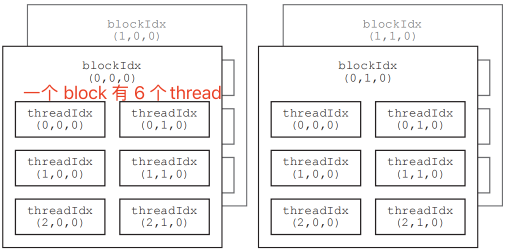

- [前言](#前言)
- [一 grid 和 block 维度及尺寸](#一-grid-和-block-维度及尺寸)
  - [1.1 dim3 定义 grid 和 block 维度](#11-dim3-定义-grid-和-block-维度)
  - [1.2 设置 grid 和 block 尺寸](#12-设置-grid-和-block-尺寸)
- [二 线程全局索引计算](#二-线程全局索引计算)
  - [2.1 通过全局线程索引访问数据](#21-通过全局线程索引访问数据)
- [三 网格和块配置实例](#三-网格和块配置实例)
  - [3.1 一维块: 向量相加](#31-一维块-向量相加)
  - [3.2 二维网格和二维块: 矩阵转置](#32-二维网格和二维块-矩阵转置)
  - [3.3 二维网格和二维块: 矩阵相乘](#33-二维网格和二维块-矩阵相乘)
  - [3.4 三维网格和三维块: 三维张量的处理](#34-三维网格和三维块-三维张量的处理)
- [参考资料](#参考资料)

## 前言

`Grid，Block，Thread` 都是线程的组织形式，最小的逻辑单位是 Thread，最小的硬件执行单位是 `thread warp`，若干个 Thread 组成一个Block，Block 被加载到 `SM` 上运行，多个 Block 组成一个 Grid，Grid 决定了 CUDA 内核将被启动多少次。

通过下图可以更直观理解 **grid、block 和 thread 的层次关系**。


内核启动时，需要指定 `grid` 和 `block` 的维度（核函数配置）。语法如下：

```cpp
kernel<<<gridDim, blockDim, sharedMem, stream>>>(parameters);
```

- `gridDim`：网格的维度，可以是一维、二维或三维。
- `blockDim`：块的维度，可以是一维、二维或三维。
- `sharedMem`（可选）：每个块分配的共享内存大小（以字节为单位）。
- `stream`（可选）：CUDA 流，用于异步执行。

值的注意的是，核函数的不同配置对内核性能是有影响的。

## 一 grid 和 block 维度及尺寸

### 1.1 dim3 定义 grid 和 block 维度

**kernel 配置: 多维网格和多维块**，`kernel` 如何配置就决定了我们如何划分并行任务。

“CUDA” 内核的启动，需要先定义启动配置  `<<<grid_size, block_size>>>`，其用于配置执行线程的组织结构，CUDA 最多可以组织三维的网格和线程块，用 `dim3` 结构体来定义。
```bash
dim3 grid_size(Gx, Gy, Gz);
dim3 block_size(Bx, By, Bz);
```

`dim3` 可以被看作是一个简单的三维向量，其中每个维度代表一个不同的轴：
1. `x`：第一个维度，通常用于表示线程或线程块的线性索引。
2. `y`：第二个维度，用于表示线程块的二维网格布局中的行数。
3. `z`：第三个维度，用于表示线程块的三维网格布局中的深度

三维 block 和三维 grid 的可视化如下图所示:


如果第三个维度的大小是 1，可以写
```bash
dim3 grid_size(Gx, Gy);
dim3 block_size(Bx, By);
```

例如，如果要定义一个 2 × 2 × 1 的网格及 3 × 2 × 1 的线程块，可将执行配置中的 grid_size 和 block_size 分别定义为如下结构体变量：

```bash
dim3 grid_size(2, 2, 1);
dim3 block_size(3, 2, 1);
```

此核函数配置 <<<grid_size, block_size>>> 对应的的线程组织如下图所示：



在矩阵乘法 kernel 中的二维内核配置定义如下：
```cpp
// Threads per CTA dimension
int THREADS = 32;

// Blocks per grid dimension (assumes THREADS divides N evenly)
int BLOCKS = N / THREADS; // N is size (in bytes) of matrix

// Use dim3 structs for block  and grid dimensions
dim3 threads(THREADS, THREADS);
dim3 blocks(BLOCKS, BLOCKS);

// Launch kernel
matrixMul<<<blocks, threads>>>(d_a, d_b, d_c, N);
```

### 1.2 设置 grid 和 block 尺寸

**1，block 尺寸**

对任何从开普勒到图灵架构的 GPU 来说，网格大小在 x、y 和 z 这 3 个方向的最大允许值分别为 $2^{31−1}$、65535 和 65535；线程块大小在 x、y 和 z 这 3 个方向的最大允许值分别为 1024、1024 和 64。另外还要求线程块总的大小，即 blockDim.x、blockDim.y 和 blockDim.z 的乘积不能大于 1024。即不管线程块是几维的，一个线程块最多只能有 $1024$ 个线程，另外，线程块大小设置为 $32$ 的倍数可能会提高性能。

**2，grid 尺寸**

网格尺寸的计算通常基于问题规模、数据维度和线程块尺寸。

**3，实例**

在 cuda 中希望尽可能多的线程并行，并保证所有数据被处理。

1. **一维数据**：假设有一个问题需要处理的数据量为 N，每个线程块可以处理 B 个数据项，如果问题规模是线性的，可以计算网格尺寸为 gridSize.x = (N + B - 1) / B，确保所有数据项都被处理。
2. **二维数据**：对于二维数据（如图像），如果图像的宽度为w idth，高度为 height，每个线程块处理 blockDim.x * blockDim.y 个像素，可以计算网格尺寸为：
```cpp
gridSize.x = (width + blockDim.x - 1) / blockDim.x;
gridSize.y = (height + blockDim.y - 1) / blockDim.y;
```
3. **三维数据**：对于三维数据，其尺寸为 width = 512, height = 512, depth = 64，如果每个线程块的尺寸为 blockDim(4, 4, 4)：
```cpp
int width = 256;
int height = 128;
int depth = 64;
dim3 blockDim(4, 4, 4);
// 计算网格尺寸. 向上取整，以确保覆盖所有数据
int gridSizeX = (width + blockDim.x - 1) / blockDim.x;
int gridSizeY = (height + blockDim.y - 1) / blockDim.y;
int gridSizeZ = (depth + blockDim.z - 1) / blockDim.z;
// 设置网格尺寸dim3 
gridSize(gridSizeX, gridSizeY, gridSizeZ);
```

## 二 线程全局索引计算

CUDA 中每一个线程都有一个唯一的标识 ID，也叫全局线程索引，kernel 函数内部就是通过全局线程索引来访问 `1D/2D/3D` 张量元素的。全局索引的计算依赖于内核配置 `<<<grid_size, block_size>>>`。而在 kernel 函数内部：
1. 配置参数的两个变量是赋值给：`gridDim` 和 `blockDim` 内建变量（built-in variable）中。它们都是类型为 `dim3` 结构体变量，具有 x、y、z 这 3 个成员。
	- `gridDim` 表示每个维度上的线程块数量，即每个网格的尺寸。
	- `blockDim` 表示每个维度上的线程数量，即每个线程块的尺寸。
2. 为了计算 `threadIdx`，还定义了 `blockIdx`, blockIdx 和 threadIdx 都是类型为 `uint3` 的结构体变量，具有 x、y、z 这 3 个成员。其中：
	- blockIdx.x 取值范围是 [0, gridDim.x - 1];
	- blockIdx.y 取值范围是 [0, gridDim.y - 1];
	- blockIdx.z 取值范围是 [0, gridDim.z - 1];
	- threadIdx.x 取值范围是 [0, blockDim.x - 1];
	- 等等

多维网格和块的划分可以组织成以下 $9 = 3*3$ 种情况：
```bash
一维网格一维线程块；
一维网格两维线程块；
一维网格三维线程块；
两维网格一维线程块；
两维网格两维线程块；
两维网格三维线程块；
三维网格一维线程块；
三维网格两维线程块；
三维网格三维线程块；
```

对于经典的二维网格二维线程块，想要计算下图中**红色块的全局线程索引**，调用核函数的线程配置代码如下：

```cpp
dim3 grid_size(3,2);
dim3 block_size(4,4);
kernel_func<<<grid_size, block_size>>>(args);
```


全局线程索引计算过程如下：
```bash
int blockId = blockIdx.x + blockIdx.y * gridDim.x;
int threadId = threadIdx.x + threadIdx.y * blockDim.x;

int id = blockId * (blockDim.x * blockDim.y) + threadId;

// 带入计算
int blockId = 1 + 1 * 3 = 4
int threadId = 2 + 2 * 4 = 10
int id = 4 * ( 4 * 4) + 10 = 74
```

上面的九种组织情况其实都可以视为是**三维网格三维线程块**的情况，只是比如一维或者二维的时候，其他维度为 1 而已。把它们都看成三维格式，这样不管哪种线程组织方式，都可以套用三维网格三维线程块的计算方式。多维的网格和线程块本质上还是一维的，就像多维数组本质上也是一维数组一样。全局线程索引计算方式如下：
```cpp
// 线程块索引
int blockId = blockIdx.x + blockIdx.y * gridDim.x + gridDim.x * gridDim.y * blockIdx.z;
// 局部线程索引
int threadId = threadIdx.z * blockDim.x * blockDim.y + threadIdx.y * blockDim.x + threadIdx.x;
// 全局线程索引
int id = blockId * (blockDim.x * blockDim.y * blockDim.z) + threadId;
```

或者如下计算方式：
```cpp
int blockId = blockIdx.x + blockIdx.y * gridDim.x
			+  blockIdx.z * gridDim.x * gridDim.y;  
int threadId = blockId * (blockDim.x * blockDim.y * blockDim.z) 
			+ (threadIdx.z * (blockDim.x * blockDim.y))
			+ (threadIdx.y * blockDim.x) + threadIdx.x;
```
> x 维度是最内层的（变化最快的），而 z 维度是最外层的（变化最慢的）。

具体的：

1、 grid 划分成 1 维，block 划分为 1 维
```cpp
int threadId = threadIdx.x;
int id = blockIdx.x * blockDim.x + threadId;  
```
2、 grid 划分成 1 维，block 划分为 2 维
```cpp
int threadId = threadIdx.y * blockDim.x + threadIdx.x; 
int id = blockIdx.x * blockDim.x * blockDim.y + threadId;
```
3、grid 划分成 2 维，block 划分为 2 维

```cpp
int blockId = blockIdx.x + blockIdx.y * gridDim.x; 
int threadId = threadIdx.x + threadIdx.y * blockDim.x;
int id = blockId * (blockDim.x * blockDim.y) + threadId
```


### 2.1 通过全局线程索引访问数据

以下是如何在核函数中使用线程索引来访问数据的步骤：

1. 确定数据结构：首先，你需要确定你正在处理的数据结构，例如一维数组、二维矩阵（图像）、三维数组（体积数据）等。
2. **计算全局索引**：每个线程需要计算其全局索引。对于一维数据，全局索引可以通过以下方式计算：
```bash
int globalIndex = blockIdx.x * blockDim.x + threadIdx.x;
```
对于二维或三维数据，计算会更复杂，需要考虑所有维度。
3. **使用全局索引访问数据**：一旦线程有了全局索引，就可以使用它来访问设备内存中的数据。例如，如果你有一个一维数组 data，线程可以通过其全局索引访问它：
```bash
data[globalIndex];
```
4. **考虑数据存储方式**：对于多维数据，需要根据数据在内存中的存储方式（通常是行优先或列优先）来计算索引。例如，对于二维图像数据，如果以行优先方式存储，一个像素的索引可以这样计算：
```cpp
// 行优先
int row = blockIdx.y * blockDim.y + threadIdx.y;
int col = blockIdx.x * blockDim.x + threadIdx.x;
int globalIndex = row * width + col;
```
这里，width 是图像的宽度。
5. **确保索引在有效范围内**：在访问数据之前，线程需要检查其全局索引是否在数据的有效范围内。这可以通过简单地与数据大小比较来完成：
```cpp
if (globalIndex < dataSize) {    
	// 安全地访问数据    data[globalIndex] = ...;}
```
6. **处理数据**：一旦线程通过索引访问了数据，就可以执行所需的操作，如计算、复制或转换。

## 三 网格和块配置实例

### 3.1 一维块: 向量相加

输入输出都是向量（一维），核函数和核函数配置如下：
```cpp
// CUDA kernel for vector addition
// __global__ means this is called from the CPU, and runs on the GPU
__global__ void vectorAdd(const int *__restrict a, const int *__restrict b,
                          int *__restrict c, int N) {
    // Calculate global thread ID
    int tid = (blockIdx.x * blockDim.x) + threadIdx.x;

    // Boundary check
    if (tid < N) c[tid] = a[tid] + b[tid];
}

int main() {
    // Vectors for holding the host-side (CPU-side) data
    std::vector<int> a;
    a.reserve(N);
    std::vector<int> b;
    b.reserve(N);
    std::vector<int> c;
    c.reserve(N);
  
    int NUM_THREADS = 1 << 10; // 每个网格的 CTA（合作线程数组）
    int NUM_BLOCKS = (N + NUM_THREADS - 1) / NUM_THREADS; // CTAs per Grid

    // Launch the kernel on the GPU
    // Kernel calls are asynchronous (the CPU program continues execution after
    // call, but no necessarily before the kernel finishes)
    vectorAdd<<<NUM_BLOCKS, NUM_THREADS>>>(d_a, d_b, d_c, N);
}
```
### 3.2 二维网格和二维块: 矩阵转置

二维矩阵转置对于二维矩阵（例如图像），如果我们要进行转置操作，核函数可能如下所示：
```cpp
__global__ void transpose(int *src, int *dst, int width, int height) {
    int row = blockIdx.y * blockDim.y + threadIdx.y;
    int col = blockIdx.x * blockDim.x + threadIdx.x;
    if (row < height && col < width) { 
        int srcIndex = row * width + col; // 原来的矩阵元素内存索引
        int dstIndex = col * height + row;
        dst[dstIndex] = src[srcIndex];
    }}

int main() {
    // assume that the matrix is m × n,
    // m is number of rows, n is number of cols
    // input d_Pin has been allocated on and copied to device
    // output d_Pout has been allocated on device

    dim3 DimGrid((n-1)/16 + 1, (m-1)/16+1, 1);
    dim3 DimBlock(16, 16, 1);
    PictureKernel<<<DimGrid,DimBlock>>>(d_in, d_out, m, n);
}
```

### 3.3 二维网格和二维块: 矩阵相乘

二维矩阵相乘，直接使用二维网格和二维块，核函数和核函数配置如下:

```cpp
__global__ void matrixMul(const int *a, const int *b, int *c, int N) {
    // Compute each thread's global row and column index
    int row = blockIdx.y * blockDim.y + threadIdx.y;
    int col = blockIdx.x * blockDim.x + threadIdx.x;

    // Iterate over row, and down column
    c[row * N + col] = 0;
    for (int k = 0; k < N; k++) {
        // Accumulate results for a single element
        c[row * N + col] += a[row * N + k] * b[k * N + col];
    }
}
int main() {
    // Threads per CTA dimension
    int THREADS = 32;
    // Blocks per grid dimension (assumes THREADS divides N evenly)
    int BLOCKS = N / THREADS; // N is matrix shape
    // Use dim3 structs for block  and grid dimensions
    dim3 threads(THREADS, THREADS);
    dim3 blocks(BLOCKS, BLOCKS);
    // Launch kernel
    matrixMul<<<blocks, threads>>>(d_a, d_b, d_c, N)
}
```

### 3.4 三维网格和三维块: 三维张量的处理

在 CUDA 中处理三维数组时，核函数需要正确地计算每个线程负责的数据索引。假设我们有一个三维数组，我们想要实现一个简单的核函数，该函数将三维数组中的每个元素加一。首先，定义核函数，计算每个线程的全局索引，并据此访问三维数组。

```cpp
__global__ void increment3DArray(int *array, 
                                int width, 
                                int height, 
                                int depth) 
{    
    // 计算线程的全局索引    
    int idx = (blockIdx.z * gridDim.x * gridDim.y + blockIdx.y * gridDim.x + blockIdx.x) * blockDim.x + threadIdx.x;        
    // 计算三维数组中的行、列和层索引
    int z = idx / (width * height);
    int y = (idx % (width * height)) / width;
    int x = idx % width;
    // 确保索引在三维数组的有效范围内
    if (x < width && y < height && z < depth) {
        // 计算数组中对应的全局索引
        int globalIndex = z * width * height + y * width + x;
        // 对应位置的元素加一
        array[globalIndex] = array[globalIndex] + 1;
    }
}

int main() {    
    // 三维数组的尺寸
    int width = 16;
    int height = 16;
    int depth = 8;
    // 计算数组总大小 
    int size = width * height * depth;
    // 在主机端分配内存
    int *h_array = new int[size];
    /*省略部分代码*/
    dim3 blockSize(2, 2, 2); 
    // 每个线程块有8个线程
    dim3 gridSize((width + blockSize.x - 1) / blockSize.x, 
                    (height + blockSize.y - 1) / blockSize.y,
                    (depth + blockSize.z - 1) / blockSize.z);
    // 执行核函数
    increment3DArray<<<gridSize, blockSize>>>(d_array, width, height, depth);

    return 0;}

```

我们使用了以下方法来计算多维索引：
1. 二维数组：通过整除和取余操作来分别获取行和列索引。
2. 三维数组：首先通过整除获取z轴（深度）索引，然后对剩余的部分再次进行整除和取余操作以获取y轴（高度）和x轴（宽度）索引。

## 参考资料

- [极智开发 | CUDA线程模型与全局索引计算方式](https://mp.weixin.qq.com/s/IyQaarSN6V_tukt6KigkGQ)
- [C++ CUDA 设置线程块尺寸和网格尺寸](https://mp.weixin.qq.com/s/FfMWa94nLFIejilfc3DCxg)
- [C++ CUDA 核函数中如何通过索引访问数据](https://mp.weixin.qq.com/s/VuGarPnZu56hYNlkRP5cyw)
- https://harmanani.github.io/classes/csc447/Notes/Lecture15.pdf
